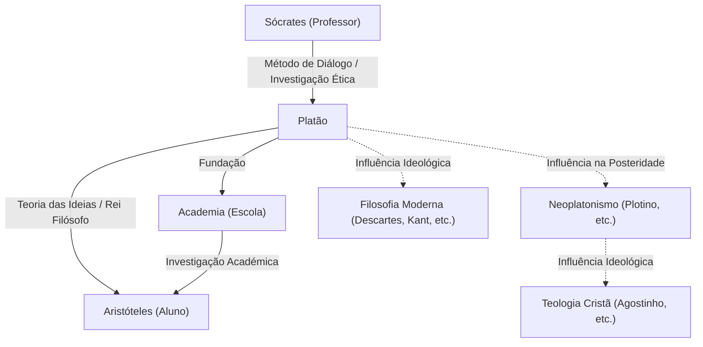

Platão, um dos filósofos mais proeminentes da Grécia Antiga, lançou as bases da filosofia ocidental. Como aluno de Sócrates e professor de Aristóteles, ele deixou inúmeras ideias para as gerações futuras através dos seus diálogos. Conceitos como a "Teoria das Ideias" influenciaram profundamente não apenas a filosofia, mas também a ciência política, a ética e a teologia. A sua presença é tão avassaladora que o filósofo britânico A.N. Whitehead comentou a famosa frase: "A caracterização geral mais segura da tradição filosófica europeia é que ela consiste numa série de notas de rodapé a Platão".

Neste artigo, aprofundamo-nos na vida de Platão, nas suas ideias filosóficas centrais e no seu impacto nas gerações posteriores.

## A Vida de Platão: O Encontro com Sócrates e a Fundação da Academia

Platão (c. 427 a.C. - c. 347 a.C.) nasceu numa poderosa família aristocrática em Atenas. Na sua juventude, ambicionava tornar-se político, mas a sua vida foi alterada de forma decisiva pelo seu encontro com o filósofo Sócrates. Profundamente impressionado com os pensamentos e o modo de vida de Sócrates, Platão tornou-se seu aluno dedicado.

No entanto, em 399 a.C., o seu professor Sócrates foi julgado num tribunal popular ateniense sob a acusação de "corromper a juventude e não acreditar nos deuses do Estado", e foi condenado à morte. Este evento absurdo foi um choque imensurável para o jovem Platão. Agudamente consciente das limitações da democracia (que na época via como o governo da multidão), abandonou o seu caminho na política e decidiu dedicar-se à filosofia para buscar a verdadeira justiça.

Após a morte de Sócrates, Platão viajou para lugares como Egito e Itália, aprendendo matemática e doutrinas religiosas com os pitagóricos. Ao retornar a Atenas por volta de 387 a.C., fundou a "Academia". Esta é frequentemente considerada a primeira instituição de ensino superior da história ocidental, e mais tarde reuniu muitos estudiosos brilhantes, incluindo Aristóteles, contribuindo grandemente para o avanço do conhecimento.

## Ideias Filosóficas Centrais: A Teoria das Ideias e o Rei Filósofo

No cerne da filosofia de Platão está a "Teoria das Ideias" (ou Teoria das Formas). Platão acreditava que o mundo que percebemos com os nossos sentidos (o mundo fenoménico) é apenas uma sombra temporária, e que existe um mundo da verdade separado, perfeito e eternamente imutável (o mundo das Ideias).

Por exemplo, ele explicava que as várias "coisas belas" existentes no mundo real só são belas porque partilham (participam) imperfeitamente da "Ideia de Beleza" que existe no mundo das Ideias. Argumentava que a alma humana residiu outrora no mundo das Ideias e reconheceu a verdade, mas esqueceu-a ao entrar no corpo físico. Buscar a verdade através da filosofia não é outra coisa senão "recordar" (anamnese) essas Ideias esquecidas.

Além disso, no seu pensamento político, idealizou o "Rei Filósofo". Na sua obra principal, *A República*, Platão afirmou que, a menos que os verdadeiros sábios (filósofos) que podem perceber as Ideias governem o Estado, ou os governantes estudem sinceramente a filosofia, as misérias do Estado nunca terminarão. Esta foi também uma crítica contundente ao sistema político ateniense da sua época que tinha levado o seu mestre Sócrates à morte.

## Diagrama Mermaid: Relações e Influência em Torno de Platão

O diagrama seguinte ilustra a rede de pessoas que cercavam Platão e a expansão da sua influência.

## Influência na Posteridade: Como Fonte do Pensamento Ocidental

A maioria das obras que Platão deixou foram escritas em forma de diálogo. Obras como *O Banquete*, *Fédon* e *A República* são altamente conceituadas não só filosoficamente, mas também como obras-primas literárias, e têm sido amplamente lidas por intelectuais em geral, para além dos filósofos especializados.

A sua influência não se limitou à Grécia Antiga. O "Neoplatonismo", que se desenvolveu durante o Império Romano, teve um grande impacto nos primeiros Padres da Igreja Cristã (como Santo Agostinho) e esteve profundamente envolvido na formação da teologia cristã. A visão de mundo dualista do mundo das Ideias e do mundo fenoménico tinha uma grande afinidade com o enquadramento cristão da Cidade de Deus e da cidade terrena.

Além disso, o Renascimento assistiu a um renascimento da filosofia platónica, e na filosofia moderna, pensadores como Descartes e Kant desenvolveram os seus argumentos traçando os seus fundamentos ideológicos até Platão. Mesmo hoje, como se vê no uso do termo "Platonismo" em discussões relativas aos fundamentos da matemática e da lógica, o seu quadro de pensamento permanece vivo.

A filosofia de Platão não é uma mera relíquia do passado. As questões que levantou — "O que é a verdade?", "O que significa viver uma boa vida?" e "Qual é o Estado ideal?" — continuam a ser questões fundamentais e universais para nós que vivemos numa sociedade moderna com valores diversos.
