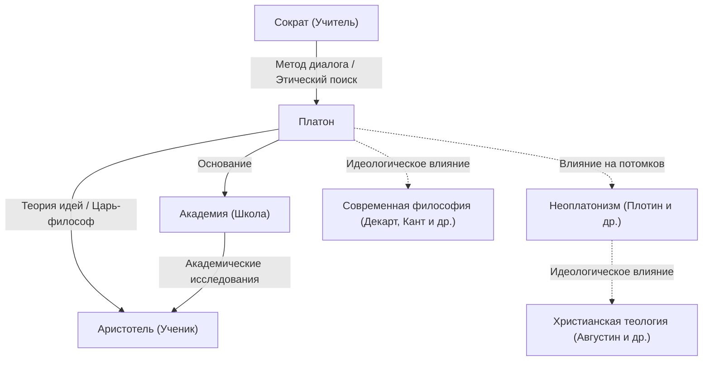

Платон, один из выдающихся философов Древней Греции, заложил основы западной философии. Будучи учеником Сократа и учителем Аристотеля, он через свои диалоги оставил потомкам множество идей. Такие концепции, как «теория идей» (эйдосов), оказали глубокое влияние не только на философию, но и на политологию, этику и теологию. Его присутствие настолько грандиозно, что британский философ А.Н. Уайтхед сделал знаменитое замечание: «Самая надежная общая характеристика европейской философской традиции состоит в том, что она представляет собой серию примечаний к Платону».

В этой статье мы подробно рассмотрим жизнь Платона, его основные философские идеи и влияние, которое он оказал на последующие поколения.

## Жизнь Платона: Встреча с Сократом и основание Академии

Платон (ок. 427 г. до н.э. – ок. 347 г. до н.э.) родился во влиятельной аристократической семье в Афинах. В юности он стремился стать политиком, но его жизнь решительно изменилась после встречи с философом Сократом. Глубоко впечатленный мыслями и образом жизни Сократа, Платон стал его преданным учеником.

Однако в 399 г. до н.э. его учитель Сократ предстал перед афинским народным судом по обвинению в «развращении молодежи и неверии в богов государства» и был приговорен к смертной казни. Это абсурдное событие стало неизмеримым потрясением для молодого Платона. Остро осознав ограниченность демократии (которую он в то время рассматривал как власть толпы), он отказался от пути в политике и решил посвятить себя философии в поисках истинной справедливости.

После смерти Сократа Платон путешествовал по Египту и Италии, изучая математику и религиозные учения у пифагорейцев. Вернувшись в Афины около 387 г. до н.э., он основал «Академию». Она часто считается первым высшим учебным заведением в истории Запада. Позже там собралось множество блестящих ученых, включая Аристотеля, что внесло огромный вклад в развитие науки.

## Основные философские идеи: Теория идей и философ на троне

В основе философии Платона лежит «теория идей». Платон считал, что мир, который мы воспринимаем нашими чувствами (феноменальный мир), — это лишь временная тень, и что существует отдельный, совершенный и вечно неизменный мир истины (мир идей или эйдосов).

Например, он объяснял, что различные «красивые вещи», существующие в реальном мире, красивы только потому, что они несовершенно причастны «идее прекрасного», существующей в мире идей. Он утверждал, что человеческая душа когда-то пребывала в мире идей и познала истину, но забыла её, войдя в физическое тело. Поиск истины через философию — это не что иное, как «припоминание» (анамнезис) тех забытых идей.

Кроме того, в своей политической мысли он идеализировал «царя-философа». В своем главном труде *Государство* Платон утверждал, что беды государства никогда не закончатся, если государством не будут управлять истинные мудрецы (философы), способные воспринимать идеи, или если те, кто находится у власти, не будут искренне изучать философию. Это было также резкой критикой афинской политической системы того времени, доведшей его учителя Сократа до смерти.

## Диаграмма Mermaid: Окружение Платона и его влияние

Следующая диаграмма иллюстрирует сеть людей, окружавших Платона, и распространение его влияния.

## Влияние на потомков: Как исток западной мысли

Большинство произведений, оставленных Платоном, написаны в форме диалога. Такие произведения, как *Пир*, *Федон* и *Государство*, высоко ценятся не только с философской точки зрения, но и как литературные шедевры. Их широко читали образованные люди далеко за пределами круга профессиональных философов.

Его влияние не ограничилось Древней Грецией. «Неоплатонизм», развившийся во времена Римской империи, оказал огромное влияние на ранних отцов христианской церкви (таких как Августин) и был глубоко вовлечен в формирование христианской теологии. Дуалистическое мировоззрение о мире идей и феноменальном мире имело высокую степень сходства с христианской концепцией Града Божьего и града земного.

Более того, в эпоху Возрождения произошло возрождение платоновской философии, а в современной философии такие мыслители, как Декарт и Кант, развивали свои аргументы, возводя их идеологические основы к Платону. Даже сегодня, как видно из использования термина «платонизм» в дискуссиях об основаниях математики и логики, система его мысли продолжает жить.

Философия Платона — это не просто реликт прошлого. Поднятые им вопросы: «Что такое истина?», «Что значит жить хорошей жизнью?» и «Каково идеальное государство?» — остаются фундаментальными и универсальными вопросами для нас, живущих в современном обществе с разнообразными ценностями.
