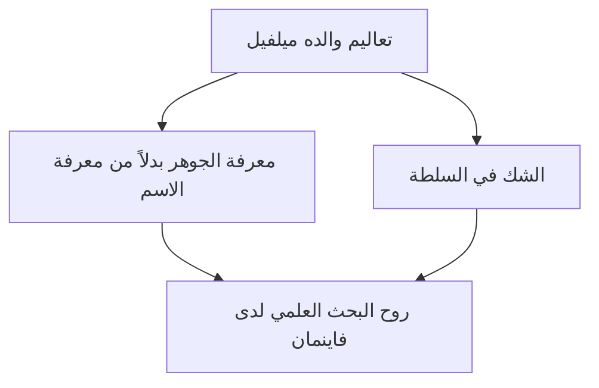
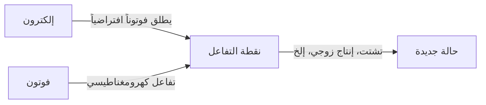

## 1. مقدمة: المحتال في عالم الفيزياء وأعظم المعلمين

"هناك الكثير من الأشياء التي لا أعرفها. ولكن ما المشكلة في ذلك؟ لا بأس على الإطلاق بأن أظل جاهلاً بها."

كما يتضح من هذه المقولة، لم يكن ريتشارد ب. فاينمان (Richard Phillips Feynman, 1918 - 1988) مجرد عالم فيزياء عبقري، بل كان يتمتع "بجاذبية إنسانية" هائلة وكان بمثابة "كتلة من الفضول". كواحد من أبرز علماء الفيزياء في القرن العشرين، فاز بجائزة نوبل في الفيزياء عام 1965 لمساهمته في تطوير الديناميكا الكهربائية الكمية (QED). ومع ذلك، فإن السبب الذي يجعله محبوباً ومحترماً من قبل الناس في جميع أنحاء العالم حتى يومنا هذا ليس فقط إنجازاته الرائعة.

فقد كان ينغمس في الحسابات الفيزيائية في نوادي التعري خلال أيام إجازته، وقام بفتح خزائن زملائه الواحدة تلو الأخرى في منشأة سرية للغاية تابعة لمشروع مانهاتن، وعزف البونغو بحماس مع فرقة سامبا في البرازيل، وأسكت كبار المسؤولين في ناسا بتجربة بسيطة باستخدام الماء المثلج وحلقة مطاطية على شكل O في لجنة التحقيق في حادث انفجار تشالنجر. بالنسبة له، كان استكشاف حقائق الكون، وفك رموز الكتابة المايا، ومراقبة سلوك النمل، كلها تنبع بالتساوي من "متعة الاكتشاف" (The Pleasure of Finding Things Out).

في هذا المقال، سنتعمق بآلاف الكلمات في حياة ريتشارد فاينمان، والثورة التي أحدثها في الفيزياء، والرسالة التي توجهها فلسفته إلى مجتمعنا الحديث.

---

## 2. الطفولة وسنوات الدراسة: أعظم هدية من والده

ولد فاينمان في 11 مايو 1918 في فار روكاواي، كوينز، نيويورك. وقد تأثر تفكيره العلمي الأساسي، ولا سيما موقفه في "التشكيك في السلطة والتفكير بنفسه"، بشدة بوالده ميلفيل.

كان ميلفيل يعمل في صناعة الزي الرسمي ولم يكن عالماً، لكنه علم ابنه "طريقة النظر" العلمية للأشياء بشكل دقيق. ومن القصص الشهيرة عن ذلك مراقبة الطيور. لم يعلمه والده "اسم الطائر"، بل جعله يفكر "لماذا ينقر الطائر ريشه بمنقاره". كانت هذه الفلسفة تنص على أن "معرفة اسم الشيء يختلف تماماً عن معرفة الشيء نفسه". وقد شكل هذا أساس الموقف الأكاديمي لفاينمان لاحقاً.

التحق فاينمان بمعهد ماساتشوستس للتكنولوجيا (MIT)، وبدأ في حل مسائل الرياضيات والفيزياء بنهج فريد غير مقيد بالأطر التقليدية، مما أدى إلى ازدهار موهبته بسرعة. بعد ذلك، التحق بكلية الدراسات العليا في جامعة برينستون، حيث التقى بجون أرشيبالد ويلر ودخل في طليعة ميكانيكا الكم.

---

## 3. مشروع مانهاتن وأيامه في لوس ألاموس

مع اندلاع الحرب العالمية الثانية، انخرط فاينمان الشاب أيضاً في دوامة التاريخ الكبيرة. تم استدعاؤه إلى مختبر لوس ألاموس الوطني في نيو مكسيكو، مركز "مشروع مانهاتن السري" لتطوير القنبلة الذرية.

في ذلك الوقت، كان في أوائل العشرينيات من عمره، وبدأ العمل تحت إشراف علماء فيزياء من الطراز العالمي مثل روبرت أوبنهايمر وهانز بيث. تم تعيينه قائداً لقسم الحسابات (حيث لم تكن هناك حواسيب ضخمة في ذلك الوقت، بل تم استخدام البشر والآلات الحاسبة الميكانيكية)، وقدم مساهمات كبيرة في الجوانب العملية، مثل بناء نظام معالجة متوازٍ فعال لآلات الحوسبة بالبطاقات المثقبة.

ومع ذلك، فإن ما جعله مشهوراً كان طبيعته المحبة للمزاح. على الرغم من أنها كانت منشأة تتعامل مع أسرار عليا، لاحظ فاينمان أن أمن الخزائن التي تحفظ المستندات كان ضعيفاً، فاكتشف قواعده الخاصة وقام بفتح خزائن زملائه واحدة تلو الأخرى تاركاً ملاحظة تقول: "لقد أخذت تلك الوثيقة السرية". يمكن القول إن هذا لم يكن مجرد مزحة، بل كان "اختراقاً" بطريقته الخاصة لإثبات نقاط الضعف في النظام.

علاوة على ذلك، كانت أيامه في لوس ألاموس فترة مأساة شخصية بالنسبة له. كانت زوجته الحبيبة أرلين تعاني من مرض السل، واستمرت أيامه في زيارتها في المصحة. توفيت أرلين قبل وقت قصير من إسقاط القنبلة الذرية في عام 1945. وقد ترك هذا الحدث ندبة عميقة في قلب فاينمان، وكان له تأثير كبير على نظرته للحياة لاحقاً.

---

## 4. ثورة الديناميكا الكهربائية الكمية (QED) ومخطط فاينمان

بعد الحرب، انتقل فاينمان من جامعة كورنيل إلى معهد كاليفورنيا للتكنولوجيا (Caltech)، وأرسى أخيراً دعامة خالدة في تاريخ الفيزياء. وهي إعادة بناء "الديناميكا الكهربائية الكمية (Quantum Electrodynamics, QED)".

في ذلك الوقت، كانت هناك مشكلة قاتلة (صعوبة التباعد) حيث كانت الإجابات تصبح لا نهائية عند محاولة حساب تفاعل الإلكترونات والفوتونات. تعامل شينيتشيرو توموناغا وجوليان شوينجر وآخرون مع هذه المشكلة في نفس الوقت تقريباً وتوصلوا إلى حلول (نظرية إعادة التطبيع) باستخدام طرق رياضية متقدمة، لكن نهج فاينمان كان مختلفاً تماماً.

لقد ابتكر نهجاً بديهياً يتمثل في جمع "جميع المسارات الممكنة" التي يسلكها الجسيم عند تحركه عبر الفضاء، أي **"تكامل المسار (Path Integral)"**. وعلاوة على ذلك، اخترع **"مخطط فاينمان"**، الذي يعبر عن هذه الصيغ المعقدة كأشكال مرئية.

من خلال هذا التمثيل الرسومي، أصبحت حسابات ميكانيكا الكم، التي كانت بالغة الصعوبة حتى ذلك الحين، ممكنة بشكل بديهي وآلي. أصبح مخطط فاينمان "اللغة المشتركة" في الفيزياء، ويُقال إنه سَرَّع من تطور فيزياء الجسيمات الأولية لعدة عقود. بفضل هذا الإنجاز، حصل على جائزة نوبل في الفيزياء عام 1965 مع شينيتشيرو توموناغا وجوليان شوينجر.

---

## 5. "بالتأكيد أنت تمزح سيد فاينمان!": حياة يومية غير تقليدية ومغامرات

ما لا غنى عنه عند الحديث عن فاينمان هو العديد من قصصه غير التقليدية. يصف مقاله حول سيرته الذاتية، "بالتأكيد أنت تمزح سيد فاينمان!"، كيف استمتع بالحياة وكان فضولياً بشأن كل شيء.

*   **السامبا والبونغو:** أثناء إقامته في البرازيل، افتُتن بموسيقى السامبا المحلية وشارك في الكرنفال كعازف بونغو مع فرقة محترفة.
*   **الشغف بالرسم:** من خلال نقاش مع صديق فنان، ولكي يدحض التحيز القائل بأن "العلماء لا يستطيعون فهم الجمال"، تعلم الرسم بجدية حتى أقام معرضاً فردياً (باستخدام اسم مستعار "أوفي (Ofey)").
*   **فك رموز الكتابة المايا:** اهتم بالمخطوطات القديمة لحضارة المايا أثناء زيارته للمكسيك في شهر العسل، وعلى الرغم من أنه لم يكن خبيراً لغوياً، فقد فك رموز قوانين الحسابات الفلكية بنفسه.
*   **الحساب في نوادي التعري:** كمكان يمكنه فيه الحساب بهدوء، تردد بشكل مثير للدهشة على نوادي التعري وكان يكتب الصيغ الرياضية على المناديل الورقية.

لم تكن هذه الأفعال غريبة من أجل لفت الانتباه فحسب، بل كانت جميعها نابعة من رغبة خالصة في "معرفة كيف تسير الأمور". بالنسبة له، كانت الفيزياء والبونغو وكتابة المايا كلها ألغازاً لفهم العالم.

---

## 6. فاينمان كمعلم: المحاضرات الأسطورية

لم يكن فاينمان باحثاً فحسب، بل كان يمتلك موهبة نادرة كمعلم أيضاً. كانت قناعته هي أنه "إذا لم تستطع شرح مفهوم معقد لطلاب السنة الأولى في الجامعة بطريقة يفهمونها دون استخدام المصطلحات التقنية، فلا يمكنك القول إنك تفهمه حقاً".

تم تسجيل محاضرات الفيزياء للطلاب الجامعيين التي أُلقيت على مدى عامين في معهد كاليفورنيا للتكنولوجيا في أوائل الستينيات بالصوت والصورة، ونُشرت لاحقاً تحت عنوان "محاضرات فاينمان في الفيزياء" (The Feynman Lectures on Physics). أصبح هذا الكتاب المدرسي بمثابة الإنجيل للطلاب الذين يدرسون الفيزياء في جميع أنحاء العالم، ولا يزال يُقرأ حتى اليوم دون أن يفقد بريقه، على الرغم من مرور أكثر من نصف قرن.

كان سحر محاضراته لا يكمن في مجرد سرد المعادلات الرياضية، بل في التحدث بروح الدعابة والإيماءات حول مدى دراماتيكية وجمال ظواهر الطبيعة. لم يكن يعلم الطلاب "الإجابات"، بل كان يعلمهم "كيفية طرح الأسئلة على الطبيعة".

---

## 7. حادث انفجار تشالنجر و"لا يمكن خداع الطبيعة"

من أشهر القصص التي زُينت بها أواخر حياة فاينمان مشاركته في لجنة التحقيق (لجنة روجرز) في حادث انفجار مكوك الفضاء "تشالنجر" الذي وقع عام 1986.

على الرغم من أنه كان مصاباً بالسرطان في ذلك الوقت وكان متردداً في المشاركة في البداية، إلا أنه ذهب إلى واشنطن لمعرفة الحقيقة. وفي مواجهة ثقافة التستر البيروقراطية ونظام إدارة السلامة المهمل في وكالة ناسا (ضعف تقييم المخاطر)، قام بإجراء مقابلات مباشرة مع المهندسين في الموقع للاقتراب من جوهر المشكلة.

وأثناء جلسة استماع عامة متلفزة، قام فاينمان بغمس حلقة O مطاطية مستخدمة في مفاصل المكوك في كأس من الماء المثلج وتمسك بها بمشبك (ملزمة). أثبت بوضوح بطريقة يفهمها الجميع أن المطاط يفقد مرونته في بيئة قريبة من درجة التجمد — وأن هذا كان السبب المباشر للانفجار.

لا تزال الجملة الأخيرة التي كتبها كملحق شخصي لتقرير التحقيق تُردد حتى اليوم كجرس إنذار لكل من يشارك في العلوم والتكنولوجيا.

> "For a successful technology, reality must take precedence over public relations, for nature cannot be fooled."
> (من أجل تكنولوجيا ناجحة، يجب أن يكون للواقع الأسبقية على العلاقات العامة، لأنه لا يمكن خداع الطبيعة.)

---

## 8. الخاتمة: ما تركه لنا فاينمان

في 15 فبراير 1988، توفي فاينمان عن عمر يناهز 69 عاماً بسبب سرطان في البطن. كانت كلماته الأخيرة مليئة بروح الدعابة المميزة له: "أكره أن أموت مرتين. إنه أمر ممل للغاية (I'd hate to die twice. It's so boring.)".

تثبت حياة ريتشارد فاينمان الإمكانيات اللامحدودة التي يحملها "الفضول الفكري" البشري. بالنسبة له، لم يكن العلم مجرد مجموعة من الصيغ الرياضية الباردة والنظريات الموثوقة، بل كان أفضل لعبة للاستمتاع باللغز العظيم الذي يمثله العالم.

في العصر الحالي حيث يتطور الذكاء الاصطناعي بسرعة وتتوفر الإجابات بسهولة، غالباً ما ننسى "التفكير بأنفسنا" و"طرح أسئلة بريئة". ومع ذلك، فإن "موقف حب المجهول" و"القدرة على تمييز الجوهر وراء الأشياء" اللذين علمنا إياهما فاينمان، سيكونان بوصلة لا غنى عنها بالنسبة لنا عبر العصور.

عند تتبع مسار حياته، فإننا لا نشهد جمال العلم فحسب، بل نشهد أيضاً إجابة رائعة على السؤال الأساسي حول كيف ينبغي للإنسان أن يعيش في العالم ويستمتع به.

---
*نأمل من خلال هذا المقال أن تكون قد شعرت ولو قليلاً بفضول يشبه فضول فاينمان الذي يجعلك تتساءل "لماذا؟" تجاه الظواهر من حولك.*
