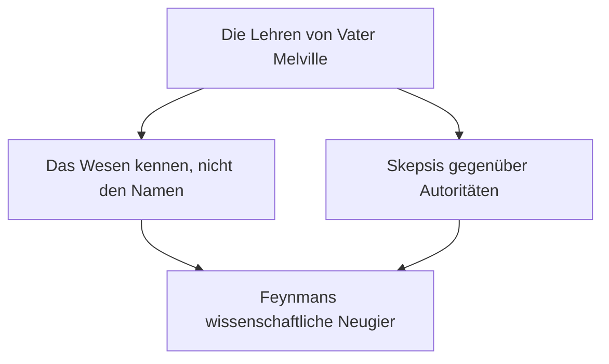
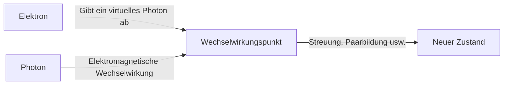

## 1. Einführung: Der Trickster und beste Lehrer der Physikwelt

"Ich habe viele Dinge, die ich nicht verstehe. Aber was macht das schon? Es macht überhaupt nichts aus, wenn ich sie nicht verstehe."

Wie diese Worte symbolisieren, war Richard P. Feynman (1918 - 1988) mehr als nur ein geniales Physikgenie; er war eine überwältigende "menschliche Anziehungskraft" und ein "Bündel von Neugier". Er war einer der bedeutendsten Physiker des 20. Jahrhunderts und erhielt 1965 den Nobelpreis für Physik für seinen Beitrag zur Entwicklung der Quantenelektrodynamik (QED). Der Grund, warum er heute noch von Menschen auf der ganzen Welt geliebt und respektiert wird, ist jedoch nicht nur seine brillante Leistung.

An seinen freien Tagen vertiefte er sich in einem Stripclub in physikalische Berechnungen, knackte in einer streng geheimen Einrichtung des Manhattan-Projekts einen Tresor seiner Kollegen nach dem anderen, begeisterte sich als Bongo-Spieler in einer Samba-Band in Brasilien und brachte die Führung der NASA bei der Untersuchungskommission der Challenger-Explosion mit einem einfachen Experiment mit Eiswasser und einem Gummi-O-Ring zum Schweigen. Für ihn waren die Erforschung der Wahrheiten des Universums, die Entschlüsselung der Maya-Schrift und die Beobachtung der Ökologie von Ameisen gleichermaßen in der "Freude am Entdecken (The Pleasure of Finding Things Out)" verwurzelt.

In diesem Artikel werden wir das Leben von Richard Feynman, die von ihm vollbrachte Revolution in der Physik und die Botschaft, die seine Philosophie für unsere moderne Gesellschaft hat, auf mehreren tausend Wörtern ausführlich untersuchen.

---

## 2. Kindheit und Studienzeit: Das beste Geschenk des Vaters

Am 11. Mai 1918 wurde Feynman in Far Rockaway, Queens, New York, geboren. Sein grundlegendes wissenschaftliches Denken, insbesondere seine Haltung, "Autoritäten zu bezweifeln und selbst zu denken", war stark von seinem Vater Melville beeinflusst.

Melville stellte Uniformen her und war kein Wissenschaftler, aber er brachte seinem Sohn konsequent eine wissenschaftliche "Sichtweise" bei. Eine berühmte Episode handelt von der Beobachtung von Vögeln. Der Vater brachte ihm nicht die "Namen der Vögel" bei, sondern ließ ihn darüber nachdenken, "warum Vögel mit dem Schnabel in ihren Federn picken". Es war die Philosophie: "Den Namen zu kennen und die Sache selbst zu kennen, sind zwei völlig verschiedene Dinge." Dies bildete die Grundlage für Feynmans spätere wissenschaftliche Einstellung.

Feynman, der am MIT (Massachusetts Institute of Technology) studierte, löste mathematische und physikalische Probleme mit einem einzigartigen Ansatz, der nicht an bestehende Rahmen gebunden war, und sein Talent blühte schnell auf. Später, als er die Graduiertenschule an der Princeton University besuchte, lernte er John Archibald Wheeler kennen und betrat die Spitze der Quantenmechanik.

---

## 3. Das Manhattan-Projekt und die Tage in Los Alamos

Mit dem Ausbruch des Zweiten Weltkriegs wurde auch der junge Feynman in den großen Strudel der Geschichte hineingezogen. Er wurde zum Los Alamos National Laboratory in New Mexico gerufen, dem Zentrum des streng geheimen "Manhattan-Projekts" zur Entwicklung der Atombombe.

Damals war er erst Anfang 20 und arbeitete unter einigen der besten Physiker der Welt wie Robert Oppenheimer und Hans Bethe. Er wurde zum Leiter der Berechnungsabteilung (zu dieser Zeit gab es noch keine großen Computer, sondern menschliche oder mechanische Rechenmaschinen) ernannt und leistete auch in praktischer Hinsicht große Beiträge, wie etwa den Aufbau eines effizienten parallelen Verarbeitungssystems für Lochkartenrechner.

Was ihn jedoch berühmt machte, war sein Hang zu Streichen. Obwohl es sich um eine Einrichtung handelte, die strengste Geheimnisse behandelte, bemerkte Feynman, dass die Sicherheit der Tresore, in denen Dokumente aufbewahrt wurden, nachlässig war. Er fand seine eigenen Regeln heraus, öffnete einen Tresor seiner Kollegen nach dem anderen und hinterließ Notizen wie "Ich habe dieses Geheimdokument genommen". Dies war nicht nur ein einfacher Scherz, sondern seine Art des "Hackens", um die Schwachstellen des Systems zu demonstrieren.

Die Zeit in Los Alamos war für ihn auch eine Zeit persönlicher Tragödien. Seine geliebte Frau Arline litt an Tuberkulose, und er besuchte sie oft in einem Sanatorium. Kurz vor dem Abwurf der Atombombe im Jahr 1945 verstarb Arline. Dieses Ereignis, das eine tiefe Wunde in Feynmans Herzen hinterließ, hatte auch großen Einfluss auf seine spätere Lebensphilosophie.

---

## 4. Die Revolution der Quantenelektrodynamik (QED) und Feynman-Diagramme

Nach dem Krieg wechselte Feynman nach einer Zeit an der Cornell University zum California Institute of Technology (Caltech) und errichtete schließlich ein unsterbliches Denkmal in der Geschichte der Physik. Es war die Neukonstruktion der "Quantenelektrodynamik (Quantum Electrodynamics, QED)".

Damals gab es das fatale Problem (die Schwierigkeit der Divergenz), dass die Antwort unendlich wurde, wenn man versuchte, die Wechselwirkung von Elektronen und Photonen zu berechnen. Shin'ichirō Tomonaga und Julian Schwinger befassten sich zur gleichen Zeit mit diesem Problem und leiteten mit einem hochgradig mathematischen Ansatz eine Lösung ab (Renormierungstheorie), aber Feynmans Methode war völlig anders.

Er erfand einen intuitiven Ansatz, bei dem er "alle möglichen Pfade" zusammenzählte, auf denen sich ein Teilchen durch den Raum bewegte, nämlich das **"Pfadintegral (Path Integral)"**. Darüber hinaus erfand er das **"Feynman-Diagramm"**, das diese komplexen mathematischen Formeln als visuelle Figuren darstellte.

Durch diese grafische Darstellung wurden die zuvor extrem schwierigen Berechnungen der Quantenmechanik intuitiv und mechanisch durchführbar. Das Feynman-Diagramm wurde zur "gemeinsamen Sprache" in der Physik, und es wird sogar gesagt, dass es die Entwicklung der Teilchenphysik um Jahrzehnte beschleunigt hat. Für diese Leistung erhielt er 1965 gemeinsam mit Shin'ichirō Tomonaga und Julian Schwinger den Nobelpreis für Physik.

---

## 5. "Sie belieben zu scherzen, Mr. Feynman!": Ein unkonventioneller Alltag und Abenteuer

Unverzichtbar bei der Diskussion über Feynman sind seine vielen unkonventionellen Episoden. In seinem autobiografischen Essay "Sie belieben zu scherzen, Mr. Feynman!" wird beschrieben, wie sehr er das Leben genoss und auf alles neugierig war.

*   **Samba und Bongos:** Während seines Aufenthalts in Brasilien war er von der lokalen Sambamusik fasziniert und trat als Bongo-Spieler bei einem Karneval zusammen mit einer professionellen Band auf.
*   **Leidenschaft für die Malerei:** Nach einer Diskussion mit einem Künstlerfreund beschloss er, das Vorurteil, dass "Wissenschaftler die Schönheit nicht verstehen können", zu widerlegen. Er lernte ernsthaft das Zeichnen und veranstaltete sogar Einzelausstellungen (unter dem Pseudonym "Ofey").
*   **Entschlüsselung der Maya-Schrift:** Auf seiner Hochzeitsreise nach Mexiko interessierte er sich für die alten Dokumente der Maya-Zivilisation und entschlüsselte aus eigener Kraft die Gesetzmäßigkeiten der astronomischen Berechnungen, obwohl er kein Experte für Linguistik war.
*   **Berechnungen im Stripclub:** Als Ort, an dem er sich in Ruhe auf seine Berechnungen konzentrieren konnte, besuchte er ausgerechnet Stripclubs und kritzelte mathematische Formeln auf Papierservietten.

Dies waren keineswegs "exzentrische" Verhaltensweisen, sondern alle entsprangen dem reinen Wunsch zu wissen, "wie das funktioniert". Für ihn waren Physik, Bongos und die Maya-Schrift Puzzles, um die Welt zu verstehen.

---

## 6. Feynman als Pädagoge: Legendäre Vorlesungen

Feynman besaß nicht nur als Forscher, sondern auch als Pädagoge ein außergewöhnliches Talent. Seine Überzeugung war: "Wenn man ein komplexes Konzept nicht ohne Fachjargon so erklären kann, dass es auch ein Studienanfänger versteht, hat man es nicht wirklich verstanden."

Anfang der 1960er Jahre wurden seine zweijährigen Vorlesungen über Physik für Studenten am Caltech auf Tonband und Film aufgenommen und später als "Feynman-Vorlesungen über Physik (The Feynman Lectures on Physics)" veröffentlicht. Dieses Lehrbuch wurde zu einer Bibel für Physikstudenten auf der ganzen Welt und wird auch heute noch, nach mehr als einem halben Jahrhundert, ohne an Bedeutung zu verlieren, gelesen.

Der Reiz seiner Vorlesungen bestand nicht in einer einfachen Aneinanderreihung mathematischer Formeln, sondern darin, wie dramatisch und schön die Phänomene in der Natur sind, was er mit Gesten und viel Humor vermittelte. Er brachte seinen Studenten nicht die "Antworten" bei, sondern "wie man die Natur befragt".

---

## 7. Die Challenger-Explosion und "Die Natur lässt sich nicht täuschen"

Eine der berühmtesten Episoden in Feynmans späten Jahren war seine Teilnahme an der Untersuchungskommission (Rogers-Kommission) zur Explosion des Space Shuttles "Challenger" im Jahr 1986.

Da er zu dieser Zeit bereits an Krebs erkrankt war, zögerte er zunächst, daran teilzunehmen, reiste aber nach Washington, um die Wahrheit herauszufinden. Konfrontiert mit der bürokratischen Verschleierungstaktik und dem nachlässigen Sicherheitsmanagement (schlechte Risikobewertung) der NASA, befragte er selbst die Ingenieure vor Ort direkt und kam dem Kern des Problems auf die Spur.

Während einer im Fernsehen übertragenen Anhörung tauchte Feynman einen Gummi-O-Ring, der an den Verbindungsstellen des Shuttles verwendet wurde, in ein bereitgestelltes Glas mit Eiswasser und klemmte ihn in eine Zwinge. Er bewies auf anschauliche Weise für jeden verständlich, dass Gummi in einer Umgebung nahe dem Gefrierpunkt seine Elastizität verliert – und dass dies die direkte Ursache für die Explosion war.

Der letzte Satz, den er als persönlichen Anhang zum Untersuchungsbericht schrieb, wird bis heute als Warnung für alle, die in Wissenschaft und Technik tätig sind, zitiert.

> "For a successful technology, reality must take precedence over public relations, for nature cannot be fooled."
> (Für eine erfolgreiche Technologie muss die Realität Vorrang vor der Öffentlichkeitsarbeit haben, denn die Natur lässt sich nicht täuschen.)

---

## 8. Fazit: Was Feynman uns hinterlassen hat

Am 15. Februar 1988 verstarb Feynman im Alter von 69 Jahren an Bauchkrebs. Seine letzten Worte waren "Ich möchte nicht zweimal sterben. Es ist so langweilig (I'd hate to die twice. It's so boring.)", voller des für ihn so typischen Humors.

Das Leben von Richard Feynman beweist die unendlichen Möglichkeiten der menschlichen "intellektuellen Neugier". Für ihn war Wissenschaft nicht eine Ansammlung kalter mathematischer Formeln oder autoritärer Theorien, sondern das beste Spiel, um das große Mysterium der Welt zu genießen.

In einer Zeit, in der sich die KI rasant entwickelt und Antworten sofort verfügbar sind, neigen wir dazu, "das eigene Denken" und "das Haben reiner Fragen" zu vergessen. Doch die "Einstellung, das Unbekannte zu lieben" und die "Fähigkeit, das Wesen hinter den Dingen zu erkennen", die Feynman uns gelehrt hat, sollten uns über die Zeiten hinweg ein unverzichtbarer Kompass sein.

Wenn wir den Weg seines Lebens verfolgen, werden wir nicht nur Zeuge der Schönheit der Wissenschaft, sondern auch einer großartigen Antwort auf die grundlegende Frage, wie wir als Menschen in der Welt leben und sie genießen sollten.

---

*Wir hoffen, dass dieser Artikel Sie dazu inspiriert hat, den Phänomenen um Sie herum mit ein wenig Feynman'scher Neugier im Sinne von "Warum ist das so?" zu begegnen.*
