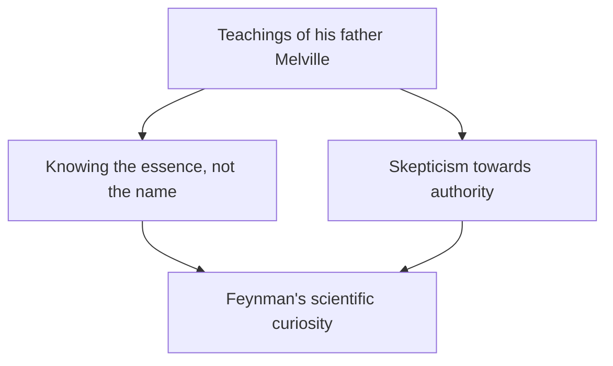

## 1. Introduction: The Trickster and Greatest Teacher of the Physics World

"I have a lot of things I don't understand. But what does it matter? It's perfectly fine not to understand."

As symbolized by these words, Richard P. Feynman (1918 - 1988) was not just a genius physicist, but an overwhelming "human charm" and a "mass of curiosity." One of the most prominent physicists of the 20th century, he won the Nobel Prize in Physics in 1965 for his contributions to the development of Quantum Electrodynamics (QED). However, the reason he is still loved and respected by people all over the world today is not just his brilliant achievements.

He immersed himself in physics calculations at strip clubs on his days off, cracked the safes of colleagues one after another at the top-secret Manhattan Project facility, enthusiastically played the bongos in a samba band in Brazil, and silenced NASA executives on the Challenger explosion investigation commission with a simple experiment using ice water and a rubber O-ring. For him, whether it was exploring the truth of the universe, deciphering Mayan hieroglyphs, or observing the ecology of ants, everything was equally rooted in "The Pleasure of Finding Things Out."

In this article, we will delve deeply into the life of Richard Feynman, the revolution in physics he accomplished, and the message his philosophy poses to our modern society over thousands of words.

---

## 2. Childhood and Student Days: The Best Gift from His Father

Feynman was born on May 11, 1918, in Far Rockaway, Queens, New York. His underlying scientific thinking, especially his attitude of "doubting authority and thinking for yourself," was heavily influenced by his father, Melville.

Melville made uniforms for a living and was not a scientist, but he thoroughly taught his son a scientific "way of looking at things." A famous anecdote is bird watching. Rather than teaching "the names of birds," his father made him think about "why a bird pecks its feathers with its beak." This is the philosophy that "knowing the name of something is completely different from knowing the thing itself." This formed the foundation of Feynman's academic attitude later in life.

Advancing to MIT (Massachusetts Institute of Technology), Feynman began solving math and physics problems with his own unique approaches that were not bound by existing frameworks, and his talent rapidly blossomed. Later, he went on to graduate school at Princeton University, where he met John Archibald Wheeler and stepped onto the front lines of quantum mechanics.

---

## 3. The Manhattan Project and Days at Los Alamos

With the outbreak of World War II, young Feynman was also swept into the massive vortex of history. He was drafted to the Los Alamos National Laboratory in New Mexico, the center of the top-secret "Manhattan Project" to develop the atomic bomb.

At the time, he was still in his early twenties and found himself working under world-class physicists like Robert Oppenheimer and Hans Bethe. He was put in charge of the calculation department (at that time there were no massive computers, and humans and mechanical calculators were used) and made immense practical contributions, such as building an efficient parallel processing system for punch-card calculators.

However, what made him famous was his mischievous personality. Realizing that the security of the safes storing documents was sloppy despite it being a top-secret facility, Feynman figured out his own rules and opened his colleagues' safes one after another, leaving notes saying "I borrowed those classified documents." This wasn't just a prank; it could be said it was his way of "hacking" to demonstrate the vulnerability of the system.

Furthermore, his days at Los Alamos were also a time of personal tragedy for him. His beloved wife Arline was battling tuberculosis, and he visited her at the sanatorium day after day. Just before the atomic bomb was dropped in 1945, Arline passed away. This event, which left a deep scar in Feynman's heart, greatly influenced his outlook on life thereafter.

---

## 4. The Revolution of Quantum Electrodynamics (QED) and Feynman Diagrams

After the war, Feynman moved to the California Institute of Technology (Caltech) via Cornell University, and finally established an immortal monument in the history of physics. This was the reconstruction of "Quantum Electrodynamics (QED)."

At the time, there was a fatal problem (the difficulty of divergence) where trying to calculate the interactions between electrons and photons resulted in infinite answers. Sin-Itiro Tomonaga and Julian Schwinger were also tackling this problem around the same time and derived solutions (renormalization theory) using highly mathematical approaches, but Feynman's method was completely different.

He conceived an intuitive approach of adding up "all possible paths" when a particle moves through space, namely the **"Path Integral."** Furthermore, he invented **"Feynman Diagrams"** to represent these complex formulas as visual figures.

Thanks to this diagramming, calculations in quantum mechanics, which were previously extremely difficult, could be performed intuitively and mechanically. Feynman Diagrams became the "common language" in physics, and it is even said they accelerated the development of particle physics by decades. For this achievement, he was awarded the Nobel Prize in Physics in 1965 along with Sin-Itiro Tomonaga and Julian Schwinger.

---

## 5. "Surely You're Joking, Mr. Feynman!": Unconventional Daily Life and Adventures

Indispensable when talking about Feynman are his numerous wildly unconventional anecdotes. His autobiographical essay "Surely You're Joking, Mr. Feynman!" depicts how much he enjoyed life and was curious about everything.

*   **Samba and Bongos:** While staying in Brazil, he became fascinated by local samba music and participated in the carnival as a bongo player in a professional band.
*   **Passion for Painting:** From an argument with an artist friend, to overturn the prejudice that "scientists cannot understand beauty," he seriously studied drawing and even held a solo exhibition (using the pseudonym "Ofey").
*   **Deciphering Mayan Hieroglyphs:** On his honeymoon in Mexico, he became interested in the ancient documents of the Mayan civilization and, despite not being a linguistics expert, figured out the rules of their astronomical calculations on his own.
*   **Calculations in a Strip Club:** As a place where he could sit down and calculate in peace, he actually frequented a strip club, scribbling math formulas on paper napkins.

These were never just "eccentric" actions; they all arose from his pure desire to "know how things work." For him, physics, bongos, and Mayan hieroglyphs were all puzzles to understand the world.

---

## 6. Feynman as an Educator: Legendary Lectures

Feynman possessed a rare talent not just as a researcher, but as an educator. His philosophy was, "If you can't explain a complex concept to a first-year college student without using jargon, you don't really understand it."

In the early 1960s, a two-year undergraduate physics lecture given at Caltech was recorded and later published as "The Feynman Lectures on Physics." This textbook became a bible for students studying physics worldwide, and even now, over half a century later, it continues to be read without fading in the slightest.

The charm of his lectures lay not in the mere listing of formulas, but in his humorous, gestural way of talking about how dramatic and beautiful natural phenomena are. He was not teaching students "the answers," but "how to ask questions of nature."

---

## 7. The Challenger Explosion and "Nature Cannot Be Fooled"

One of the most famous anecdotes adorning Feynman's later years is his participation in the Rogers Commission investigating the 1986 space shuttle "Challenger" explosion.

Although already suffering from cancer at the time and initially reluctant to participate, he went to Washington to uncover the truth. Faced with bureaucratic cover-ups and NASA's sloppy safety management system (poor risk assessment), he personally interviewed the engineers on the ground and got to the core of the problem.

Then, during a televised hearing, Feynman dunked a rubber O-ring used in the shuttle's joints into a glass of ice water that had been prepared, and clamped it in a C-clamp. He vividly proved in a way anyone could understand that rubber loses its elasticity in near-freezing environments—and that this was the direct cause of the explosion.

The final sentence he wrote as a personal appendix to the investigation report is still told today as a warning to all humans involved in science and technology.

> "For a successful technology, reality must take precedence over public relations, for nature cannot be fooled."

---

## 8. Conclusion: What Feynman Left Us

On February 15, 1988, Feynman passed away at the age of 69 due to abdominal cancer. His final words were full of his signature humor: "I'd hate to die twice. It's so boring."

Richard Feynman's life proves the infinite possibilities of human "intellectual curiosity." For him, science was not a cold collection of formulas or authoritative theories, but the ultimate game to enjoy the grand mystery of the world.

In our modern age, where AI is rapidly advancing and answers can be obtained immediately, we tend to forget to "think for ourselves" and to "have pure questions." However, the "attitude of loving what we don't understand" and the "ability to see the essence behind things" that Feynman taught us should serve as an indispensable compass for us across generations.

When we trace the trajectory of his life, we witness not only the beauty of science but also a brilliant answer to the fundamental question of how we should live and enjoy the world as humans.

---
*Through this article, I hope you have been inspired with even a little Feynman-esque curiosity of "I wonder why?" about the phenomena around you.*
