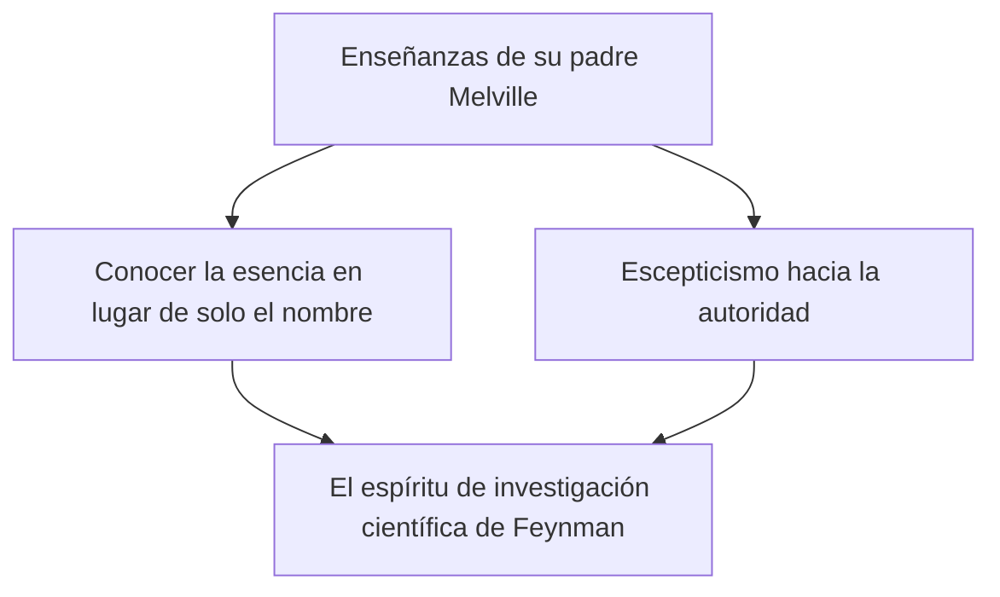
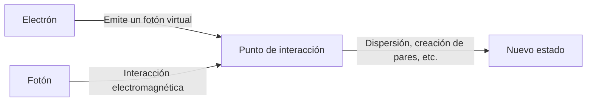

## 1. Introducción: El bromista de la física y el mejor de los profesores

"Hay muchas cosas que no entiendo. Pero, ¿qué importa? No pasa nada por no entenderlas."

Como simbolizan estas palabras, Richard Phillips Feynman (1918 - 1988) no se limitaba a ser un genio de la física, sino que era una persona con un encanto humano abrumador y pura "curiosidad". Fue uno de los físicos más importantes del siglo XX, y en 1965 recibió el Premio Nobel de Física por sus contribuciones al desarrollo de la electrodinámica cuántica (QED). Sin embargo, la razón por la que todavía hoy es amado y respetado en todo el mundo no se debe solo a sus brillantes logros.

En sus días libres se sumergía en cálculos físicos en un club de striptease, abría una tras otra las cajas fuertes de sus colegas en las instalaciones ultrasecretas del Proyecto Manhattan, tocaba apasionadamente los bongos con una banda de samba en Brasil, y silenció a los altos mandos de la NASA durante el comité de investigación de la explosión del transbordador espacial Challenger con un simple experimento utilizando agua helada y una junta tórica de goma. Para él, explorar las verdades del universo, descifrar la escritura maya y observar la ecología de las hormigas radicaba igualmente en "el placer de descubrir cosas" (The Pleasure of Finding Things Out).

En este artículo, exploraremos a fondo, a lo largo de miles de palabras, la vida de Richard Feynman, la revolución que logró en la física y el mensaje que su filosofía sigue transmitiendo a nuestra sociedad moderna.

---

## 2. Infancia y etapa de estudiante: El mejor regalo de su padre

Feynman nació el 11 de mayo de 1918 en Far Rockaway, Queens, Nueva York. El pensamiento científico que lo definía en su núcleo, especialmente su actitud de "dudar de la autoridad y pensar por uno mismo", fue fuertemente influenciado por su padre, Melville.

Melville trabajaba fabricando uniformes y no era científico, pero le enseñó a su hijo una forma de ver las cosas desde una perspectiva científica. Una anécdota famosa trata sobre la observación de aves. En lugar de enseñarle el nombre del ave, su padre le hizo pensar en "por qué el pájaro se pica las plumas con el pico". Su filosofía era que "saber el nombre de algo y conocer ese algo son dos cosas completamente distintas". Esto formó la base de la actitud académica que Feynman tendría más adelante.

Feynman, al ingresar al MIT (Instituto Tecnológico de Massachusetts), comenzó a resolver problemas de matemáticas y física con enfoques originales, sin limitarse a los marcos convencionales, lo que hizo florecer rápidamente su talento. Posteriormente, al cursar estudios de posgrado en la Universidad de Princeton, conoció a John Archibald Wheeler y se adentró en la vanguardia de la mecánica cuántica.

---

## 3. El Proyecto Manhattan y sus días en Los Álamos

Con el estallido de la Segunda Guerra Mundial, el joven Feynman también se vio envuelto en el gran torbellino de la historia. Fue convocado al Laboratorio Nacional de Los Álamos en Nuevo México, el centro del Proyecto Manhattan, un proyecto ultrasecreto para el desarrollo de la bomba atómica.

En ese entonces tenía poco más de 20 años y comenzó a trabajar bajo la supervisión de algunos de los mejores físicos del mundo, como Robert Oppenheimer y Hans Bethe. Fue designado líder del departamento de cálculo (en esa época aún no existían las grandes computadoras y se utilizaban seres humanos o calculadoras mecánicas) e hizo enormes contribuciones en el aspecto práctico, como la construcción de un sistema eficiente de procesamiento paralelo con calculadoras de tarjetas perforadas.

Sin embargo, lo que le hizo famoso fue su carácter bromista. Al darse cuenta de que la seguridad de las cajas fuertes que guardaban los documentos era deficiente, a pesar de ser una instalación de máximo secreto, Feynman descubrió sus propias reglas, abrió una tras otra las cajas fuertes de sus colegas y dejó notas diciendo: "He tomado prestados estos documentos confidenciales". Se puede decir que esto no era una simple broma, sino su forma de "hackear" para demostrar la vulnerabilidad del sistema.

Además, sus días en Los Álamos también fueron una época de tragedia personal. Su amada esposa, Arline, padecía tuberculosis y pasaba los días visitándola en un sanatorio. Justo antes del lanzamiento de la bomba atómica en 1945, Arline falleció. Este evento, que dejó una profunda herida en el corazón de Feynman, también tuvo un gran impacto en su posterior visión de la vida.

---

## 4. La revolución de la Electrodinámica Cuántica (QED) y los Diagramas de Feynman

Después de la guerra, tras pasar por la Universidad de Cornell y trasladarse al Instituto de Tecnología de California (Caltech), Feynman finalmente erigió un monumento inmortal en la historia de la física. Fue la reconstrucción de la "Electrodinámica Cuántica" (QED, por sus siglas en inglés).

En aquel entonces, existía el problema fatal (la dificultad de divergencia) de que al intentar calcular la interacción de electrones y fotones, la respuesta resultaba infinita. Sin-Itiro Tomonaga y Julian Schwinger también abordaron este problema al mismo tiempo y encontraron soluciones (la teoría de la renormalización) utilizando enfoques matemáticos avanzados, pero el método de Feynman era de naturaleza completamente diferente.

Él ideó un enfoque intuitivo de sumar "todas las rutas concebibles" que toma una partícula al moverse por el espacio, es decir, la **"integral de camino" (Path Integral)**. Además, inventó los **"diagramas de Feynman"**, que representan visualmente esas complejas fórmulas matemáticas mediante figuras geométricas.

Gracias a esta esquematización, los cálculos de la mecánica cuántica, que hasta entonces eran extremadamente difíciles, se pudieron realizar de forma intuitiva y mecánica. Los diagramas de Feynman se convirtieron en el "idioma común" de la física, y se dice incluso que adelantaron el desarrollo de la física de partículas en varias décadas. Por este logro, recibió el Premio Nobel de Física en 1965, junto con Sin-Itiro Tomonaga y Julian Schwinger.

---

## 5. "¿Está usted de broma, Sr. Feynman?": Una vida poco convencional y llena de aventuras

Es imposible hablar de Feynman sin mencionar sus numerosas anécdotas extravagantes. En su ensayo autobiográfico "¿Está usted de broma, Sr. Feynman?", se relata cómo disfrutaba de la vida y cómo sentía curiosidad por todo.

*   **Samba y bongos:** Durante su estancia en Brasil, quedó fascinado por la música de samba local y participó en el carnaval como tocador de bongos junto a una banda profesional.
*   **Pasión por la pintura:** A partir de discusiones con amigos artistas, y para refutar el prejuicio de que "los científicos no pueden comprender la belleza", aprendió a dibujar en serio y llegó a organizar sus propias exposiciones (utilizando el seudónimo de "Ofey").
*   **Descifrando la escritura maya:** Durante su luna de miel en México, se interesó por los manuscritos antiguos de la civilización maya y, sin ser un experto en lingüística, descifró por sí mismo las regularidades de sus cálculos astronómicos.
*   **Cálculos en un club de striptease:** Buscando un lugar tranquilo para calcular, iba con frecuencia a un club de striptease, donde garabateaba fórmulas en servilletas de papel.

Todas estas no eran acciones para llamar la atención, sino que nacían de un puro deseo de "saber cómo funciona". Para él, tanto la física como los bongos o la escritura maya eran rompecabezas para comprender el mundo.

---

## 6. Feynman como educador: Clases legendarias

Feynman poseía un talento extraordinario no solo como investigador, sino también como educador. Su postura era que "si no puedes explicar un concepto complejo a un estudiante de primer año de universidad sin usar jerga técnica de modo que lo entienda, significa que en realidad no lo has comprendido tú mismo".

A principios de la década de 1960, se grabaron en audio y video sus clases de física para estudiantes universitarios, impartidas durante dos años en Caltech, que luego se publicaron como las "Lecciones de Física de Feynman" (The Feynman Lectures on Physics). Este libro de texto se convirtió en la biblia para estudiantes de física de todo el mundo y, a pesar de haber pasado más de medio siglo, sigue siendo leído sin perder en absoluto su vigencia.

El encanto de sus clases residía en que no era una simple enumeración de fórmulas, sino que explicaba con gran sentido del humor y lenguaje corporal lo dramáticos y hermosos que son los fenómenos de la naturaleza. Él no enseñaba a sus alumnos las "respuestas", sino "cómo hacer preguntas a la naturaleza".

---

## 7. El accidente de la explosión del Challenger y "A la naturaleza no se la puede engañar"

Uno de los episodios más famosos de los últimos años de Feynman fue su participación en la comisión investigadora (la Comisión Rogers) del accidente de la explosión del transbordador espacial "Challenger", que ocurrió en 1986.

Aunque ya estaba padeciendo cáncer, inicialmente dudó en participar, pero finalmente viajó a Washington para descubrir la verdad. Enfrentado a la cultura burocrática del encubrimiento y a los deficientes sistemas de gestión de la seguridad (evaluaciones de riesgo laxas) de la NASA, él mismo realizó audiencias directas con los ingenieros en el lugar y llegó al núcleo del problema.

Y durante una audiencia pública televisada, Feynman sumergió una junta tórica de goma, utilizada en las conexiones del transbordador, en un vaso de agua con hielo que le habían preparado, y la apretó con una abrazadera. Demostró de forma brillante y comprensible para todos que la elasticidad de la goma se perdía en un ambiente cercano a temperaturas de congelación, siendo esta la causa directa de la explosión.

La última frase que escribió como apéndice personal en el informe de investigación sigue siendo recordada como una advertencia para todas las personas que se dedican a la ciencia y la tecnología.

> "For a successful technology, reality must take precedence over public relations, for nature cannot be fooled."
> (Para una tecnología exitosa, la realidad debe primar sobre las relaciones públicas, ya que a la naturaleza no se la puede engañar.)

---

## 8. Conclusión: El legado de Feynman para nosotros

El 15 de febrero de 1988, Feynman falleció a la edad de 69 años a causa de un cáncer abdominal. Sus últimas palabras fueron: "Odiaría morir dos veces. Es tan aburrido" (I'd hate to die twice. It's so boring), llenas de su característico humor.

La vida de Richard Feynman demuestra las infinitas posibilidades que tiene la "curiosidad intelectual" humana. Para él, la ciencia no era una fría colección de fórmulas o teorías autorizadas, sino el mejor juego para disfrutar del gran misterio que es el mundo.

En la actualidad, donde la inteligencia artificial avanza rápidamente y podemos obtener respuestas al instante, tendemos a olvidar "pensar por nosotros mismos" y a tener "dudas genuinas". Sin embargo, la "actitud de amar lo que no entendemos" y la "capacidad de discernir la esencia detrás de las cosas" que Feynman nos enseñó, deberían ser una brújula indispensable para nosotros a lo largo del tiempo.

Al seguir la trayectoria de su vida, no solo presenciamos la belleza de la ciencia, sino también una magnífica respuesta a la pregunta fundamental de cómo debemos vivir y disfrutar del mundo como seres humanos.

---
*Si a través de este artículo ha logrado despertar en usted, aunque sea un poco, esa curiosidad estilo Feynman de preguntarse "¿por qué?" frente a los fenómenos que le rodean, nos daríamos por satisfechos.*
