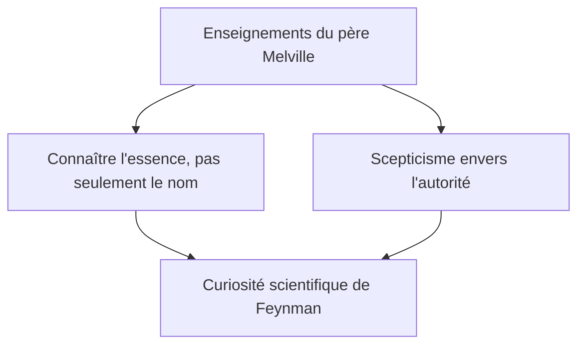
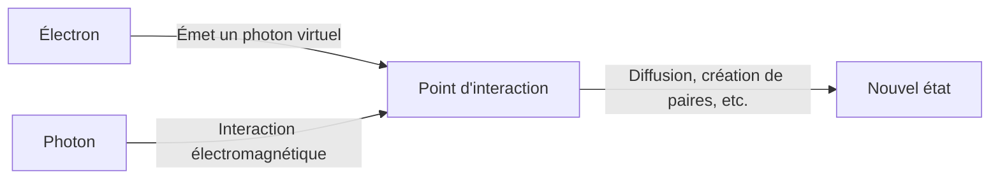

## 1. Introduction : Le trickster de la physique et le meilleur des professeurs

« Il y a beaucoup de choses que je ne comprends pas. Mais qu'est-ce que ça peut faire ? Ce n'est pas grave de ne pas savoir. »

Comme le symbolise cette citation, Richard P. Feynman (1918 - 1988) était bien plus qu'un simple génie de la physique, c'était une « pure merveille humaine » et un « concentré de curiosité ». En tant que l'un des physiciens les plus éminents du 20e siècle, il a remporté le prix Nobel de physique en 1965 pour sa contribution au développement de l'électrodynamique quantique (QED). Cependant, la raison pour laquelle il est encore aujourd'hui aimé et respecté par des gens du monde entier ne se limite pas à ses brillantes réalisations.

Se plonger dans des calculs de physique dans un club de strip-tease pendant ses jours de congé, forcer un par un les coffres-forts de ses collègues dans le complexe ultra-secret du projet Manhattan, s'enflammer en tant que joueur de bongo dans un groupe de samba au Brésil, et faire taire les dirigeants de la NASA avec une simple expérience impliquant de l'eau glacée et un joint torique en caoutchouc lors de la commission d'enquête sur l'explosion de la navette Challenger. Pour lui, explorer la vérité de l'univers, déchiffrer les hiéroglyphes mayas ou observer l'écologie des fourmis, tout était également ancré dans le « plaisir de découvrir » (The Pleasure of Finding Things Out).

Dans cet article, nous explorerons en profondeur sur plusieurs milliers de mots la vie d'un tel Richard Feynman, la révolution qu'il a accomplie en physique, et le message que sa philosophie adresse à notre société moderne.

---

## 2. Enfance et époque étudiante : Le meilleur cadeau de son père

Le 11 mai 1918, Feynman est né à Far Rockaway, dans l'arrondissement de Queens à New York. Sa pensée scientifique fondamentale, et plus particulièrement son attitude consistant à « douter de l'autorité et penser par soi-même », a été fortement influencée par son père, Melville.

Melville fabriquait des uniformes et n'était pas un scientifique, mais il a inculqué de manière approfondie à son fils une « façon scientifique de voir les choses ». Une anecdote célèbre concerne l'observation des oiseaux. Son père ne lui a pas appris « le nom de l'oiseau », mais l'a fait réfléchir à « pourquoi l'oiseau picore ses plumes avec son bec ». C'est la philosophie selon laquelle « connaître le nom d'une chose et connaître la chose elle-même sont complètement différents ». Cela a formé le fondement de l'attitude académique ultérieure de Feynman.

Feynman, qui est entré au MIT (Massachusetts Institute of Technology), a commencé à résoudre des problèmes de mathématiques et de physique avec une approche unique, non limitée par les cadres existants, et son talent s'est rapidement épanoui. Ensuite, il est allé à l'école doctorale de l'Université de Princeton, où il a rencontré John Archibald Wheeler et a mis les pieds à l'avant-garde de la mécanique quantique.

---

## 3. Le projet Manhattan et les jours à Los Alamos

Avec le déclenchement de la Seconde Guerre mondiale, le jeune Feynman a également été emporté dans le grand tourbillon de l'histoire. Il a été convoqué au Laboratoire national de Los Alamos au Nouveau-Mexique, le centre du « Projet Manhattan », un projet top-secret pour le développement de la bombe atomique.

À l'époque, il n'avait qu'une vingtaine d'années et devait travailler sous la direction de physiciens de classe mondiale comme Robert Oppenheimer et Hans Bethe. Il a été nommé chef du département des calculs (à l'époque, il n'y avait pas encore d'ordinateurs géants, on utilisait des calculateurs humains ou mécaniques) et a apporté une contribution massive sur le plan pratique, notamment en construisant un système de traitement parallèle efficace pour les machines à cartes perforées.

Cependant, ce qui l'a rendu célèbre, c'est son caractère espiègle. Ayant remarqué que la sécurité des coffres-forts abritant les documents confidentiels était bâclée, même s'il s'agissait d'une installation manipulant des secrets de premier ordre, Feynman a découvert ses propres règles, ouvrant l'un après l'autre les coffres de ses collègues pour y laisser une note disant : « J'ai emprunté ce document confidentiel. » On peut dire que ce n'était pas une simple farce, mais une forme de « piratage » à sa manière pour démontrer la vulnérabilité du système.

En outre, ses jours à Los Alamos furent aussi une période de tragédie personnelle. Sa femme bien-aimée, Arline, souffrait de la tuberculose et il continuait à lui rendre visite au sanatorium. Juste avant le largage de la bombe atomique en 1945, Arline est décédée. Cet événement, qui a laissé une profonde cicatrice dans le cœur de Feynman, a également eu un impact majeur sur sa vision de la vie par la suite.

---

## 4. La révolution de l'électrodynamique quantique (QED) et les diagrammes de Feynman

Après la guerre, Feynman s'est rendu à l'Université Cornell, puis au California Institute of Technology (Caltech), où il a finalement érigé un monument immortel dans l'histoire de la physique. Il s'agit de la reconstruction de l'« électrodynamique quantique » (Quantum Electrodynamics, QED).

À l'époque, il y avait un problème fatal (le problème des divergences) : lorsque l'on essayait de calculer l'interaction entre les électrons et les photons, la réponse devenait infinie. Shinichiro Tomonaga et Julian Schwinger ont également travaillé sur ce problème en même temps et ont trouvé une solution (la théorie de la renormalisation) grâce à une approche mathématique avancée, mais la méthode de Feynman était d'une nature totalement différente.

Il a imaginé une approche intuitive consistant à additionner « tous les chemins concevables » qu'une particule emprunte lorsqu'elle se déplace dans l'espace, à savoir **« l'intégrale de chemin » (Path Integral)**. De plus, il a inventé les **« diagrammes de Feynman »**, qui représentent ces formules mathématiques complexes sous forme de figures visuelles.

Grâce à cette schématisation, les calculs de la mécanique quantique, jusqu'alors extrêmement difficiles, pouvaient être effectués de manière intuitive et mécanique. Le diagramme de Feynman est devenu une « langue commune » en physique, et on dit même qu'il a accéléré le développement de la physique des particules de plusieurs décennies. Pour ces réalisations, il a reçu le prix Nobel de physique en 1965 avec Shinichiro Tomonaga et Julian Schwinger.

---

## 5. « Vous voulez rire, monsieur Feynman ! » : Un quotidien non conventionnel et des aventures

On ne peut pas parler de Feynman sans évoquer ses nombreuses anecdotes extravagantes. Son essai autobiographique « Vous voulez rire, monsieur Feynman ! » décrit à quel point il a profité de la vie et a été curieux de tout.

*   **Samba et bongos :** Lors d'un séjour au Brésil, il a été fasciné par la musique de samba locale et a participé au carnaval en tant que joueur de bongo au sein d'un groupe professionnel.
*   **Passion pour la peinture :** Suite à une dispute avec un ami artiste, et pour renverser le préjugé selon lequel « les scientifiques ne peuvent pas comprendre la beauté », il a appris le dessin de manière intensive, jusqu'à tenir une exposition personnelle (sous le pseudonyme « Ofey »).
*   **Déchiffrement des hiéroglyphes mayas :** Lors d'un voyage de noces au Mexique, il s'est intéressé aux manuscrits anciens de la civilisation maya, et bien qu'il ne soit pas un expert en linguistique, il a déchiffré par lui-même les lois des calculs astronomiques.
*   **Calculs dans un club de strip-tease :** Étonnamment, il a fréquenté un club de strip-tease comme endroit pour pouvoir faire des calculs au calme, griffonnant des équations mathématiques sur des serviettes en papier.

Ces actions n'étaient en aucun cas « excentriques », elles découlaient toutes du désir pur de « savoir comment ça marche ». Pour lui, la physique, le bongo et les hiéroglyphes mayas étaient tous des puzzles pour comprendre le monde.

---

## 6. Feynman en tant qu'éducateur : Les cours légendaires

Feynman possédait un talent exceptionnel non seulement en tant que chercheur, mais aussi en tant qu'éducateur. Sa conviction était que « si vous ne pouvez pas expliquer un concept complexe à un étudiant de première année sans utiliser de jargon technique, c'est que vous ne le comprenez pas vraiment ».

Au début des années 1960, un cours de physique pour les étudiants de premier cycle dispensé sur deux ans au Caltech a été enregistré sur bande audio et vidéo, pour être publié plus tard sous le titre « Le cours de physique de Feynman » (The Feynman Lectures on Physics). Ce manuel est devenu une bible pour les étudiants du monde entier qui étudient la physique et continue d'être lu aujourd'hui, plus d'un demi-siècle plus tard, sans avoir pris une ride.

Le charme de ses cours ne résidait pas dans une simple énumération de formules, mais dans sa façon de parler avec des gestes et beaucoup d'humour pour montrer à quel point les phénomènes du monde naturel sont spectaculaires et magnifiques. Il n'enseignait pas les « réponses » à ses étudiants, mais « comment poser des questions à la nature ».

---

## 7. L'accident de la navette spatiale Challenger et « On ne peut pas tromper la nature »

L'un des épisodes les plus célèbres de la fin de la vie de Feynman est sa participation à la commission d'enquête (Commission Rogers) sur l'explosion de la navette spatiale « Challenger » qui s'est produite en 1986.

Déjà atteint d'un cancer à l'époque, il hésitait d'abord à participer, mais il s'est rendu à Washington pour découvrir la vérité. Confronté à une culture bureaucratique de dissimulation et au système de gestion de la sécurité négligent de la NASA (faiblesse de l'évaluation des risques), il a mené lui-même des entretiens directs avec les ingénieurs sur le terrain, se rapprochant ainsi du cœur du problème.

Lors d'une audience publique retransmise à la télévision, Feynman a trempé un joint torique en caoutchouc, utilisé pour les joints de la navette, dans un verre d'eau glacée qui lui avait été préparé, et l'a serré avec une pince (étau). Il a prouvé de manière éclatante, de façon compréhensible pour tous, que le caoutchouc perd son élasticité dans un environnement proche de zéro degré, ce qui fut la cause directe de l'explosion.

La dernière phrase qu'il a écrite en tant qu'annexe personnelle au rapport d'enquête est encore transmise aujourd'hui comme un avertissement à tous ceux qui travaillent dans la science et la technologie.

> "For a successful technology, reality must take precedence over public relations, for nature cannot be fooled."
> (Pour qu'une technologie soit couronnée de succès, la réalité doit primer sur les relations publiques, car on ne peut pas tromper la nature.)

---

## 8. Conclusion : L'héritage que Feynman nous a laissé

Le 15 février 1988, Feynman est décédé à l'âge de 69 ans des suites d'un cancer de l'abdomen. Ses derniers mots furent : « Je détesterais mourir deux fois. C'est tellement ennuyeux. » (I'd hate to die twice. It's so boring.), une phrase pleine de l'humour qui le caractérisait.

La vie de Richard Feynman prouve les possibilités infinies de la « curiosité intellectuelle » humaine. Pour lui, la science n'était pas un ramassis de formules froides et de théories autoritaires, mais le jeu ultime pour profiter du grand mystère qu'est le monde.

À l'heure où l'IA évolue rapidement et où les réponses sont instantanément disponibles, nous avons tendance à oublier de « penser par nous-mêmes » et de « se poser de pures questions ». Cependant, « l'attitude d'aimer ce que l'on ne comprend pas » et « la capacité de discerner l'essence derrière les choses » que Feynman nous a enseignées devraient nous servir de boussole indispensable à travers les âges.

En retraçant le parcours de sa vie, nous sommes témoins non seulement de la beauté de la science, mais aussi d'une réponse splendide à la question fondamentale de savoir comment nous devons vivre et profiter du monde en tant qu'êtres humains.

---
*Si cet article a pu susciter en vous ne serait-ce qu'un peu de cette curiosité à la Feynman, en vous demandant « pourquoi ? » face aux phénomènes qui vous entourent, nous en serions ravis.*
