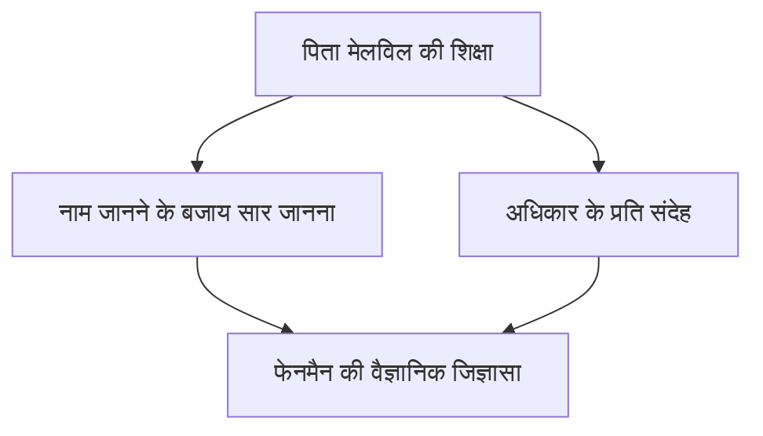
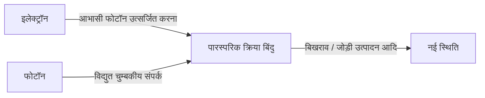

## 1. प्रस्तावना: भौतिकी की दुनिया के ट्रिकस्टर और सर्वश्रेष्ठ शिक्षक

"मेरे पास बहुत सी ऐसी चीजें हैं जो मुझे समझ नहीं आतीं। लेकिन, उससे क्या फर्क पड़ता है? अगर मैं उन्हें नहीं समझता, तो भी कोई बात नहीं है।"

जैसा कि इन शब्दों से स्पष्ट है, रिचर्ड पी. फेनमैन (1918 - 1988) केवल एक प्रतिभाशाली भौतिक विज्ञानी ही नहीं थे, बल्कि उनमें अपार "मानवीय आकर्षण" था और वे "जिज्ञासा के पुंज" थे। वे 20वीं सदी के प्रमुख भौतिक विज्ञानियों में से एक थे और 1965 में क्वांटम इलेक्ट्रोडायनामिक्स (QED) के विकास में उनके योगदान के लिए उन्हें भौतिकी का नोबेल पुरस्कार मिला था। हालांकि, आज भी दुनिया भर में उन्हें जो प्यार और सम्मान मिलता है, उसका कारण केवल उनकी शानदार उपलब्धियां नहीं हैं।

छुट्टियों में स्ट्रिप क्लब में भौतिकी की गणनाओं में तल्लीन होना, मैनहट्टन प्रोजेक्ट की अति-गुप्त सुविधा में सहकर्मियों की तिजोरियां एक के बाद एक तोड़ना, ब्राजील में सांबा बैंड में बोंगो वादक के रूप में धूम मचाना, और चैलेंजर विस्फोट दुर्घटना जांच समिति में बर्फ के पानी और रबर ओ-रिंग का उपयोग करके एक सरल प्रयोग से नासा के शीर्ष अधिकारियों को चुप करा देना। उनके लिए, ब्रह्मांड के सत्य की खोज करना, माया लिपि को डिकोड करना, या चींटियों के व्यवहार का निरीक्षण करना, यह सब समान रूप से "खोज के आनंद" (The Pleasure of Finding Things Out) में निहित था।

इस लेख में, हम रिचर्ड फेनमैन के जीवन, उनके द्वारा लाई गई भौतिकी की क्रांति, और उनके दर्शन आज के आधुनिक समाज को क्या संदेश देते हैं, इसका हजारों शब्दों में गहन विश्लेषण करेंगे।

---

## 2. बचपन से छात्र जीवन तक: पिता का सर्वश्रेष्ठ उपहार

11 मई 1918 को न्यूयॉर्क के क्वींस के फार रॉकअवे में फेनमैन का जन्म हुआ। उनकी अंतर्निहित वैज्ञानिक सोच, विशेष रूप से "अधिकार पर सवाल उठाना और अपने दिमाग से सोचना" का दृष्टिकोण, उनके पिता मेलविल से बहुत प्रभावित था।

मेलविल वर्दी बनाने का काम करते थे और वैज्ञानिक नहीं थे, लेकिन उन्होंने अपने बेटे को वैज्ञानिक "दृष्टिकोण" अच्छी तरह सिखाया। एक प्रसिद्ध किस्सा पक्षी अवलोकन से जुड़ा है। पिता ने "पक्षी का नाम" सिखाने के बजाय, उसे यह सोचने पर मजबूर किया कि "पक्षी अपनी चोंच से अपने पंखों को क्यों सहलाते हैं।" उनका दर्शन था कि "नाम जानना और उस चीज़ को जानना दोनों बिल्कुल अलग बातें हैं।" इसी ने बाद में फेनमैन के शैक्षणिक दृष्टिकोण की नींव रखी।

MIT (मैसाचुसेट्स इंस्टीट्यूट ऑफ टेक्नोलॉजी) में प्रवेश करने के बाद, फेनमैन ने पारंपरिक ढांचे से परे एक अनूठे दृष्टिकोण के साथ गणित और भौतिकी की समस्याओं को हल करना शुरू किया, और उनकी प्रतिभा तेजी से निखरी। इसके बाद, प्रिंसटन विश्वविद्यालय के स्नातक विद्यालय में, उनकी मुलाकात जॉन आर्चीबाल्ड व्हीलर से हुई, और उन्होंने क्वांटम यांत्रिकी के अग्रणी मोर्चे पर कदम रखा।

---

## 3. मैनहट्टन प्रोजेक्ट और लॉस एलामोस के दिन

द्वितीय विश्व युद्ध छिड़ने के साथ ही, युवा फेनमैन भी इतिहास के एक बड़े भंवर में फंस गए। उन्हें परमाणु बम विकसित करने के अति-गुप्त प्रोजेक्ट "मैनहट्टन प्रोजेक्ट" के केंद्र, न्यू मैक्सिको में लॉस एलामोस नेशनल लेबोरेटरी में बुलाया गया था।

उस समय, वह अपने 20 के दशक की शुरुआत में ही थे, और उन्हें रॉबर्ट ओपेनहाइमर और हंस बेथे जैसे दुनिया के शीर्ष भौतिक विज्ञानियों के अधीन काम करने का अवसर मिला। उन्हें गणना विभाग (उस समय कोई विशाल कंप्यूटर नहीं थे, और मानव या यांत्रिक कैलकुलेटर का उपयोग किया जाता था) का नेता नियुक्त किया गया, और उन्होंने पंच-कार्ड कैलकुलेटर का उपयोग करके एक कुशल समानांतर प्रसंस्करण प्रणाली बनाने जैसे व्यावहारिक पहलुओं में भी बहुत योगदान दिया।

हालांकि, जिस चीज़ ने उन्हें प्रसिद्ध किया, वह उनका शरारती स्वभाव था। एक अति-सुरक्षित सुविधा होने के बावजूद, दस्तावेज़ों को रखने वाली तिजोरियों की सुरक्षा को कमजोर पाकर, फेनमैन ने अपने स्वयं के नियम खोजे, सहकर्मियों की तिजोरियों को एक के बाद एक खोला और एक नोट छोड़ा: "वे गुप्त दस्तावेज़ मैंने ले लिए हैं।" यह केवल एक मज़ाक नहीं था, बल्कि प्रणाली की कमज़ोरियों को प्रदर्शित करने वाला उनका अपना "हैकिंग" का तरीका था।

साथ ही, लॉस एलामोस के दिन उनके लिए एक व्यक्तिगत त्रासदी का समय भी थे। उनकी प्यारी पत्नी आर्लीन तपेदिक से जूझ रही थीं, और वह अक्सर उन्हें सैनिटोरियम में देखने जाते थे। 1945 में परमाणु बम गिराए जाने से ठीक पहले आर्लीन का निधन हो गया। इस घटना ने फेनमैन के दिल पर गहरी चोट छोड़ी और बाद में उनके जीवन के दृष्टिकोण पर बड़ा प्रभाव डाला।

---

## 4. क्वांटम इलेक्ट्रोडायनामिक्स (QED) की क्रांति और फेनमैन डायग्राम

युद्ध के बाद, कॉर्नेल विश्वविद्यालय से होते हुए कैलिफोर्निया इंस्टीट्यूट ऑफ टेक्नोलॉजी (कैलटेक) जाने के बाद, फेनमैन ने अंततः भौतिकी के इतिहास में एक अमर कीर्तिमान स्थापित किया। वह था "क्वांटम इलेक्ट्रोडायनामिक्स (QED)" का पुनर्निर्माण।

उस समय, इलेक्ट्रॉनों और फोटॉनों की परस्पर क्रिया की गणना करने का प्रयास करते समय, उत्तर अनंत हो जाने की एक घातक समस्या (विचलन की कठिनाई) थी। शिनिचिरो तोमोनागा और जूलियन श्विंगर जैसे वैज्ञानिकों ने भी उसी समय इस समस्या से निपटा और उच्च गणितीय दृष्टिकोण (पुनर्सामान्यीकरण सिद्धांत) के साथ समाधान निकाला, लेकिन फेनमैन का तरीका पूरी तरह से अलग था।

उन्होंने एक सहज दृष्टिकोण ईजाद किया जिसमें एक कण के अंतरिक्ष में यात्रा करते समय "सभी संभावित मार्गों" को जोड़ना शामिल था, जिसे **"पाथ इंटीग्रल" (Path Integral)** कहा जाता है। इसके अलावा, उन्होंने उन जटिल गणितीय सूत्रों को दृश्य आकृतियों के रूप में व्यक्त करने के लिए **"फेनमैन डायग्राम"** का आविष्कार किया।

इस आरेखीकरण ने क्वांटम यांत्रिकी की गणनाओं को, जो पहले अत्यंत कठिन थीं, सहज और यांत्रिक रूप से करना संभव बना दिया। फेनमैन डायग्राम भौतिकी में एक "सामान्य भाषा" बन गया, और यह भी कहा जाता है कि इसने कण भौतिकी के विकास को कई दशक आगे बढ़ा दिया। इस उपलब्धि के लिए, उन्हें 1965 में शिनिचिरो तोमोनागा और जूलियन श्विंगर के साथ भौतिकी का नोबेल पुरस्कार मिला।

---

## 5. "ज़रूर मज़ाक कर रहे हैं, मिस्टर फेनमैन": अपरंपरागत दैनिक जीवन और रोमांच

फेनमैन के बारे में बात करते समय उनके कई बेतहाशा किस्सों को नज़रअंदाज़ नहीं किया जा सकता है। उनके आत्मकथात्मक निबंध "ज़रूर मज़ाक कर रहे हैं, मिस्टर फेनमैन" में बताया गया है कि उन्होंने किस तरह जीवन का पूरा आनंद लिया और हर चीज़ के प्रति उत्सुकता दिखाई।

*   **सांबा और बोंगो:** ब्राज़ील में अपने प्रवास के दौरान, वह स्थानीय सांबा संगीत से इतने आकर्षित हुए कि उन्होंने एक पेशेवर बैंड में शामिल होकर एक बोंगो वादक के रूप में कार्निवल में प्रदर्शन किया।
*   **चित्रकला का जुनून:** एक कलाकार मित्र के साथ हुई चर्चा से, "वैज्ञानिक सुंदरता नहीं समझ सकते" के पूर्वाग्रह को तोड़ने के लिए उन्होंने गंभीरता से ड्राइंग सीखी और यहां तक कि एक एकल प्रदर्शनी भी आयोजित की (उन्होंने "ओफे" (Ofey) नाम का छद्म नाम इस्तेमाल किया था)।
*   **माया लिपि को डिकोड करना:** अपने हनीमून पर मैक्सिको जाने के बाद, उनकी रुचि माया सभ्यता की प्राचीन पांडुलिपियों में जगी, और बिना भाषाविद् विशेषज्ञ हुए भी, उन्होंने स्वयं ही खगोलीय गणना के नियमों को डिकोड किया।
*   **स्ट्रिप क्लब में गणना:** गणना करने के लिए एक शांतिपूर्ण स्थान के रूप में, वे नियमित रूप से स्ट्रिप क्लब जाते थे और वहां कागज़ के नैपकिन पर समीकरण लिखते थे।

ये बिल्कुल भी "ध्यान खींचने वाले" कार्य नहीं थे, बल्कि ये सभी "चीज़ें कैसे काम करती हैं" यह जानने की एक शुद्ध इच्छा से उत्पन्न हुए थे। उनके लिए भौतिकी, बोंगो और माया लिपि सभी दुनिया को समझने के लिए बस पहेलियां थीं।

---

## 6. एक शिक्षक के रूप में फेनमैन: प्रसिद्ध व्याख्यान

फेनमैन में न केवल एक शोधकर्ता के रूप में, बल्कि एक शिक्षक के रूप में भी अद्वितीय प्रतिभा थी। उनका मानना था, "यदि आप जटिल अवधारणाओं को तकनीकी शब्दों का उपयोग किए बिना विश्वविद्यालय के प्रथम वर्ष के छात्र को नहीं समझा सकते हैं, तो इसका मतलब है कि आप वास्तव में इसे नहीं समझते हैं।"

1960 के दशक की शुरुआत में, कैलटेक में उनके द्वारा दिए गए दो साल के स्नातक भौतिकी व्याख्यान को रिकॉर्ड किया गया और बाद में इसे "द फेनमैन लेक्चर्स ऑन फिजिक्स" के रूप में प्रकाशित किया गया। यह पाठ्यपुस्तक दुनिया भर में भौतिकी पढ़ने वाले छात्रों के लिए एक बाइबिल बन गई है, और आधी सदी से अधिक समय बीत जाने के बाद भी, आज भी यह उतनी ही प्रासंगिक है और पढ़ी जाती है।

उनके व्याख्यानों का आकर्षण केवल सूत्रों की सूची नहीं थी, बल्कि यह था कि वे हाव-भाव और हास्य के साथ प्राकृतिक घटनाओं के नाटकीय और सुंदर पहलुओं को समझाते थे। वह छात्रों को "उत्तर" नहीं सिखा रहे थे, बल्कि "प्रकृति से सवाल कैसे पूछें" यह सिखा रहे थे।

---

## 7. चैलेंजर विस्फोट और "प्रकृति को बेवकूफ नहीं बनाया जा सकता"

फेनमैन के जीवन के अंतिम वर्षों के सबसे प्रसिद्ध किस्सों में से एक 1986 में स्पेस शटल "चैलेंजर" विस्फोट दुर्घटना की जांच के लिए गठित समिति (रोजर्स आयोग) में उनकी भागीदारी थी।

उस समय वह पहले ही कैंसर से पीड़ित थे और शुरुआत में इसमें भाग लेने से हिचकिचा रहे थे, लेकिन सच्चाई का पता लगाने के लिए वह वाशिंगटन गए। नौकरशाही की छिपाने की प्रवृत्ति और नासा की ढीली सुरक्षा प्रबंधन प्रणाली (खराब जोखिम मूल्यांकन) का सामना करते हुए, उन्होंने व्यक्तिगत रूप से ऑन-साइट इंजीनियरों का साक्षात्कार लिया और समस्या के मूल तक पहुंचे।

फिर, टेलीविजन पर प्रसारित सुनवाई में, फेनमैन ने शटल के जोड़ों में इस्तेमाल होने वाले रबर ओ-रिंग को बर्फ के पानी के एक गिलास में डुबोया और इसे एक क्लैंप से दबाया। उन्होंने सभी को स्पष्ट रूप से दिखाया कि शून्य से नीचे के तापमान में रबर अपनी लोच खो देता है - यही विस्फोट का प्रत्यक्ष कारण था।

जांच रिपोर्ट के अपने व्यक्तिगत परिशिष्ट के रूप में उनके द्वारा लिखा गया अंतिम वाक्य आज भी विज्ञान और प्रौद्योगिकी में शामिल सभी लोगों के लिए एक चेतावनी के रूप में याद किया जाता है।

> "For a successful technology, reality must take precedence over public relations, for nature cannot be fooled."
> (एक सफल तकनीक के लिए, वास्तविकता को जनसंपर्क पर प्राथमिकता मिलनी चाहिए, क्योंकि प्रकृति को बेवकूफ नहीं बनाया जा सकता है।)

---

## 8. निष्कर्ष: फेनमैन हमारे लिए क्या छोड़ गए

15 फरवरी 1988 को, पेट के कैंसर के कारण 69 वर्ष की आयु में फेनमैन का निधन हो गया। उनके अंतिम शब्द उनके सामान्य हास्य से भरे थे: "मैं दो बार नहीं मरना चाहूंगा। यह बहुत उबाऊ है (I'd hate to die twice. It's so boring.)।"

रिचर्ड फेनमैन का जीवन मानवीय "बौद्धिक जिज्ञासा" की असीमित संभावनाओं को साबित करता है। उनके लिए, विज्ञान केवल ठंडे सूत्रों या आधिकारिक सिद्धांतों का संग्रह नहीं था, बल्कि दुनिया के इस भव्य रहस्य का आनंद लेने का सबसे अच्छा खेल था।

आज के युग में जहां AI तेज़ी से विकसित हो रहा है और उत्तर तुरंत उपलब्ध हैं, हम "अपने दिमाग से सोचना" और "शुद्ध जिज्ञासा रखना" भूल जाते हैं। लेकिन, फेनमैन ने हमें "अज्ञात से प्यार करने का दृष्टिकोण" और "चीज़ों के पीछे के सार को देखने की क्षमता" सिखाई, जो हर युग में हमारे लिए एक आवश्यक कम्पास होनी चाहिए।

उनके जीवन के पथ का अनुसरण करते हुए, हम न केवल विज्ञान की सुंदरता देखते हैं, बल्कि इस मौलिक प्रश्न का एक शानदार उत्तर भी पाते हैं कि मनुष्य के रूप में हमें दुनिया में कैसे रहना और आनंद लेना चाहिए।

---
*इस लेख के माध्यम से, हम आशा करते हैं कि आप अपने आस-पास की घटनाओं के प्रति "ऐसा क्यों है?" जैसी फेनमैन शैली की जिज्ञासा विकसित करेंगे.*
