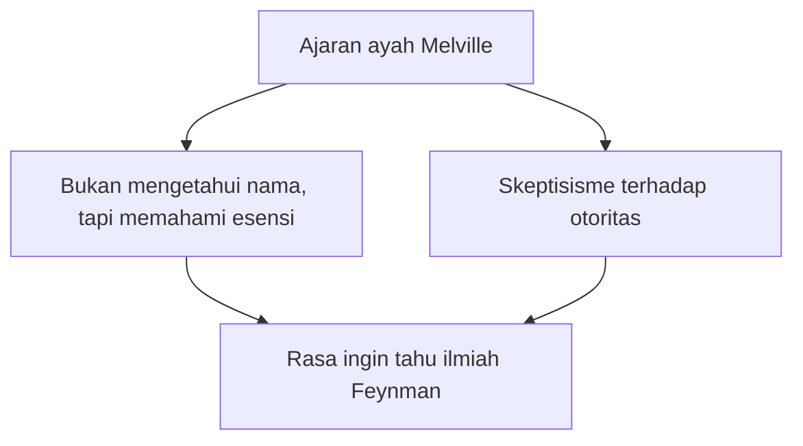
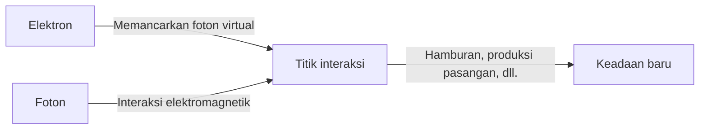

## 1. Pendahuluan: Sang Penipu (Trickster) di Dunia Fisika dan Guru Terbaik

"Ada banyak hal yang tidak saya ketahui. Tapi, memangnya kenapa? Tidak tahu pun sama sekali tidak masalah, bukan?"

Sebagaimana tercermin dari kata-kata tersebut, Richard P. Feynman (Richard Phillips Feynman, 1918 - 1988) bukanlah sekadar fisikawan jenius biasa, melainkan sosok dengan "daya tarik kemanusiaan" yang luar biasa dan merupakan perwujudan dari "rasa ingin tahu yang murni". Ia adalah salah satu fisikawan paling berpengaruh di abad ke-20, dan pada tahun 1965 menerima Hadiah Nobel Fisika atas kontribusinya dalam pengembangan Elektrodinamika Kuantum (QED). Namun, alasan mengapa ia masih sangat dicintai dan dihormati oleh orang-orang di seluruh dunia hingga saat ini, bukan sekadar karena pencapaiannya yang cemerlang.

Ia tenggelam dalam perhitungan fisika di bar striptis pada hari libur, berturut-turut membobol brankas rekan-rekannya di fasilitas rahasia Proyek Manhattan, bermain bongo di band samba di Brasil dengan penuh semangat, dan dalam komisi investigasi kecelakaan pesawat ulang-alik Challenger, ia membungkam petinggi NASA dengan eksperimen sederhana menggunakan air es dan karet O-ring. Baginya, baik menyelidiki kebenaran alam semesta, memecahkan kode huruf Maya, maupun mengamati ekologi semut, semuanya berakar pada hal yang sama, yaitu "kesenangan dalam menemukan sesuatu" (The Pleasure of Finding Things Out).

Dalam artikel ini, kita akan menggali lebih dalam ribuan kata mengenai kehidupan Richard Feynman, revolusi fisika yang ia capai, serta pesan apa yang disampaikan oleh filosofinya bagi masyarakat modern kita.

---

## 2. Masa Kecil hingga Mahasiswa: Hadiah Terbaik dari Sang Ayah

Pada tanggal 11 Mei 1918, Feynman lahir di Far Rockaway, Queens, New York. Pemikiran ilmiah yang mendasarinya, terutama sikap "meragukan otoritas dan berpikir dengan pikiran sendiri", sangat dipengaruhi oleh ayahnya, Melville.

Melville bekerja sebagai pembuat seragam sekolah dan bukan seorang ilmuwan, tetapi ia mengajarkan "cara pandang" ilmiah secara menyeluruh kepada putranya. Salah satu kisah terkenalnya adalah saat mereka mengamati burung. Ayahnya tidak mengajarkan "nama burung", melainkan mengajak Feynman berpikir "mengapa burung tersebut mematuk bulunya dengan paruhnya". Ini adalah filosofi bahwa "mengetahui nama sesuatu sama sekali berbeda dengan memahami sesuatu itu sendiri". Hal ini kelak membentuk landasan sikap akademis Feynman.

Melanjutkan studi di MIT (Massachusetts Institute of Technology), Feynman mulai memecahkan masalah matematika dan fisika dengan pendekatan unik yang tidak terikat oleh batasan yang ada, dan bakatnya pun berkembang pesat. Setelah itu, ia melanjutkan ke sekolah pascasarjana di Universitas Princeton, di mana ia bertemu dengan John Archibald Wheeler dan mulai melangkah ke garis depan mekanika kuantum.

---

## 3. Proyek Manhattan dan Hari-hari di Los Alamos

Seiring dengan meletusnya Perang Dunia II, Feynman muda juga terseret ke dalam pusaran besar sejarah. Ia dipanggil ke Laboratorium Nasional Los Alamos di New Mexico, pusat dari "Proyek Manhattan", sebuah proyek rahasia untuk mengembangkan bom atom.

Saat itu, ia masih berusia awal 20-an dan harus bekerja di bawah fisikawan kelas dunia seperti Robert Oppenheimer dan Hans Bethe. Ia dipercaya sebagai pemimpin departemen perhitungan (pada saat itu belum ada komputer raksasa, melainkan manusia dan kalkulator mekanik yang digunakan), dan ia memberikan kontribusi besar di bidang praktis, seperti membangun sistem pemrosesan paralel yang efisien untuk mesin hitung kartu punch.

Namun, yang membuatnya terkenal adalah sifatnya yang suka menjahili orang. Menyadari bahwa keamanan brankas penyimpanan dokumen di fasilitas yang menangani rahasia tingkat tinggi tersebut sangat ceroboh, Feynman menemukan pola unik, dan secara berturut-turut membuka brankas rekan-rekannya, lalu meninggalkan catatan yang berbunyi, "Dokumen rahasia itu telah saya ambil." Ini bukan sekadar lelucon, melainkan cara "peretasannya" sendiri untuk membuktikan kerentanan sistem.

Selain itu, hari-hari di Los Alamos juga merupakan masa tragedi pribadi baginya. Istri tercintanya, Arline, sedang berjuang melawan TBC, dan ia menghabiskan hari-harinya mengunjunginya di sanatorium. Tepat sebelum bom atom dijatuhkan pada tahun 1945, Arline meninggal dunia. Kejadian ini meninggalkan luka yang dalam di hati Feynman dan berdampak besar pada pandangan hidupnya di kemudian hari.

---

## 4. Revolusi Elektrodinamika Kuantum (QED) dan Diagram Feynman

Setelah perang, setelah melalui Universitas Cornell dan pindah ke Institut Teknologi California (Caltech), Feynman akhirnya menorehkan pencapaian abadi dalam sejarah fisika. Itulah rekonstruksi "Elektrodinamika Kuantum (Quantum Electrodynamics, QED)".

Pada saat itu, ketika mencoba menghitung interaksi antara elektron dan foton, ada masalah fatal di mana jawabannya akan menjadi tak terhingga (kesulitan divergensi). Sin-Itiro Tomonaga dan Julian Schwinger juga menangani masalah ini pada saat yang sama, dan menemukan solusi (teori renormalisasi) dengan pendekatan matematika tingkat tinggi, tetapi metode Feynman sama sekali berbeda.

Ia merancang pendekatan intuitif dengan menjumlahkan "semua kemungkinan jalur" ketika sebuah partikel bergerak melintasi ruang angkasa, yang disebut **"Integral Jalur (Path Integral)"**. Selain itu, ia juga menemukan **"Diagram Feynman"**, yang merepresentasikan persamaan matematika yang rumit tersebut sebagai gambaran visual.

Dengan representasi visual ini, perhitungan mekanika kuantum yang sebelumnya sangat sulit, dapat dilakukan secara intuitif dan mekanis. Diagram Feynman menjadi "bahasa umum" dalam fisika, dan bahkan dikatakan telah mempercepat perkembangan fisika partikel dasar beberapa dekade. Berkat pencapaian ini, ia memenangkan Hadiah Nobel Fisika pada tahun 1965 bersama Sin-Itiro Tomonaga dan Julian Schwinger.

---

## 5. "Anda Pasti Bercanda, Tuan Feynman": Kehidupan Sehari-hari yang Tidak Konvensional dan Petualangan

Hal yang tak terpisahkan saat berbicara tentang Feynman adalah berbagai kisah luar biasanya. Dalam esai otobiografi "Anda Pasti Bercanda, Tuan Feynman", tergambar bagaimana ia menikmati hidup dan memiliki rasa ingin tahu tentang segala hal.

*   **Samba dan Bongo:** Saat tinggal di Brasil, ia terpesona oleh musik samba setempat dan bahkan ikut serta dalam karnaval sebagai pemain bongo bersama band profesional.
*   **Gairah terhadap Seni Lukis:** Dari sebuah diskusi dengan teman seniman, untuk mematahkan prasangka bahwa "ilmuwan tidak bisa memahami keindahan", ia belajar menggambar dengan serius dan bahkan mengadakan pameran tunggal (menggunakan nama samaran "Ofey").
*   **Memecahkan Kode Huruf Maya:** Saat berbulan madu di Meksiko, ia tertarik pada dokumen kuno peradaban Maya, dan meskipun bukan ahli linguistik, ia secara mandiri memecahkan pola perhitungan astronomi di dalamnya.
*   **Perhitungan di Bar Striptis:** Menjadikannya sebagai tempat yang tenang untuk berhitung, ia bahkan rutin mengunjungi bar striptis, sambil mencoret-coret persamaan matematika di atas serbet kertas.

Tindakan-tindakan ini sama sekali bukan "mencari perhatian", melainkan semuanya lahir dari keinginan yang murni untuk "mengetahui bagaimana cara kerjanya". Baginya, fisika, bongo, maupun huruf Maya adalah teka-teki untuk memahami dunia.

---

## 6. Feynman sebagai Pendidik: Kuliah yang Legendaris

Feynman bukan hanya seorang peneliti, tetapi juga memiliki bakat yang luar biasa sebagai seorang pendidik. Ia berprinsip bahwa "jika Anda tidak dapat menjelaskan konsep yang kompleks kepada mahasiswa tahun pertama tanpa menggunakan jargon teknis, berarti Anda belum benar-benar memahaminya".

Pada awal 1960-an, kuliah fisika 2 tahun untuk mahasiswa tingkat sarjana di Caltech direkam (audio dan video), dan kemudian diterbitkan sebagai "Kuliah Fisika Feynman (The Feynman Lectures on Physics)". Buku teks ini telah menjadi alkitab bagi mahasiswa di seluruh dunia yang mempelajari fisika, dan bahkan setelah lebih dari setengah abad berlalu, buku ini masih terus dibaca dan tidak lekang oleh waktu.

Daya tarik kuliahnya terletak pada penyampaiannya yang tidak sekadar menderetkan rumus matematika, melainkan menceritakan betapa dramatis dan indahnya fenomena alam dengan bahasa tubuh dan humor yang melimpah. Ia tidak mengajarkan "jawaban" kepada para mahasiswanya, melainkan "cara bertanya kepada alam".

---

## 7. Kecelakaan Ledakan Pesawat Ulang-alik Challenger dan "Alam Tidak Bisa Ditipu"

Salah satu episode paling terkenal yang menghiasi tahun-tahun terakhir hidup Feynman adalah partisipasinya dalam Komisi Investigasi (Komisi Rogers) kecelakaan pesawat ulang-alik "Challenger" pada tahun 1986.

Meskipun saat itu ia sudah mengidap kanker, ia pada awalnya enggan berpartisipasi, namun akhirnya ia pergi ke Washington untuk mencari kebenaran. Dihadapkan pada budaya birokrasi yang saling menutupi dan sistem manajemen keselamatan NASA yang ceroboh (kurangnya penilaian risiko), ia secara langsung mewawancarai para insinyur di lapangan untuk menggali inti dari masalah tersebut.

Lalu pada saat sidang dengar pendapat yang disiarkan di televisi, Feynman mencelupkan karet O-ring yang digunakan pada sambungan pesawat ulang-alik ke dalam segelas air es yang telah disiapkan, lalu menjepitnya dengan penjepit C-clamp. Ia membuktikan secara brilian dengan cara yang dapat dipahami oleh siapa saja, bahwa dalam suhu mendekati titik beku, karet akan kehilangan elastisitasnya, dan itulah penyebab langsung dari ledakan tersebut.

Kalimat terakhir yang ia tulis sebagai lampiran pribadinya dalam laporan investigasi tersebut, hingga kini masih terus dikenang sebagai peringatan bagi semua orang yang terlibat dalam ilmu pengetahuan dan teknologi.

> "For a successful technology, reality must take precedence over public relations, for nature cannot be fooled."
> (Untuk teknologi yang sukses, realitas harus diutamakan di atas hubungan masyarakat, karena alam tidak dapat ditipu.)

---

## 8. Kesimpulan: Apa yang Feynman Tinggalkan untuk Kita

Pada tanggal 15 Februari 1988, Feynman meninggal dunia pada usia 69 tahun karena kanker perut. Kata-kata terakhir yang ia tinggalkan adalah "Saya tidak ingin mati dua kali. Mati itu sangat membosankan (I'd hate to die twice. It's so boring.)", yang dipenuhi dengan selera humor khas dirinya.

Kehidupan Richard Feynman membuktikan potensi tak terbatas yang dimiliki oleh "rasa ingin tahu intelektual" manusia. Baginya, sains bukanlah sekadar kumpulan rumus matematika yang dingin dan teori-teori otoritatif, melainkan permainan terbaik untuk menikmati misteri besar yang disebut dunia.

Di era modern saat AI berkembang pesat dan jawaban bisa didapat dengan cepat, kita cenderung melupakan pentingnya "berpikir dengan pikiran sendiri" dan "memiliki keraguan yang murni". Namun, "sikap mencintai ketidaktahuan" dan "kemampuan melihat esensi di balik sesuatu" yang diajarkan oleh Feynman, akan selalu menjadi kompas yang sangat penting bagi kita, melampaui berbagai zaman.

Ketika kita menelusuri jejak kehidupannya, kita tidak hanya menyaksikan keindahan sains, tetapi juga melihat sebuah jawaban yang luar biasa terhadap pertanyaan mendasar tentang bagaimana kita sebagai manusia harus menjalani dan menikmati dunia ini.

---

*Melalui artikel ini, kami berharap Anda bisa memiliki sedikit rasa ingin tahu ala Feynman yang selalu bertanya "mengapa?" terhadap fenomena di sekitar Anda.*
