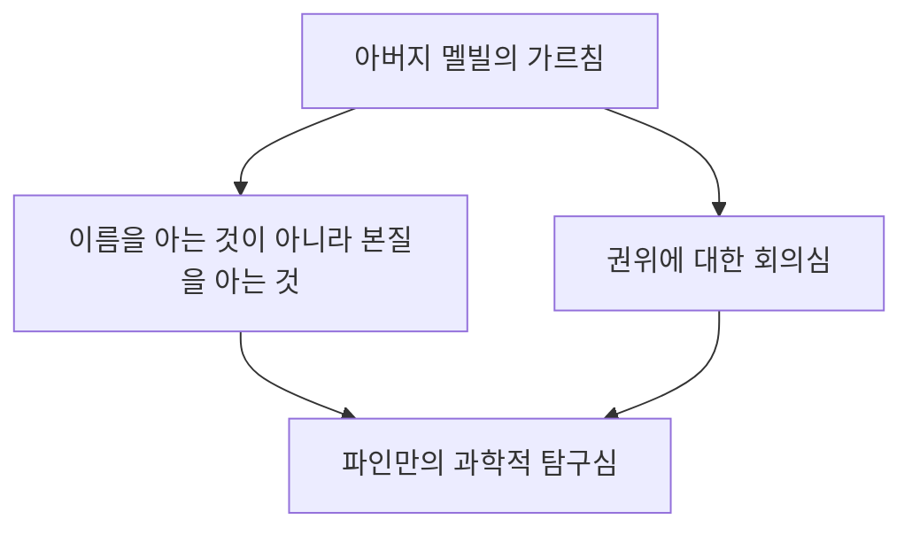
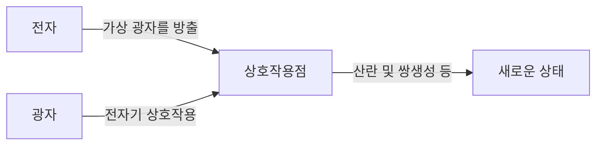

## 1. 서론: 물리학계의 트릭스터이자 최고의 교사

"나는 모르는 것이 많다. 하지만 그게 뭐 어쨌다는 건가? 모르는 채로 있어도 전혀 상관없지 않은가"

이 말로 상징되듯이, 리처드 P. 파인만(Richard Phillips Feynman, 1918 - 1988)은 단순한 천재 물리학자라는 틀에 얽매이지 않는, 압도적인 '인간적 매력'과 '호기심의 덩어리'였습니다. 20세기를 대표하는 물리학자 중 한 명이며, 1965년에는 양자전기역학(QED) 발전에 기여한 공로로 노벨 물리학상을 수상했습니다. 하지만 그가 지금도 전 세계 사람들에게 사랑받고 존경받는 이유는 그 빛나는 업적 때문만이 아닙니다.

휴일에 스트립 바에서 물리 계산에 몰두하고, 맨해튼 프로젝트의 극비 시설에서 동료들의 금고를 차례로 열었으며, 브라질에서 삼바 밴드의 봉고 연주자로 열광하고, 챌린저호 폭발 사고 조사 위원회에서는 얼음물과 고무 O링을 사용한 간단한 실험으로 NASA 수뇌부를 침묵시켰습니다. 그에게 우주의 진리를 탐구하는 것도, 마야 문자를 해독하는 것도, 개미의 생태를 관찰하는 것도 모두 똑같이 '발견의 기쁨(The Pleasure of Finding Things Out)'에 뿌리에 두고 있었습니다.

본 기사에서는 그러한 리처드 파인만의 생애, 그가 이룩한 물리학의 혁명, 그리고 그의 철학이 우리 현대 사회에 어떤 메시지를 던지고 있는지를 수천 자에 걸쳐 철저하게 깊이 파헤칩니다.

---

## 2. 유년기~학창 시절: 아버지가 주신 최고의 선물

1918년 5월 11일, 뉴욕 퀸스 파락어웨이에서 파인만은 태어났습니다. 그의 밑바탕에 있는 과학적 사고, 특히 '권위를 의심하고 스스로 생각한다'는 태도는 아버지 멜빌로부터 강한 영향을 받았습니다.

멜빌은 제복을 만드는 일을 했고 과학자는 아니었지만, 과학적인 '사물을 보는 법'을 아들에게 철저히 가르쳤습니다. 유명한 일화로 새 관찰이 있습니다. 아버지는 '새의 이름'을 가르치는 것이 아니라 '새가 왜 부리로 깃털을 쪼는가'를 생각하게 했습니다. "이름을 아는 것과 그 대상을 아는 것은 전혀 다르다"는 철학입니다. 이것은 훗날 파인만의 학문적 태도의 근간을 형성했습니다.

MIT(매사추세츠 공과대학교)에 진학한 파인만은 기존의 틀에 얽매이지 않는 독자적인 접근법으로 수학이나 물리 문제를 풀기 시작했고, 그 재능을 빠르게 꽃피웁니다. 이후 프린스턴 대학교 대학원에 진학한 그는 그곳에서 존 아치볼드 휠러와 만나 양자역학의 최전선에 발을 들여놓게 됩니다.

---

## 3. 맨해튼 프로젝트와 로스앨러모스에서의 나날들

제2차 세계대전의 발발과 함께 젊은 파인만 역시 역사의 거대한 소용돌이에 휘말립니다. 원자폭탄 개발을 위한 극비 프로젝트 '맨해튼 프로젝트'의 중심지, 뉴멕시코주 로스앨러모스 국립연구소로 소집된 것입니다.

당시 그는 아직 20대 초반이었고, 로버트 오펜하이머나 한스 베테 같은 세계 최고 수준의 물리학자들 밑에서 일하게 되었습니다. 그는 계산 부서(당시에는 아직 거대한 컴퓨터가 없어서 인간이나 기계식 계산기를 사용했다)의 리더를 맡아 천공 카드 계산기의 효율적인 병렬 처리 시스템을 구축하는 등 실무적인 면에서도 지대한 공헌을 했습니다.

하지만 그를 유명하게 만든 것은 장난기 많은 성격이었습니다. 최고 기밀을 다루는 시설이면서도 서류를 보관하는 금고의 보안이 허술하다는 것을 깨달은 파인만은 독자적인 법칙을 찾아내어 동료들의 금고를 차례차례 열고는 "그 기밀 서류는 내가 가져갔다"는 메모를 남겼습니다. 이것은 단순한 장난이 아니라 시스템의 취약성을 입증하는 그 나름의 '해킹'이었다고 할 수 있습니다.

또한 로스앨러모스에서의 나날은 그에게 개인적인 비극의 시기이기도 했습니다. 사랑하는 아내 알린이 결핵으로 투병 중이어서 요양소로 병문안을 가는 날들이 계속되었습니다. 1945년 원자폭탄 투하 직전, 알린은 세상을 떠납니다. 파인만의 마음에 깊은 상처를 남긴 이 사건은 훗날 그의 인생관에도 큰 영향을 미쳤습니다.

---

## 4. 양자전기역학(QED)의 혁명과 파인만 다이어그램

전후 코넬 대학교를 거쳐 캘리포니아 공과대학교(칼텍)로 옮긴 파인만은 마침내 물리학의 역사에 불멸의 금자탑을 세웁니다. 그것이 '양자전기역학(Quantum Electrodynamics, QED)'의 재구축입니다.

당시 전자나 광자의 상호작용을 계산하려고 하면 답이 무한대가 되어버리는 치명적인 문제(발산의 어려움)가 있었습니다. 도모나가 신이치로나 줄리언 슈윙거 등도 같은 시기에 이 문제에 몰두하여 고도의 수학적 접근법으로 해결책(재규격화 이론)을 이끌어냈지만, 파인만의 방법은 전혀 이질적인 것이었습니다.

그는 입자가 공간을 이동할 때의 '생각할 수 있는 모든 경로'를 합산한다는 직관적인 접근, 즉 **'경로 적분(Path Integral)'**을 고안했습니다. 게다가 그 복잡한 수식을 시각적인 도형으로 표현하는 **'파인만 다이어그램'**을 발명했습니다.

이 도식화를 통해 그때까지 극히 난해했던 양자역학의 계산을 직관적이고 기계적으로 할 수 있게 되었습니다. 파인만 다이어그램은 물리학에서 '공통 언어'가 되었고, 입자 물리학의 발전을 수십 년 앞당겼다고까지 평가받습니다. 이 업적으로 그는 1965년에 도모나가 신이치로, 줄리언 슈윙거와 함께 노벨 물리학상을 수상했습니다.

---

## 5. "파인만 씨, 농담도 잘하시네": 파격적인 일상과 모험

파인만을 논할 때 빼놓을 수 없는 것이 그의 파천황적인 에피소드들입니다. 자전적 에세이 『파인만 씨, 농담도 잘하시네!』에는 그가 얼마나 인생을 구가하고 모든 것에 호기심을 가졌는지가 그려져 있습니다.

*   **삼바와 봉고:** 브라질에 머물렀을 때 그는 현지의 삼바 음악에 매료되어 프로 밴드에 섞여 봉고 연주자로 카니발에 참가했습니다.
*   **그림에 대한 열정:** 예술가 친구와의 논쟁에서 '과학자는 아름다움을 이해할 수 없다'는 편견을 뒤집기 위해 본격적으로 데생을 배우고 개인전을 열기까지 했습니다('오페이(Ofey)'라는 가명을 사용했습니다).
*   **마야 문자 해독:** 신혼여행으로 방문한 멕시코에서 마야 문명의 고문서에 흥미를 가져, 언어학 전문가도 아니면서 스스로의 힘으로 천문 계산의 법칙성을 해독했습니다.
*   **스트립 바에서의 계산:** 차분히 계산을 할 수 있는 장소로 무려 스트립 바에 드나들며 종이 냅킨에 수식을 휘갈겨 썼습니다.

이것들은 결코 '기이한 행동'이 아니라 모두 '그것이 어떻게 되어 있는지 알고 싶다'는 순수한 욕구에서 비롯된 것이었습니다. 그에게 물리학도, 봉고도, 마야 문자도 세상을 이해하기 위한 퍼즐이었습니다.

---

## 6. 교육자로서의 파인만: 전설의 강의

파인만은 연구자로서뿐만 아니라 교육자로서도 유례없는 재능을 가지고 있었습니다. "복잡한 개념을 전문 용어를 쓰지 않고 대학교 1학년생도 알 수 있게 설명하지 못한다면, 그것은 진정으로 이해한 것이 아니다"라는 것이 그의 지론이었습니다.

1960년대 초반, 칼텍에서 이루어진 2년간의 학부생 대상 물리학 강의는 녹음 및 녹화되어 훗날 『파인만 물리학(The Feynman Lectures on Physics)』으로 출판되었습니다. 이 교과서는 물리학을 배우는 전 세계 학생들에게 바이블이 되었고, 반세기가 지난 현재까지도 전혀 빛바래지 않고 널리 읽히고 있습니다.

그의 강의의 매력은 단순한 수식의 나열이 아니라, 자연계의 현상이 얼마나 극적이고 아름다운지를 몸짓과 손짓을 섞어가며 유머러스하게 이야기한다는 점에 있었습니다. 그는 학생들에게 '답'을 가르치는 창구가 아니라 '자연에 질문하는 법'을 가르쳤던 것입니다.

---

## 7. 챌린저호 폭발 사고와 "자연은 속일 수 없다"

파인만의 말년을 장식하는 가장 유명한 에피소드 중 하나가 1986년에 발생한 우주왕복선 '챌린저호' 폭발 사고 조사 위원회(로저스 위원회)에 참가한 것입니다.

당시 이미 암에 걸려 있던 그는 처음에는 참가를 꺼렸지만, 진상 규명을 위해 워싱턴으로 향합니다. 관료적인 은폐 체질과 NASA의 허술한 안전 관리 체제(위험 평가의 안일함)에 직면한 그는 직접 현장 기술자들을 만나 이야기를 듣고 문제의 핵심에 다가갔습니다.

그리고 TV로 중계되는 청문회 자리에서, 파인만은 준비된 얼음물 잔에 셔틀의 접합부에 사용되었던 고무 O링을 담그고 바이스로 조여 보였습니다. 영하에 가까운 환경에서는 고무의 탄성이 사라진다는 것, 그것이 폭발의 직접적인 원인임을 누구나 알 수 있는 형태로 선명하게 증명해 보인 것입니다.

그가 조사 보고서의 개인적인 부록으로 적은 마지막 문장은 과학 기술에 종사하는 모든 사람에게 보내는 경종으로서 지금도 전해 내려오고 있습니다.

> "For a successful technology, reality must take precedence over public relations, for nature cannot be fooled."
> (성공적인 기술을 위해서는 홍보보다 현실이 우선되어야 한다. 왜냐하면 자연은 속일 수 없기 때문이다.)

---

## 8. 결론: 파인만이 우리에게 남긴 것

1988년 2월 15일, 파인만은 복부암으로 69세의 나이에 세상을 떠났습니다. 그가 마지막으로 남긴 말은 "두 번 죽고 싶지는 않네. 죽는 건 너무 지루하거든(I'd hate to die twice. It's so boring.)"이라는 그다운 유머로 가득 찬 것이었습니다.

리처드 파인만의 생애는 인간의 '지적 호기심'이 가진 무한한 가능성을 증명합니다. 그에게 과학이란 차가운 수식이나 권위 있는 이론의 모음이 아니라, 세계라는 장대한 미스터리를 즐기기 위한 최고의 놀이였습니다.

AI가 급속도로 진화하여 답을 쉽게 얻을 수 있는 현대에, 우리는 '스스로 생각하는 것'이나 '순수한 의문을 갖는 것'을 잊어버리기 쉽습니다. 하지만 파인만이 가르쳐준 '모르는 것을 사랑하는 태도'나 '사물의 이면에 있는 본질을 꿰뚫어 보는 힘'은 시대를 초월하여 우리에게 꼭 필요한 나침반이 될 것입니다.

그의 삶의 궤적을 따라갈 때, 우리는 과학의 아름다움뿐만 아니라 인간으로서 세상을 어떻게 살고, 어떻게 즐겨야 하는지에 대한 근원적인 질문에 대한 하나의 멋진 해답을 목격하게 됩니다.

---
*이 기사를 통해 여러분이 조금이라도 주변 현상에 대해 "왜 그럴까?"라는 파인만적인 호기심을 가질 수 있었다면 기쁘겠습니다.*
