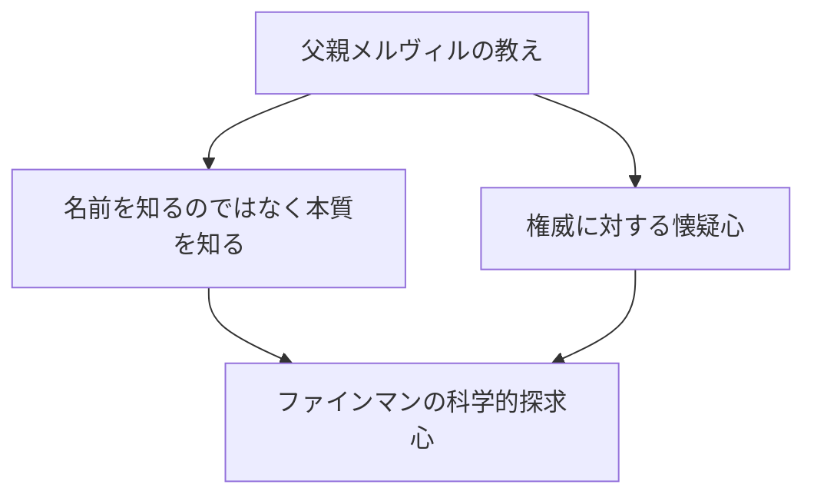
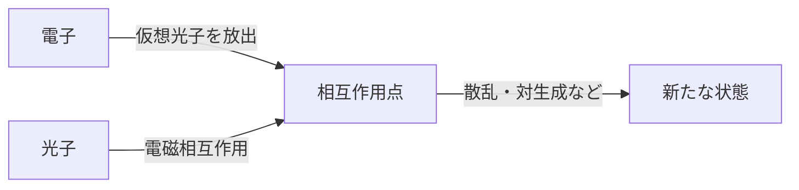

## 1. はじめに：物理学界のトリックスターにして最高の教師

「わたしには、わからないことがたくさんある。でも、それがどうしたというのだろう？ わからないままでも、ちっとも構わないじゃないか」

この言葉に象徴されるように、リチャード・P・ファインマン（Richard Phillips Feynman, 1918 - 1988）は、単なる天才物理学者という枠に収まらない、圧倒的な「人間的魅力」と「好奇心の塊」でした。20世紀を代表する物理学者のひとりであり、1965年には量子電磁力学（QED）の発展への貢献によりノーベル物理学賞を受賞しました。しかし、彼が今なお世界中の人々から愛され、尊敬されている理由は、その輝かしい業績だけではありません。

休日にストリップバーで物理の計算に没頭し、マンハッタン計画の極秘施設で同僚の金庫を次々と破り、ブラジルでサンババンドのボンゴ叩きとして熱狂し、チャレンジャー号爆発事故の調査委員会では氷水とゴムのOリングを使ったシンプルな実験で NASA の首脳陣を沈黙させました。彼にとって、宇宙の真理を探究することも、マヤ文字を解読することも、アリの生態を観察することも、すべては等しく「発見のよろこび（The Pleasure of Finding Things Out）」に根ざしていたのです。

本記事では、そんなリチャード・ファインマンの生涯、彼が成し遂げた物理学の革命、そして彼の哲学が私たちの現代社会にどのようなメッセージを投げかけているのかを、数千文字にわたって徹底的に深掘りします。

---

## 2. 幼少期〜学生時代：父親からの最高の贈り物

1918年5月11日、ニューヨークのクイーンズ区ファー・ロッカウェイで、ファインマンは生まれました。彼の根底にある科学的思考、とりわけ「権威を疑い、自分の頭で考える」という姿勢は、父親のメルヴィルから強い影響を受けています。

メルヴィルは制服を作る仕事をしており、科学者ではありませんでしたが、科学的な「物の見方」を息子に徹底的に教え込みました。有名なエピソードに鳥の観察があります。父親は「鳥の名前」を教えるのではなく、「鳥がなぜくちばしで羽をつつくのか」を考えさせました。「名前を知ることと、そのものを知ることは全く違う」という哲学です。これは後のファインマンの学問的態度の根幹を形成しました。

MIT（マサチューセッツ工科大学）に進学したファインマンは、既存の枠にとらわれない独自のアプローチで数学や物理の問題を解くようになり、その才能を急速に開花させます。その後、プリンストン大学の大学院に進学した彼は、そこでジョン・アーチボルト・ホイーラーと出会い、量子力学の最前線へと足を踏み入れることになります。

---

## 3. マンハッタン計画とロスアラモスでの日々

第二次世界大戦の勃発とともに、若きファインマンもまた歴史の大きな渦に巻き込まれます。原子爆弾開発のための極秘プロジェクト「マンハッタン計画」の中心地、ニューメキシコ州のロスアラモス国立研究所に招集されたのです。

当時、彼はまだ20代前半で、ロバート・オッペンハイマーやハンス・ベーテといった世界トップクラスの物理学者たちの下で働くことになりました。彼は計算部門（当時はまだ巨大なコンピューターがなく、人間や機械式の計算機を使っていた）のリーダーを任され、パンチカード計算機の効率的な並列処理システムを構築するなど、実務面でも多大な貢献を果たしました。

しかし、彼を有名にしたのはそのイタズラ好きの性格でした。最高機密を扱う施設でありながら、書類を保管する金庫のセキュリティが杜撰であることに気づいたファインマンは、独自の法則を見つけ出し、同僚たちの金庫を次々と開けては「あの機密書類は私がいただいた」というメモを残しました。これは単なる悪ふざけではなく、システムの脆弱性を実証するという、彼なりの「ハッキング」であったと言えます。

また、ロスアラモスでの日々は、彼にとって個人的な悲劇の時期でもありました。最愛の妻アーリーンが結核で闘病しており、サナトリウムで見舞う日々が続いていたのです。1945年の原爆投下直前、アーリーンはこの世を去ります。ファインマンの心に深い傷を残したこの出来事は、後の彼の人生観にも大きな影響を与えました。

---

## 4. 量子電磁力学（QED）の革命とファインマン・ダイアグラム

戦後、コーネル大学を経てカリフォルニア工科大学（カルテク）に移ったファインマンは、いよいよ物理学の歴史に不滅の金字塔を打ち立てます。それが「量子電磁力学（Quantum Electrodynamics, QED）」の再構築です。

当時、電子や光子の相互作用を計算しようとすると、答えが無限大になってしまうという致命的な問題（発散の困難）がありました。朝永振一郎やジュリアン・シュウィンガーらも同時期にこの問題に取り組み、高度な数学的アプローチで解決策（くりこみ理論）を導き出しましたが、ファインマンの手法はまったく異質なものでした。

彼は、粒子が空間を移動する際の「考え得るすべての経路」を足し合わせるという直感的なアプローチ、すなわち**「経路積分（Path Integral）」**を考案しました。さらに、その複雑な数式を視覚的な図形として表現する**「ファインマン・ダイアグラム」**を発明しました。

この図式化により、それまで極めて難解だった量子力学の計算が、直感的かつ機械的に行えるようになりました。ファインマン・ダイアグラムは物理学における「共通言語」となり、素粒子物理学の発展を数十年早めたとさえ言われています。この業績により、彼は1965年に朝永振一郎、ジュリアン・シュウィンガーとともにノーベル物理学賞を受賞しました。

---

## 5. 「ご冗談でしょう、ファインマンさん」：型破りな日常と冒険

ファインマンを語る上で欠かせないのが、彼の破天荒なエピソードの数々です。自伝的エッセイ『ご冗談でしょう、ファインマンさん』には、彼がいかに人生を謳歌し、あらゆることに好奇心を持っていたかが描かれています。

*   **サンバとボンゴ：** ブラジルに滞在した際、彼は現地のサンバ音楽に魅了され、プロのバンドに混じってボンゴ奏者としてカーニバルに出場しました。
*   **絵画への情熱：** 芸術家の友人との議論から、「科学者は美を理解できない」という偏見を覆すべく、本格的にデッサンを学び、個展を開くまでになりました（「オフェイ（Ofey）」という偽名を使っていました）。
*   **マヤ文字の解読：** ハネムーンで訪れたメキシコでマヤ文明の古文書に興味を持ち、言語学の専門家でもないのに自力で天文計算の法則性を解読しました。
*   **ストリップバーでの計算：** 落ち着いて計算ができる場所として、なんとストリップバーに通い詰め、紙ナプキンに数式を書きなぐっていました。

これらは決して「奇をてらった」行動ではなく、すべてが「それがどうなっているのか知りたい」という純粋な欲求から生じたものでした。彼にとって、物理学もボンゴもマヤ文字も、世界を理解するためのパズルだったのです。

---

## 6. 教育者としてのファインマン：伝説の講義

ファインマンは研究者としてだけでなく、教育者としても類稀なる才能を持っていました。「複雑な概念を、専門用語を使わずに大学一回生にもわかるように説明できなければ、それは本当に理解しているとは言えない」というのが彼の持論でした。

1960年代初頭、カルテクで行われた2年間の学部生向け物理学講義は録音・録画され、後に『ファインマン物理学（The Feynman Lectures on Physics）』として出版されました。この教科書は、物理学を学ぶ世界中の学生にとってのバイブルとなり、半世紀以上が経過した現在でも、全く色褪せることなく読み継がれています。

彼の講義の魅力は、単なる数式の羅列ではなく、自然界の現象がいかに劇的で美しいかを、身振り手振りを交え、ユーモアたっぷりに語りかける点にありました。彼は学生たちに「答え」を教えるのではなく、「自然への問いかけ方」を教えていたのです。

---

## 7. チャレンジャー号爆発事故と「自然は騙せない」

ファインマンの晩年を飾る最も有名なエピソードの一つが、1986年に発生したスペースシャトル「チャレンジャー号」爆発事故の調査委員会（ロジャース委員会）への参加です。

当時すでにガンに冒されていた彼は、当初は参加を渋っていましたが、真相究明のためにワシントンへ赴きます。官僚的な隠蔽体質や NASA のずさんな安全管理体制（リスク評価の甘さ）に直面した彼は、自ら現場の技術者たちに直接ヒアリングを行い、問題の核心に迫りました。

そしてテレビ中継されている公聴会の席上、ファインマンは用意されたグラスの氷水に、シャトルの接合部に使われていたゴム製のOリングを浸し、万力で挟んでみせました。氷点下に近い環境ではゴムの弾性が失われること――それが爆発の直接的な原因であることを、誰もがわかる形で鮮やかに証明してみせたのです。

彼が調査報告書の個人的な付録として記した最後の一文は、科学技術に携わるすべての人間への警鐘として今も語り継がれています。

> "For a successful technology, reality must take precedence over public relations, for nature cannot be fooled."
> （成功する技術のためには、広報よりも現実が優先されなければならない。なぜなら、自然を騙すことはできないからだ。）

---

## 8. 結論：ファインマンが私たちに残したもの

1988年2月15日、ファインマンは腹部のガンのため69歳でこの世を去りました。彼が最後に残した言葉は「もう二度と死にたくないね。死ぬのはひどく退屈だ（I'd hate to die twice. It's so boring.）」という、彼らしいユーモアに満ちたものでした。

リチャード・ファインマンの生涯は、人間の「知的好奇心」が持つ無限の可能性を証明しています。彼にとって科学とは、冷たい数式や権威ある理論の寄せ集めではなく、世界という壮大なミステリーを楽しむための最高の遊びでした。

AIが急速に進化し、答えがすぐに手に入る現代において、私たちは「自分の頭で考えること」や「純粋な疑問を持つこと」を忘れがちです。しかし、ファインマンが教えてくれた「わからないことを愛する姿勢」や「物事の裏側にある本質を見極める力」は、時代を超えて私たちに不可欠な羅針盤となるはずです。

彼の人生の軌跡を辿るとき、私たちは科学の美しさだけでなく、人間として世界をどう生き、どう楽しむべきかという根源的な問いに対するひとつの見事な解答を目の当たりにするのです。

---
*本記事を通じて、あなたが少しでも身の回りの現象に対して「なぜだろう？」というファインマン的な好奇心を抱いていただけたなら幸いです。*
