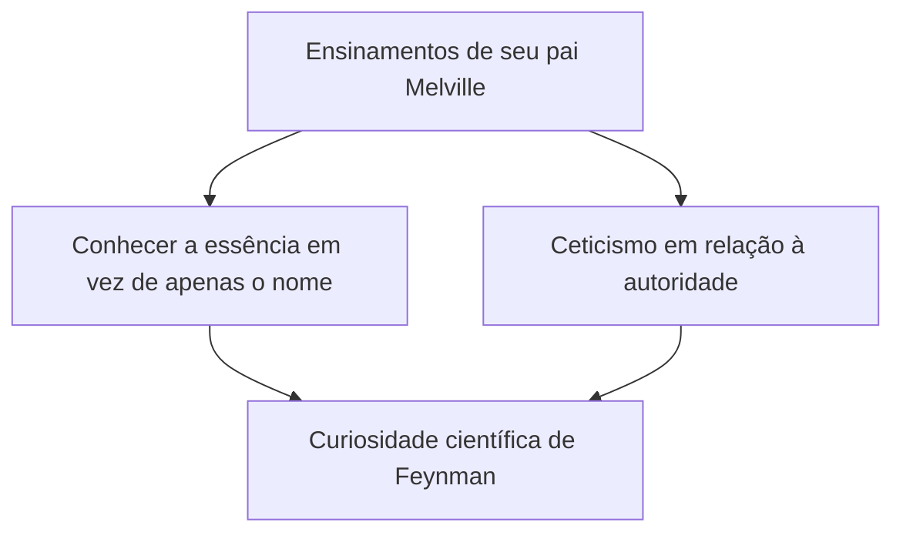
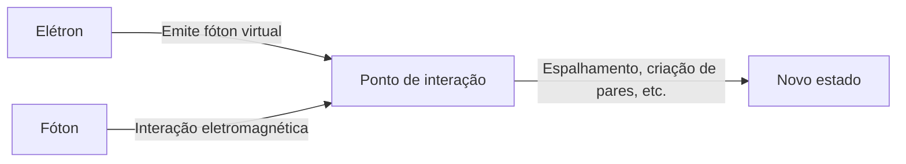

## 1. Introdução: O trapaceiro e o melhor professor do mundo da física

"Tenho muitas coisas que não entendo. Mas e daí? Não há problema nenhum em continuar sem entender."

Simbolizado por estas palavras, Richard P. Feynman (1918 - 1988) foi mais do que apenas um gênio da física; ele tinha um "charme humano" esmagador e era uma "bola de curiosidade". Um dos principais físicos do século 20, ele ganhou o Prêmio Nobel de Física em 1965 por suas contribuições ao desenvolvimento da Eletrodinâmica Quântica (QED). No entanto, a razão pela qual ele ainda é amado e respeitado por pessoas em todo o mundo não é apenas por suas brilhantes realizações.

Ele mergulhou em cálculos de física em um clube de striptease em seus dias de folga, arrombou os cofres de seus colegas em uma instalação ultrassecreta do Projeto Manhattan, ficou entusiasmado como tocador de bongô de uma banda de samba no Brasil, e silenciou os chefões da NASA na comissão de investigação da explosão do Challenger com um experimento simples usando água gelada e um anel de vedação de borracha (O-ring). Para ele, explorar a verdade do universo, decifrar os hieróglifos maias e observar a ecologia das formigas estavam todos igualmente enraizados no "O Prazer de Descobrir as Coisas (The Pleasure of Finding Things Out)".

Neste artigo, aprofundaremos em milhares de palavras a vida de Richard Feynman, a revolução que ele alcançou na física e a mensagem que sua filosofia lança para a nossa sociedade moderna.

---

## 2. Infância aos dias de estudante: O melhor presente de seu pai

Em 11 de maio de 1918, Feynman nasceu em Far Rockaway, Queens, Nova York. Seu pensamento científico subjacente, especialmente sua atitude de "duvidar da autoridade e pensar por si mesmo", foi fortemente influenciado por seu pai, Melville.

Melville trabalhava fazendo uniformes e não era um cientista, mas ensinou incansavelmente ao filho uma "maneira científica de ver as coisas". Há um episódio famoso sobre a observação de pássaros. O pai não ensinou "os nomes dos pássaros", mas o fez pensar sobre "por que os pássaros bicam suas penas com seus bicos". É a filosofia de que "saber o nome e saber a coisa são completamente diferentes". Isso formou a base da atitude acadêmica de Feynman mais tarde.

Ao ingressar no MIT (Instituto de Tecnologia de Massachusetts), Feynman começou a resolver problemas de matemática e física com uma abordagem única que não estava presa a estruturas existentes, fazendo seu talento florescer rapidamente. Mais tarde, ele foi para a escola de pós-graduação da Universidade de Princeton, onde conheceu John Archibald Wheeler e entrou na vanguarda da mecânica quântica.

---

## 3. O Projeto Manhattan e os dias em Los Alamos

Com a eclosão da Segunda Guerra Mundial, o jovem Feynman também foi apanhado no grande turbilhão da história. Ele foi convocado para o Laboratório Nacional de Los Alamos no Novo México, o centro do "Projeto Manhattan", um projeto ultrassecreto para o desenvolvimento da bomba atômica.

Naquela época, ele ainda estava na casa dos 20 anos e passou a trabalhar sob o comando dos principais físicos do mundo, como Robert Oppenheimer e Hans Bethe. Ele foi nomeado líder do departamento de computação (na época ainda não havia computadores gigantes, então eram usados humanos ou calculadoras mecânicas) e fez grandes contribuições na prática, como a construção de um eficiente sistema de processamento paralelo usando calculadoras de cartões perfurados.

No entanto, o que o tornou famoso foi sua natureza brincalhona. Ao perceber que a segurança dos cofres onde os documentos eram armazenados era negligente, apesar de ser uma instalação que lidava com segredos de alto nível, Feynman descobriu suas próprias regras e abriu os cofres de seus colegas, um após o outro, deixando notas dizendo "Peguei aqueles documentos confidenciais". Isso não era apenas uma brincadeira, mas sim o seu próprio "hacking" para demonstrar a vulnerabilidade do sistema.

Os dias em Los Alamos também foram um momento de tragédia pessoal para ele. Sua amada esposa, Arline, estava lutando contra a tuberculose, e ele a visitava no sanatório todos os dias. Pouco antes do lançamento da bomba atômica em 1945, Arline faleceu. Este evento, que deixou uma cicatriz profunda no coração de Feynman, também teve um grande impacto em sua visão de vida mais tarde.

---

## 4. A Revolução da Eletrodinâmica Quântica (QED) e os Diagramas de Feynman

Após a guerra, Feynman mudou-se para o Instituto de Tecnologia da Califórnia (Caltech), depois de passar pela Universidade Cornell, e finalmente estabeleceu um marco imortal na história da física. Foi a reconstrução da "Eletrodinâmica Quântica (QED)".

Na época, havia um problema fatal de que tentar calcular a interação entre elétrons e fótons resultaria em uma resposta infinita (a dificuldade da divergência). Sin-Itiro Tomonaga e Julian Schwinger também trabalharam nesse problema ao mesmo tempo, e encontraram uma solução (teoria da renormalização) usando uma abordagem matemática avançada, mas o método de Feynman era completamente diferente.

Ele desenvolveu uma abordagem intuitiva, chamada **"Integral de Trajetória (Path Integral)"**, de somar "todos os caminhos possíveis" que uma partícula toma quando se move pelo espaço. Além disso, ele inventou os **"Diagramas de Feynman"**, que expressam as complexas fórmulas matemáticas como figuras visuais.

Com essa esquematização, os cálculos da mecânica quântica, que até então eram extremamente difíceis, puderam ser realizados de forma intuitiva e mecânica. Os diagramas de Feynman tornaram-se a "linguagem comum" na física, e diz-se até que aceleraram o desenvolvimento da física de partículas elementares em várias décadas. Por essa conquista, ele recebeu o Prêmio Nobel de Física em 1965, junto com Sin-Itiro Tomonaga e Julian Schwinger.

---

## 5. "Certamente você está brincando, Sr. Feynman!": Vida cotidiana não convencional e aventuras

Ao falar sobre Feynman, é impossível não mencionar seus muitos episódios inusitados. Seu ensaio autobiográfico "Certamente você está brincando, Sr. Feynman!" descreve como ele desfrutou da vida e tinha curiosidade por tudo.

*   **Samba e Bongô:** Durante sua estadia no Brasil, ele ficou fascinado pela música de samba local e participou do carnaval como tocador de bongô junto com uma banda profissional.
*   **Paixão pela Pintura:** A partir de uma discussão com um amigo artista, ele começou a estudar desenho a sério e até realizou exposições individuais para derrubar o preconceito de que "cientistas não conseguem entender a beleza" (ele usava o pseudônimo "Ofey").
*   **Decifração dos hieróglifos Maias:** No México, que visitou em sua lua de mel, interessou-se pelos antigos documentos da civilização maia e, sem ser especialista em linguística, decifrou por conta própria as regras dos cálculos astronômicos.
*   **Cálculos em um clube de striptease:** Procurando um lugar onde pudesse se sentar e fazer cálculos, ele frequentou um clube de striptease e rabiscou fórmulas matemáticas em guardanapos de papel.

Essas não eram ações "excêntricas", mas surgiram de um desejo genuíno de "querer saber como isso funciona". Para ele, a física, os bongôs e os hieróglifos maias eram todos quebra-cabeças para entender o mundo.

---

## 6. Feynman como educador: Palestras lendárias

Feynman possuía um talento extraordinário não apenas como pesquisador, mas também como educador. Sua teoria era de que "se você não consegue explicar um conceito complexo para um calouro de faculdade sem usar jargões, então você não o compreendeu de verdade".

No início da década de 1960, um curso de física para estudantes de graduação que durou dois anos, realizado na Caltech, foi gravado em áudio e vídeo e posteriormente publicado como as "Lições de Física de Feynman (The Feynman Lectures on Physics)". Este livro didático tornou-se uma bíblia para estudantes de todo o mundo que estudam física, e ainda hoje é lido sem perder seu brilho, mais de meio século depois.

O charme de suas palestras não era apenas listar fórmulas, mas falar sobre o quão dramáticos e belos são os fenômenos do mundo natural, usando gestos e muito humor. Ele não ensinava aos alunos as "respostas", mas lhes ensinava "como questionar a natureza".

---

## 7. A explosão da Challenger e "A natureza não pode ser enganada"

Um dos episódios mais famosos dos últimos anos de Feynman foi sua participação na comissão de investigação (Comissão Rogers) da explosão do ônibus espacial "Challenger", ocorrida em 1986.

Embora ele já estivesse sofrendo de câncer na época, inicialmente ele estava relutante em participar, mas foi a Washington para descobrir a verdade. Diante da burocracia focada em encobrir e do sistema frouxo de gerenciamento de segurança da NASA (avaliação de risco inadequada), ele próprio entrevistou diretamente os engenheiros de campo e chegou ao cerne do problema.

Então, durante uma audiência pública transmitida pela televisão, Feynman mergulhou um anel de vedação de borracha (O-ring) usado nas juntas do ônibus espacial no copo de água com gelo que havia sido preparado e apertou-o com um alicate de pressão (clamp). Ele demonstrou brilhantemente de uma forma que qualquer um pudesse entender que a borracha perde sua elasticidade em ambientes quase congelantes - e essa foi a causa direta da explosão.

A última frase que ele escreveu como apêndice pessoal do relatório de investigação ainda é transmitida como um alerta a todos os envolvidos em ciência e tecnologia.

> "Para uma tecnologia de sucesso, a realidade deve ter precedência sobre as relações públicas, pois a natureza não pode ser enganada."
> ("For a successful technology, reality must take precedence over public relations, for nature cannot be fooled.")

---

## 8. Conclusão: O que Feynman deixou para nós

Em 15 de fevereiro de 1988, Feynman faleceu de câncer abdominal aos 69 anos. Suas últimas palavras foram cheias de seu típico humor: "Eu odiaria morrer duas vezes. É tão chato." ("I'd hate to die twice. It's so boring.")

A vida de Richard Feynman prova as infinitas possibilidades da "curiosidade intelectual" humana. Para ele, a ciência não era um amontoado de fórmulas frias ou teorias autoritárias, mas o melhor jogo para desfrutar do grande mistério do mundo.

Na era moderna, onde a IA está evoluindo rapidamente e as respostas estão prontamente disponíveis, tendemos a esquecer "pensar por nós mesmos" e "ter dúvidas puras". No entanto, a "atitude de amar o desconhecido" e a "capacidade de enxergar a essência por trás das coisas", que Feynman nos ensinou, devem servir como uma bússola essencial para nós através dos tempos.

Ao traçar a trajetória de sua vida, testemunhamos não apenas a beleza da ciência, mas também uma resposta esplêndida à questão fundamental de como devemos viver e desfrutar do mundo como seres humanos.

---
*Através deste artigo, ficaria feliz se você, mesmo que um pouco, sentisse uma curiosidade no estilo Feynman de se perguntar "por quê?" sobre os fenômenos ao seu redor.*
