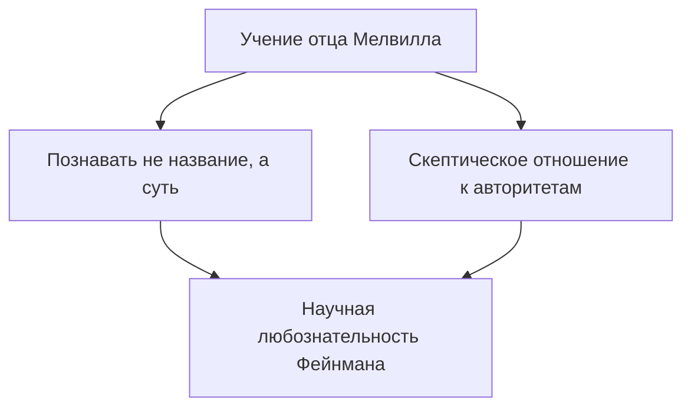
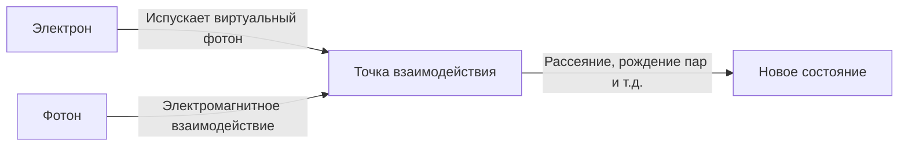

## 1. Введение: Трикстер в мире физики и величайший учитель

«Я многого не знаю. Но ну и что? Разве это имеет какое-то значение, даже если я этого не знаю?»

Как символизируют эти слова, Ричард Ф. Фейнман (Richard Phillips Feynman, 1918 - 1988) был не просто гениальным физиком, но человеком непреодолимого «человеческого обаяния» и настоящим «сгустком любопытства». Он является одним из величайших физиков 20-го века, а в 1965 году получил Нобелевскую премию по физике за свой вклад в развитие квантовой электродинамики (КЭД). Однако причина, по которой его до сих пор любят и уважают во всем мире, кроется не только в его блестящих достижениях.

В свой выходной он мог с головой погрузиться в физические расчеты в стрип-клубе, один за другим взламывать сейфы своих коллег в сверхсекретном центре Манхэттенского проекта, с энтузиазмом играть на бонго в самба-оркестре в Бразилии и заставить замолчать руководство NASA на комиссии по расследованию причин катастрофы космического корабля «Челленджер» с помощью простого эксперимента с ледяной водой и резиновым уплотнительным кольцом. Для него постижение тайн вселенной, расшифровка письменности майя или наблюдение за экологией муравьев — все это в равной степени проистекало из «Удовольствия от познания» (The Pleasure of Finding Things Out).

В этой статье мы подробно, на нескольких тысячах слов, рассмотрим жизнь Ричарда Фейнмана, совершенную им революцию в физике, а также то, какое послание несет его философия нашему современному обществу.

---

## 2. Детство и студенческие годы: Лучший подарок от отца

11 мая 1918 года Фейнман родился в Фар-Рокуэй, районе Куинс в Нью-Йорке. Его научное мышление, в частности, позиция «подвергать сомнению авторитеты и думать своей головой», сформировалось под сильным влиянием его отца, Мелвилла.

Мелвилл зарабатывал на жизнь пошивом униформы и не был ученым, но он тщательно привил своему сыну научный «взгляд на вещи». Известен эпизод с наблюдением за птицами. Отец не стал учить его «названию птицы», а заставил задуматься о том, «почему птица чистит перья клювом». Философия заключалась в том, что «знать название чего-либо и знать саму суть — это совершенно разные вещи». Это стало основой академического подхода Фейнмана в будущем.

Поступив в Массачусетский технологический институт (MIT), Фейнман начал решать математические и физические задачи, используя свои собственные нестандартные методы, не ограниченные существующими рамками, и его талант быстро расцвел. Позже, поступив в аспирантуру Принстонского университета, он познакомился с Джоном Арчибальдом Уилером и шагнул на передний край квантовой механики.

---

## 3. Манхэттенский проект и дни в Лос-Аламосе

С началом Второй мировой войны молодой Фейнман оказался втянут в великий водоворот истории. Его призвали в Лос-Аламосскую национальную лабораторию в Нью-Мексико, которая была центром сверхсекретного Манхэттенского проекта по созданию атомной бомбы.

В то время, когда ему было чуть больше двадцати лет, он работал под руководством таких физиков мирового уровня, как Роберт Оппенгеймер и Ханс Бете. Он был назначен руководителем вычислительного отдела (в то время еще не было гигантских компьютеров, использовались люди и механические калькуляторы), и внес значительный практический вклад, например, создав эффективную систему параллельной обработки данных для калькуляторов на перфокартах.

Однако знаменитым его сделала склонность к розыгрышам. Заметив, что безопасность сейфов, в которых хранились документы в этом сверхсекретном учреждении, была небрежной, Фейнман вывел свои собственные закономерности и начал один за другим открывать сейфы своих коллег, оставляя записки со словами: «Этот секретный документ забрал я». Можно сказать, что это был не просто розыгрыш, а его собственный способ «хакерства», демонстрирующий уязвимость системы.

Кроме того, дни в Лос-Аламосе стали периодом личной трагедии для Фейнмана. Его любимая жена Арлин боролась с туберкулезом, и он продолжал навещать ее в санатории. Незадолго до атомной бомбардировки в 1945 году Арлин скончалась. Это событие, оставившее глубокий шрам в сердце Фейнмана, оказало огромное влияние на его взгляды на жизнь в будущем.

---

## 4. Революция квантовой электродинамики (КЭД) и диаграммы Фейнмана

После войны Фейнман перешел в Корнеллский университет, а затем в Калифорнийский технологический институт (Калтех), где он, наконец, воздвиг бессмертный памятник в истории физики. Этим стала реконструкция «квантовой электродинамики» (КЭД).

В то время существовала фатальная проблема (проблема расходимостей), когда при попытке вычислить взаимодействие между электроном и фотоном ответ становился бесконечным. Синъитиро Томонага и Джулиан Швингер также занимались этой проблемой примерно в то же время и вывели решение (теория перенормировок) с помощью сложного математического подхода, но метод Фейнмана был совершенно иным.

Он разработал интуитивно понятный подход, заключающийся в суммировании «всех возможных путей», по которым частица может перемещаться в пространстве, то есть **«интеграл по траекториям» (Path Integral)**. Кроме того, он изобрел **«диаграммы Фейнмана»**, которые выражали сложные математические формулы в виде наглядных геометрических фигур.

Благодаря такой схематизации вычисления в квантовой механике, которые до этого были чрезвычайно сложными, стало возможным выполнять интуитивно и механически. Диаграммы Фейнмана стали «общим языком» в физике, и даже говорят, что они ускорили развитие физики элементарных частиц на несколько десятилетий. За это достижение он был удостоен Нобелевской премии по физике в 1965 году вместе с Синъитиро Томонагой и Джулианом Швингером.

---

## 5. «Вы, конечно, шутите, мистер Фейнман!»: Нестандартная повседневная жизнь и приключения

Говоря о Фейнмане, нельзя не упомянуть о его многочисленных неординарных историях. В автобиографических эссе «Вы, конечно, шутите, мистер Фейнман!» описывается, как он наслаждался жизнью и ко всему относился с любопытством.

*   **Самба и бонго:** Во время пребывания в Бразилии он был очарован местной музыкой самба и даже принял участие в карнавале в качестве исполнителя на бонго в составе профессиональной группы.
*   **Страсть к живописи:** В результате спора с другом-художником, желая опровергнуть предубеждение о том, что «ученые не способны понимать красоту», он всерьез начал изучать рисунок и даже провел персональную выставку (под псевдонимом "Ofey").
*   **Расшифровка письменности майя:** Во время медового месяца в Мексике он заинтересовался древними манускриптами цивилизации майя и, не будучи специалистом по лингвистике, самостоятельно расшифровал закономерности астрономических вычислений.
*   **Вычисления в стрип-клубе:** В качестве места, где он мог бы спокойно проводить вычисления, он, как ни удивительно, часто посещал стрип-клуб, где записывал формулы на бумажных салфетках.

Эти действия отнюдь не были «эпатажными», все они проистекали из чистого желания узнать, «как это устроено». Для него и физика, и игра на бонго, и письмена майя были головоломками для понимания мира.

---

## 6. Фейнман как педагог: Легендарные лекции

Фейнман обладал редким талантом не только как исследователь, но и как педагог. Его теория заключалась в следующем: «Если вы не можете объяснить сложную концепцию студенту-первокурснику без использования профессиональных терминов, значит, вы сами не до конца ее понимаете».

Его двухгодичные лекции по физике для студентов бакалавриата, прочитанные в Калтехе в начале 1960-х годов, были записаны на аудио и видео, а позже опубликованы в виде «Фейнмановских лекций по физике» (The Feynman Lectures on Physics). Этот учебник стал библией для студентов-физиков во всем мире и продолжает издаваться даже спустя более полувека, нисколько не утратив своей актуальности.

Очарование его лекций заключалось не в простом перечислении формул, а в том, как он с изрядной долей юмора, сопровождая все жестами, рассказывал о том, насколько драматичны и прекрасны явления природы. Он учил студентов не «ответам», а тому, «как задавать вопросы природе».

---

## 7. Катастрофа «Челленджера» и «Природу не обманешь»

Одним из самых известных эпизодов позднего периода жизни Фейнмана является его участие в комиссии по расследованию (Комиссия Роджерса) причин взрыва космического шаттла «Челленджер» в 1986 году.

В то время он уже страдал от рака и поначалу неохотно согласился на участие, но все же отправился в Вашингтон, чтобы докопаться до истины. Столкнувшись с бюрократической культурой сокрытия фактов и небрежным отношением NASA к безопасности (слабой оценкой рисков), он лично проводил беседы с инженерами на местах и добирался до сути проблемы.

И во время телевизионных слушаний Фейнман погрузил резиновое уплотнительное кольцо, используемое в соединениях шаттла, в стакан с ледяной водой и сжал его струбциной. Он наглядно доказал, так, чтобы было понятно каждому, что при температуре, близкой к нулю, резина теряет свою эластичность — и что именно это стало непосредственной причиной взрыва.

Последнее предложение, которое он написал в качестве личного приложения к отчету о расследовании, до сих пор звучит как предупреждение для всех, кто связан с наукой и технологиями.

> "For a successful technology, reality must take precedence over public relations, for nature cannot be fooled."
> (Для успешного технологий реальность должна ставиться выше пиара, ибо природу не обманешь.)

---

## 8. Заключение: Что Фейнман оставил нам

15 февраля 1988 года Фейнман скончался от рака брюшной полости в возрасте 69 лет. Его последние слова были: «Я бы не хотел умереть дважды. Это так скучно» (I'd hate to die twice. It's so boring.) — фраза, полная его фирменного юмора.

Жизнь Ричарда Фейнмана доказывает бесконечный потенциал человеческого «интеллектуального любопытства». Для него наука была не набором холодных формул или авторитетных теорий, а величайшей игрой, позволяющей наслаждаться грандиозной тайной под названием «мир».

В современном мире, где ИИ стремительно развивается и ответы можно получить мгновенно, мы часто забываем о необходимости «думать своей головой» и «задаваться чистосердечными вопросами». Однако «умение любить то, чего не знаешь» и «способность видеть суть, скрытую за вещами», которым научил нас Фейнман, должны стать для нас незаменимым компасом, неподвластным времени.

Прослеживая путь его жизни, мы становимся свидетелями не только красоты науки, но и одного из блестящих ответов на фундаментальный вопрос о том, как человеку следует жить в этом мире и как им наслаждаться.

---
*Я надеюсь, что благодаря этой статье вы проникнитесь хотя бы толикой фейнмановского любопытства к окружающим вас явлениям, задаваясь вопросом: «А почему это так?».*
