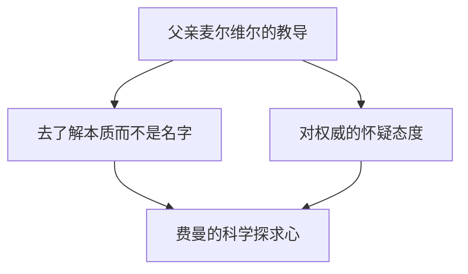
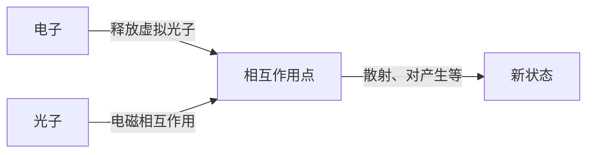

## 1. 引言：物理学界的捣蛋鬼与最伟大的教师

“我有很多不知道的事情。但是，那又怎样呢？就算一直不知道，也没什么大不了的吧。”

正如这句话所象征的，理查德·P·费曼（Richard Phillips Feynman, 1918 - 1988）并不局限于一个单纯的“天才物理学家”的框架，而是拥有压倒性“人格魅力”的“好奇心化身”。他是20世纪代表性的物理学家之一，并于1965年因对量子电动力学（QED）发展的贡献而获得诺贝尔物理学奖。然而，他至今仍被全世界人们所热爱和尊敬的原因，绝不仅仅是因为他辉煌的成就。

他会在休息日躲进脱衣舞俱乐部全神贯注地进行物理计算；在曼哈顿计划的绝密设施里接连破解同事的保险箱；在巴西作为桑巴乐队的邦戈鼓手狂热演奏；在挑战者号爆炸事故调查委员会上，用一杯冰水和橡胶O型环进行了一个简单的实验，就让NASA的高层哑口无言。对他来说，无论是探索宇宙真理、破译玛雅文字，还是观察蚂蚁的生态，所有这一切都同等地根植于“发现的乐趣（The Pleasure of Finding Things Out）”。

本文将通过数千字的篇幅，深入探讨理查德·费曼的生平、他所成就的物理学革命，以及他的哲学为我们现代社会传达了怎样的信息。

---

## 2. 童年至学生时代：来自父亲的最好礼物

1918年5月11日，费曼出生在纽约皇后区的法洛克韦（Far Rockaway）。他根深蒂固的科学思维，特别是“质疑权威、用自己的头脑思考”的态度，深受父亲麦尔维尔（Melville）的影响。

麦尔维尔从事制作制服的工作，虽然不是科学家，但他彻底地教导儿子如何以科学的“视角”看待事物。一个著名的轶事是观察鸟类。父亲不是教他“鸟的名字”，而是让他思考“为什么鸟会用喙啄羽毛”。他的哲学是“知道一个事物的名字，和真正了解这个事物完全是两码事”。这构成了费曼后来学术态度的基础。

升入麻省理工学院（MIT）后，费曼开始用不拘泥于现有框架的独特方法解决数学和物理问题，他的才华迅速绽放。随后，他进入普林斯顿大学研究生院，在那里遇到了约翰·阿奇博尔德·惠勒（John Archibald Wheeler），从而踏入了量子力学的最前沿。

---

## 3. 曼哈顿计划与洛斯阿拉莫斯的岁月

随着第二次世界大战的爆发，年轻的费曼也被卷入了历史的巨大漩涡。他被征召到开发原子弹的绝密项目“曼哈顿计划”的中心——新墨西哥州的洛斯阿拉莫斯国家实验室。

当时，他刚满20岁出头，却要在罗伯特·奥本海默和汉斯·贝特等世界顶尖物理学家的手下工作。他被任命为计算部门的负责人（当时还没有巨型计算机，使用的是人工和机械式计算器），并构建了打孔卡计算机的高效并行处理系统，在实际工作中做出了巨大贡献。

但是，让他出名的是他喜欢恶作剧的性格。尽管是在处理最高机密的设施中，费曼却发现保管文件的保险箱安全性非常马虎。他找出了自己的规律，接连打开了同事们的保险箱，并留下了“那份机密文件我拿走了”的纸条。这不仅仅是恶作剧，可以说这也是他以自己的方式进行的“黑客攻击”，以证明系统的脆弱性。

此外，在洛斯阿拉莫斯的日子，对他个人来说也是一段悲剧时期。他最爱的妻子阿琳（Arline）因结核病卧病在床，他不得不每天去疗养院探望。1945年原子弹投下前夕，阿琳离开了人世。这件事在费曼心中留下了深深的伤痕，也对他后来的人生观产生了巨大影响。

---

## 4. 量子电动力学（QED）的革命与费曼图

战后，费曼经过康奈尔大学，最终转入加州理工学院（Caltech），终于在物理学史上树立了不朽的丰碑。那就是重构“量子电动力学（Quantum Electrodynamics, QED）”。

当时，如果要计算电子和光子的相互作用，答案就会变成无穷大，这是一个致命的问题（发散困难）。朝永振一郎和朱利安·施温格等人在同一时期也致力于解决这个问题，并用高深的数学方法得出了解决方案（重整化理论），但费曼的方法却截然不同。

他构想出了一种直观的方法，即将粒子在空间中移动时“所有可能经过的路径”全部加起来，即**“路径积分（Path Integral）”**。此外，他还发明了将那些复杂的数学公式表示为直观图形的**“费曼图（Feynman Diagram）”**。

通过这种图解化，以前极其晦涩难懂的量子力学计算，变得能够直观且机械地进行。费曼图成为了物理学中的“通用语言”，甚至被认为将粒子物理学的发展向前推进了数十年。由于这项成就，他在1965年与朝永振一郎、朱利安·施温格共同获得了诺贝尔物理学奖。

---

## 5. 《别闹了，费曼先生》：不拘一格的日常与冒险

谈到费曼，绝对离不开他那数不胜数的打破常规的轶事。在他的自传体散文集《别闹了，费曼先生》中，描绘了他如何讴歌人生，并对所有事物都充满好奇心。

*   **桑巴与邦戈鼓：** 在巴西逗留期间，他被当地的桑巴音乐深深吸引，甚至混入专业乐队中，作为邦戈鼓手参加了狂欢节。
*   **对绘画的热情：** 起因于与艺术家朋友的争论，为了推翻“科学家不懂美”的偏见，他开始认真学习素描，甚至还举办了个人画展（当时他使用了假名“Ofey”）。
*   **破译玛雅文字：** 蜜月旅行去墨西哥时，他对玛雅文明的古文献产生了兴趣，尽管不是语言学专家，他却靠自己的力量破译了天文计算的规律。
*   **在脱衣舞俱乐部的计算：** 为了找个能安静计算的地方，他竟然频繁光顾脱衣舞俱乐部，在纸巾上潦草地写下数学公式。

这些绝对不是为了“哗众取宠”的行动，而是全都源于他想要“弄清楚它到底是怎么回事”的纯粹欲望。对他来说，无论是物理学、邦戈鼓还是玛雅文字，都是为了理解这个世界而存在的谜题。

---

## 6. 作为教育者的费曼：传奇的讲义

费曼不仅是一位研究者，作为教育者也拥有罕见的天赋。“如果不能不用专业术语把复杂的概念向大学一年级的学生解释清楚，那就不能说是真正理解了”，这是他一直秉持的观点。

在20世纪60年代初，他在加州理工学院为本科生进行了为期两年的物理学讲座。这些讲座被录音录像，后来被出版为《费曼物理学讲义（The Feynman Lectures on Physics）》。这本教科书成为了全世界学习物理学的学生们的圣经，时至今日，即使已经过去了半个多世纪，它依然毫不褪色地被人们阅读。

他的讲义的魅力，不在于单纯地罗列数学公式，而在于他能够辅以肢体动作，充满幽默感地讲述自然界的现象是多么的充满戏剧性和美丽。他教给学生的不是“答案”，而是“向自然提问的方法”。

---

## 7. 挑战者号爆炸事故与“自然是不可欺骗的”

在费曼晚年最为人所知的轶事之一，就是他参加了1986年航天飞机“挑战者号”爆炸事故的调查委员会（罗杰斯委员会）。

当时他已经身患癌症，最初并不情愿参加，但为了查明真相，他还是前往了华盛顿。面对官僚主义的隐瞒作风和NASA草率的安全管理体制（风险评估不严），他亲自直接听取了现场技术人员的意见，直逼问题的核心。

随后，在有电视转播的听证会上，费曼把航天飞机接合处使用的橡胶O型环浸入准备好的冰水中，并用台钳夹住。在接近冰点的环境中，橡胶会失去弹性——这就是导致爆炸的直接原因。他以所有人都看得懂的方式，鲜明地证明了这一点。

他在调查报告的个人附录中写下的最后一句话，至今仍作为对所有从事科学技术工作的人的警钟而被传颂：

> "For a successful technology, reality must take precedence over public relations, for nature cannot be fooled."
> （为了一项成功的技术，现实必须凌驾于公关之上，因为自然是不可欺骗的。）

---

## 8. 结论：费曼留给了我们什么

1988年2月15日，费曼因腹部癌症去世，享年69岁。他留下的最后一句话是“我讨厌死两次。那太无聊了（I'd hate to die twice. It's so boring.）”，这句话充满了费曼式的幽默。

理查德·费曼的一生，证明了人类的“求知欲”所具有的无限可能。对他来说，科学不是冰冷的公式和权威理论的拼凑，而是为了享受“世界”这个宏大谜题的最好的游戏。

在AI快速发展、人们能够迅速得到答案的现代社会，我们往往容易忘记“用自己的头脑思考”和“保持纯粹的疑问”。然而，费曼教给我们的“热爱未知事物的态度”以及“看清事物背后本质的能力”，一定能够跨越时代，成为我们不可或缺的指南针。

当我们回顾他的人生轨迹时，我们看到的不仅仅是科学的美，更是一个关于作为人应该如何在世界上生存、如何享受生活这一根本问题的精彩解答。

---
*希望通过这篇文章，能让您对身边的事物产生哪怕一点点类似费曼的“为什么会这样呢？”的好奇心。*
