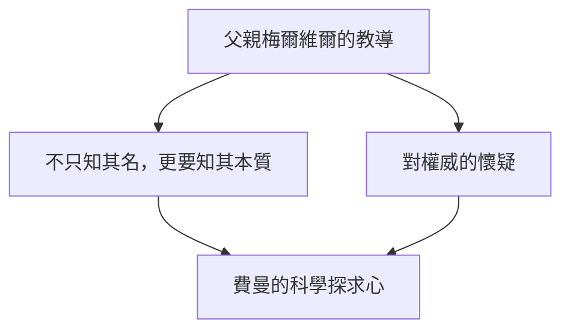
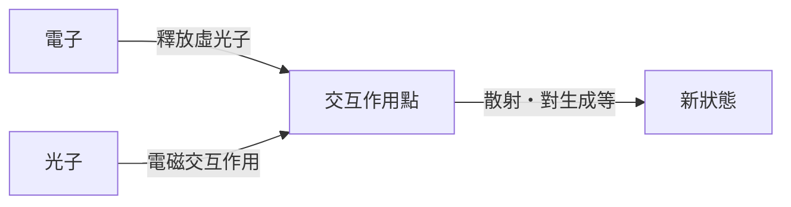

## 1. 前言：物理學界的搗蛋鬼與最棒的教師

「我有很多不懂的事情。但是，那又怎樣呢？就算一直不懂，也完全沒關係吧」

正如這句話所象徵的，理查·P·費曼（Richard Phillips Feynman, 1918 - 1988）不僅僅是一位天才物理學家，更具備壓倒性的「人格魅力」與「好奇心化身」。作為20世紀最具代表性的物理學家之一，他在1965年因對量子電動力學（QED）發展的貢獻而榮獲諾貝爾物理學獎。然而，他至今仍受到全世界人們的喜愛與尊敬的原因，並不僅僅是因為他輝煌的成就。

在假日沉浸於脫衣舞俱樂部裡計算物理、在曼哈頓計劃的極密設施中接連破解同事的保險箱、在巴西狂熱地擔任森巴樂團的邦哥鼓手、在挑戰者號爆炸事故的調查委員會上用冰水與橡膠O型環進行簡單的實驗讓NASA高層啞口無言。對他而言，探索宇宙的真理、解讀馬雅文字，或是觀察螞蟻的生態，全都是出於平等的「發現的樂趣（The Pleasure of Finding Things Out）」。

本文將以數千字徹底深入探討這位理查·費曼的一生、他所完成的物理學革命，以及他的哲學向我們現代社會傳達了什麼樣的訊息。

---

## 2. 幼年時期～學生時代：來自父親最棒的禮物

1918年5月11日，費曼出生於紐約皇后區的法洛克威（Far Rockaway）。他根深蒂固的科學思維，尤其是「懷疑權威、用自己的頭腦思考」的態度，受到了父親梅爾維爾的強烈影響。

梅爾維爾從事製作制服的工作，雖然不是科學家，但他徹底地教導兒子科學的「觀察事物的方法」。一個著名的故事是關於觀察鳥類。父親並沒有教他「鳥的名字」，而是讓他思考「鳥為什麼要用喙啄羽毛」。「知道名字和了解事物本身是完全不同的」——這個哲學成為了後來費曼學術態度的基石。

進入麻省理工學院（MIT）就讀的費曼，開始以不受現有框架束縛的獨特方法來解決數學和物理問題，迅速展露他的才華。之後，他進入普林斯頓大學研究所，在那裡遇見了約翰·惠勒（John Archibald Wheeler），從此踏入了量子力學的最前線。

---

## 3. 曼哈頓計劃與在洛斯阿拉莫斯的日子

隨著第二次世界大戰的爆發，年輕的費曼也被捲入了歷史的巨大漩渦中。他被徵召到了開發原子彈的極密計畫「曼哈頓計畫」的中心——位於新墨西哥州的洛斯阿拉莫斯國家實驗室。

當時，他才20歲出頭，開始在羅伯特·奧本海默和漢斯·貝特等世界頂尖物理學家的手下工作。他被任命為計算部門（當時還沒有巨型電腦，使用的是人力或機械式計算機）的負責人，建構了打孔卡片計算機的高效平行處理系統等，在實務面上也做出了巨大貢獻。

然而，讓他出名的是他喜歡惡作劇的性格。儘管是在處理最高機密的設施中，費曼發現保管文件的保險箱安全性非常草率。他找出了獨特的規律，接連打開同事們的保險箱，並留下「那些機密文件被我拿走了」的紙條。這不僅僅是單純的惡作劇，可以說是他用來證明系統脆弱性的獨特「駭客行為」。

此外，在洛斯阿拉莫斯的日子，對他來說也是個人經歷悲劇的時期。他最愛的妻子阿琳因結核病在療養院與病魔搏鬥，他持續著前去探望的日子。1945年原子彈投下前夕，阿琳離開了人世。這件事在費曼心中留下了深深的傷痛，對他後來的人生觀也產生了重大影響。

---

## 4. 量子電動力學（QED）的革命與費曼圖

戰後，經過康乃爾大學，隨後轉往加州理工學院（Caltech）的費曼，終於在物理學史上建立起不朽的金字塔。那就是「量子電動力學（Quantum Electrodynamics, QED）」的重建。

當時，在試圖計算電子與光子的交互作用時，遇到了一個致命的問題，那就是答案會變成無限大（發散困難）。朝永振一郎與朱利安·施溫格等人在同一時期也致力於解決這個問題，並透過高度的數學方法得出了解決方案（重整化理論），但費曼的手法卻截然不同。

他發明了一種直觀的方法，將粒子在空間移動時「所有可能路徑」加總起來，也就是**「路徑積分（Path Integral）」**。此外，他還發明了將那些複雜數學公式視覺化為圖形的**「費曼圖（Feynman Diagram）」**。

透過這種圖解化，使得以往極度艱澀難懂的量子力學計算，變得能夠直觀且機械式地進行。費曼圖成為了物理學界的「共通語言」，甚至被說成是將粒子物理學的發展提前了數十年。因為這項成就，他在1965年與朝永振一郎、朱利安·施溫格共同榮獲諾貝爾物理學獎。

---

## 5. 「別鬧了，費曼先生」：打破常規的日常與冒險

談到費曼，絕對少不了他那許多破天荒的奇聞軼事。在自傳散文集《別鬧了，費曼先生》中，描繪了他如何謳歌人生，以及對所有事物都抱有好奇心的模樣。

*   **森巴與邦哥鼓：** 在巴西逗留期間，他被當地的森巴音樂所吸引，甚至混入專業樂團，以邦哥鼓手的身分參加了嘉年華。
*   **對繪畫的熱情：** 源於與藝術家朋友的辯論，為了推翻「科學家不懂美」的偏見，他開始認真學習素描，甚至舉辦了個人畫展（他當時使用「Ofey」這個假名）。
*   **解讀馬雅文字：** 蜜月旅行時造訪墨西哥，他對馬雅文明的古書產生了興趣，儘管不是語言學專家，卻靠自己解讀出了天文計算的法則。
*   **在脫衣舞俱樂部計算：** 為了尋找一個可以靜下心來計算的地方，他竟然頻繁出入脫衣舞俱樂部，並在紙巾上隨手寫滿數學公式。

這些絕對不是「標新立異」的行為，全都是出於「想知道那到底是怎麼運作的」這種純粹的渴望。對他來說，無論是物理學、邦哥鼓還是馬雅文字，全都是用來理解這個世界的拼圖。

---

## 6. 身為教育者的費曼：傳奇的講義

費曼不僅是一位研究者，身為教育者也擁有罕見的才華。「如果不能不使用專業術語，將複雜的概念解釋給大學一年級學生聽懂，那就不能說你真的理解它了」——這是他一貫的主張。

1960年代初期，他在加州理工學院為期兩年的大學部物理學講義被錄音錄影，後來出版為《費曼物理學講義》（The Feynman Lectures on Physics）。這本教科書成為了全世界學習物理的學生們的聖經，即便經過了半個多世紀的現在，依然絲毫不減光彩地被傳閱著。

他講義的魅力，不在於單純地羅列數學公式，而是結合豐富的手勢，幽默風趣地向學生講述自然界現象是多麼地具戲劇性與美麗。他不是在教學生們「答案」，而是在教導他們「向自然提問的方法」。

---

## 7. 挑戰者號爆炸事故與「自然是無法被欺騙的」

點綴費曼晚年最著名的事蹟之一，就是參與了1986年發生的太空梭「挑戰者號」爆炸事故的調查委員會（羅傑斯委員會）。

當時已經罹患癌症的他，起初對參加這項工作感到猶豫，但為了查明真相，最終還是前往了華盛頓。面對官僚式的隱瞞作風與 NASA 草率的安全管理體制（風險評估的疏忽），他親自直接詢問現場工程師，直逼問題的核心。

接著，在電視轉播的聽證會席上，費曼將準備好的冰水杯裡，浸入太空梭接合處所使用的橡膠O型環，並用虎鉗夾住展示。在接近冰點的環境下，橡膠會失去彈性——他以任何人都能明白的方式，鮮明地證明了這就是爆炸的直接原因。

他在調查報告個人附錄中寫下的最後一句話，至今仍作為對所有從事科學技術人員的警鐘，被世人傳頌。

> "For a successful technology, reality must take precedence over public relations, for nature cannot be fooled."
> （為了技術的成功，現實必須凌駕於公關之上，因為自然是無法被欺騙的。）

---

## 8. 結論：費曼留給我們的東西

1988年2月15日，費曼因腹部癌症以69歲之齡離開了人世。他留下的最後一句話是「我可不想再死一次。死實在是太無聊了（I'd hate to die twice. It's so boring.）」，充滿了專屬於他的幽默感。

理查·費曼的一生，證明了人類「求知好奇心」所擁有的無限可能。對他來說，科學不是冰冷的公式與權威理論的拼湊，而是用來享受名為世界的壯闊謎團，最棒的遊戲。

在AI迅速發展、答案唾手可得的現代，我們往往容易忘記「用自己的頭腦思考」與「抱持純粹的疑問」。然而，費曼教給我們「熱愛未知的態度」與「看透事物背後本質的能力」，超越了時代，必然會成為我們不可或缺的指南針。

當我們追尋他的人生軌跡時，不僅看見了科學之美，更親眼見證了對於身為人類應該如何在這個世界上生活、如何去享受的根本問題，一個精彩絕倫的解答。

---
*希望透過這篇文章，能讓您對身邊的現象哪怕只產生一點點「為什麼呢？」的費曼式好奇心。*
