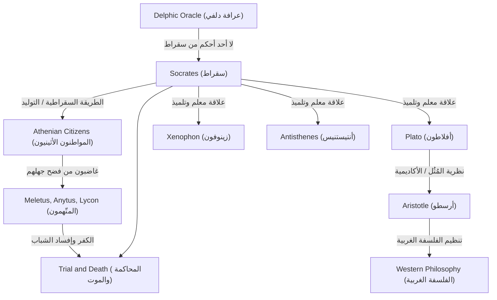

سقراط (حوالي 470 قبل الميلاد - 399 قبل الميلاد)، المفكر العظيم الذي أرسى أسس الفلسفة الغربية. وعلى الرغم من أنه لم يترك عملاً مكتوبًا واحدًا بنفسه، إلا أن أفكاره وطريقة حياته المكثفة قد انتقلت إلى العصر الحديث من خلال الحوارات التي كتبها تلاميذه مثل أفلاطون وزينوفون. لم تكن مناهجه، مثل "حكمة الجهل" و"الطريقة السقراطية"، مجرد سعي وراء المعرفة، بل كانت نقيضًا قويًا للسؤال البشري العالمي حول كيفية عيش حياة جيدة. يتعمق هذا المقال في حياة سقراط، الذي انخرط مرارًا في حوارات مع الشباب على نواصي شوارع أثينا القديمة، والتأثير الهائل الذي أحدثه على الأجيال القادمة.

## من ابن نحات الحجارة إلى فيلسوف الشارع

وُلد سقراط لأسرة مكونة من سوفرونيسكوس، نحات (أو قاطع حجارة)، وفيناريت، قابلة. يُقال إنه عمل في شبابه كقاطع حجارة على خطى والده، لكنه كرس نفسه في النهاية للبحث الفلسفي. خدم كجندي مشاة ثقيل في الحرب البيلوبونيسية، في معركتي بوتيديا وديليوم، حيث أشاد به مواطنوه لجلده وشجاعته غير العادية.

كانت نقطة التحول في حياته هي "عرافة دلفي" التي جلبها صديقه شيريفون. عندما سأل شيريفون في معبد أبولو: "هل هناك من هو أحكم من سقراط؟"، أجابت الكاهنة: "لا يوجد أحد أحكم من سقراط". إدراكًا منه لجهله، زار سقراط السياسيين والشعراء والحرفيين الذين كانوا يُعتبرون "رجالاً حكماء" في أثينا في ذلك الوقت، محاولاً إجراء حوارات لكشف معنى هذه العرافة.

## "حكمة الجهل" والعناية بالروح

من خلال حواراته مع الحكماء، أدرك سقراط حقيقة أنهم "كانوا يعتقدون أنهم يعرفون، بينما هم في الواقع لا يعرفون". في المقابل، استنتج سقراط أنه أكثر حكمة منهم قليلاً لأنه "كان يعلم أنه لا يعلم". هذه هي **"حكمة الجهل" (إدراك الجهل)** الشهيرة.

كانت طريقة سقراط في البحث هي "الطريقة السقراطية" (إلينخوس)، والتي تضمنت طرح أسئلة على المحاور لجعله يدرك تناقضاته. وشبّه نفسه بـ "القابلة" التي تساعد في ولادة الحقيقة داخل عقول الناس، وهي طريقة سُميت لاحقًا بـ "التوليد". ما كان يقدره فوق كل شيء لم يكن الثروة أو الشرف، بل "جعل الروح ممتازة قدر الإمكان" - أي **"العناية بالروح"**. فلسفته، التي جادلت بأن الفضيلة الحقيقية (أريتي) تأتي من المعرفة وبشرت بوحدة المعرفة والعمل، يمكن اعتبارها نقطة انطلاق للأخلاق.

## مخطط ارتباط الأفكار والعلاقات

كيف تشكل فكر سقراط وتوارث؟ يوضح المخطط أدناه نسبه الفلسفي وعلاقاته مع من حوله.

## المحاكمة والموت: سبب شرب السم

جرح استجواب سقراط المستمر كبرياء الشخصيات المؤثرة في أثينا وخلق له العديد من الأعداء. في عام 399 قبل الميلاد، اتُهم بـ "عدم الإيمان بالآلهة التي تعترف بها الدولة، وإدخال آلهة جديدة (دايمونيون)، وإفساد الشباب".

في المحكمة، دافع عن نفسه بجرأة (اعتذار سقراط)، مدعياً ​​أن أفعاله كانت مبنية على مهمة إلهية، ولكن نتيجة لذلك، حُكم عليه بالإعدام. حثه تلاميذه بشدة على الهروب من السجن، لكن سقراط رفض، قائلاً: "يجب ألا نرد الشر بالشر"، و"إطاعة قوانين الدولة هو العدالة". لم يساوم أبداً على معتقداته وفلسفته حتى النهاية، وشرب كأس الشوكران بهدوء، وأنهى حياته.

## التأثير على الأجيال اللاحقة والأهمية اليوم

أعطى موت سقراط صدمة هائلة لتلميذه الحبيب أفلاطون. ورث أفلاطون تعاليم سيده، وطورها بشكل أكبر، وبنى "نظرية المُثُل" الفريدة الخاصة به. علاوة على ذلك، أصبح هذا النسب الفكري الذي أدى إلى أرسطو نهرًا ضخمًا للفلسفة الغربية.

حتى اليوم، لا يزال موقف سقراط المتمثل في تقييم "الحوار" حيًا كتعلم نشط في التعليم وطرق التدريب في الأعمال (الطريقة السقراطية). كلماته، "الحياة غير المفحوصة لا تستحق العيش"، يمكن القول إنها حقيقة حادة تخترق الناس المعاصرين، الذين يميلون إلى الاكتفاء بالمعرفة السطحية في فيضان غامر من المعلومات. إن سؤال "كيف ينبغي للمرء أن يعيش"، الذي استكشفه سقراط مخاطرًا بحياته، يستمر في هز أرواحنا عبر العصور.
