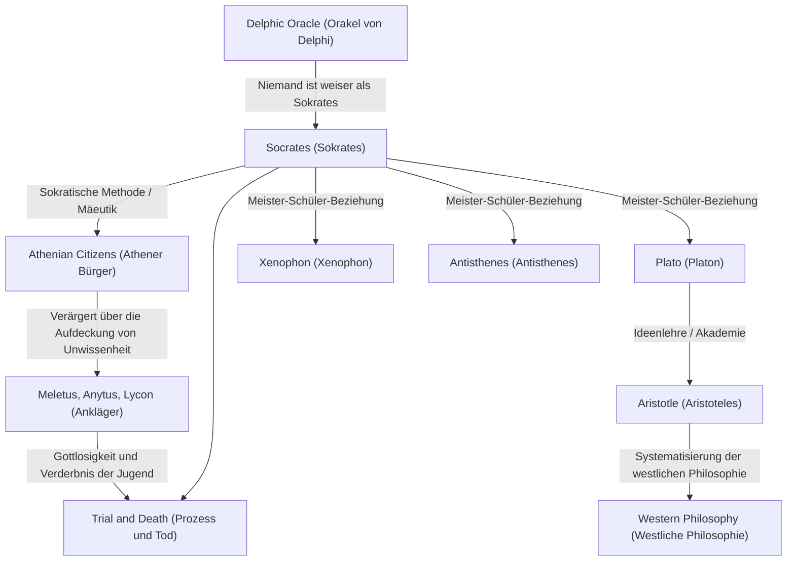

Sokrates (ca. 470 v. Chr. – 399 v. Chr.), der große Denker, der den Grundstein für die westliche Philosophie legte. Obwohl er selbst nie ein einziges schriftliches Werk hinterließ, wurden seine Gedanken und seine intensive Lebensweise durch die von seinen Schülern wie Platon und Xenophon verfassten Dialoge in die Moderne überliefert. Seine Ansätze wie die „Weisheit der Unwissenheit“ und die „Sokratische Methode“ waren nicht nur ein Streben nach Wissen, sondern eine mächtige Antithese zur universellen menschlichen Frage, wie man ein gutes Leben führt. Dieser Artikel befasst sich eingehend mit dem Leben des Sokrates, der an den Straßenecken des antiken Athen immer wieder Dialoge mit jungen Menschen führte, und mit dem unermesslichen Einfluss, den er auf zukünftige Generationen hatte.

## Vom Sohn eines Steinmetzes zum Straßenphilosophen

Sokrates wurde als Sohn des Bildhauers (oder Steinmetzes) Sophroniskos und der Hebamme Phainarete geboren. Es heißt, dass er in seiner Jugend als Steinmetz in die Fußstapfen seines Vaters trat, sich aber schließlich der philosophischen Untersuchung widmete. Er diente als Hoplit im Peloponnesischen Krieg, an den Schlachten von Poteidaia und Delion, wo er von seinen Landsleuten für seine außergewöhnliche Ausdauer und seinen Mut gelobt wurde.

Der Wendepunkt in seinem Leben war das „Orakel von Delphi“, das von seinem Freund Chairephon überbracht wurde. Als Chairephon im Apollontempel fragte: „Gibt es jemanden, der weiser ist als Sokrates?“, antwortete die Priesterin: „Es gibt niemanden, der weiser ist als Sokrates.“ Im Bewusstsein seiner eigenen Unwissenheit besuchte Sokrates Politiker, Dichter und Handwerker, die damals in Athen als „Weise“ galten, und versuchte durch Dialoge, die Bedeutung dieses Orakels zu entschlüsseln.

## „Weisheit der Unwissenheit“ und die Sorge um die Seele

Durch seine Dialoge mit den weisen Männern erkannte Sokrates die Tatsache, dass sie „dachten, sie wüssten es, während sie es in Wirklichkeit nicht wussten“. Im Gegensatz dazu kam Sokrates zu dem Schluss, dass er geringfügig weiser war als sie, weil er „wusste, dass er nicht wusste“. Dies ist die berühmte **„Weisheit der Unwissenheit“ (Bewusstsein der Unwissenheit)**.

Die Untersuchungsmethode des Sokrates war die „Sokratische Methode“ (Elenchos), bei der dem Gesprächspartner Fragen gestellt wurden, um ihm seine Widersprüche bewusst zu machen. Er verglich sich selbst mit einer „Hebamme“, die dabei hilft, die Wahrheit in den Köpfen der Menschen zur Welt zu bringen, eine Methode, die später „Mäeutik“ genannt wurde. Was er über alles schätzte, war nicht Reichtum oder Ehre, sondern „die Seele so vortrefflich wie möglich zu machen“ – nämlich die **„Sorge um die Seele“**. Seine Philosophie, die argumentierte, dass wahre Tugend (Arete) aus Wissen kommt, und die Einheit von Wissen und Handeln predigte, kann als Ausgangspunkt der Ethik angesehen werden.

## Korrelationsdiagramm von Gedanken und Verbindungen

Wie wurde das Denken des Sokrates geformt und weitergegeben? Das folgende Diagramm veranschaulicht seine philosophische Abstammung und seine Beziehungen zu den Menschen in seinem Umfeld.

## Prozess und Tod: Der Grund für das Trinken des Schierlingsbechers

Das beharrliche Hinterfragen des Sokrates verletzte den Stolz der einflussreichen Persönlichkeiten in Athen und machte ihm viele Feinde. Im Jahr 399 v. Chr. wurde er beschuldigt, „nicht an die vom Staat anerkannten Götter zu glauben, neue Gottheiten (Daimonion) einzuführen und die Jugend zu verderben“.

Vor Gericht verteidigte er sich mutig (Die Apologie des Sokrates) und behauptete, seine Handlungen beruhten auf einer göttlichen Mission, wurde aber in der Folge zum Tode verurteilt. Seine Schüler drängten ihn nachdrücklich, aus dem Gefängnis zu fliehen, aber Sokrates weigerte sich und erklärte: „Man darf Böses nicht mit Bösem vergelten“ und „Den Gesetzen des Staates zu gehorchen ist Gerechtigkeit“. Er ging bis zum Ende keine Kompromisse bei seinen Überzeugungen und seiner Philosophie ein, trank ruhig den Schierlingsbecher und beendete sein Leben.

## Einfluss auf spätere Generationen und Bedeutung heute

Der Tod des Sokrates versetzte seinem geliebten Schüler Platon einen enormen Schock. Platon erbte die Lehren seines Meisters, entwickelte sie weiter und konstruierte seine einzigartige „Ideenlehre“. Darüber hinaus wurde diese Denklinie, die zu Aristoteles führte, zu einem massiven Strom der westlichen Philosophie.

Auch heute noch lebt Sokrates' Haltung der Wertschätzung des „Dialogs“ als aktives Lernen in der Bildung und als Coaching-Methode in der Wirtschaft (Sokratische Methode) weiter. Seine Worte „Das ungeprüfte Leben ist nicht lebenswert“ können als eine scharfe Wahrheit angesehen werden, die moderne Menschen durchdringt, die dazu neigen, sich in einer überfließenden Flut von Informationen mit oberflächlichem Wissen zufrieden zu geben. Die Frage, „wie man leben sollte“, die Sokrates unter Einsatz seines Lebens erforschte, erschüttert unsere Seelen über die Zeitalter hinweg weiter.
