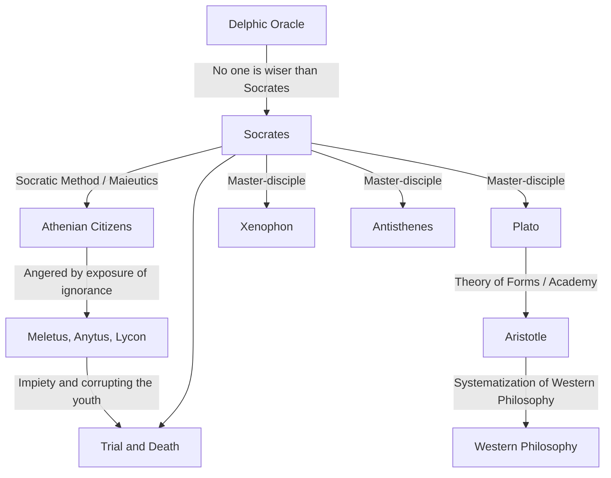

Socrates (c. 470 BC – 399 BC) is the great thinker who laid the foundation of Western philosophy. Although he never left a single written work himself, his thoughts and intense way of life have been passed down to the modern era through the dialogues written by his disciples such as Plato and Xenophon. His approaches, such as the "Wisdom of Ignorance" and the "Socratic Method," were not merely a pursuit of knowledge, but a powerful antithesis to the universal human question of how to live a good life. This article delves deeply into the life of Socrates, who repeatedly engaged in dialogues with young people on the street corners of ancient Athens, and the immeasurable influence he had on future generations.

## From Stonemason's Son to Street Philosopher

Socrates was born to Sophroniscus, a sculptor (or stonemason), and Phaenarete, a midwife. It is said that in his youth he worked as a stonemason following in his father's footsteps, but eventually devoted himself to philosophical inquiry. He served as a hoplite in the Peloponnesian War, at the battles of Potidaea and Delium, where he was praised by his compatriots for his extraordinary endurance and courage.

The turning point in his life was the "Delphic Oracle" brought by his friend Chaerephon. When Chaerephon asked at the Temple of Apollo, "Is there anyone wiser than Socrates?", the priestess answered, "There is no one wiser than Socrates." Aware of his own ignorance, Socrates visited politicians, poets, and craftsmen who were considered "wise men" in Athens at the time, attempting dialogues to unravel the meaning of this oracle.

## "Wisdom of Ignorance" and the Care of the Soul

Through his dialogues with the wise men, Socrates realized the fact that they "thought they knew, when in reality they did not." In contrast, Socrates concluded that he was slightly wiser than them because he "knew that he did not know." This is the famous **"Wisdom of Ignorance" (Awareness of Ignorance)**.

Socrates' method of inquiry was the "Socratic Method" (Elenchus), which involved posing questions to the interlocutor to make them aware of their contradictions. He likened himself to a "midwife" who helps deliver the truth within people's minds, a method later called "maieutics." What he valued above all was not wealth or honor, but "making the soul as excellent as possible"—namely, the **"care of the soul."** His philosophy, which argued that true virtue (arete) comes from knowledge and preached the unity of knowledge and action, can be seen as the starting point of ethics.

## Correlation Chart of Thoughts and Connections

How was Socrates' thought formed and inherited? The diagram below illustrates his philosophical lineage and relationships with those around him.

## Trial and Death: The Reason for Drinking the Poison Hemlock

Socrates' persistent questioning wounded the pride of the influential figures in Athens and made him many enemies. In 399 BC, he was accused of "not believing in the gods recognized by the state, introducing new deities (daimonion), and corrupting the youth."

In court, he boldly defended himself (The Apology of Socrates), claiming that his actions were based on a divine mission, but as a result, he was sentenced to death. His disciples strongly urged him to escape from prison, but Socrates refused, stating, "One must not return evil for evil," and "Obeying the laws of the state is justice." He never compromised his beliefs and philosophy until the very end, calmly drank the cup of hemlock, and closed his life.

## Influence on Later Generations and Significance Today

The death of Socrates gave a tremendous shock to his beloved disciple Plato. Plato inherited his master's teachings, further developed them, and constructed his unique "Theory of Forms." Furthermore, this lineage of thought leading to Aristotle became a massive river of Western philosophy.

Even today, Socrates' attitude of valuing "dialogue" lives on as active learning in education and coaching methods in business (Socratic Method). His words, "The unexamined life is not worth living," can be said to be a sharp truth that pierces modern people, who tend to be satisfied with superficial knowledge in an overflowing flood of information. The question of "how one should live," which Socrates explored at the risk of his life, continues to shake our souls across the ages.
