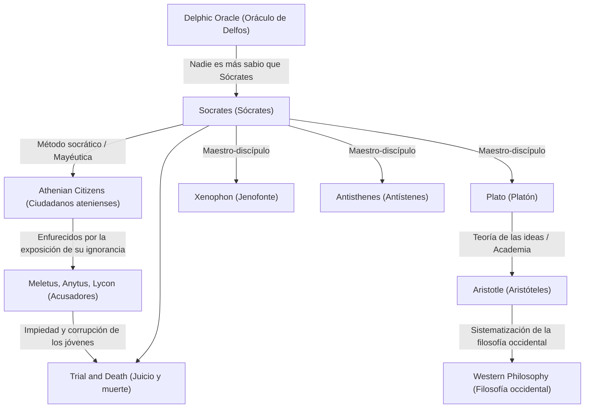

Sócrates (c. 470 a.C. – 399 a.C.), el gran pensador que sentó las bases de la filosofía occidental. Aunque nunca dejó una sola obra escrita por sí mismo, sus pensamientos y su intensa forma de vida se han transmitido a la era moderna a través de los diálogos escritos por sus discípulos, como Platón y Jenofonte. Sus enfoques, como la "Sabiduría de la ignorancia" y el "Método socrático", no eran una mera búsqueda de conocimiento, sino una poderosa antítesis a la pregunta humana universal de cómo vivir una buena vida. Este artículo profundiza en la vida de Sócrates, quien entablaba diálogos repetidamente con los jóvenes en las esquinas de la antigua Atenas, y la inmensurable influencia que tuvo en las generaciones futuras.

## De hijo de cantero a filósofo callejero

Sócrates nació de Sofronisco, un escultor (o cantero), y Fenáreta, una partera. Se dice que en su juventud trabajó como cantero siguiendo los pasos de su padre, pero con el tiempo se dedicó a la investigación filosófica. Sirvió como hoplita en la Guerra del Peloponeso, en las batallas de Potidea y Delio, donde fue elogiado por sus compatriotas por su extraordinaria resistencia y valentía.

El punto de inflexión en su vida fue el "Oráculo de Delfos" traído por su amigo Querefonte. Cuando Querefonte preguntó en el Templo de Apolo: "¿Hay alguien más sabio que Sócrates?", la sacerdotisa respondió: "No hay nadie más sabio que Sócrates". Consciente de su propia ignorancia, Sócrates visitó a políticos, poetas y artesanos que eran considerados "hombres sabios" en Atenas en ese momento, intentando diálogos para desentrañar el significado de este oráculo.

## "Sabiduría de la ignorancia" y el cuidado del alma

A través de sus diálogos con los sabios, Sócrates se dio cuenta del hecho de que ellos "creían saber, cuando en realidad no sabían". Por el contrario, Sócrates concluyó que él era un poco más sabio que ellos porque "sabía que no sabía". Esta es la famosa **"Sabiduría de la ignorancia" (Conciencia de la ignorancia)**.

El método de investigación de Sócrates era el "Método socrático" (Elenchus), que consistía en plantear preguntas al interlocutor para hacerles conscientes de sus contradicciones. Se comparaba a sí mismo con una "partera" que ayuda a dar a luz la verdad dentro de las mentes de las personas, un método que más tarde se llamó "mayéutica". Lo que valoraba por encima de todo no era la riqueza o el honor, sino "hacer que el alma sea lo más excelente posible", es decir, el **"cuidado del alma"**. Su filosofía, que sostenía que la verdadera virtud (areté) proviene del conocimiento y predicaba la unidad de conocimiento y acción, puede verse como el punto de partida de la ética.

## Cuadro de correlación de pensamientos y conexiones

¿Cómo se formó y heredó el pensamiento de Sócrates? El siguiente diagrama ilustra su linaje filosófico y las relaciones con las personas que lo rodeaban.

## Juicio y muerte: La razón para beber la cicuta

Los persistentes interrogatorios de Sócrates hirieron el orgullo de las figuras influyentes de Atenas y le ganaron muchos enemigos. En el 399 a.C., fue acusado de "no creer en los dioses reconocidos por el estado, introducir nuevas deidades (daimonion) y corromper a los jóvenes".

En la corte, se defendió audazmente (La Apología de Sócrates), afirmando que sus acciones se basaban en una misión divina, pero como resultado, fue condenado a muerte. Sus discípulos le instaron fuertemente a escapar de prisión, pero Sócrates se negó, declarando: "No se debe devolver el mal con el mal" y "Obedecer las leyes del estado es justicia". Nunca comprometió sus creencias y su filosofía hasta el final, bebió tranquilamente la copa de cicuta y puso fin a su vida.

## Influencia en generaciones posteriores y significado en la actualidad

La muerte de Sócrates causó un tremendo impacto en su amado discípulo Platón. Platón heredó las enseñanzas de su maestro, las desarrolló aún más y construyó su única "Teoría de las Formas". Además, este linaje de pensamiento que condujo a Aristóteles se convirtió en un río masivo de filosofía occidental.

Incluso hoy en día, la actitud de Sócrates de valorar el "diálogo" sigue viva como aprendizaje activo en la educación y en los métodos de coaching en los negocios (Método socrático). Sus palabras, "Una vida sin examen no merece ser vivida", pueden considerarse una verdad aguda que atraviesa a las personas modernas, quienes tienden a estar satisfechas con el conocimiento superficial en una inundación desbordante de información. La pregunta de "cómo se debe vivir", que Sócrates exploró arriesgando su vida, continúa sacudiendo nuestras almas a través de las edades.
