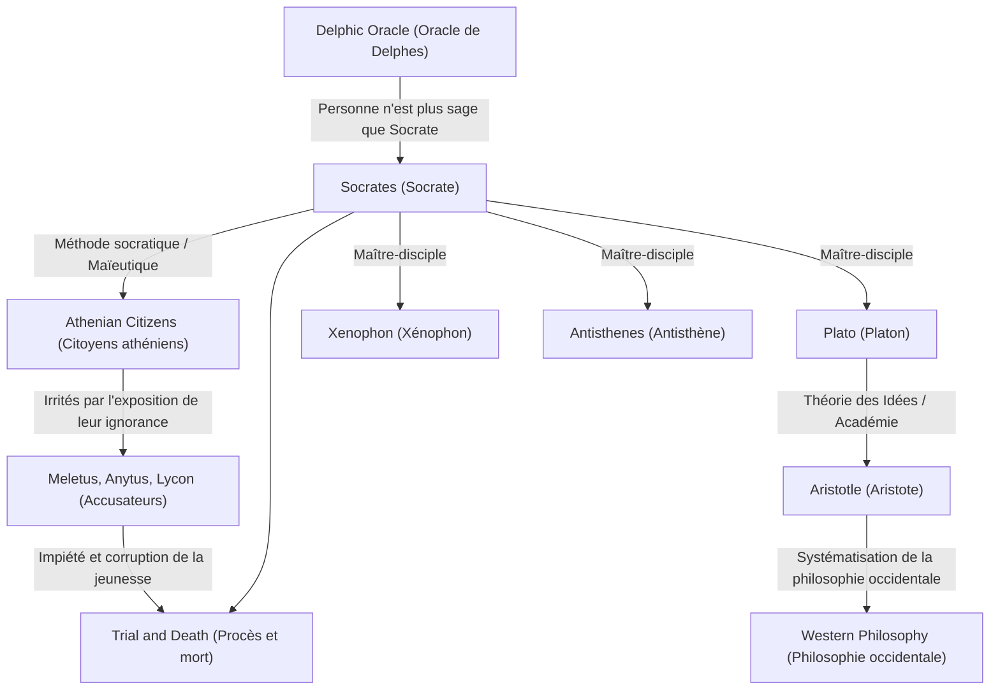

Socrate (vers 470 av. J.-C. – 399 av. J.-C.) est le grand penseur qui a jeté les bases de la philosophie occidentale. Bien qu'il n'ait lui-même laissé aucune œuvre écrite, ses pensées et son mode de vie intense ont été transmis à l'ère moderne à travers les dialogues écrits par ses disciples, tels que Platon et Xénophon. Ses approches, telles que la « Sagesse de l'ignorance » et la « Méthode socratique », n'étaient pas une simple quête de connaissances, mais une puissante antithèse à la question humaine universelle de savoir comment mener une vie bonne. Cet article se penche en profondeur sur la vie de Socrate, qui s'est engagé à plusieurs reprises dans des dialogues avec des jeunes au coin des rues de l'Athènes antique, et sur l'influence incommensurable qu'il a eue sur les générations futures.

## De fils de tailleur de pierre à philosophe de rue

Socrate est né de Sophronisque, sculpteur (ou tailleur de pierre), et de Phénarète, sage-femme. On dit que dans sa jeunesse, il a travaillé comme tailleur de pierre sur les traces de son père, mais qu'il s'est finalement consacré à la recherche philosophique. Il a servi comme hoplite lors de la guerre du Péloponnèse, aux batailles de Potidée et de Délion, où il a été loué par ses compatriotes pour son endurance et son courage extraordinaires.

Le tournant de sa vie a été « l'Oracle de Delphes » rapporté par son ami Chéréphon. Lorsque Chéréphon a demandé au temple d'Apollon : « Y a-t-il quelqu'un de plus sage que Socrate ? », la prêtresse a répondu : « Il n'y a personne de plus sage que Socrate. » Conscient de sa propre ignorance, Socrate a rendu visite à des hommes politiques, des poètes et des artisans qui étaient considérés comme des « hommes sages » à Athènes à l'époque, tentant des dialogues pour percer le sens de cet oracle.

## La « Sagesse de l'ignorance » et le soin de l'âme

Grâce à ses dialogues avec les sages, Socrate s'est rendu compte du fait qu'ils « croyaient savoir, alors qu'en réalité ils ne savaient pas ». En revanche, Socrate a conclu qu'il était légèrement plus sage qu'eux car il « savait qu'il ne savait pas ». C'est la célèbre **« Sagesse de l'ignorance » (Conscience de l'ignorance)**.

La méthode d'investigation de Socrate était la « méthode socratique » (Élenchos), qui consistait à poser des questions à l'interlocuteur pour lui faire prendre conscience de ses contradictions. Il se comparait à une « sage-femme » qui aide à accoucher de la vérité dans l'esprit des gens, une méthode appelée plus tard « maïeutique ». Ce qu'il valorisait par-dessus tout n'était pas la richesse ou l'honneur, mais le fait de « rendre l'âme aussi excellente que possible » — à savoir, le **« soin de l'âme »**. Sa philosophie, qui affirmait que la véritable vertu (arété) provient de la connaissance et prêchait l'unité de la connaissance et de l'action, peut être considérée comme le point de départ de l'éthique.

## Charte de corrélation des pensées et des relations

Comment la pensée de Socrate s'est-elle formée et a-t-elle été héritée ? Le diagramme ci-dessous illustre sa lignée philosophique et ses relations avec son entourage.

## Procès et mort : La raison pour laquelle il a bu la ciguë

Les interrogatoires persistants de Socrate ont blessé la fierté des personnalités influentes d'Athènes et lui ont valu de nombreux ennemis. En 399 av. J.-C., il est accusé de « ne pas croire aux dieux reconnus par l'État, d'introduire de nouvelles divinités (daimonion) et de corrompre la jeunesse ».

Au tribunal, il s'est défendu avec audace (L'Apologie de Socrate), affirmant que ses actions étaient fondées sur une mission divine, mais il a finalement été condamné à mort. Ses disciples l'ont fortement exhorté à s'échapper de prison, mais Socrate a refusé, déclarant : « Il ne faut pas rendre le mal pour le mal » et « Obéir aux lois de l'État est la justice ». Il n'a jamais compromis ses convictions ni sa philosophie jusqu'à la fin, a bu calmement la coupe de ciguë et a mis fin à ses jours.

## Influence sur les générations futures et signification aujourd'hui

La mort de Socrate a provoqué un choc immense chez son disciple bien-aimé Platon. Platon a hérité des enseignements de son maître, les a développés et a construit sa propre « Théorie des Idées ». De plus, cette lignée de pensée menant à Aristote est devenue un fleuve massif de la philosophie occidentale.

Même aujourd'hui, l'attitude de Socrate valorisant le « dialogue » survit en tant qu'apprentissage actif dans l'éducation et méthodes de coaching dans les affaires (Méthode socratique). Ses mots, « Une vie sans examen ne vaut pas la peine d'être vécue », peuvent être considérés comme une vérité poignante qui transperce les gens modernes, qui ont tendance à se satisfaire de connaissances superficielles dans un flot d'informations débordant. La question de « comment on doit vivre », que Socrate a explorée au péril de sa vie, continue d'ébranler nos âmes à travers les âges.
