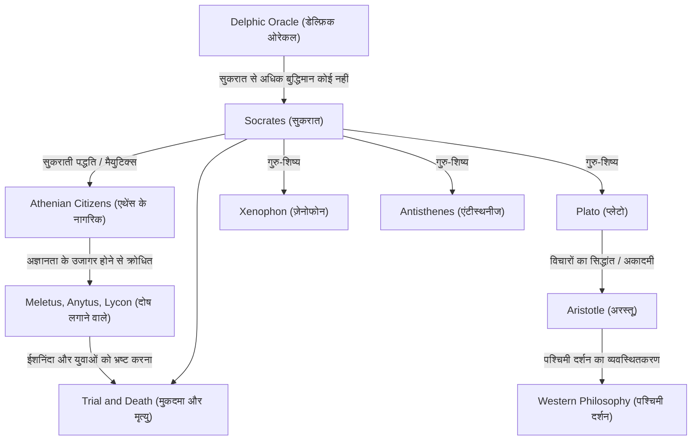

सुकरात (लगभग 470 ईसा पूर्व – 399 ईसा पूर्व), वे महान विचारक थे जिन्होंने पश्चिमी दर्शन की नींव रखी। यद्यपि उन्होंने स्वयं कभी कोई लिखित कार्य नहीं छोड़ा, लेकिन उनके विचार और जीवन का तीव्र तरीका प्लेटो और ज़ेनोफोन जैसे उनके शिष्यों द्वारा लिखे गए संवादों के माध्यम से आधुनिक युग में पारित किए गए हैं। "अज्ञानता का ज्ञान" और "सुकराती पद्धति" जैसे उनके दृष्टिकोण केवल ज्ञान की खोज नहीं थे, बल्कि इस सार्वभौमिक मानवीय प्रश्न के लिए एक शक्तिशाली प्रतिपक्ष थे कि अच्छा जीवन कैसे जिया जाए। यह लेख सुकरात के जीवन में गहराई से उतरता है, जिन्होंने प्राचीन एथेंस के नुक्कड़ों पर युवाओं के साथ बार-बार संवाद किया, और भविष्य की पीढ़ियों पर उनका जो अथाह प्रभाव पड़ा।

## राजमिस्त्री के बेटे से स्ट्रीट फिलॉसफर तक

सुकरात का जन्म सोफ्रोनिस्कस, जो एक मूर्तिकार (या राजमिस्त्री) थे, और फेनारेट, जो एक दाई थीं, के यहाँ हुआ था। ऐसा कहा जाता है कि अपनी युवावस्था में उन्होंने अपने पिता के नक्शेकदम पर चलते हुए राजमिस्त्री के रूप में काम किया, लेकिन अंततः दार्शनिक जांच के लिए खुद को समर्पित कर दिया। उन्होंने पेलोपोनेशियन युद्ध में, पोटाडिया और डेलियम की लड़ाई में होप्लाइट (पैदल सैनिक) के रूप में कार्य किया, जहाँ उनके असाधारण धीरज और साहस के लिए उनके हमवतन द्वारा उनकी प्रशंसा की गई।

उनके जीवन का टर्निंग पॉइंट उनके मित्र चेरेफ़ोन द्वारा लाया गया "डेल्फ़िक ओरेकल" था। जब चेरेफ़ोन ने अपोलो के मंदिर में पूछा, "क्या सुकरात से अधिक बुद्धिमान कोई है?", तो पुजारिन ने उत्तर दिया, "सुकरात से अधिक बुद्धिमान कोई नहीं है।" अपने स्वयं के अज्ञान से अवगत, सुकरात ने राजनीतिज्ञों, कवियों और कारीगरों का दौरा किया, जिन्हें उस समय एथेंस में "बुद्धिमान व्यक्ति" माना जाता था, और इस भविष्यवाणी के अर्थ को उजागर करने के लिए संवाद का प्रयास किया।

## "अज्ञानता का ज्ञान" और आत्मा की देखभाल

बुद्धिमान पुरुषों के साथ अपने संवादों के माध्यम से, सुकरात ने यह महसूस किया कि वे "सोचते थे कि वे जानते हैं, जबकि वास्तविकता में वे नहीं जानते थे।" इसके विपरीत, सुकरात ने निष्कर्ष निकाला कि वह उनसे थोड़ा अधिक बुद्धिमान था क्योंकि वह "जानता था कि वह नहीं जानता।" यह प्रसिद्ध **"अज्ञानता का ज्ञान" (अज्ञानता की जागरूकता)** है।

सुकरात की जांच की विधि "सुकराती पद्धति" (एलेन्चस) थी, जिसमें वार्ताकार से उनकी अंतर्विरोधों से अवगत कराने के लिए प्रश्न पूछना शामिल था। उन्होंने खुद को एक "दाई" के समान बताया जो लोगों के मन के भीतर सच्चाई को जन्म देने में मदद करती है, एक ऐसी विधि जिसे बाद में "मैयुटिक्स" कहा गया। उसने धन या सम्मान से ऊपर जिसे महत्व दिया, वह था "आत्मा को यथासंभव उत्कृष्ट बनाना"—अर्थात, **"आत्मा की देखभाल।"** उनका दर्शन, जिसने तर्क दिया कि सच्चा गुण (एरेते) ज्ञान से आता है और ज्ञान और क्रिया की एकता का उपदेश दिया, उसे नैतिकता के प्रारंभिक बिंदु के रूप में देखा जा सकता है।

## विचारों और संबंधों का सहसंबंध चार्ट

सुकरात के विचार कैसे बने और विरासत में मिले? नीचे दिया गया आरेख उनके दार्शनिक वंश और उनके आसपास के लोगों के साथ संबंधों को दर्शाता है।

## मुकदमा और मृत्यु: जहर का प्याला पीने का कारण

सुकरात की लगातार पूछताछ ने एथेंस की प्रभावशाली हस्तियों के गौरव को आहत किया और उनके कई दुश्मन बना दिए। 399 ईसा पूर्व में, उन पर "राज्य द्वारा मान्यता प्राप्त देवताओं में विश्वास न करने, नए देवताओं (डेमोनियन) को पेश करने और युवाओं को भ्रष्ट करने" का आरोप लगाया गया था।

अदालत में, उन्होंने साहसपूर्वक अपना बचाव किया (सुकरात की क्षमायाचना), यह दावा करते हुए कि उनके कार्य एक ईश्वरीय मिशन पर आधारित थे, लेकिन परिणामस्वरूप, उन्हें मौत की सजा सुनाई गई। उनके शिष्यों ने उन्हें जेल से भागने का कड़ा आग्रह किया, लेकिन सुकरात ने यह कहते हुए इनकार कर दिया, "बुराई के बदले बुराई नहीं करनी चाहिए," और "राज्य के कानूनों का पालन करना ही न्याय है।" उन्होंने अंत तक अपनी मान्यताओं और दर्शन से कभी समझौता नहीं किया, शांति से हेमलॉक का प्याला पिया, और अपना जीवन समाप्त कर दिया।

## बाद की पीढ़ियों पर प्रभाव और आज के समय में महत्व

सुकरात की मृत्यु ने उनके प्रिय शिष्य प्लेटो को बहुत बड़ा झटका दिया। प्लेटो ने अपने गुरु की शिक्षाओं को विरासत में मिला, उन्हें और विकसित किया, और अपने अनूठे "रूपों के सिद्धांत" का निर्माण किया। इसके अलावा, अरस्तू तक जाने वाली सोच का यह वंश पश्चिमी दर्शन की एक विशाल नदी बन गया।

आज भी, "संवाद" को महत्व देने का सुकरात का दृष्टिकोण शिक्षा में सक्रिय शिक्षा और व्यवसाय में कोचिंग विधियों (सुकराती पद्धति) के रूप में जीवित है। उनके शब्द, "बिना जांची-परखी जिंदगी जीने लायक नहीं है," एक ऐसा तीखा सच कहा जा सकता है जो आधुनिक लोगों को भेदता है, जो जानकारी की बाढ़ में सतही ज्ञान से संतुष्ट होते हैं। "व्यक्ति को कैसे जीना चाहिए" का सवाल, जिसे सुकरात ने अपने जीवन को जोखिम में डालकर खोजा था, युगों-युगों से हमारी आत्माओं को झकझोरता आ रहा है।
