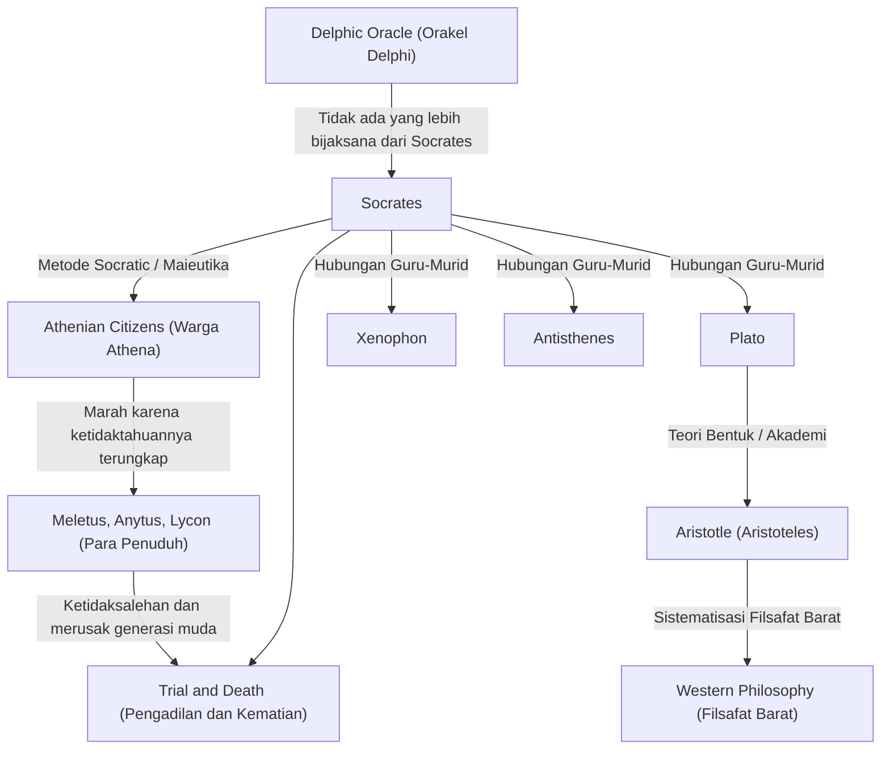

Socrates (sekitar 470 SM – 399 SM), pemikir besar yang meletakkan dasar filsafat Barat. Meskipun ia sendiri tidak pernah meninggalkan satu pun karya tulis, pemikiran dan cara hidupnya yang intens telah diwariskan ke era modern melalui dialog-dialog yang ditulis oleh murid-muridnya seperti Plato dan Xenophon. Pendekatannya, seperti "Kebijaksanaan Ketidaktahuan" dan "Metode Socratic," bukan sekadar pencarian pengetahuan, melainkan antitesis yang kuat terhadap pertanyaan universal manusia tentang bagaimana menjalani kehidupan yang baik. Artikel ini menggali lebih dalam kehidupan Socrates, yang berulang kali terlibat dalam dialog dengan orang-orang muda di sudut-sudut jalan Athena kuno, dan pengaruhnya yang tak terukur pada generasi mendatang.

## Dari Putra Tukang Batu Menjadi Filsuf Jalanan

Socrates lahir dari ayah bernama Sophroniscus, seorang pematung (atau tukang batu), dan Phaenarete, seorang bidan. Dikatakan bahwa di masa mudanya ia bekerja sebagai tukang batu mengikuti jejak ayahnya, namun pada akhirnya mengabdikan dirinya pada penyelidikan filosofis. Ia bertugas sebagai hoplite (infanteri berat) dalam Perang Peloponnesia, pada pertempuran Potidaea dan Delium, di mana ia dipuji oleh rekan-rekan senegaranya atas daya tahan dan keberaniannya yang luar biasa.

Titik balik dalam hidupnya adalah "Orakel Delphi" yang dibawa oleh temannya Chaerephon. Ketika Chaerephon bertanya di Kuil Apollo, "Adakah orang yang lebih bijaksana dari Socrates?", pendeta wanita itu menjawab, "Tidak ada orang yang lebih bijaksana dari Socrates." Sadar akan ketidaktahuannya sendiri, Socrates mengunjungi para politikus, penyair, dan pengrajin yang dianggap sebagai "orang bijak" di Athena pada saat itu, mencoba berdialog untuk mengungkap makna dari orakel ini.

## "Kebijaksanaan Ketidaktahuan" dan Pemeliharaan Jiwa

Melalui dialognya dengan orang-orang bijak, Socrates menyadari fakta bahwa mereka "berpikir bahwa mereka tahu, padahal kenyataannya tidak." Sebaliknya, Socrates menyimpulkan bahwa ia sedikit lebih bijaksana daripada mereka karena ia "tahu bahwa ia tidak tahu." Inilah **"Kebijaksanaan Ketidaktahuan" (Kesadaran akan Ketidaktahuan)** yang terkenal itu.

Metode penyelidikan Socrates adalah "Metode Socratic" (Elenchus), yang melibatkan pengajuan pertanyaan kepada lawan bicara untuk menyadarkan mereka akan kontradiksi mereka. Ia mengibaratkan dirinya sebagai "bidan" yang membantu melahirkan kebenaran di dalam pikiran orang-orang, sebuah metode yang belakangan disebut "maieutika." Apa yang ia hargai di atas segalanya bukanlah kekayaan atau kehormatan, melainkan "menjadikan jiwa sebaik mungkin"—yaitu, **"pemeliharaan jiwa."** Filsafatnya, yang berpendapat bahwa kebajikan sejati (arete) berasal dari pengetahuan dan mengkhotbahkan kesatuan pengetahuan dan tindakan, dapat dilihat sebagai titik awal etika.

## Bagan Korelasi Pemikiran dan Hubungan

Bagaimana pemikiran Socrates terbentuk dan diwariskan? Diagram di bawah ini mengilustrasikan silsilah filosofisnya dan hubungannya dengan orang-orang di sekitarnya.

## Pengadilan dan Kematian: Alasan Meminum Racun Hemlock

Pertanyaan-pertanyaan Socrates yang terus-menerus melukai harga diri tokoh-tokoh berpengaruh di Athena dan membuatnya memiliki banyak musuh. Pada 399 SM, ia dituduh "tidak mempercayai dewa-dewa yang diakui oleh negara, memperkenalkan dewa-dewa baru (daimonion), dan merusak pemuda."

Di pengadilan, ia dengan berani membela dirinya sendiri (Apologi Socrates), mengklaim bahwa tindakannya didasarkan pada misi ilahi, tetapi sebagai hasilnya, ia dijatuhi hukuman mati. Murid-muridnya sangat mendesaknya untuk melarikan diri dari penjara, namun Socrates menolak, menyatakan, "Seseorang tidak boleh membalas kejahatan dengan kejahatan," dan "Mematuhi hukum negara adalah keadilan." Ia tidak pernah mengkompromikan keyakinan dan filosofinya sampai akhir, dengan tenang meminum secangkir racun hemlock, dan menutup usianya.

## Pengaruh pada Generasi Selanjutnya dan Maknanya Saat Ini

Kematian Socrates memberikan kejutan yang luar biasa bagi murid kesayangannya, Plato. Plato mewarisi ajaran gurunya, mengembangkannya lebih lanjut, dan membangun "Teori Bentuk" (Theory of Forms) yang unik. Selanjutnya, silsilah pemikiran yang mengarah pada Aristoteles ini menjadi sungai besar filsafat Barat.

Bahkan hari ini, sikap Socrates yang menghargai "dialog" terus hidup sebagai pembelajaran aktif dalam pendidikan dan metode pembinaan dalam bisnis (Metode Socratic). Kata-katanya, "Kehidupan yang tidak teruji tidak layak untuk dijalani," dapat dikatakan sebagai kebenaran tajam yang menusuk manusia modern, yang cenderung puas dengan pengetahuan dangkal di tengah banjir informasi yang meluap. Pertanyaan tentang "bagaimana seseorang harus hidup," yang dieksplorasi Socrates dengan mempertaruhkan nyawanya, terus mengguncang jiwa kita melintasi zaman.
