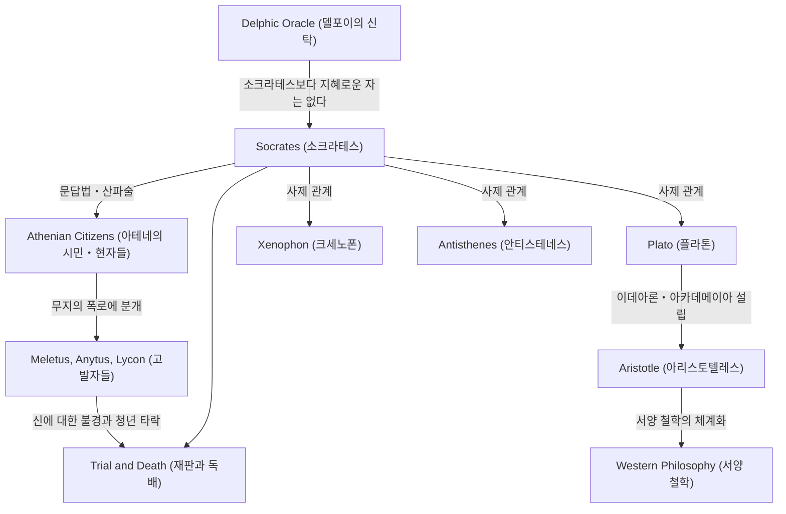

서양 철학의 기초를 다진 위대한 사상가, 소크라테스(기원전 470년경 – 기원전 399년). 그는 스스로 단 한 권의 저서도 남기지 않았음에도 불구하고, 제자인 플라톤이나 크세노폰 등이 기록한 대화편을 통해 그 사상과 강렬한 삶의 방식을 현대에 전하고 있습니다. '무지의 지'나 '문답법'과 같은 그의 접근은 단순한 지식의 탐구에 그치지 않고, 어떻게 하면 선하게 살 수 있을까 하는 인류 보편의 질문에 대한 강력한 안티테제이기도 했습니다. 본 기사에서는 고대 아테네의 길거리에서 젊은이들과 대화를 거듭한 소크라테스의 생애와, 그가 후세에 미친 헤아릴 수 없는 영향에 대해 깊이 파헤쳐 봅니다.

## 석공의 아들에서 거리의 철학자로

소크라테스는 조각가(또는 석공)인 아버지 소프로니스코스와 산파인 어머니 파이나레테 사이에서 태어났습니다. 청년기에는 아버지의 뒤를 이어 석공으로 일했다고도 전해지지만, 이윽고 철학적인 탐구로 자신의 몸을 던지게 됩니다. 그는 펠로폰네소스 전쟁에서 포티다이아 전투나 델리온 전투에 중장보병으로 종군하였고, 그 유례없는 인내력과 용기로 동포들로부터 찬사를 받았습니다.

그의 인생을 결정지은 것은 친구 카이레폰이 가져온 '델포이의 신탁'입니다. 카이레폰이 아폴론 신전에서 "소크라테스보다 지혜로운 자가 있는가"라고 묻자, 무녀는 "소크라테스보다 지혜로운 자는 없다"고 대답했습니다. 스스로의 무지를 자각하고 있던 소크라테스는, 이 신탁의 의미를 풀기 위해 당시 아테네에서 '현자'로 불리던 정치가나 시인, 장인들을 차례로 찾아가 대화를 시도합니다.

## '무지의 지'와 영혼의 돌봄

현자들과의 대화를 통해 소크라테스가 깨달은 것은, 그들이 '사실은 알지 못하면서, 알고 있다고 착각하고 있다'는 사실이었습니다. 이에 반해 소크라테스 자신은 '자신은 알지 못한다는 것을 알고 있다'는 점에서, 그들보다 아주 조금 더 지혜롭다는 결론에 이릅니다. 이것이 그 유명한 **'무지의 지(무지의 자각)'**입니다.

소크라테스의 탐구 방법은 상대방에게 질문을 던져 그 모순을 자각하게 하는 '문답법(엘렝코스)'이었습니다. 그는 스스로를 사람들의 마음속에 있는 진리를 낳게 하는 '산파'에 비유했고, 이 수법은 후에 '산파술'이라고도 불렸습니다. 그가 무엇보다도 중시한 것은 부나 명예가 아니라 '영혼을 가능한 한 훌륭하게 만드는 것', 즉 **'영혼의 돌봄'**이었습니다. 진정한 덕(아레테)은 앎에서 나온다고 하며 지행합일을 설파한 그의 철학은, 윤리학의 출발점이라고도 할 수 있습니다.

## 사상과 인맥의 상관도

소크라테스의 사상은 어떻게 형성되고, 계승되어 갔는가. 아래의 도해는 그의 철학적인 계보와 주위 인물들과의 관계성을 보여줍니다.

## 재판과 죽음: 독배를 마신 이유

소크라테스의 집요한 문답은 아테네 유력자들의 자존심을 상하게 했고, 많은 적을 만들었습니다. 기원전 399년, 그는 "국가가 인정하는 신들을 믿지 않고, 새로운 신격(다이모니온)을 도입하여 청년을 타락시키고 있다"는 죄목으로 고발당합니다.

법정에서 그는 자신의 행동이 신의 사명에 기초한 것이라고 당당하게 변명(소크라테스의 변명)했지만, 결과적으로 사형 판결을 받습니다. 제자들은 탈옥을 강력히 권유했지만, 소크라테스는 "악에는 악으로 갚아서는 안 된다", "국가의 법에 따르는 것이야말로 정의이다"라며 이를 거부했습니다. 그는 마지막까지 자신의 신념과 철학을 굽히지 않고, 평온한 태도로 독미나리가 든 잔을 마시며 그 생애를 마감했습니다.

## 후세에 미친 영향과 현대에 갖는 의의

소크라테스의 죽음은 애제자 플라톤에게 다대한 충격을 주었습니다. 플라톤은 스승의 가르침을 계승하고, 더욱 발전시켜 독자적인 '이데아론'을 구축합니다. 또한, 아리스토텔레스로 이어지는 이 사상의 계보는 서양 철학의 거대한 큰 강이 되었습니다.

현대에 이르러서도 소크라테스의 '대화'를 중시하는 자세는, 교육에서의 액티브 러닝이나 비즈니스에서의 코칭 수법(소크라테스 메소드)으로서 숨 쉬고 있습니다. "성찰하지 않는 삶은 살 가치가 없다"는 그의 말은, 정보가 범람하고 피상적인 지식으로 만족해버리기 쉬운 현대인들에게야말로 날카롭게 꽂히는 진리라고 할 수 있을 것입니다. 소크라테스가 목숨을 걸고 탐구한 "어떻게 살아야 하는가"라는 질문은 시대를 초월하여 우리의 영혼을 계속해서 뒤흔들고 있습니다.
