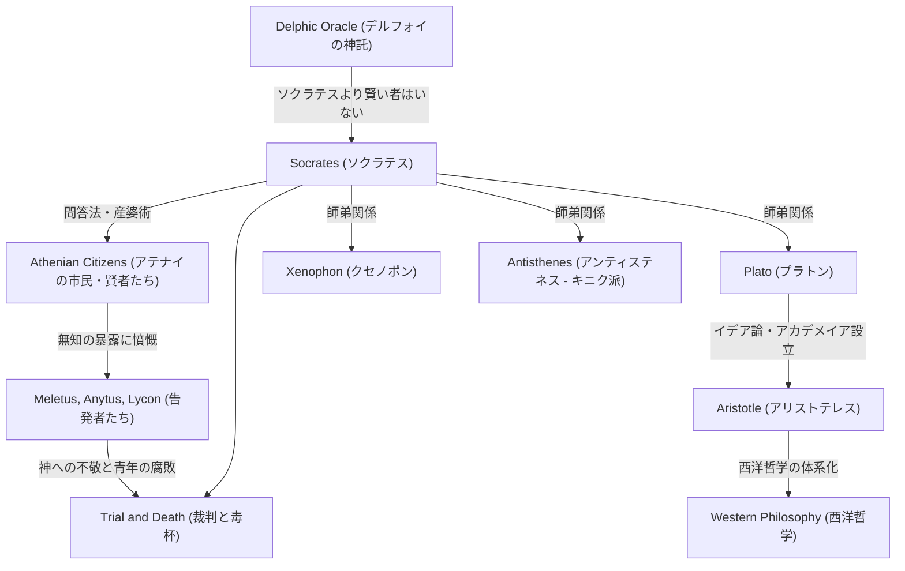

西洋哲学の基礎を築いた偉大なる思想家、ソクラテス（紀元前470年頃 – 紀元前399年）。彼は自ら一冊の著作も残さなかったにもかかわらず、弟子のプラトンやクセノポンらの記した対話篇を通じて、その思想と強烈な生き様を現代に伝えています。「無知の知」や「問答法」といった彼のアプローチは、単なる知識の探求にとどまらず、いかにして善く生きるかという人類普遍の問いに対する強烈なアンチテーゼでもありました。本記事では、古代アテナイの街角で若者たちと対話を重ねたソクラテスの生涯と、彼が後世に与えた計り知れない影響について深く掘り下げます。

## 石工の子から街頭の哲学者へ

ソクラテスは、彫刻家（あるいは石工）の父ソプロニスコスと、産婆の母パイナレテの間に生まれました。青年期には父の跡を継いで石工として働いていたとも伝えられますが、やがて哲学的な探求へとその身を投じるようになります。彼はペロポネソス戦争において、ポテイダイアの戦いやデリオンの戦いに重装歩兵として従軍し、その類まれな忍耐力と勇気で同胞から称賛されました。

彼の人生を決定づけたのは、友人カイレポンがもたらした「デルフォイの神託」です。カイレポンがアポロンの神殿で「ソクラテスより賢い者はいるか」と尋ねたところ、巫女は「ソクラテスより賢い者はいない」と答えました。自らの無知を自覚していたソクラテスは、この神託の意味を解き明かすため、当時のアテナイで「賢者」とされていた政治家や詩人、職人たちを次々と訪ね、対話を試みます。

## 「無知の知」と魂の配慮

賢者たちとの対話を通じてソクラテスが気付いたのは、彼らが「本当は知らないのに、知っていると思い込んでいる」という事実でした。これに対し、ソクラテス自身は「自分は知らないということを知っている」という点で、彼らよりもわずかに賢いのだという結論に至ります。これが有名な**「無知の知（不知の自覚）」**です。

ソクラテスの探求方法は、相手に問いを投げかけ、その矛盾を自覚させる「問答法（エレンコス）」でした。彼は自らを、人々の心の中にある真理を産み出させる「産婆」に例え、この手法は後に「産婆術」とも呼ばれました。彼が何よりも重視したのは、富や名誉ではなく「魂をできるだけ優れたものにすること」、すなわち**「魂の配慮」**でした。真の徳（アレテー）は知から生まれるとし、知行合一を説いた彼の哲学は、倫理学の出発点とも言えます。

## 思想と人脈の相関図

ソクラテスの思想がいかに形成され、受け継がれていったのか。以下の図解は、彼の哲学的な系譜と周囲の人物との関係性を示しています。

## 裁判と死：毒杯を仰いだ理由

ソクラテスの執拗な問答は、アテナイの有力者たちのプライドを傷つけ、多くの敵を作りました。紀元前399年、彼は「国家が認める神々を信じず、新しい神格（ダイモニオン）を導入し、青年を腐敗させている」という罪状で告発されます。

法廷において、彼は自らの行動が神の使命に基づくものであると堂々と弁明（ソクラテスの弁明）しましたが、結果として死刑判決を受けます。弟子たちは脱獄を強く勧めましたが、ソクラテスは「悪には悪をもって報いてはならない」「国家の法に従うことこそが正義である」としてこれを拒否しました。彼は最後まで自らの信念と哲学を曲げることなく、平静な態度で毒人参の杯をあおり、その生涯を閉じました。

## 後世への影響と現代における意義

ソクラテスの死は、愛弟子プラトンに多大な衝撃を与えました。プラトンは師の教えを継承し、さらに発展させて独自の「イデア論」を構築します。また、アリストテレスへと続くこの思想の系譜は、西洋哲学の巨大な大河となりました。

現代においても、ソクラテスの「対話」を重んじる姿勢は、教育におけるアクティブ・ラーニングや、ビジネスにおけるコーチングの手法（ソクラテス・メソッド）として息づいています。「吟味されない人生は生きるに値しない」という彼の言葉は、情報が氾濫し、表面的な知識で満足してしまいがちな現代人にこそ、鋭く突き刺さる真理と言えるでしょう。ソクラテスが命を懸けて探求した「いかに生きるべきか」という問いは、時代を超えて私たちの魂を揺さぶり続けています。
