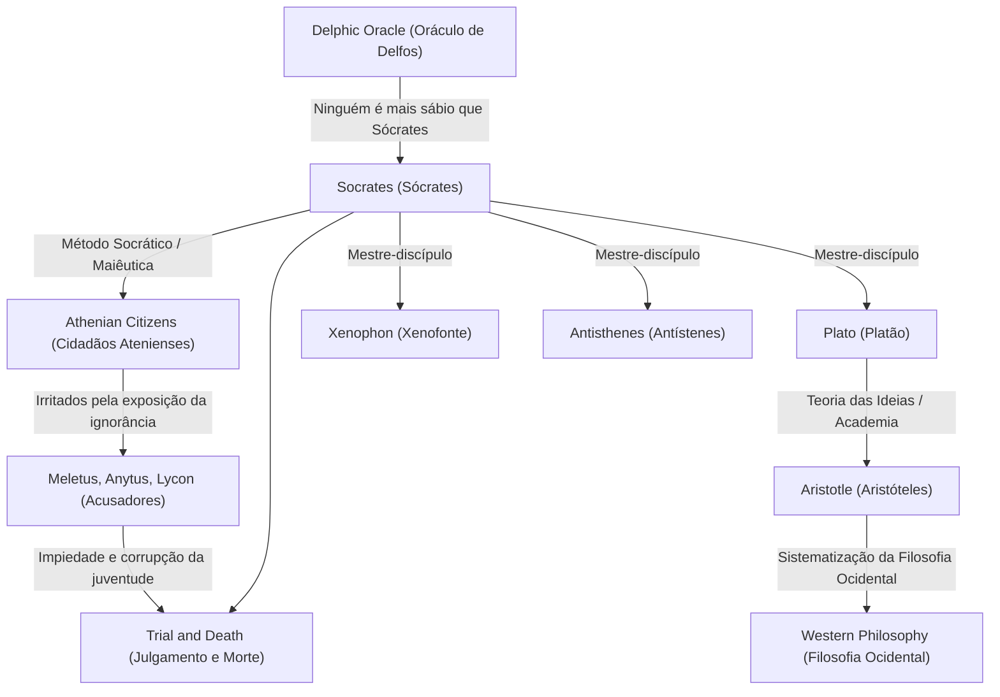

Sócrates (c. 470 a.C. – 399 a.C.), o grande pensador que lançou as bases da filosofia ocidental. Embora nunca tenha deixado uma única obra escrita, seus pensamentos e seu intenso modo de vida foram transmitidos à era moderna através dos diálogos escritos por seus discípulos, como Platão e Xenofonte. Suas abordagens, como a "Sabedoria da Ignorância" e o "Método Socrático", não eram meramente uma busca por conhecimento, mas uma poderosa antítese à questão humana universal de como viver uma vida boa. Este artigo investiga profundamente a vida de Sócrates, que se envolveu repetidamente em diálogos com jovens nas esquinas da antiga Atenas, e a imensurável influência que ele teve nas gerações futuras.

## De Filho de Pedreiro a Filósofo de Rua

Sócrates nasceu de Sofronisco, um escultor (ou pedreiro), e Fenareta, uma parteira. Diz-se que em sua juventude trabalhou como pedreiro seguindo os passos de seu pai, mas acabou se dedicando à investigação filosófica. Ele serviu como hoplita na Guerra do Peloponeso, nas batalhas de Potideia e Délio, onde foi elogiado por seus compatriotas por sua extraordinária resistência e coragem.

O ponto de virada em sua vida foi o "Oráculo de Delfos" trazido por seu amigo Querefonte. Quando Querefonte perguntou no Templo de Apolo: "Existe alguém mais sábio do que Sócrates?", a sacerdotisa respondeu: "Não há ninguém mais sábio do que Sócrates." Consciente de sua própria ignorância, Sócrates visitou políticos, poetas e artesãos que eram considerados "homens sábios" em Atenas na época, tentando diálogos para desvendar o significado deste oráculo.

## "Sabedoria da Ignorância" e o Cuidado da Alma

Através de seus diálogos com os sábios, Sócrates percebeu o fato de que eles "pensavam que sabiam, quando na realidade não sabiam". Em contraste, Sócrates concluiu que ele era um pouco mais sábio do que eles porque "sabia que não sabia". Esta é a famosa **"Sabedoria da Ignorância" (Consciência da Ignorância)**.

O método de investigação de Sócrates era o "Método Socrático" (Elenchus), que envolvia fazer perguntas ao interlocutor para torná-los conscientes de suas contradições. Ele se comparava a uma "parteira" que ajuda a dar à luz a verdade dentro das mentes das pessoas, um método mais tarde chamado de "maiêutica". O que ele valorizava acima de tudo não era a riqueza ou a honra, mas "tornar a alma tão excelente quanto possível" - a saber, o **"cuidado da alma"**. Sua filosofia, que argumentava que a verdadeira virtude (areté) vem do conhecimento e pregava a unidade de conhecimento e ação, pode ser vista como o ponto de partida da ética.

## Gráfico de Correlação de Pensamentos e Conexões

Como o pensamento de Sócrates foi formado e herdado? O diagrama abaixo ilustra sua linhagem filosófica e relacionamentos com as pessoas ao seu redor.

## Julgamento e Morte: A Razão para Beber a Cicuta

Os persistentes questionamentos de Sócrates feriram o orgulho das figuras influentes em Atenas e o fizeram muitos inimigos. Em 399 a.C., ele foi acusado de "não acreditar nos deuses reconhecidos pelo Estado, introduzir novas divindades (daimonion) e corromper a juventude".

No tribunal, ele se defendeu ousadamente (A Apologia de Sócrates), alegando que suas ações baseavam-se em uma missão divina, mas como resultado, foi condenado à morte. Seus discípulos insistiram fortemente para que ele escapasse da prisão, mas Sócrates recusou, afirmando: "Não se deve retribuir o mal com o mal" e "Obedecer às leis do Estado é justiça". Ele nunca comprometeu suas crenças e filosofia até o fim, bebeu calmamente o cálice de cicuta e encerrou sua vida.

## Influência nas Gerações Futuras e Significado Hoje

A morte de Sócrates causou um tremendo choque ao seu amado discípulo Platão. Platão herdou os ensinamentos de seu mestre, desenvolveu-os ainda mais e construiu sua única "Teoria das Ideias". Além disso, esta linhagem de pensamento que leva a Aristóteles tornou-se um enorme rio da filosofia ocidental.

Mesmo hoje, a atitude de Sócrates de valorizar o "diálogo" vive como aprendizado ativo na educação e métodos de coaching nos negócios (Método Socrático). Suas palavras, "A vida não examinada não vale a pena ser vivida", podem ser consideradas uma verdade afiada que perfura as pessoas modernas, que tendem a ficar satisfeitas com conhecimentos superficiais em uma enchente transbordante de informações. A questão de "como se deve viver", que Sócrates explorou com o risco de sua vida, continua a abalar nossas almas através dos tempos.
