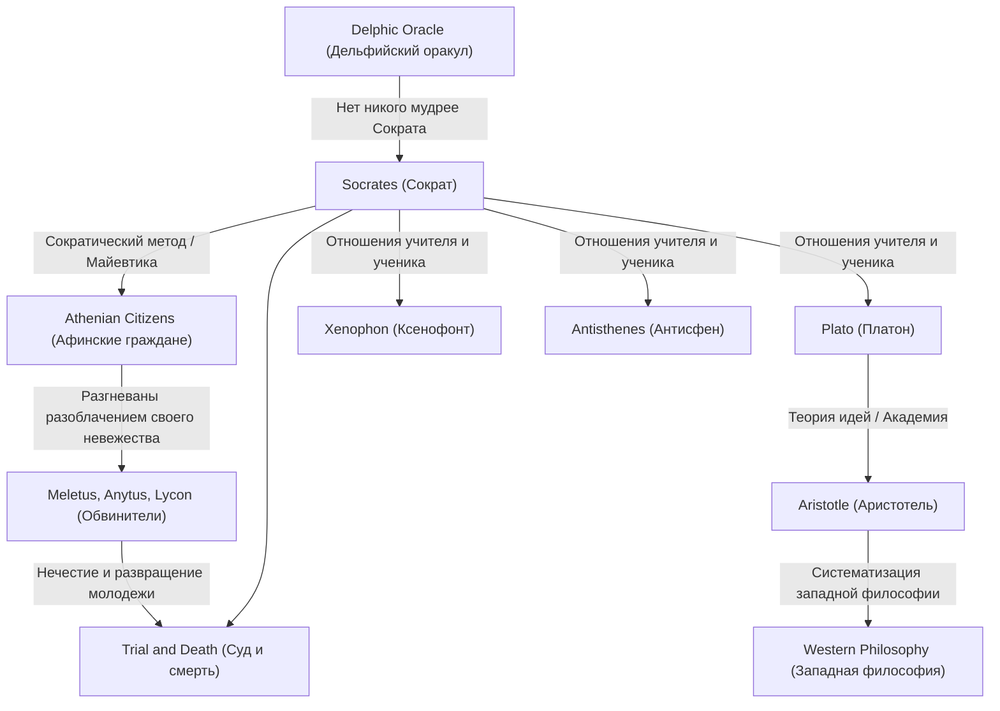

Сократ (ок. 470 до н.э. – 399 до н.э.) — великий мыслитель, заложивший основы западной философии. Хотя сам он не оставил ни одного письменного труда, его мысли и напряженный образ жизни дошли до современности через диалоги, написанные его учениками, такими как Платон и Ксенофонт. Его подходы, такие как «Мудрость незнания» и «Сократический метод», были не просто стремлением к знаниям, но мощным антитезисом к универсальному человеческому вопросу о том, как прожить хорошую жизнь. Эта статья глубоко погружается в жизнь Сократа, который раз за разом вступал в диалоги с молодежью на улицах древних Афин, и в то неизмеримое влияние, которое он оказал на будущие поколения.

## От сына каменотеса до уличного философа

Сократ родился в семье Софрониска, скульптора (или каменотеса), и Фенареты, повитухи. Говорят, что в юности он работал каменотесом, идя по стопам отца, но в конце концов посвятил себя философским исследованиям. Он служил гоплитом в Пелопоннесской войне, в битвах при Потидее и Делии, где его соотечественники хвалили его за необычайную выносливость и мужество.

Поворотным моментом в его жизни стал «Дельфийский оракул», о котором рассказал его друг Херефонт. Когда Херефонт спросил в храме Аполлона: «Есть ли кто-нибудь мудрее Сократа?», жрица ответила: «Нет никого мудрее Сократа». Осознавая собственное невежество, Сократ посещал политиков, поэтов и ремесленников, которые считались в то время «мудрецами» в Афинах, пытаясь вести с ними диалоги, чтобы разгадать смысл этого пророчества.

## «Мудрость незнания» и забота о душе

Через свои диалоги с мудрецами Сократ осознал тот факт, что они «думали, что знают, тогда как на самом деле не знали». В отличие от них, Сократ пришел к выводу, что он немного мудрее их, потому что «знал, что ничего не знает». Это и есть знаменитая **«Мудрость незнания» (осознание своего невежества)**.

Методом исследования Сократа был «сократический метод» (эленхос), который заключался в том, чтобы задавать вопросы собеседнику, заставляя его осознать свои противоречия. Он сравнивал себя с «повитухой», помогающей рождению истины в умах людей — этот метод позже назвали «майевтикой». То, что он ценил превыше всего, было не богатство или почести, а стремление «сделать душу как можно лучше» — то есть **«забота о душе»**. Его философия, утверждавшая, что истинная добродетель (арете) происходит от знания, и проповедовавшая единство знания и действия, может рассматриваться как отправная точка этики.

## Схема взаимосвязей идей и знакомств

Как формировалась и наследовалась мысль Сократа? Приведенная ниже диаграмма иллюстрирует его философскую родословную и отношения с окружающими людьми.

## Суд и смерть: Почему он выпил чашу с ядом

Настойчивые вопросы Сократа уязвляли гордость влиятельных фигур Афин и нажили ему множество врагов. В 399 году до н.э. его обвинили в том, что он «не верит в богов, признанных государством, вводит новые божества (даймоний) и развращает юношество».

На суде он смело защищал себя («Апология Сократа»), утверждая, что его действия основаны на божественной миссии, но в результате был приговорен к смертной казни. Ученики настоятельно убеждали его бежать из тюрьмы, но Сократ отказался, заявив: «Нельзя отвечать злом на зло» и «Повиновение законам государства есть справедливость». Он до самого конца не изменил своим убеждениям и философии, спокойно выпил чашу с цикутой и завершил свою жизнь.

## Влияние на будущие поколения и значение в наши дни

Смерть Сократа стала огромным потрясением для его любимого ученика Платона. Платон унаследовал учения своего наставника, развил их дальше и создал свою уникальную «теорию идей». Более того, эта линия мысли, ведущая к Аристотелю, превратилась в огромную реку западной философии.

Даже сегодня отношение Сократа, ценящее «диалог», продолжает жить как активное обучение в образовании и методы коучинга в бизнесе (сократический метод). Его слова «Неисследованная жизнь не стоит того, чтобы ее жить» можно назвать острой истиной, пронзающей современных людей, которые склонны довольствоваться поверхностными знаниями в переполненном потоке информации. Вопрос «как следует жить», который Сократ исследовал, рискуя своей жизнью, продолжает волновать наши души сквозь века.
