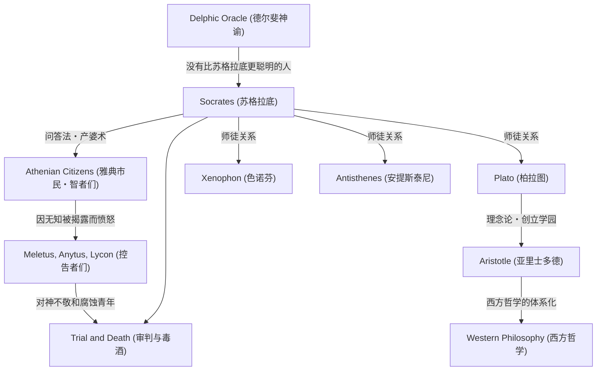

苏格拉底（约公元前470年 – 公元前399年）是奠定西方哲学基础的伟大思想家。尽管他本人没有留下任何著作，但他通过弟子柏拉图和色诺芬等人的对话录，将他的思想和强烈的生活方式流传至今。“无知之知”和“问答法”等他的方法，不仅仅是对知识的追求，更是对人类如何过上美好生活这一普遍问题的强烈反思。本文将深入探讨在古雅典街头与年轻人反复对话的苏格拉底的一生，以及他对后世产生的不可估量的影响。

## 从石匠之子到街头哲学家

苏格拉底出生于雕刻家（或石匠）父亲索佛洛尼斯库斯和助产士母亲费娜瑞特之间。据说青年时期他曾继承父业作为石匠工作，但最终投身于哲学探索。他曾在伯罗奔尼撒战争中，作为重装步兵参加了波提狄亚战役和德里昂战役，并以其非凡的忍耐力和勇气受到同胞的赞扬。

决定他一生的是朋友凯勒丰带来的“德尔斐神谕”。当凯勒丰在阿波罗神庙问“有没有比苏格拉底更聪明的人”时，女祭司回答说“没有比苏格拉底更聪明的人了”。意识到自己无知的苏格拉底，为了解开这个神谕的含义，陆续拜访了当时在雅典被称为“智者”的政治家、诗人和工匠，尝试与他们对话。

## “无知之知”与灵魂的关怀

通过与智者们的对话，苏格拉底发现了一个事实：他们“其实并不知道，却自以为知道”。相比之下，苏格拉底得出结论，正是因为他“知道自己不知道”，所以比他们稍微聪明一点。这就是著名的<strong>“无知之知”（对无知的自知）</strong>。

苏格拉底的探索方法是向对方提出问题，让他们意识到自己矛盾的“问答法”（Elenchus）。他把自己比作帮助人们在心中产出真理的“接生婆”，这种方法后来也被称为“产婆术”。他最看重的不是财富或荣誉，而是“使灵魂尽可能变得优秀”，即<strong>“灵魂的关怀”</strong>。他的哲学主张真正的美德（arete）来自知识，并宣扬知行合一，可以说这正是伦理学的起点。

## 思想与人脉的关联图

苏格拉底的思想是如何形成并被继承的呢？下面的图解展示了他的哲学谱系以及与周围人物的关系。

## 审判与死亡：饮下毒酒的理由

苏格拉底执着的问答伤害了雅典权贵们的自尊心，树立了许多敌人。公元前399年，他被控告“不信奉国家认可的神，引入新神（daimonion），并腐蚀青年”。

在法庭上，他堂堂正正地为自己辩护（苏格拉底的申辩），声称自己的行为是基于神的使命，但结果还是被判处死刑。弟子们强烈建议他越狱，但苏格拉底以“不能以恶报恶”“服从国家法律才是正义”为由予以拒绝。他直到最后也没有违背自己的信念和哲学，平静地喝下了毒芹汁，结束了自己的一生。

## 对后世的影响及现代意义

苏格拉底之死给他的爱徒柏拉图带来了巨大的冲击。柏拉图继承了恩师的教诲，进一步发展并构建了自己独特的“理念论”。此外，这条延续至亚里士多德的思想谱系，成为了西方哲学的一条巨大长河。

即使在现代，苏格拉底重视“对话”的态度，依然作为教育中的主动学习和商业中的教练方法（苏格拉底教学法）而存在。“未经验证的人生是不值得过的”这句名言，对于在信息泛滥中容易满足于表面知识的现代人来说，可以说是一个直击心灵的真理。苏格拉底拼上性命探索的“应该如何生活”这一问题，跨越时代，继续震撼着我们的灵魂。
