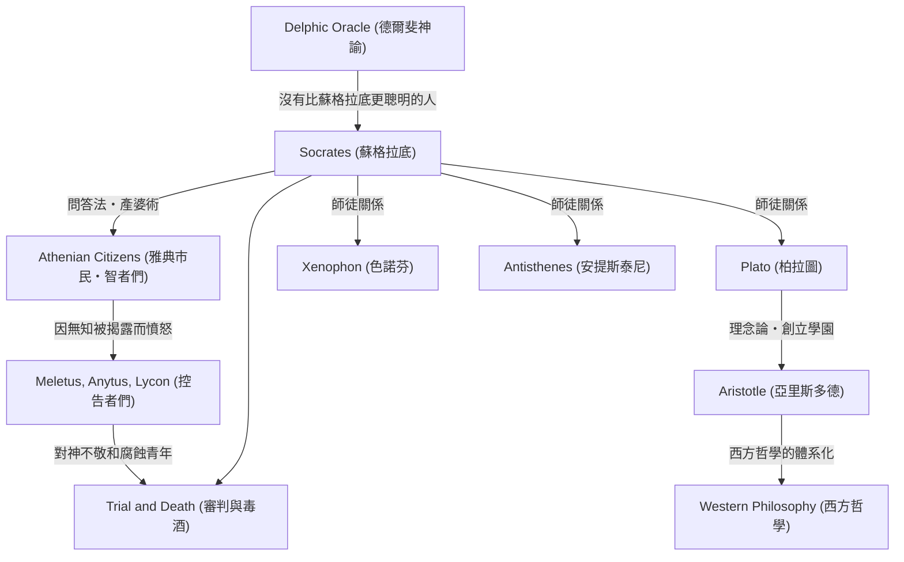

蘇格拉底（約公元前470年 – 公元前399年）是奠定西方哲學基礎的偉大思想家。儘管他本人沒有留下任何著作，但他透過弟子柏拉圖和色諾芬等人的對話錄，將他的思想和強烈的生活方式流傳至今。「無知之知」和「問答法」等他的方法，不僅僅是對知識的追求，更是對人類如何過上美好生活這一普遍問題的強烈反思。本文將深入探討在古雅典街頭與年輕人反覆對話的蘇格拉底的一生，以及他對後世產生的不可估量的影響。

## 從石匠之子到街頭哲學家

蘇格拉底出生於雕刻家（或石匠）父親索佛洛尼斯庫斯和助產士母親費娜瑞特之間。據說青年時期他曾繼承父業作為石匠工作，但最終投身於哲學探索。他曾在伯羅奔尼撒戰爭中，作為重裝步兵參加了波提狄亞戰役和德里昂戰役，並以其非凡的忍耐力和勇氣受到同胞的讚揚。

決定他一生的是朋友凱勒豐帶來的「德爾斐神諭」。當凱勒豐在阿波羅神廟問「有沒有比蘇格拉底更聰明的人」時，女祭司回答說「沒有比蘇格拉底更聰明的人了」。意識到自己無知的蘇格拉底，為了解開這個神諭的含義，陸續拜訪了當時在雅典被稱為「智者」的政治家、詩人和工匠，嘗試與他們對話。

## 「無知之知」與靈魂的關懷

透過與智者們的對話，蘇格拉底發現了一個事實：他們「其實並不知道，卻自以為知道」。相比之下，蘇格拉底得出結論，正是因為他「知道自己不知道」，所以比他們稍微聰明一點。這就是著名的**「無知之知」（對無知的自知）**。

蘇格拉底的探索方法是向對方提出問題，讓他們意識到自己矛盾的「問答法」（Elenchus）。他把自己比作幫助人們在心中產出真理的「接生婆」，這種方法後來也被稱為「產婆術」。他最看重的不是財富或榮譽，而是「使靈魂盡可能變得優秀」，即**「靈魂的關懷」**。他的哲學主張真正的美德（arete）來自知識，並宣揚知行合一，可以說這正是倫理學的起點。

## 思想與人脈的關聯圖

蘇格拉底的思想是如何形成並被繼承的呢？下面的圖解展示了他的哲學譜系以及與周圍人物的關係。

## 審判與死亡：飲下毒酒的理由

蘇格拉底執著的問答傷害了雅典權貴們的自尊心，樹立了許多敵人。公元前399年，他被控告「不信奉國家認可的神，引入新神（daimonion），並腐蝕青年」。

在法庭上，他堂堂正正地為自己辯護（蘇格拉底的申辯），聲稱自己的行為是基於神的使命，但結果還是被判處死刑。弟子們強烈建議他越獄，但蘇格拉底以「不能以惡報惡」「服從國家法律才是正義」為由予以拒絕。他直到最後也沒有違背自己的信念和哲學，平靜地喝下了毒芹汁，結束了自己的一生。

## 對後世的影響及現代意義

蘇格拉底之死給他的愛徒柏拉圖帶來了巨大的衝擊。柏拉圖繼承了恩師的教誨，進一步發展並構建了自己獨特的「理念論」。此外，這條延續至亞里斯多德的思想譜系，成為了西方哲學的一條巨大長河。

即使在現代，蘇格拉底重視「對話」的態度，依然作為教育中的主動學習和商業中的教練方法（蘇格拉底教學法）而存在。「未經驗證的人生是不值得過的」這句名言，對於在信息氾濫中容易滿足於表面知識的現代人來說，可以說是一個直擊心靈的真理。蘇格拉底拼上性命探索的「應該如何生活」這一問題，跨越時代，繼續震撼著我們的靈魂。
