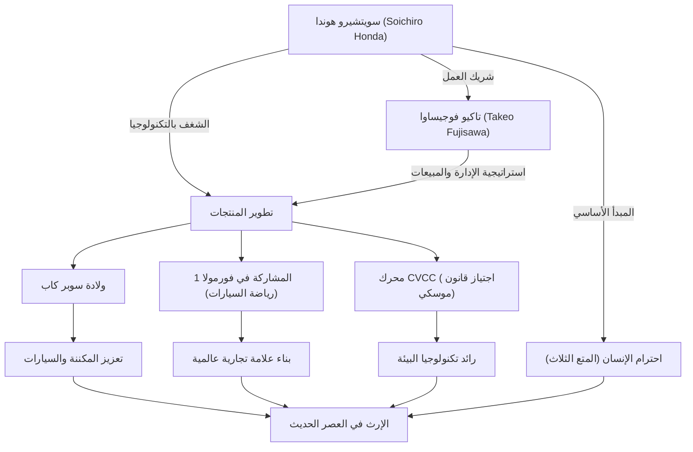

سويتشيرو هوندا، الرجل الذي يرمز إلى التصنيع الياباني وأسس شركة "هوندا" العالمية في جيل واحد. تميزت حياته بالسعي اللامتناهي للتكنولوجيا والروح التي لا تقهر والتي اتخذت من "الأحلام" قوة دافعة لها. في هذا المقال، سنتعمق في حياة هذا الرجل الذي تحول من مجرد ميكانيكي إصلاح إلى مؤسس شركة HONDA العالمية، وفلسفته الفريدة، والإرث الذي تناقلته الأجيال حتى يومنا هذا.

## الانطلاق من ميكانيكي إصلاح: الشغف بالآلات

وُلد سويتشيرو هوندا في عام 1906 (العام 39 من فترة ميجي) كابن أكبر لأسرة حداد في مقاطعة إيواتا بمحافظة شيزوكا (مدينة تينريو حاليًا)، وقد أظهر اهتمامًا قويًا بالآلات منذ طفولته المبكرة. بعد أن سحَرته أحدث الآلات كالسيارات والطائرات، أنهى دراسته في المدرسة الابتدائية العليا وانتقل للعمل كمتدرب في ورشة إصلاح السيارات "آرت شوكاي" (Art Shokai) في طوكيو. هناك، أظهر براعته وفضوله الفطري، وتعلم أساسيات تكنولوجيا إصلاح السيارات من الصفر.

بعد أن استقل بعمله عن "آرت شوكاي"، سعى سويتشيرو إلى التحول من أعمال الإصلاح إلى التصنيع، فأسس شركة "توكاي سيكي للصناعات الثقيلة" (Tokai Seiki Heavy Industries) وبدأ في إنتاج حلقات المكبس. ومع ذلك، وبسبب نقص المعرفة النظرية، واجه في البداية جبالًا من المنتجات المعيبة وتجرع مرارة الفشل. لكنه لم يستسلم، وعاد لتعلم علم المعادن كطالب مستمع في مدرسة هاماماتسو الصناعية العليا (كلية الهندسة بجامعة شيزوكا حاليًا)، ونجح أخيرًا في تطوير حلقات مكبس عالية الجودة. أصبح هذا الموقف المتمثل في "التعلم من الفشل والجمع بين النظرية والتطبيق" نقطة البداية لفلسفته اللاحقة.

## "التكنولوجيا من أجل الناس": ولادة شركة هوندا موتور والتقدم السريع

بعد الحرب العالمية الثانية، وفي ظل اليابان المدمرة، شعر سويتشيرو بالحاجة الماسة للناس إلى وسائل تنقل. في عام 1946، افتتح معهد هوندا للأبحاث التقنية، وطوّر محرك "باتا باتا" من خلال تركيب محركات صغيرة كانت تُستخدم لأجهزة الراديو العسكرية الفائضة على الدراجات. حقق هذا نجاحًا كبيرًا، وفي عام 1948 أسس "شركة هوندا موتور المحدودة".

ما جعل عمله يزدهر بشكل هائل هو لقاؤه بعبقري الإدارة تاكيو فوجيساوا. من خلال تقسيم الأدوار الرائع، حيث ركز سويتشيرو على التطوير التكنولوجي بينما تولى فوجيساوا المبيعات والتمويل، حققت هوندا نموًا سريعًا. ساهم طراز "سوبر كاب" الذي تم إطلاقه في عام 1958 في تعزيز ثقافة السيارات في اليابان بفضل متانته وسهولة استخدامه وكفاءته الممتازة في استهلاك الوقود، وأصبح من أكثر السيارات مبيعًا تاريخيًا ولا يزال محبوبًا في جميع أنحاء العالم حتى يومنا هذا.

علاوة على ذلك، ولإثبات قدراته التكنولوجية للعالم، أعلن سويتشيرو المشاركة في سباق "جزيرة مان تي تي". في البداية، اصطدم بالحاجز العالمي، ولكن بعد تحسينات مستمرة، حقق انتصارًا ساحقًا وجعل اسم HONDA يتردد في جميع أنحاء العالم. بعد ذلك، استمر في تحقيق إنجازات غير مسبوقة تلو الأخرى، مثل دخول سوق السيارات ذات الأربع عجلات، والفوز في سباقات الفورمولا 1 (F1)، وتطوير محرك CVCC الذي كان أول محرك في العالم يجتاز لوائح الانبعاثات الأمريكية الصارمة (قانون موسكي).

## مخطط الارتباط بين الإنجازات والفلسفة

لا يرتبط نجاح سويتشيرو بقدراته التكنولوجية فحسب، بل يرتبط ارتباطًا معقدًا بالأشخاص الذين دعموه وفلسفته الفريدة. يوضح المخطط التالي مدى اتساع إنجازاته.

## الفلسفة الفريدة: "لا تخف من الفشل" و"المتع الثلاث"

عند الحديث عن سويتشيرو هوندا، لا يمكن إغفال العديد من الأقوال المأثورة والفلسفة التي تركها وراءه. فقد قال: "النجاح يمثل 1% وهو مدعوم بـ 99% من الفشل"، وحث موظفيه بقوة على خوض التحديات دون خوف من الفشل. لم يكن يلوم على الفشل، بل كان يكره عدم المحاولة على الإطلاق أكثر من أي شيء آخر.

بالإضافة إلى ذلك، تجسد فلسفة شركة هوندا المتمثلة في "المتع الثلاث (متعة الشراء، متعة البيع، ومتعة الابتكار)" روح احترام الإنسان لدى سويتشيرو. كان يعتقد أن التكنولوجيا ليست سوى وسيلة لجعل الناس سعداء، وأنه يجب أن تكون الشركة مكانًا يشعر فيه جميع المشاركين في المنتج بالمتعة. كان يحب ميدان العمل بشدة، وحتى بعد أن أصبح رئيسًا، كان يتجول في المصنع مرتديًا ملابس العمل (بدلة بيضاء) ويناقش بحماس مع الموظفين. تلك الصورة التي جعلت الجميع ينادونه بمودة "الرجل العجوز" (أوياجي)، كانت تجسد قائدًا ذو كاريزما عالية وإنسانية عميقة في الوقت ذاته.

## التأثير على الأجيال القادمة: استمرار "قوة الأحلام" (The Power of Dreams)

في عام 1973، تنحى سويتشيرو بشهامة عن الخطوط الأمامية للإدارة مع تاكيو فوجيساوا. وانطلاقًا من إيمانه بأن "الشركة ليست ملكًا لشخص"، لم يورث الإدارة لأي شخص، بل سلم الراية للأجيال القادمة. بعد تقاعده، قام بجولة على جميع وكالات البيع والمصانع في جميع أنحاء البلاد ليعبر عن امتنانه لكل موظف دعم هوندا لسنوات عديدة.

حتى بعد وفاته في عام 1991 عن عمر يناهز 84 عامًا، لا تزال روحه تنبض بقوة كحمض نووي (DNA) في شركة هوندا. فموقف هوندا المتمثل في الاستمرار في تحدي مجالات جديدة، مثل الروبوتات المتمثلة في أسيمو (ASIMO) ودخول مجال الطيران من خلال طائرة هوندا جيت، ما هو إلا امتداد "للحلم" الذي كان يراود سويتشيرو باستمرار.

لم يكن سويتشيرو هوندا مجرد مدير أو مخترع. لقد كان "مهندسًا شغوفًا" آمن بقوة التكنولوجيا على جعل المستحيل ممكنًا، وطارد حلمه في إثراء حياة الناس طوال حياته. لا يزال تاريخ التحديات والفلسفة التي تركها يمنحنا الكثير من الإلهام والشجاعة للعيش بقوة حتى في عالمنا المعاصر السريع التغير.
