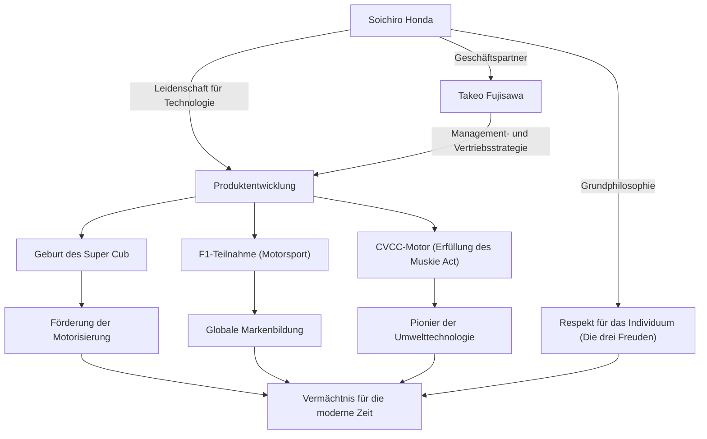

Soichiro Honda, der Mann, der die japanische Fertigungsindustrie (Monozukuri) symbolisiert und in einer Generation das Weltunternehmen "Honda" aufbaute. Sein Leben ist geprägt von einem endlosen Forscherdrang nach Technologie und einem unbeugsamen Geist, der von "Träumen" angetrieben wurde. In diesem Artikel tauchen wir tief in sein Leben ein – wie er aus einem einfachen Mechaniker das weltweite Unternehmen HONDA schuf, seine einzigartige Philosophie und das Vermächtnis, das in der modernen Zeit weiterlebt.

## Anfänge als Mechaniker: Die Leidenschaft für Maschinen

Geboren 1906 als ältester Sohn eines Schmieds in Iwata, Präfektur Shizuoka (dem heutigen Tenryu), zeigte Soichiro Honda schon in jungen Jahren ein starkes Interesse an Maschinen. Fasziniert von hochmodernen Maschinen wie Autos und Flugzeugen, ging er nach seinem Abschluss der Grund- und Hauptschule als Lehrling in die Autowerkstatt "Art Shokai" in Tokio. Hier nutzte er seine natürliche Geschicklichkeit und Neugier und erlernte die Fähigkeiten der Autoreparatur von Grund auf.

Nachdem er sich mit einer Zweigstelle von Art Shokai selbstständig gemacht hatte, vollzog Soichiro den Wechsel von der Reparatur- zur Fertigungsindustrie, gründete "Tokai Seiki Heavy Industry" und begann mit der Herstellung von Kolbenringen. Aufgrund mangelnder theoretischer Kenntnisse produzierte er jedoch anfangs einen Berg von fehlerhaften Produkten und erlebte Rückschläge. Dennoch gab er nicht auf, studierte erneut Metallurgie als Gasthörer an der Höheren Technischen Schule Hamamatsu (heute die Fakultät für Ingenieurwissenschaften der Universität Shizuoka) und war schließlich mit der Entwicklung hochwertiger Kolbenringe erfolgreich. Diese Haltung, "aus Fehlern zu lernen und Theorie und Praxis zu verbinden", wurde zum Ursprung seiner späteren Philosophie.

## "Technologie für die Menschen": Die Geburt und der rasante Aufstieg von Honda Motor Co., Ltd.

Nach dem Zweiten Weltkrieg, im kriegszerstörten Japan, spürte Soichiro das starke Bedürfnis der Menschen nach Fortbewegungsmitteln. 1946 eröffnete er das Honda Technical Research Institute und entwickelte das "Bata-Bata", ein Fahrrad, an dem er einen kleinen Motor für Funkgeräte aus den Beständen der ehemaligen Armee anbrachte. Dies wurde ein großer Hit und 1948 gründete er die "Honda Motor Co., Ltd.".

Was sein Geschäft sprunghaft ansteigen ließ, war die Begegnung mit dem Management-Genie Takeo Fujisawa. Durch die perfekte Arbeitsteilung, bei der Soichiro sich auf die technologische Entwicklung konzentrierte und Fujisawa den Vertrieb und die Finanzierung übernahm, wuchs Honda rasant. Das 1958 auf den Markt gebrachte "Super Cub" förderte durch seine Langlebigkeit, einfache Handhabung und hervorragenden Kraftstoffverbrauch die Motorisierung Japans und wurde zu einem historischen Weltbestseller, der bis heute auf der ganzen Welt geliebt wird.

Darüber hinaus kündigte Soichiro die Teilnahme an der "Isle of Man TT"-Rennserie an, um der Welt seine technologische Stärke zu beweisen. Anfangs stieß er auf weltweite Barrieren, aber nach ständigen Verbesserungen errang er einen vollständigen Sieg und machte den Namen HONDA weltweit bekannt. Danach vollbrachte er eine beispiellose Leistung nach der anderen, wie den Eintritt in den Automobilmarkt, Siege beim F1-Grand-Prix und die Entwicklung des CVCC-Motors, der als erster weltweit die strengen US-Abgasvorschriften (Muskie Act) erfüllte.

## Korrelationsdiagramm von Errungenschaften und Philosophie

Soichiros Erfolg ist nicht nur auf seine technologische Kompetenz zurückzuführen, sondern auch auf ein komplexes Geflecht von Menschen, die ihn unterstützten, und seiner einzigartigen Philosophie. Das folgende Diagramm zeigt die Reichweite seiner Errungenschaften.

## Einzigartige Philosophie: "Keine Angst vor dem Scheitern" und "Die drei Freuden"

Wenn man über Soichiro Honda spricht, sind die zahlreichen Zitate und die Philosophie, die er hinterlassen hat, unverzichtbar. Er sagte: "Erfolg ist 1 %, das auf 99 % Misserfolg aufbaut", und forderte seine Mitarbeiter nachdrücklich auf, Herausforderungen anzunehmen, ohne Angst vor dem Scheitern zu haben. Er kritisierte nicht das Scheitern, sondern verabscheute es am meisten, es gar nicht erst zu versuchen.

Darüber hinaus verkörpert die Unternehmensphilosophie von Honda, "Die drei Freuden" (Die Freude am Kaufen, die Freude am Verkaufen, die Freude am Erschaffen), Soichiros Geist des Respekts vor dem Individuum. Es ist die Überzeugung, dass Technologie letztendlich ein Mittel ist, um Menschen glücklich zu machen, und dass das Unternehmen ein Ort sein muss, an dem jeder, der mit dem Produkt zu tun hat, Freude empfindet. Er liebte die Arbeit vor Ort zutiefst; selbst als Präsident lief er in Arbeitskleidung (einem weißen Overall) durch die Fabrik und diskutierte leidenschaftlich mit den Mitarbeitern. Er wurde liebevoll "Oyaji" (Vater/Alter Herr) genannt und war eine charismatische, aber sehr menschliche Führungspersönlichkeit.

## Einfluss auf die Nachwelt: "The Power of Dreams" wird weitergegeben

1973 traten Soichiro und Takeo Fujisawa gnädig aus der vordersten Front des Managements zurück. In der Überzeugung, dass "ein Unternehmen nicht das Eigentum einer Einzelperson ist", machten sie ohne jegliche Erbfolge Platz für die nächste Generation. Nach seiner Pensionierung besuchte er Händler und Fabriken im ganzen Land, um jedem einzelnen Mitarbeiter zu danken, der Honda über viele Jahre unterstützt hatte.

Auch nach seinem Tod im Jahr 1991 im Alter von 84 Jahren lebt sein Geist als Hondas DNA weiter. Hondas ständige Bereitschaft, sich neuen Bereichen zu stellen, wie z.B. die Robotik, vertreten durch ASIMO, und der Einstieg ins Flugzeuggeschäft mit dem HondaJet, ist eine Fortsetzung des "Traums", an dem Soichiro festhielt.

Soichiro Honda war nicht nur ein einfacher Manager oder Erfinder. Er war ein "leidenschaftlicher Ingenieur", der an die Kraft der Technologie glaubte, das Unmögliche möglich zu machen, und sein ganzes Leben lang den Traum verfolgte, das Leben der Menschen zu bereichern. Seine Geschichte der Herausforderungen und seine Philosophie geben uns auch in der heutigen, sich schnell verändernden Zeit weiterhin wichtige Hinweise und Mut zum Leben.
