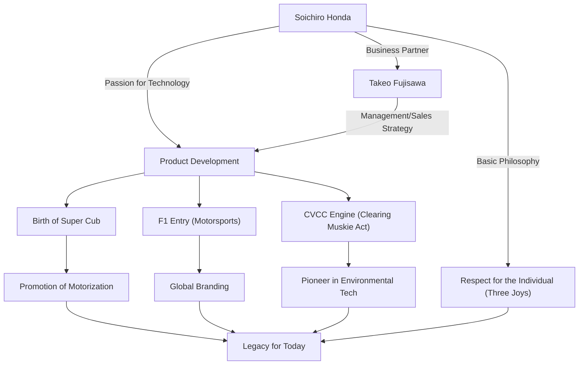

Soichiro Honda, the man who built the global company "Honda" in a single generation and symbolizes Japanese manufacturing. His life is colored by an endless spirit of inquiry into technology and an indomitable spirit fueled by "dreams." This article delves deeply into the life of the man who went from being a mere mechanic to creating the global HONDA, his unique philosophy, and the legacy passed down to the present day.

## From a Mechanic's Start: A Passion for Machines

Born in 1906 (Meiji 39) as the eldest son of a blacksmith in Iwata-gun, Shizuoka Prefecture (now Tenryu City), Soichiro Honda showed a strong interest in machines from a young age. Captivated by cutting-edge machines such as cars and airplanes, after graduating from ordinary higher elementary school, he went to work as an apprentice at the "Art Shokai" automobile repair shop in Tokyo. Here, he demonstrated his innate dexterity and inquisitive mind, having the basics of auto repair technology drilled into him.

After gaining independence by setting up a branch of Art Shokai, Soichiro sought to transition from repair to manufacturing, establishing "Tokai Seiki Heavy Industry" to embark on manufacturing piston rings. However, due to a lack of theoretical knowledge, he initially produced a mountain of defective products and tasted failure. Even so, he did not give up, re-learning metal engineering as an auditing student at Hamamatsu Higher Technical School (now the Faculty of Engineering at Shizuoka University), and finally succeeded in developing high-quality piston rings. This attitude of "learning from failure and fusing theory with practice" became the starting point for his later philosophy.

## "Technology for the People": The Birth of Honda Motor Co., Ltd. and its Rapid Advance

In the burned-out fields of Japan after World War II, Soichiro sensed a strong need for transportation among the people. He opened the Honda Technical Research Institute in 1946 and developed the "Bata-bata," which attached a small engine for military radios (former army surplus) to a bicycle. This became a massive hit, and in 1948, he established "Honda Motor Co., Ltd."

What made his business take off was his encounter with the business genius Takeo Fujisawa. The perfect division of roles—Soichiro focusing on technological development and Fujisawa handling sales and financing—allowed Honda to grow rapidly. The "Super Cub," released in 1958, promoted Japan's motorization with its durability, ease of handling, and excellent fuel efficiency, becoming a historic mega-bestseller that is still loved around the world today.

Furthermore, to prove his technological prowess to the world, Soichiro declared his entry into the "Isle of Man TT Race." Although initially repelled by the world's wall, after relentless improvement, he achieved overall victory, making the name HONDA roar across the globe. After that, he achieved a series of unprecedented feats, including entering the four-wheel vehicle market, winning the F1 Grand Prix, and developing the CVCC engine, which was the first in the world to clear the strict U.S. emissions regulations (Muskie Act).

## Diagram of Achievements and Philosophy

Soichiro's success is intricately linked not only to his technological prowess but also to the people who supported him and his unique philosophy. The diagram below illustrates the expanse of his achievements.

## Unique Philosophy: "Don't Fear Failure" and "The Three Joys"

When talking about Soichiro Honda, the numerous quotes and philosophies he left behind are indispensable. He said, "Success represents the 1% of your work which results from the 99% that is called failure," strongly urging his employees to challenge themselves without fearing failure. He did not blame them for failing, but rather despised not trying anything at all.

Moreover, Honda's corporate philosophy, "The Three Joys (The Joy of Buying, The Joy of Selling, The Joy of Creating)," embodies Soichiro's spirit of respect for the individual. It is the belief that technology is merely a means to make people happy, and that a company must be one where everyone involved with its products can feel joy. He loved the frontline shop floor dearly; even after becoming president, he walked around the factory in work clothes (white coveralls) and engaged in heated discussions with employees. Affectionately called "Oyaji" (Old Man), he was a charismatic yet deeply human leader.

## Influence on Future Generations: Inheriting "The Power of Dreams"

In 1973, Soichiro gracefully retired from the front lines of management along with Takeo Fujisawa. Under the conviction that "a company is not an individual's property," he passed the torch to his successors without practicing any form of nepotism. After retiring, he toured dealerships and factories nationwide to personally express his gratitude to each and every employee who had supported Honda for many years.

Even after he passed away in 1991 at the age of 84, his spirit lives on robustly as Honda's DNA. Honda's stance of continuously challenging new areas, such as robotics represented by ASIMO and entry into the aircraft business with the HondaJet, lies on the extension of the "dream" that Soichiro continued to hold.

Soichiro Honda was not just a manager, nor just an inventor. He was a "passionate engineer" who believed in the power of technology to make the impossible possible and devoted his life to pursuing the dream of enriching people's lives. The history of challenges and philosophy he left behind continue to give us hints and courage to live strongly, even in our rapidly changing modern times.
