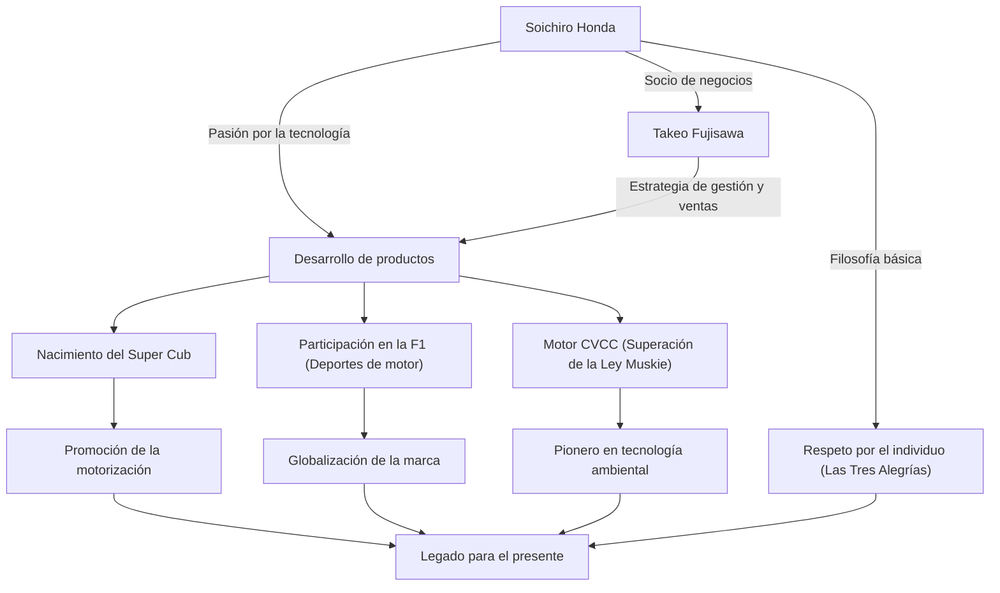

Soichiro Honda, el hombre que simboliza la manufactura japonesa y construyó la empresa global "Honda" en una sola generación. Su vida está marcada por una infinita curiosidad hacia la tecnología y un espíritu indomable impulsado por los "sueños". En este artículo, profundizaremos en su vida, su filosofía única y el legado que perdura hasta nuestros días, desde sus inicios como un simple mecánico hasta la creación de la marca global HONDA.

## Los inicios de un mecánico: Pasión por las máquinas

Nacido en 1906, como el hijo mayor de un herrero en el distrito de Iwata, prefectura de Shizuoka (actual ciudad de Tenryu), Soichiro Honda mostró un fuerte interés por las máquinas desde su infancia. Cautivado por las máquinas de última generación, como automóviles y aviones, tras graduarse de la escuela primaria superior, se fue a Tokio como aprendiz al taller de reparación de automóviles "Art Shokai". Aquí, demostró su destreza innata y su curiosidad, y aprendió los fundamentos de la tecnología de reparación de automóviles.

Tras independizarse de Art Shokai, Soichiro intentó pasar del negocio de las reparaciones a la manufactura, fundando "Tokai Seiki Heavy Industry" para fabricar anillos de pistón. Sin embargo, debido a la falta de conocimientos teóricos, al principio produjo una montaña de piezas defectuosas, sufriendo un gran revés. Aun así, no se rindió y volvió a estudiar metalurgia como estudiante oyente en la Escuela Superior de Industria de Hamamatsu (actual Facultad de Ingeniería de la Universidad de Shizuoka), y finalmente logró desarrollar anillos de pistón de alta calidad. Esta actitud de "aprender de los fracasos y combinar la teoría con la práctica" se convirtió en el punto de partida de su filosofía posterior.

## "La tecnología es para las personas": El nacimiento de Honda Motor Co. y su rápido avance

Después de la Segunda Guerra Mundial, en un Japón reducido a cenizas, Soichiro percibió una fuerte necesidad de medios de transporte para la gente. En 1946, inauguró el Instituto de Investigación Técnica de Honda, y desarrolló la "Bata-bata", una bicicleta con un pequeño motor de radio excedente del antiguo ejército. Esto fue un gran éxito, y en 1948 fundó "Honda Motor Co., Ltd.".

Lo que hizo despegar su negocio fue su encuentro con el genio de la gestión Takeo Fujisawa. La exquisita división de roles, donde Soichiro se concentraba en el desarrollo tecnológico y Fujisawa se encargaba de las ventas y la financiación, permitió a Honda crecer rápidamente. El "Super Cub", lanzado en 1958, impulsó la motorización de Japón gracias a su durabilidad, facilidad de manejo y excelente eficiencia de combustible, y se convirtió en un éxito de ventas histórico que aún hoy es amado en todo el mundo.

Además, Soichiro declaró la participación en el "Isle of Man TT Race" para demostrar su capacidad tecnológica al mundo. Aunque inicialmente fue rechazado por la competencia global, tras continuas mejoras, logró la victoria absoluta, haciendo resonar el nombre de HONDA en todo el mundo. Posteriormente, logró una serie de hazañas que rompieron los esquemas, como su entrada en el mercado de automóviles de cuatro ruedas, la victoria en la F1 y el desarrollo del motor CVCC, el primero en el mundo en superar las estrictas regulaciones de emisiones de EE. UU. (Ley Muskie).

## Correlación entre logros y filosofía

El éxito de Soichiro no se basa únicamente en sus habilidades tecnológicas, sino que está intrincadamente vinculado a las personas que lo apoyaron y a su filosofía única. El siguiente diagrama muestra el alcance de sus logros.

## Filosofía única: "No temas al fracaso" y "Las Tres Alegrías"

Al hablar de Soichiro Honda, son indispensables las numerosas citas y filosofías que dejó. Él solía decir: "El éxito es un 99% de fracaso", e instaba a sus empleados a asumir desafíos sin miedo a equivocarse. No reprochaba el fracaso, sino que detestaba por encima de todo el no intentar nada.

Además, la filosofía corporativa de Honda, "Las Tres Alegrías" (la alegría de comprar, la alegría de vender y la alegría de crear), encarna el espíritu de Soichiro del respeto por el individuo. Creía firmemente que la tecnología es un medio para hacer felices a las personas, y que una empresa debe ser un lugar donde todos los involucrados con el producto sientan alegría. Amaba profundamente el lugar de trabajo, e incluso siendo presidente, caminaba por la fábrica con ropa de trabajo (un mono blanco) y discutía apasionadamente con los empleados. Su figura, llamada cariñosamente "Oyaji" (padre/jefe), representaba a un líder carismático pero profundamente humano.

## Impacto en las generaciones futuras: El legado de "The Power of Dreams"

En 1973, Soichiro se retiró con elegancia de la primera línea de la dirección junto a Takeo Fujisawa. Bajo la convicción de que "la empresa no es propiedad de un individuo", no permitió ninguna sucesión hereditaria y cedió el paso a las nuevas generaciones. Tras su retiro, recorrió los concesionarios y fábricas de todo el país para expresar su gratitud a cada uno de los empleados que habían apoyado a Honda durante muchos años.

Incluso después de su fallecimiento en 1991 a los 84 años, su espíritu sigue vivo como el ADN de Honda. La actitud de Honda de seguir desafiando nuevas áreas de forma sucesiva, como la robótica representada por ASIMO y su entrada en la industria de la aviación con el HondaJet, es una extensión de los "sueños" que Soichiro siempre albergó.

Soichiro Honda no fue solo un gerente ni solo un inventor. Fue un "ingeniero apasionado" que creía en el poder de la tecnología para hacer posible lo imposible y que pasó su vida persiguiendo el sueño de enriquecer la vida de las personas. La historia de sus desafíos y su filosofía continúan brindándonos fuerza y coraje para vivir vigorosamente, incluso en el mundo actual que cambia rápidamente.
