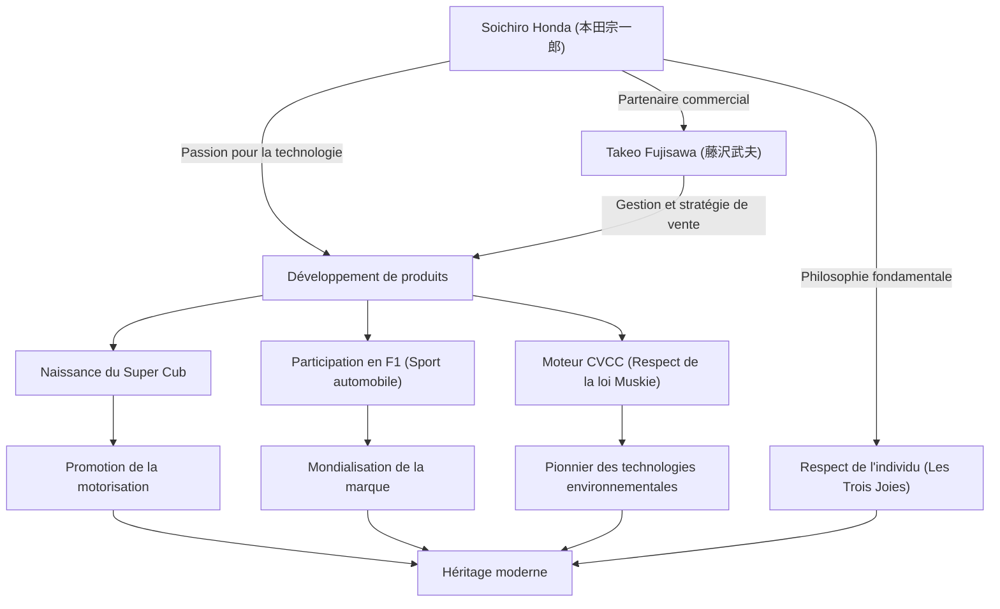

Symbole du savoir-faire japonais ("monozukuri") et homme ayant bâti l'entreprise mondiale "Honda" en une seule génération, Soichiro Honda a eu une vie marquée par une quête incessante de la technologie et un esprit indomptable animé par le "rêve". Dans cet article, nous plongerons dans la vie de cet homme passé de simple mécanicien à créateur de la marque mondiale HONDA, dans sa philosophie unique et dans l'héritage qui perdure aujourd'hui.

## De mécanicien à fondateur : une passion pour la mécanique

Né en 1906 (39e année de l'ère Meiji) en tant que fils aîné d'un forgeron dans le district d'Iwata, préfecture de Shizuoka (aujourd'hui la ville de Tenryu), Soichiro Honda a montré très tôt un vif intérêt pour la mécanique. Fasciné par les machines de pointe comme les automobiles et les avions, il a commencé à travailler comme apprenti dans un garage de réparation automobile de Tokyo, "Art Shokai", après avoir terminé l'école primaire supérieure. C'est là qu'il a mis à profit sa dextérité naturelle et sa curiosité, apprenant les bases de la réparation automobile.

Après s'être mis à son compte suite à une scission avec Art Shokai, Honda a cherché à passer de la réparation à la fabrication, en créant "Tokai Seiki Heavy Industry" pour fabriquer des segments de piston. Cependant, en raison d'un manque de connaissances théoriques, il a d'abord produit une montagne de pièces défectueuses et a connu des échecs. Sans se décourager, il est retourné étudier la métallurgie en tant qu'auditeur libre à l'École technique supérieure de Hamamatsu (actuelle faculté d'ingénierie de l'Université de Shizuoka), et a finalement réussi à développer des segments de piston de haute qualité. Cette attitude consistant à "apprendre de ses échecs et fusionner théorie et pratique" deviendra le point de départ de sa philosophie future.

## "La technologie au service de l'homme" : la naissance et l'essor de Honda Motor Co.

Après la Seconde Guerre mondiale, dans un Japon réduit en cendres, Honda a ressenti le fort besoin des gens pour un moyen de transport. En 1946, il fonde le Honda Technical Research Institute et développe le "Bata-bata", une bicyclette équipée d'un petit moteur de radio excédentaire de l'ancienne armée. Ce fut un énorme succès, ce qui a conduit à la création de "Honda Motor Co., Ltd." en 1948.

Ce qui a propulsé son entreprise, c'est sa rencontre avec un génie de la gestion, Takeo Fujisawa. Grâce à une excellente répartition des rôles, où Honda se concentrait sur le développement technologique et Fujisawa s'occupait des ventes et du financement, Honda a connu une croissance rapide. Le "Super Cub", lancé en 1958, a favorisé la motorisation du Japon grâce à sa durabilité, sa maniabilité et son excellente consommation de carburant, et reste aujourd'hui un énorme best-seller historique apprécié dans le monde entier.

De plus, pour prouver ses capacités technologiques au monde entier, Honda a annoncé sa participation au Tourist Trophy de l'île de Man. Bien qu'initialement repoussé par les obstacles mondiaux, il a finalement remporté la victoire absolue après des améliorations continues, rendant le nom HONDA célèbre dans le monde entier. Par la suite, il a accompli de grands exploits qui ont défié les conventions, comme l'entrée sur le marché de l'automobile, des victoires en Formule 1, et le développement du moteur CVCC, le premier au monde à respecter les strictes réglementations américaines sur les émissions (loi Muskie).

## Diagramme des corrélations entre réalisations et philosophie

Le succès de Honda ne repose pas seulement sur ses prouesses technologiques, mais aussi sur les personnes qui l'ont soutenu et sa philosophie unique, qui sont intimement liées. Le diagramme ci-dessous illustre l'étendue de ses réalisations.

## Une philosophie unique : "Ne craignez pas l'échec" et "Les Trois Joies"

On ne peut parler de Soichiro Honda sans évoquer les nombreuses citations et philosophies qu'il a laissées derrière lui. Il disait que "le succès représente 1 % de votre travail, qui résulte des 99 % qu'on appelle échecs", et exhortait ses employés à relever des défis sans avoir peur de l'échec. Il ne blâmait pas l'échec, mais détestait par-dessus tout l'inaction.

De plus, la philosophie d'entreprise de Honda, "Les Trois Joies (la joie d'acheter, la joie de vendre, la joie de créer)", incarne l'esprit de respect de l'individu prôné par Soichiro. Il croyait fermement que la technologie n'est qu'un moyen de rendre les gens heureux, et que l'entreprise devait apporter de la joie à tous ceux qui sont impliqués dans le produit. Il aimait le terrain par-dessus tout, et même en tant que président, il parcourait l'usine en tenue de travail (salopette blanche), discutant passionnément avec ses employés. Surnommé affectueusement "Oyaji" (le vieux), il était un leader charismatique mais extrêmement humain.

## Impact sur les générations futures : "The Power of Dreams" se perpétue

En 1973, Soichiro Honda, ainsi que Takeo Fujisawa, se retire gracieusement de la gestion de l'entreprise. Convaincu qu'une "entreprise n'est pas la propriété d'un individu", il n'a mis en place aucune succession héréditaire et a laissé la place à la génération suivante. Après sa retraite, il a visité les concessionnaires et les usines à travers le pays pour exprimer sa gratitude à chaque employé qui avait soutenu Honda au fil des ans.

Même après son décès en 1991 à l'âge de 84 ans, son esprit continue de vivre en tant qu'ADN de Honda. L'attitude de Honda qui continue de relever des défis dans de nouveaux domaines, tels que la robotique représentée par ASIMO, et l'entrée dans l'industrie aéronautique avec le HondaJet, est le prolongement du "rêve" que Soichiro a toujours chéri.

Soichiro Honda n'était ni un simple dirigeant ni un simple inventeur. C'était un "ingénieur passionné" qui croyait au pouvoir de la technologie pour rendre l'impossible possible, et qui a poursuivi le rêve d'enrichir la vie des gens tout au long de sa vie. Son histoire de défis et sa philosophie continuent de nous donner des conseils et du courage pour vivre avec force, même dans un monde moderne en évolution rapide.
