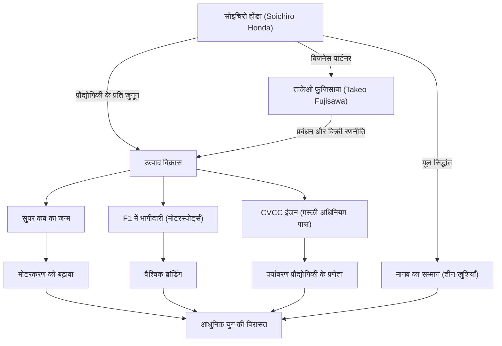

जापानी निर्माण (मोनोज़ुकुरी) के प्रतीक और वैश्विक कंपनी 'होंडा' को अपने दम पर खड़ा करने वाले व्यक्ति, सोइचिरो होंडा। उनका जीवन प्रौद्योगिकी के लिए अंतहीन खोज और 'सपनों' से प्रेरित एक अदम्य भावना से रंगा हुआ है। इस लेख में, हम उनके जीवन, जो एक साधारण मैकेनिक से शुरू होकर दुनिया की HONDA बनाने तक गया, उनके अद्वितीय दर्शन और आज भी जीवित उनकी विरासत पर गहराई से नज़र डालेंगे।

## एक मैकेनिक के रूप में शुरुआत: मशीनों के प्रति जुनून

1906 में, शिज़ुओका प्रान्त के इवाता जिले (अब तेनрю शहर) में एक लोहार के सबसे बड़े बेटे के रूप में जन्मे सोइचिरो होंडा ने बचपन से ही मशीनों में गहरी दिलचस्पी दिखाई। ऑटोमोबाइल और हवाई जहाज जैसी अत्याधुनिक मशीनों से मोहित होकर, उन्होंने प्राथमिक विद्यालय से स्नातक होने के बाद टोक्यो के एक ऑटोमोबाइल मरम्मत कारखाने 'आर्ट शोकाई' में अप्रेंटिस के रूप में काम करना शुरू किया। यहाँ उन्होंने अपनी स्वाभाविक निपुणता और जिज्ञासु स्वभाव का प्रदर्शन किया, और ऑटोमोबाइल मरम्मत की बुनियादी तकनीकों को सीखा।

आर्ट शोकाई से अलग होकर अपनी खुद की शाखा खोलने के बाद, सोइचिरो ने मरम्मत व्यवसाय से विनिर्माण व्यवसाय में संक्रमण की योजना बनाई और पिस्टन रिंग के निर्माण के लिए 'तोकाई सेकी हेवी इंडस्ट्रीज' की स्थापना की। हालांकि, सैद्धांतिक ज्ञान की कमी के कारण, शुरुआत में उन्होंने बहुत सारे खराब उत्पाद बनाए और असफलताओं का सामना किया। फिर भी उन्होंने हार नहीं मानी, और हमामात्सू हायर टेक्निकल स्कूल (वर्तमान में शिज़ुओका यूनिवर्सिटी फैकल्टी ऑफ़ इंजीनियरिंग) में एक श्रोता के रूप में मेटलर्जी (धातु विज्ञान) का फिर से अध्ययन किया, और अंततः उच्च गुणवत्ता वाले पिस्टन रिंग विकसित करने में सफल रहे। यह 'विफलता से सीखने, सिद्धांत और व्यवहार को मिलाने' का दृष्टिकोण उनके बाद के दर्शन का मूल बिंदु बन गया।

## 'प्रौद्योगिकी लोगों के लिए है': होंडा मोटर कंपनी का जन्म और तीव्र प्रगति

द्वितीय विश्व युद्ध के बाद, राख में तब्दील हो चुके जापान में, सोइचिरो ने लोगों के परिवहन के साधनों की मजबूत आवश्यकता को महसूस किया। 1946 में उन्होंने होंडा तकनीकी अनुसंधान संस्थान खोला, और पूर्व सेना के अधिशेष रेडियो के छोटे इंजनों को साइकिल पर लगाकर 'बाटाबाटा' विकसित किया। यह एक बड़ी हिट साबित हुई, और 1948 में उन्होंने 'होंडा मोटर कंपनी लिमिटेड' की स्थापना की।

उनके व्यवसाय को नई ऊंचाइयों पर ले जाने वाला पल प्रबंधन के प्रतिभाशाली ताकेओ फुजिसावा से उनकी मुलाकात थी। सोइचिरो ने तकनीकी विकास पर ध्यान केंद्रित किया, जबकि फुजिसावा ने बिक्री और धन उगाहने की जिम्मेदारी ली। भूमिकाओं के इस बेहतरीन बंटवारे ने होंडा को तेजी से बढ़ने में मदद की। 1958 में जारी 'सुपर कब', अपनी स्थायित्व, उपयोग में आसानी और उत्कृष्ट ईंधन दक्षता के कारण, जापानी मोटरकरण को आगे बढ़ाया और आज भी दुनिया भर में प्यार किया जाने वाला एक ऐतिहासिक बेस्टसेलर बन गया।

इसके अलावा, अपनी तकनीकी क्षमता को दुनिया के सामने साबित करने के लिए, सोइचिरो ने 'आइल ऑफ मैन टीटी रेस' में भाग लेने की घोषणा की। शुरुआत में उन्हें दुनिया की कड़ी प्रतिस्पर्धा का सामना करना पड़ा, लेकिन लगातार सुधार के बाद उन्होंने पूर्ण जीत हासिल की, और पूरी दुनिया में HONDA का नाम रोशन किया। उसके बाद, चार-पहिया बाजार में प्रवेश, F1 ग्रांड प्रिक्स में जीत, और दुनिया में पहली बार अमेरिका के सख्त उत्सर्जन नियमों (मस्की अधिनियम) को पूरा करने वाले CVCC इंजन का विकास जैसे कई अभूतपूर्व कारनामे किए।

## उपलब्धियों और दर्शन का सहसंबंध आरेख

सोइचिरो की सफलता केवल तकनीकी क्षमता का परिणाम नहीं थी, बल्कि यह उन लोगों से भी जटिल रूप से जुड़ी थी जिन्होंने उनका समर्थन किया और उनका अपना अनूठा दर्शन भी था। नीचे दिया गया आरेख उनकी उपलब्धियों के विस्तार को दर्शाता है।

## अद्वितीय दर्शन: 'असफलता से मत डरो' और 'तीन खुशियाँ'

सोइचिरो होंडा के बारे में बात करते समय उनके कई उद्धरणों और दर्शनों का उल्लेख करना आवश्यक है। उन्होंने कहा, 'सफलता 99% विफलता द्वारा समर्थित 1% है', और अपने कर्मचारियों से बिना डरे चुनौतियों का सामना करने का आग्रह किया। वह असफलता के लिए किसी को दोष देने के बजाय, किसी भी चीज़ को आज़माने से बचने को सबसे ज्यादा नापसंद करते थे।

इसके अलावा, होंडा का कॉर्पोरेट दर्शन 'तीन खुशियाँ (खरीदने की खुशी, बेचने की खुशी और बनाने की खुशी)' सोइचिरो के मानव सम्मान की भावना का प्रतीक है। उनका मानना था कि तकनीक लोगों को खुश करने का एक साधन मात्र है, और एक कंपनी ऐसी होनी चाहिए जहाँ उत्पाद से जुड़े सभी लोग खुशी महसूस करें। उन्हें काम करने की जगह से बहुत प्यार था, और राष्ट्रपति बनने के बाद भी वे सफ़ेद कवरॉल में कारखाने में घूमते थे और कर्मचारियों के साथ गर्मजोशी से बहस करते थे। 'ओयाजी' (पिता) के रूप में प्यार किए जाने वाले, उनका चित्र एक बहुत ही मानवीय नेता का था जो करिश्माई भी था।

## भविष्य की पीढ़ियों पर प्रभाव: विरासत में मिला 'द पावर ऑफ ड्रीम्स'

1973 में, सोइचिरो ने ताकेओ फुजिसावा के साथ शानदार ढंग से प्रबंधन की अग्रिम पंक्ति से संन्यास ले लिया। इस विश्वास के तहत कि 'एक कंपनी किसी व्यक्ति की संपत्ति नहीं है', उन्होंने कोई वंशानुगत उत्तराधिकार नहीं किया और अगली पीढ़ी के लिए रास्ता छोड़ दिया। सेवानिवृत्त होने के बाद, उन्होंने देश भर के डीलरों और कारखानों का दौरा किया और उन सभी कर्मचारियों का व्यक्तिगत रूप से धन्यवाद किया जिन्होंने इतने वर्षों तक होंडा का समर्थन किया था।

1991 में 84 वर्ष की आयु में उनके निधन के बाद भी, उनकी भावना होंडा के डीएनए में जीवित है। ASIMO जैसे रोबोटिक्स और होंडाजेट के माध्यम से विमानन व्यवसाय में प्रवेश, नए क्षेत्रों को चुनौती देने का होंडा का रवैया उसी 'सपने' का विस्तार है जिसे सोइचिरो ने हमेशा संजोया था।

सोइचिरो होंडा न केवल एक प्रबंधक थे और न ही केवल एक आविष्कारक। वह एक 'भावुक इंजीनियर' थे, जो तकनीक की उस शक्ति में विश्वास करते थे जो असंभव को संभव बनाती है, और जिन्होंने अपना पूरा जीवन लोगों के जीवन को समृद्ध बनाने के सपने को पूरा करने में लगा दिया। उनके द्वारा छोड़े गए चुनौतियों और दर्शन का इतिहास आज के तेजी से बदलते युग में भी हमें मजबूती से जीने के संकेत और साहस देता रहता है।
