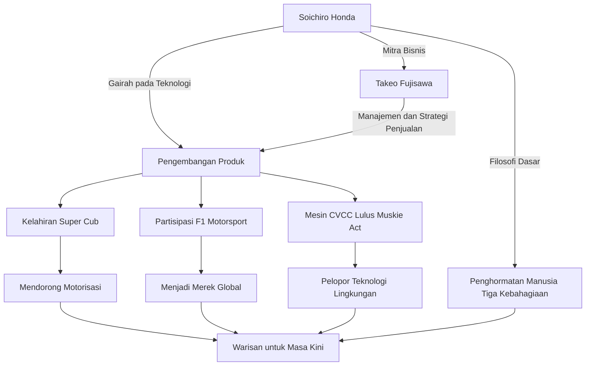

Soichiro Honda, pria yang menjadi simbol manufaktur Jepang dan membangun perusahaan global "Honda" dalam satu generasi. Kehidupannya diwarnai oleh semangat eksplorasi tanpa batas terhadap teknologi dan semangat pantang menyerah yang didorong oleh "mimpi". Dalam artikel ini, kita akan menggali lebih dalam tentang kehidupannya dari seorang mekanik biasa hingga menciptakan HONDA kelas dunia, filosofi uniknya, dan warisan yang diteruskan hingga saat ini.

## Berawal dari Seorang Mekanik: Gairah pada Mesin

Lahir pada tahun 1906 sebagai putra sulung seorang pandai besi di Distrik Iwata, Prefektur Shizuoka (sekarang Kota Tenryu), Soichiro Honda telah menunjukkan minat yang kuat pada mesin sejak usia dini. Terpesona oleh mesin-mesin mutakhir seperti mobil dan pesawat terbang, setelah lulus dari sekolah dasar tinggi, ia pergi ke Tokyo untuk magang di bengkel reparasi mobil "Art Shokai". Di sini, ia menunjukkan ketangkasan dan semangat penelusurannya, serta mempelajari dasar-dasar teknik perbaikan mobil secara menyeluruh.

Setelah mendapatkan izin untuk membuka cabangnya sendiri dari Art Shokai dan menjadi mandiri, Soichiro beralih dari industri perbaikan ke manufaktur dengan mendirikan "Tokai Seiki Heavy Industry" dan mulai memproduksi ring piston. Namun, karena kurangnya pengetahuan teoritis, ia awalnya menghasilkan banyak produk cacat dan mengalami kegagalan. Meskipun demikian, ia tidak menyerah dan kembali belajar metalurgi sebagai pendengar bebas di Sekolah Menengah Teknik Hamamatsu (sekarang Fakultas Teknik Universitas Shizuoka), hingga akhirnya berhasil mengembangkan ring piston berkualitas tinggi. Sikap "belajar dari kegagalan, menggabungkan teori dan praktik" ini kemudian menjadi titik awal filosofinya.

## "Teknologi untuk Manusia": Lahirnya Honda Motor Co., Ltd. dan Kemajuan Pesatnya

Setelah Perang Dunia II, di Jepang yang hancur lebur, Soichiro merasakan kebutuhan yang kuat dari masyarakat akan sarana transportasi. Pada tahun 1946, ia membuka Honda Technical Research Institute dan mengembangkan "Bata-bata", sebuah sepeda yang dipasangi mesin kecil untuk radio dari sisa perlengkapan militer angkatan darat. Produk ini menjadi hit besar, dan pada tahun 1948, ia mendirikan "Honda Motor Co., Ltd.".

Bisnisnya melonjak pesat berkat pertemuan dengan seorang jenius manajemen, Takeo Fujisawa. Dengan pembagian peran yang luar biasa di mana Soichiro fokus pada pengembangan teknologi dan Fujisawa menangani penjualan dan pendanaan, Honda mencapai pertumbuhan yang cepat. "Super Cub" yang dirilis pada tahun 1958, dengan daya tahannya, kemudahan penggunaannya, dan efisiensi bahan bakarnya yang sangat baik, mendorong motorisasi Jepang dan menjadi salah satu produk terlaris dalam sejarah yang dicintai di seluruh dunia hingga hari ini.

Selain itu, Soichiro mendeklarasikan partisipasi dalam "Isle of Man TT Race" untuk membuktikan kemampuan teknologinya kepada dunia. Meskipun awalnya dihalangi oleh standar dunia yang tinggi, setelah perbaikan terus-menerus, ia akhirnya meraih kemenangan penuh dan membuat nama HONDA bergema di seluruh dunia. Setelah itu, ia terus mencapai berbagai prestasi luar biasa yang mendobrak akal sehat, seperti memasuki pasar kendaraan roda empat, meraih kemenangan di F1 Grand Prix, dan mengembangkan mesin CVCC yang merupakan yang pertama di dunia lulus dari regulasi emisi gas buang Amerika Serikat yang ketat (Muskie Act).

## Diagram Korelasi Prestasi dan Filosofi

Kesuksesan Soichiro tidak hanya berkat kemampuan teknologinya, tetapi juga berkaitan erat dengan orang-orang yang mendukungnya dan filosofi uniknya. Diagram berikut menunjukkan jangkauan prestasinya.

## Filosofi Unik: "Jangan Takut Gagal" dan "Tiga Kebahagiaan"

Hal yang tidak bisa dilepaskan ketika berbicara tentang Soichiro Honda adalah kutipan dan filosofi yang ia tinggalkan. Ia berkata, "Kesuksesan adalah 1% yang didukung oleh 99% kegagalan," dan ia sangat menuntut karyawannya untuk berani mengambil tantangan tanpa takut gagal. Alih-alih menyalahkan kegagalan, ia paling benci ketika seseorang tidak mencoba sama sekali.

Selain itu, filosofi perusahaan Honda, yaitu "Tiga Kebahagiaan (Kebahagiaan Membeli, Kebahagiaan Menjual, dan Kebahagiaan Menciptakan)", mewujudkan semangat Soichiro dalam menghormati manusia. Ia meyakini bahwa teknologi hanyalah alat untuk membuat orang bahagia, dan perusahaan harus menjadi tempat di mana setiap orang yang terlibat dengan produk dapat merasakan kebahagiaan. Ia sangat mencintai lapangan, dan bahkan setelah menjadi presiden, ia berkeliling pabrik mengenakan pakaian kerja (baju terusan putih) dan berdiskusi dengan penuh semangat bersama karyawan. Sosoknya yang akrab dipanggil "Oyaji" (Ayah) merupakan citra pemimpin yang karismatik sekaligus sangat manusiawi.

## Pengaruh bagi Generasi Mendatang: Meneruskan "The Power of Dreams"

Pada tahun 1973, Soichiro dengan lapang dada mundur dari garis depan manajemen bersama Takeo Fujisawa. Dengan keyakinan bahwa "perusahaan bukanlah milik individu," ia tidak melakukan suksesi keturunan dan menyerahkan kepemimpinan kepada generasi berikutnya. Setelah pensiun, ia berkeliling ke diler dan pabrik di seluruh negeri, menyampaikan rasa terima kasih kepada setiap karyawan yang telah mendukung Honda selama bertahun-tahun.

Bahkan setelah ia meninggal dunia pada tahun 1991 di usia 84 tahun, semangatnya terus hidup sebagai DNA Honda. Robotika yang diwakili oleh ASIMO, masuknya Honda ke bisnis penerbangan dengan HondaJet, dan sikap Honda yang terus menantang bidang-bidang baru adalah kelanjutan dari "mimpi" yang terus dipegang oleh Soichiro.

Soichiro Honda bukanlah sekadar manajer atau penemu biasa. Ia adalah "insinyur yang penuh gairah" yang percaya pada kekuatan teknologi untuk membuat hal yang mustahil menjadi mungkin, dan mengejar mimpi untuk memperkaya kehidupan manusia sepanjang hidupnya. Sejarah tantangan dan filosofi yang ia tinggalkan terus memberikan kita petunjuk dan keberanian untuk hidup kuat di era modern yang penuh dengan perubahan cepat ini.
