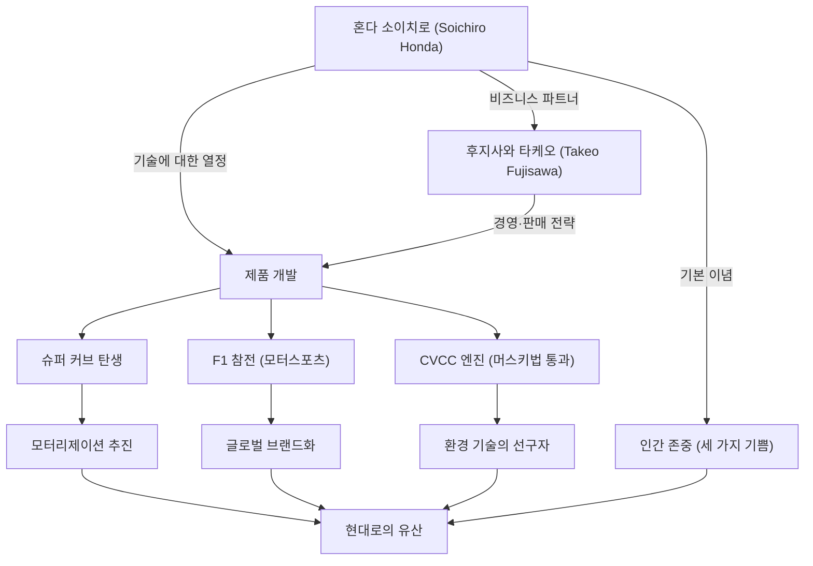

일본의 제조업을 상징하며, 세계적인 기업 '혼다'를 당대에 구축한 남자, 혼다 소이치로. 그의 인생은 기술에 대한 끝없는 탐구심과 '꿈'을 원동력으로 하는 불굴의 정신으로 수놓아져 있습니다. 본 기사에서는 단순한 수리공에서 세계의 HONDA를 만들어낸 그의 생애, 독자적인 철학, 그리고 현대에 계승되는 유산에 대해 깊이 파헤쳐 봅니다.

## 수리공으로부터의 출발: 기계에 대한 열정

1906년(메이지 39년), 시즈오카현 이와타군(현재의 텐류시)의 대장장이 장남으로 태어난 혼다 소이치로는 어릴 적부터 기계에 강한 흥미를 보였습니다. 자동차나 비행기와 같은 최첨단 기계에 마음을 빼앗긴 그는 심상고등소학교를 졸업한 후, 도쿄의 자동차 수리 공장 '아트 상회'에 수습생으로 들어갑니다. 이곳에서 그는 타고난 손재주와 탐구심을 발휘하여 자동차 수리 기술을 기초부터 철저히 배웠습니다.

아트 상회에서 독립한 소이치로는 수리업에서 제조업으로 전환을 꾀하며, '토카이 세이키 중공업'을 설립하고 피스톤 링 제조에 나섭니다. 그러나 이론적인 지식 부족으로 초기에는 불량품 산을 쌓으며 좌절을 맛봅니다. 그럼에도 그는 포기하지 않고 하마마츠 고등공업학교(현재의 시즈오카대학 공학부)의 청강생으로 금속 공학을 다시 배워, 마침내 고품질의 피스톤 링 개발에 성공했습니다. 이 '실패에서 배우고 이론과 실천을 융합한다'는 자세는 훗날 그의 철학의 원점이 됩니다.

## "기술은 사람을 위해": 혼다 기연 공업의 탄생과 쾌조의 진격

제2차 세계대전 후, 잿더미가 된 일본에서 소이치로는 사람들의 이동 수단에 대한 강한 니즈를 감지합니다. 1946년에 혼다 기술 연구소를 개설하고, 구 육군의 방출품인 무전기용 소형 엔진을 자전거에 부착한 '바타바타(Bata-bata)'를 개발합니다. 이것이 대히트를 기록하며, 1948년에는 '혼다 기연 공업 주식회사'를 설립했습니다.

그의 비즈니스를 도약시킨 것은 경영의 천재, 후지사와 타케오와의 만남이었습니다. 소이치로가 기술 개발에 전념하고, 후지사와가 판매와 자금 조달을 담당하는 절묘한 역할 분담을 통해 혼다는 급성장을 이룹니다. 1958년에 발매된 '슈퍼 커브'는 그 내구성과 다루기 쉬움, 뛰어난 연비 덕분에 일본의 모터리제이션을 추진하였고, 현재까지도 전 세계에서 사랑받는 역사적인 대형 베스트셀러가 되었습니다.

나아가 소이치로는 자신의 기술력을 세계에 증명하기 위해 '맨섬 TT 레이스' 참전을 선언합니다. 처음에는 세계의 높은 벽에 부딪혔지만, 끊임없는 개량 끝에 완전 우승을 달성하며 HONDA의 이름을 전 세계에 떨쳤습니다. 그 후 사륜차 시장 진입, F1 그랑프리에서의 승리, 그리고 세계 최초로 미국의 엄격한 배기가스 규제(머스키법)를 통과한 CVCC 엔진 개발 등, 차례차례 상식을 뒤엎는 위업을 달성해 나갑니다.

## 공적과 철학의 상관도

소이치로의 성공은 단순한 기술력뿐만 아니라, 그를 지탱해 준 사람들과 독자적인 철학이 복잡하게 얽혀 있습니다. 아래 그림은 그의 공적이 퍼져나간 모습을 보여줍니다.

## 독자적인 철학: "실패를 두려워하지 마라"와 "세 가지 기쁨"

혼다 소이치로를 말할 때 빼놓을 수 없는 것이 그가 남긴 수많은 명언과 철학입니다. 그는 "성공은 99%의 실패에 의해 지탱된 1%다"라고 말하며, 사원들에게 실패를 두려워하지 말고 도전할 것을 강하게 요구했습니다. 실패를 탓하는 것이 아니라, 아무것도 도전하지 않는 것을 가장 싫어했던 것입니다.

또한 혼다의 기업 이념인 '세 가지 기쁨 (사는 기쁨, 파는 기쁨, 만드는 기쁨)'은 소이치로의 인간 존중의 정신을 구현하고 있습니다. 기술은 어디까지나 사람을 행복하게 하기 위한 수단이며, 제품과 관련된 모든 사람이 기쁨을 느낄 수 있는 기업이어야 한다는 신념입니다. 그는 현장을 각별히 사랑하여 사장이 되어서도 작업복(흰 츠나기) 차림으로 공장을 돌아다니며 사원들과 뜨겁게 토론을 나누었습니다. '오야지(아저씨/아버지)'라고 불리며 존경받은 그 모습은 카리스마 있으면서도 매우 인간미 넘치는 리더상 이었습니다.

## 후세에의 영향: 계승되는 'The Power of Dreams'

1973년, 소이치로는 후지사와 타케오와 함께 미련 없이 경영 일선에서 물러납니다. "기업은 개인의 소유물이 아니다"라는 신념 하에 세습을 일절 하지 않고 후진에게 길을 양보한 것입니다. 은퇴 후에는 전국의 판매점과 공장을 순회하며, 오랫동안 혼다를 지탱해 준 사원들 한 명 한 명에게 감사의 뜻을 전하고 다녔습니다.

1991년 84세의 나이로 세상을 떠난 후에도 그의 정신은 혼다의 DNA로서 면면히 살아 숨 쉬고 있습니다. 아시모(ASIMO)로 대표되는 로봇 공학, 혼다 제트를 통한 항공기 사업 진출 등, 혼다가 차례로 새로운 영역에 계속해서 도전하는 자세는 소이치로가 품어왔던 '꿈'의 연장선상에 있습니다.

혼다 소이치로는 단순한 경영자나 발명가가 아니었습니다. 그는 불가능을 가능하게 하는 기술의 힘을 믿고, 사람들의 생활을 풍요롭게 하겠다는 꿈을 평생에 걸쳐 좇은 '열정의 기술자'입니다. 그가 남긴 도전의 역사와 철학은 변화가 격심한 현대에 있어서도 우리에게 굳세게 살아갈 힌트와 용기를 계속해서 주고 있습니다.
