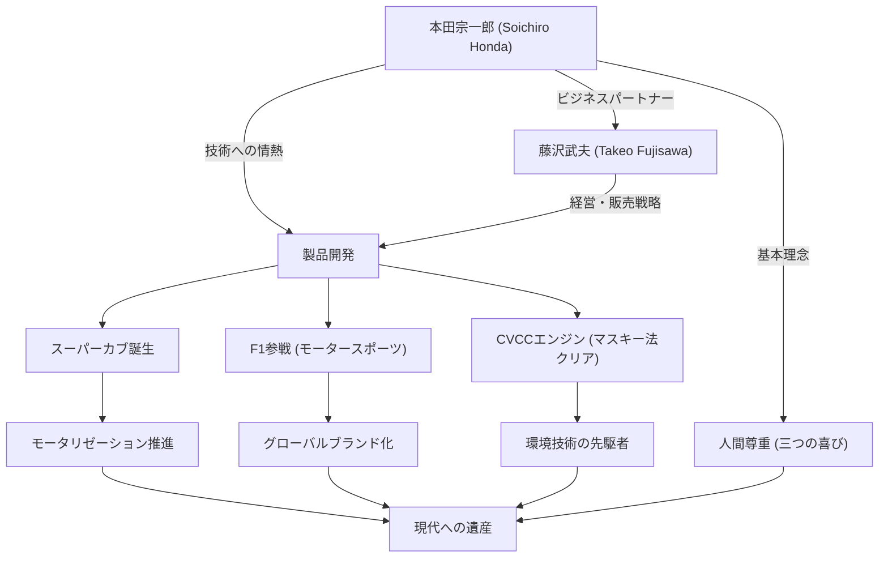

日本のモノづくりを象徴し、世界的な企業「ホンダ」を一代で築き上げた男、本田宗一郎。彼の人生は、技術への果てしない探求心と、「夢」を原動力とする不屈の精神に彩られています。本記事では、ただの修理工から世界のHONDAを創り上げた彼の生涯、独自の哲学、そして現代に受け継がれる遺産について深く掘り下げます。

## 修理工からの出発：機械への情熱

1906年（明治39年）、静岡県磐田郡（現在の天竜市）の鍛冶屋の長男として生まれた本田宗一郎は、幼い頃から機械に強い興味を示していました。自動車や飛行機といった最先端の機械に心を奪われた彼は、尋常高等小学校を卒業後、東京の自動車修理工場「アート商会」に丁稚奉公に出ます。ここで彼は、持ち前の器用さと探求心を発揮し、自動車修理の技術を基礎から叩き込まれました。

アート商会からの暖簾分けを経て独立した宗一郎は、修理業から製造業への転換を図り、「東海精機重工業」を設立してピストンリングの製造に乗り出します。しかし、理論的な知識の不足から初期は不良品の山を築き、挫折を味わいます。それでも彼は諦めず、浜松高等工業学校（現在の静岡大学工学部）の聴講生として金属工学を学び直し、ついに高品質なピストンリングの開発に成功しました。この「失敗から学び、理論と実践を融合させる」姿勢は、後の彼の哲学の原点となります。

## 「技術は人のために」：本田技研工業の誕生と快進撃

第二次世界大戦後、焼け野原となった日本で、宗一郎は人々の移動手段に対する強いニーズを感じ取ります。1946年に本田技術研究所を開設し、旧陸軍の放出品である無線機用小型エンジンを自転車に取り付けた「バタバタ」を開発。これが大ヒットを記録し、1948年には「本田技研工業株式会社」を設立しました。

彼のビジネスを飛躍させたのは、経営の天才・藤沢武夫との出会いでした。宗一郎が技術開発に専念し、藤沢が販売と資金調達を担うという絶妙な役割分担により、ホンダは急成長を遂げます。1958年に発売された「スーパーカブ」は、その耐久性、扱いやすさ、優れた燃費から、日本のモータリゼーションを推進し、現在でも世界中で愛される歴史的な大ベストセラーとなりました。

さらに宗一郎は、自らの技術力を世界に証明するため、「マン島TTレース」への参戦を宣言。当初は世界の壁に跳ね返されましたが、絶え間ない改良の末に完全優勝を果たし、HONDAの名を世界に轟かせました。その後、四輪車市場への参入、F1グランプリでの勝利、そして世界で初めて米国の厳しい排ガス規制（マスキー法）をクリアしたCVCCエンジンの開発など、次々と常識を覆す偉業を成し遂げていきます。

## 功績と哲学の相関図

宗一郎の成功は、単なる技術力だけでなく、彼を支えた人々やその独自の哲学が複雑に結びついています。以下の図は、彼の功績の広がりを示しています。

## 独自の哲学：「失敗を恐れるな」と「三つの喜び」

本田宗一郎を語る上で欠かせないのが、彼が残した数々の名言と哲学です。彼は「成功は99％の失敗に支えられた1％だ」と語り、社員に対して失敗を恐れずに挑戦することを強く求めました。失敗を咎めるのではなく、何も挑戦しないことを最も嫌ったのです。

また、ホンダの企業理念である「三つの喜び（買う喜び、売る喜び、創る喜び）」は、宗一郎の人間尊重の精神を体現しています。技術はあくまで人を幸せにするための手段であり、製品に関わるすべての人が喜びを感じられる企業でなければならないという信念です。彼は現場をこよなく愛し、社長になっても作業着（白ツナギ）で工場を歩き回り、社員と熱く議論を交わしました。「オヤジ」と呼ばれ慕われたその姿は、カリスマ的でありながら非常に人間味あふれるリーダー像でした。

## 後世への影響：受け継がれる「The Power of Dreams」

1973年、宗一郎は藤沢武夫と共に潔く経営の第一線を退きます。「企業は個人の持ち物ではない」という信念のもと、世襲を一切行わず、後進に道を譲ったのです。引退後は、全国の販売店や工場を巡回し、長年ホンダを支えてくれた社員たち一人ひとりに感謝の意を伝えて回りました。

1991年に84歳でこの世を去った後も、彼のスピリットはホンダのDNAとして脈々と息づいています。アシモ（ASIMO）に代表されるロボット工学、ホンダジェットによる航空機事業への参入など、ホンダが次々と新しい領域に挑戦し続ける姿勢は、宗一郎が抱き続けた「夢」の延長線上にあります。

本田宗一郎は、ただの経営者でも、ただの発明家でもありませんでした。彼は、不可能を可能にする技術の力を信じ、人々の生活を豊かにするという夢を生涯をかけて追い求めた「情熱の技術者」です。彼の遺した挑戦の歴史と哲学は、変化の激しい現代においても、私たちに強く生きるヒントと勇気を与え続けています。
