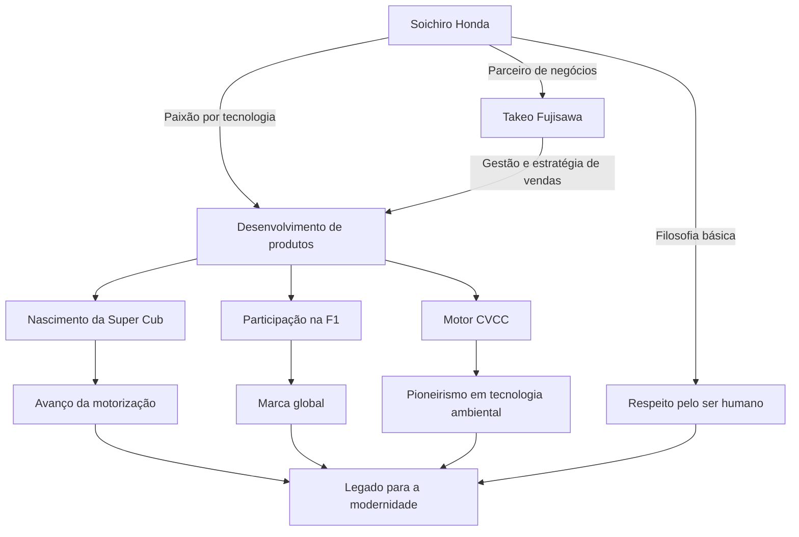

Soichiro Honda, o homem que simbolizou a manufatura japonesa e construiu a empresa global "Honda" em uma única geração. Sua vida é marcada por uma busca incessante pela tecnologia e por um espírito indomável impulsionado por "sonhos". Neste artigo, mergulharemos profundamente na vida dele, que passou de um simples mecânico ao criador da HONDA mundial, em sua filosofia única e no legado que perdura até os dias de hoje.

## A Partida como Mecânico: Paixão pelas Máquinas

Nascido em 1906, como o filho mais velho de um ferreiro no distrito de Iwata, na província de Shizuoka (atual cidade de Tenryu), Soichiro Honda demonstrou um forte interesse por máquinas desde a infância. Cativado por máquinas de ponta, como automóveis e aviões, ele foi para Tóquio trabalhar como aprendiz na oficina mecânica "Art Shokai" após terminar o ensino fundamental. Lá, ele demonstrou sua destreza e curiosidade inatas, aprendendo a fundo a tecnologia de reparo de automóveis.

Após se tornar independente ao abrir uma filial da Art Shokai, Soichiro buscou a transição da prestação de serviços de reparo para a manufatura, fundando a "Tokai Seiki Heavy Industry" para fabricar anéis de pistão. No entanto, devido à falta de conhecimento teórico inicial, ele produziu montanhas de peças defeituosas e experimentou o fracasso. Mesmo assim, ele não desistiu, voltou a estudar metalurgia como aluno ouvinte na Escola Técnica Superior de Hamamatsu (atual Faculdade de Engenharia da Universidade de Shizuoka) e, finalmente, teve sucesso no desenvolvimento de anéis de pistão de alta qualidade. Essa atitude de "aprender com os erros e unir a teoria à prática" tornou-se a origem de sua filosofia posterior.

## "Tecnologia para as Pessoas": O Nascimento e o Rápido Avanço da Honda Motor Co., Ltd.

Após a Segunda Guerra Mundial, em um Japão devastado, Soichiro percebeu uma forte necessidade de meios de transporte para as pessoas. Em 1946, ele abriu o Honda Technical Research Institute e desenvolveu a "Bata-bata", acoplando a bicicletas pequenos motores que eram excedentes militares usados em rádios de comunicação. O sucesso foi estrondoso e, em 1948, fundou a "Honda Motor Co., Ltd.".

O que fez seu negócio decolar foi o encontro com o gênio da administração Takeo Fujisawa. Com uma excelente divisão de tarefas, onde Soichiro focava no desenvolvimento tecnológico e Fujisawa se encarregava de vendas e financiamento, a Honda cresceu rapidamente. O "Super Cub", lançado em 1958, impulsionou a motorização do Japão graças à sua durabilidade, facilidade de uso e excelente economia de combustível, tornando-se um best-seller histórico que ainda é amado em todo o mundo.

Além disso, para provar a sua capacidade tecnológica para o mundo, Soichiro declarou participação na corrida "Isle of Man TT". Inicialmente, enfrentou as barreiras mundiais, mas após melhorias contínuas, alcançou a vitória completa, fazendo o nome da HONDA ressoar em todo o mundo. Posteriormente, ele alcançou uma série de feitos que desafiaram o senso comum, como a entrada no mercado de veículos de quatro rodas, vitórias na Fórmula 1 e o desenvolvimento do motor CVCC, o primeiro do mundo a cumprir as rigorosas regulamentações de emissões dos EUA (Lei Muskie).

## Gráfico de Correlação entre Conquistas e Filosofia

O sucesso de Soichiro não se deveu apenas à sua proeza técnica, mas também às pessoas que o apoiaram e à sua filosofia única, que estão intrinsecamente conectadas. O diagrama abaixo mostra a extensão de suas realizações.

## Uma Filosofia Única: "Não tema o fracasso" e "As Três Alegrias"

Ao falar sobre Soichiro Honda, é impossível ignorar as inúmeras citações e a filosofia que ele deixou. Ele dizia que "o sucesso é 1% apoiado por 99% de fracasso", e exortava fortemente seus funcionários a aceitarem desafios sem temer falhar. Ele não culpava as falhas; o que ele mais detestava era a falta de tentativas.

Além disso, a filosofia corporativa da Honda, "As Três Alegrias (Alegria de Comprar, Alegria de Vender, Alegria de Criar)", incorpora o espírito de respeito humano de Soichiro. A crença era de que a tecnologia é, em última análise, um meio para fazer as pessoas felizes, e a empresa deve ser um lugar onde todos os envolvidos no produto possam sentir alegria. Ele amava profundamente o chão de fábrica; mesmo após se tornar presidente, caminhava pelas fábricas vestindo seu macacão branco, debatendo acaloradamente com os funcionários. Carinhosamente chamado de "Oyaji" (O Velho/O Pai), ele era um líder carismático, mas extremamente humano.

## O Impacto nas Gerações Futuras: O Legado de "The Power of Dreams"

Em 1973, Soichiro retirou-se graciosamente da linha de frente da administração, juntamente com Takeo Fujisawa. Com a crença de que "uma empresa não é propriedade pessoal", ele não deixou herdeiros familiares assumirem a gestão, passando o bastão para a próxima geração. Após se aposentar, ele viajou por concessionárias e fábricas de todo o país, agradecendo pessoalmente a cada funcionário que apoiou a Honda por tantos anos.

Mesmo após sua morte em 1991, aos 84 anos, o seu espírito continua vivo no DNA da Honda. A postura da empresa em desafiar constantemente novos territórios, exemplificada por robôs como o ASIMO e a entrada no negócio de aviação com o HondaJet, é uma extensão do "sonho" que Soichiro abraçou continuamente.

Soichiro Honda não era apenas um gerente ou apenas um inventor. Ele foi um "engenheiro apaixonado" que acreditava no poder da tecnologia para tornar o impossível possível e perseguiu, ao longo de sua vida, o sonho de enriquecer a vida das pessoas. A história de seus desafios e sua filosofia continuam a nos dar força, coragem e conselhos valiosos para viver com resiliência em um mundo moderno e em constante mudança.
