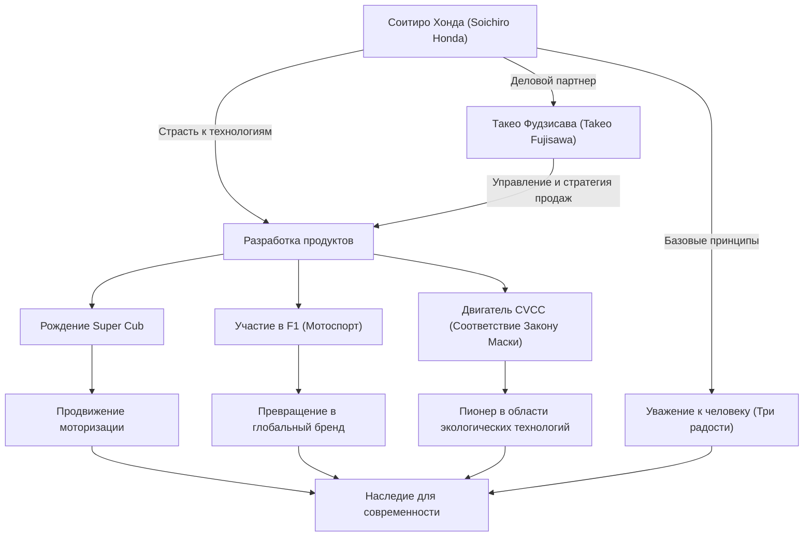

Соитиро Хонда, человек, ставший символом японского производства и построивший глобальную компанию "Honda" за одно поколение. Его жизнь окрашена бесконечной жаждой исследований в области технологий и несгибаемым духом, движущей силой которого была «мечта». В этой статье мы подробно рассмотрим жизнь человека, который прошел путь от простого автомеханика до создателя мировой HONDA, его уникальную философию и наследие, переданное современности.

## От механика: Страсть к машинам

Соитиро Хонда родился в 1906 году (39-й год эпохи Мэйдзи) как старший сын кузнеца в уезде Ивата, префектура Сидзуока (ныне город Тенрю). С ранних лет он проявлял сильный интерес к машинам. Увлекшись новейшими механизмами того времени — автомобилями и самолетами, после окончания начальной школы он отправился в Токио работать подмастерьем в автомастерской «Art Shokai». Здесь он проявил свою природную ловкость и любознательность, освоив технологии ремонта автомобилей с самых азов.

Став независимым после получения разрешения на открытие филиала Art Shokai, Соитиро решил перейти от ремонта к производству, основав «Tokai Seiki Heavy Industry» и начав производить поршневые кольца. Однако из-за нехватки теоретических знаний на начальном этапе он произвел горы брака и потерпел неудачу. Тем не менее, он не сдался и заново изучил металлургию как вольнослушатель в Высшей технической школе Хамамацу (в настоящее время инженерный факультет Университета Сидзуока), и в конечном итоге преуспел в разработке высококачественных поршневых колец. Этот подход — «учиться на ошибках и объединять теорию с практикой» — стал отправной точкой его будущей философии.

## «Технологии ради людей»: Рождение и стремительный успех Honda Motor Co.

После Второй мировой войны в разрушенной дотла Японии Соитиро почувствовал сильную потребность людей в средствах передвижения. В 1946 году он открыл Институт технических исследований Honda и разработал «Bata-bata» — велосипед с прикрепленным к нему небольшим двигателем от радиостанции, оставшимся от бывшей императорской армии. Это изобретение стало огромным хитом, и в 1948 году была основана компания «Honda Motor Co., Ltd.».

Встреча с Такео Фудзисавой, гением управления, стала катализатором прорыва в его бизнесе. Идеальное разделение ролей, при котором Соитиро сосредоточился на технологических разработках, а Фудзисава взял на себя продажи и финансирование, привело к стремительному росту Honda. Выпущенный в 1958 году «Super Cub» благодаря своей долговечности, простоте управления и отличной топливной экономичности способствовал моторизации Японии и стал историческим бестселлером, любимым во всем мире и по сей день.

Кроме того, чтобы доказать свои технологические возможности миру, Соитиро объявил об участии в гонке «Isle of Man TT». Изначально столкнувшись с непреодолимым барьером мирового уровня, после непрерывных улучшений он одержал абсолютную победу, прославив имя HONDA на весь мир. Затем он совершил ряд беспрецедентных подвигов, перевернувших здравый смысл: выход на рынок четырехколесных автомобилей, победа в Гран-при F1 и разработка двигателя CVCC, который первым в мире соответствовал строгим нормам выбросов США (Закон Маски).

## Схема взаимосвязи достижений и философии

Успех Соитиро — это не только технологическое мастерство, но и сложное переплетение людей, которые его поддерживали, и его уникальной философии. На приведенной ниже диаграмме показан масштаб его достижений.

## Уникальная философия: «Не бойтесь неудач» и «Три радости»

Говоря о Соитиро Хонде, нельзя обойти стороной множество его цитат и философию, которую он оставил после себя. Он говорил: «Успех — это 1%, который поддерживается 99% неудач», и настоятельно требовал от сотрудников не бояться ошибаться, принимая вызовы. Он ненавидел не сами ошибки, а отсутствие попыток что-либо сделать.

Кроме того, корпоративная философия Honda, «Три радости (радость покупки, радость продажи, радость создания)», воплощает дух уважения Соитиро к человеку. Это вера в то, что технологии — это всего лишь средство сделать людей счастливыми, и компания должна приносить радость всем, кто участвует в создании продукта. Он горячо любил рабочие площадки и, даже став президентом, ходил по заводу в рабочей одежде (белом комбинезоне) и жарко спорил с сотрудниками. Его образ, который с любовью называли «Оядзи» (батя), был харизматичным, но в то же время невероятно человечным лидером.

## Влияние на потомков: Унаследованная сила мечты «The Power of Dreams»

В 1973 году Соитиро вместе с Такео Фудзисавой достойно ушли с передовой линии управления. Твердо веря в то, что «компания не является чьей-либо личной собственностью», они отказались от наследственной передачи управления и уступили дорогу молодому поколению. После ухода на пенсию он объездил дилерские центры и заводы по всей стране, выражая благодарность каждому сотруднику, долгие годы поддерживавшему Honda.

Даже после его ухода из жизни в 1991 году в возрасте 84 лет его дух продолжает жить в ДНК компании Honda. Развитие робототехники, представленной ASIMO, выход на авиационный рынок с самолетом HondaJet — все эти постоянные вызовы Honda в новых областях являются продолжением «мечты», которую лелеял Соитиро.

Соитиро Хонда не был просто руководителем или просто изобретателем. Он был «страстным инженером», который верил в силу технологий делать невозможное возможным и посвятил свою жизнь мечте об обогащении жизни людей. История его вызовов и философия, которую он оставил, продолжают давать нам силу и смелость жить в сегодняшнем быстро меняющемся мире.
