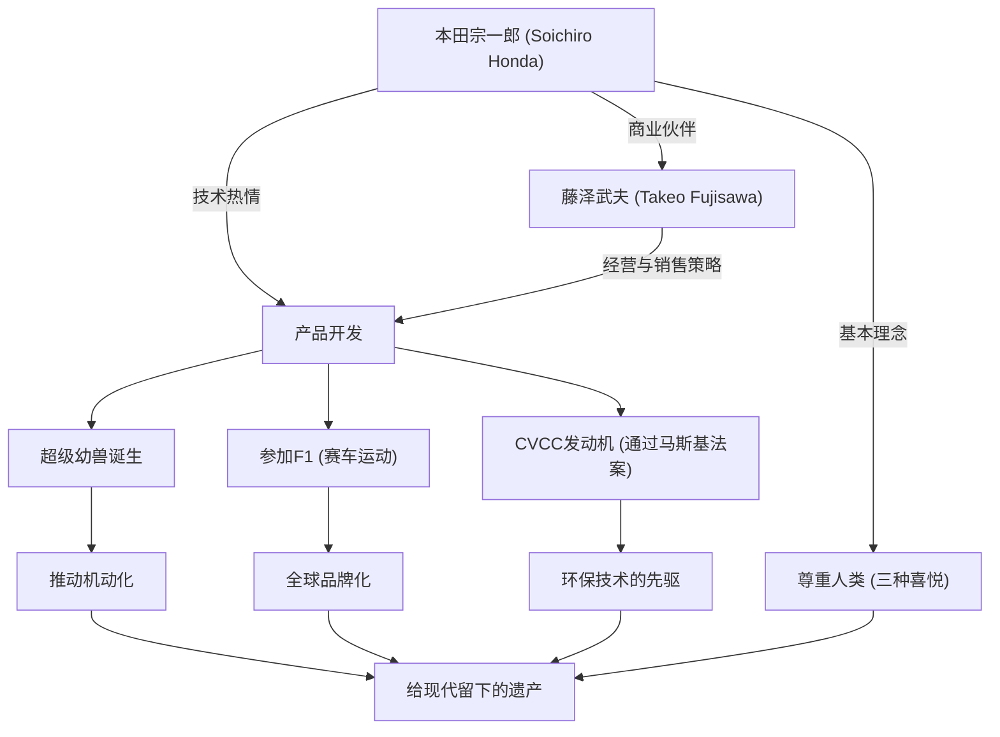

本田宗一郎，他是日本制造业的象征，也是一手缔造了世界级企业“本田（Honda）”的男人。他的一生充满了对技术无尽的探求心，以及以“梦想”为原动力的不屈精神。本文将深入探讨他从一名普通修理工到创造世界级HONDA的一生、其独特的哲学，以及流传至今的遗产。

## 从修理工起步：对机械的热情

1906年（明治39年），本田宗一郎出生于静冈县磐田郡（现天龙市）一个铁匠家庭，是家中的长子。他从小就对机械表现出浓厚的兴趣。汽车和飞机等最尖端的机械深深吸引了他，寻常高等小学毕业后，他便前往东京的汽车修理厂“Art商会”当学徒。在这里，他发挥了与生俱来的灵巧和探求心，从基础开始扎实地掌握了汽车修理技术。

在Art商会获得分店经营权并独立后，宗一郎计划从修理业转向制造业。他成立了“东海精机重工业”，开始制造活塞环。然而，由于缺乏理论知识，初期生产出堆积如山的次品，让他尝到了挫折的滋味。尽管如此，他并没有放弃，而是作为旁听生进入滨松高等工业学校（现静冈大学工学部）重新学习金属工程学，最终成功开发出高质量的活塞环。这种“从失败中学习，将理论与实践相结合”的态度，成为了他日后哲学的原点。

## “技术为了人类”：本田技研工业的诞生与迅猛发展

第二次世界大战后，在化为焦土的日本，宗一郎敏锐地察觉到了人们对交通工具的强烈需求。1946年，他创办了本田技术研究所，将旧陆军剩余的无线电小型发动机安装在自行车上，开发出了“叭嗒叭嗒（辅助动力自行车）”。该产品大获成功，随后于1948年成立了“本田技研工业株式会社”。

让他的事业实现飞跃的，是与经营天才藤泽武夫的相遇。宗一郎专心于技术开发，藤泽则负责销售和融资，这种绝妙的角色分工使本田实现了高速增长。1958年发售的“超级幼兽（Super Cub）”凭借其耐用性、易于操控和出色的燃油经济性，推动了日本的汽车普及化（Motorization），并成为至今仍备受全世界喜爱的历史性超级畅销车型。

此外，为了向世界证明自己的技术实力，宗一郎宣布参加“曼岛TT摩托车赛”。起初他们被世界级的壁垒击退，但经过不断改良，最终获得了大获全胜，让HONDA的名字响彻全球。此后，进军四轮车市场、在F1大奖赛中获胜、以及在世界上首次开发出通过美国严格废气排放限制（马斯基法案）的CVCC发动机等，他接连完成了颠覆常识的伟业。

## 功绩与哲学相关图

宗一郎的成功，不仅在于纯粹的技术实力，还与支持他的人们以及他独特的哲学错综复杂地结合在一起。下图展示了他功绩的扩展。

## 独特的哲学：“不要害怕失败”与“三种喜悦”

谈及本田宗一郎，必不可少的是他留下的众多名言和哲学。他曾说“成功是依靠99%的失败所支撑的1%”，强烈要求员工不要害怕失败，勇于挑战。他并不责怪失败，而是最讨厌什么都不去尝试。

此外，本田的企业理念“三种喜悦（购买的喜悦、销售的喜悦、创造的喜悦）”体现了宗一郎尊重人类的精神。他的信念是，技术终究是让人幸福的手段，必须成为一家让所有与产品相关的人都能感受到喜悦的企业。他深爱着生产现场，即使成为总裁，依然穿着工作服（白色连体服）在工厂里走动，与员工热烈讨论。他被亲切地称为“老爹（Oyaji）”，这一形象既具有领袖魅力，又充满了人情味。

## 对后世的影响：传承至今的“The Power of Dreams”

1973年，宗一郎与藤泽武夫一起果断地退出了经营第一线。基于“企业不是个人的私有物”的信念，他完全没有进行世袭，而是把道路让给了后辈。退休后，他巡回全国的销售店和工厂，向长年支持本田的每一位员工表达了感谢之情。

在1991年以84岁高龄离世后，他的精神依然作为本田的DNA生生不息。以阿西莫（ASIMO）为代表的机器人工程、通过HondaJet进军航空业务等，本田接连不断地向新领域发起挑战的姿态，正是宗一郎一直抱有的“梦想”的延伸。

本田宗一郎不仅仅是一位经营者，也不仅仅是一位发明家。他相信能将不可能变为可能的技术力量，是一位倾尽一生去追求“让人们生活更加丰富”这一梦想的“充满热情的工程师”。他留下的挑战历史和哲学，即使在变化剧烈的现代，也依然不断地给予我们坚强生存的启示和勇气。
