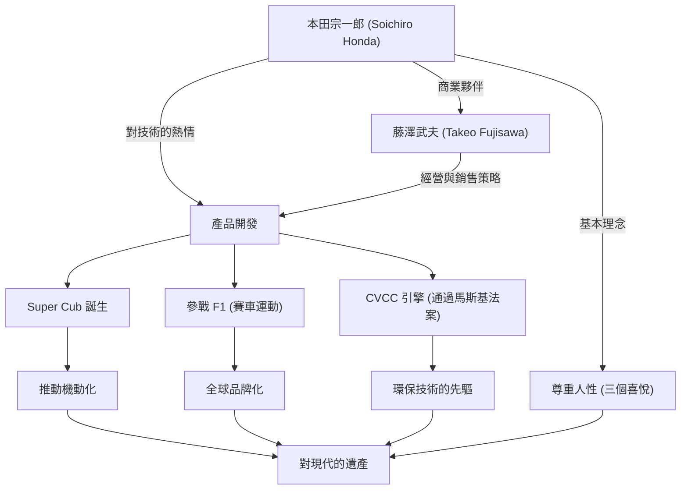

象徵日本製造業，憑一己之力建立起世界級企業「Honda（本田）」的男人——本田宗一郎。他的人生充滿了對技術無止盡的探求心，以及以「夢想」為原動力的不屈精神。本文將深入探討他從一名普通修理工，打造出世界級HONDA的生平、獨特的哲學，以及傳承至今的遺產。

## 從修理工出發：對機械的熱情

1906年（明治39年），本田宗一郎出生於靜岡縣磐田郡（現為天龍市）一個鐵匠家庭，是家中的長子。他從小就對機械表現出濃厚的興趣。被汽車和飛機等最先進機械深深吸引的他，在尋常高等小學校畢業後，便前往東京的汽車修理廠「亞特商會（Art Shokai）」當學徒。在這裡，他發揮了與生俱來的靈巧與探求心，從基礎開始扎實地學習了汽車修理技術。

從亞特商會分家獨立後，宗一郎試圖從修理業轉型為製造業。他設立了「東海精機重工業」，開始投入活塞環的製造。然而，由於缺乏理論知識，初期製造出堆積如山的不良品，讓他嚐到了挫折的滋味。儘管如此，他並未放棄，而是作為旁聽生進入濱松高等工業學校（現為靜岡大學工學部）重新學習金屬工學，最終成功開發出高品質的活塞環。這種「從失敗中學習，將理論與實踐融合」的態度，成為了他日後哲學的起點。

## 「技術是為了人」：本田技研工業的誕生與高歌猛進

第二次世界大戰後，在化為焦土的日本，宗一郎敏銳地察覺到人們對交通工具的強烈需求。1946年，他開設了本田技術研究所，將舊陸軍釋出的無線電用小型引擎安裝在自行車上，開發出了被稱為「叭噠叭噠（Bata-bata）」的機動自行車。這項產品創下了銷售佳績，隨後他在1948年設立了「本田技研工業株式會社」。

讓他的事業突飛猛進的關鍵，是遇見了經營天才藤澤武夫。宗一郎專注於技術開發，而藤澤負責銷售與資金調度。藉由這般絕妙的角色分工，本田實現了飛速成長。1958年發售的「Super Cub（超級幼獸）」，憑藉其耐用性、易於操作及優異的燃油效率，推動了日本的機動化，成為至今仍受全球喜愛的歷史性暢銷車款。

此外，為了向世界證明自己的技術實力，宗一郎宣佈參加「曼島TT國際機車賽」。起初他們在世界級別的障礙前屢遭挫敗，但在不斷地改良後，最終獲得了完全優勝，讓HONDA的名聲響徹全球。此後，進軍四輪汽車市場、在F1大獎賽中獲勝，以及開發出全球首款通過美國嚴格廢氣排放法規（馬斯基法案）的CVCC引擎等，他們接連達成了顛覆常識的偉業。

## 功績與哲學的相關圖

宗一郎的成功，不僅僅是因為技術實力，更是與支持他的人們以及他獨特的哲學複雜地交織在一起。下圖展示了他的功績所帶來的深遠影響。

## 獨特的哲學：「不要害怕失敗」與「三個喜悅」

談到本田宗一郎，不可或缺的是他留下的眾多名言與哲學。他曾說：「成功是建立在99%的失敗之上的1%」，並強烈要求員工不要害怕失敗，勇於挑戰。他不會責備失敗，最討厭的反而是什麼都不去挑戰。

此外，本田的企業理念「三個喜悅（購買的喜悅、銷售的喜悅、創造的喜悅）」，體現了宗一郎尊重人性的精神。他堅信技術終究只是讓人獲得幸福的手段，企業必須讓所有與產品相關的人都能感受到喜悅。他無比熱愛第一線現場，即使成為社長，依然穿著工作服（白色連身工作服）在工廠裡走動，與員工熱烈地進行討論。被大家親切地稱為「老爹（Oyaji）」的他，展現出了既具魅力又充滿人情味的領導者形象。

## 對後世的影響：傳承下去的「The Power of Dreams」

1973年，宗一郎與藤澤武夫一同果斷地退出了經營第一線。基於「企業不是個人私有物」的信念，他完全沒有實行世襲制，而是將道路讓給了後進。退休後，他巡迴全國的經銷商和工廠，向長年支持本田的每一位員工表達了感謝之意。

即使在1991年以84歲高齡辭世後，他的精神依然作為本田的DNA代代相傳。以ASIMO為代表的機器人工學、透過HondaJet進軍航空機事業等，本田不斷向新領域挑戰的姿態，正是宗一郎一直以來所懷抱「夢想」的延伸。

本田宗一郎不只是一名經營者，也不只是一名發明家。他是一位相信化不可能為可能的技術力量，一生追尋著豐富人們生活夢想的「充滿熱情的技術者」。他留下來的挑戰歷史與哲學，即使在變化劇烈的現代，依然持續給予我們堅強生存的啟示與勇氣。
