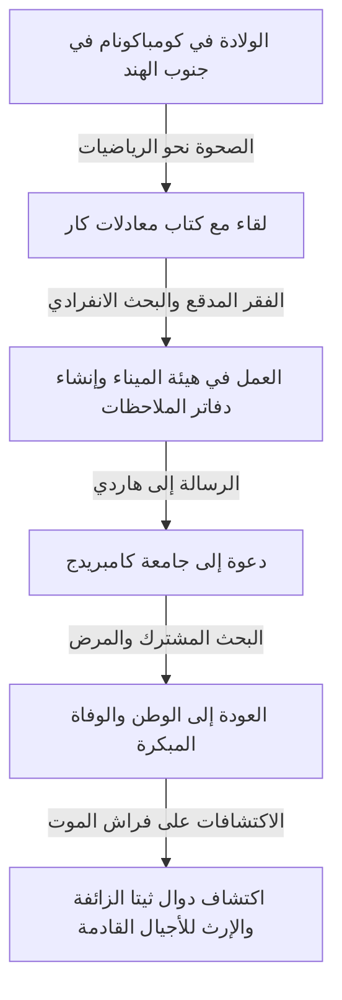
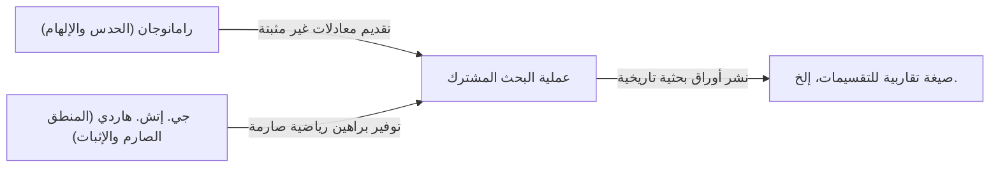

# سرينيفاسا رامانوجان: الساحر الهندي الذي نسج الحدس واللانهاية

## 1. مقدمة: "التفرد" الذي هبط في عالم الرياضيات

عند النظر في تاريخ الرياضيات، ظهرت مواهب عظيمة في كل عصر، حيث قاموا ببناء نظريات جديدة من خلال تراكم المنطق. ومع ذلك، في هذا التاريخ الطويل، هناك شخص كتب الحقيقة وكأنه يتلقى إلهامًا مباشرًا من الله، دون التقيد بأي منطق أو أطر موجودة. هذا الشخص هو سرينيفاسا رامانوجان (1887-1920)، المعروف بـ "ساحر الهند".

كانت حياته درامية تمامًا كفيلم: بدأت في بيئة من الفقر المدقع، وتطرق إلى أعماق الرياضيات من خلال التعلم الذاتي، وسافر إلى جامعة كامبريدج في إنجلترا. الآلاف من المعادلات والنظريات التي تركها لم تذهل علماء الرياضيات في عصره فحسب، بل بعد أكثر من قرن من الزمان، لا تزال تُطبق في المجالات العلمية المتطورة، مثل فيزياء الثقوب السوداء ونظرية الأوتار.

في هذا المقال، سنتعمق في حياة رامانوجان، وأبحاثه المشتركة التاريخية مع جي. إتش. هاردي، والإرث الذي لا يقدر بثمن الذي تركه للعلم الحديث.

---

## 2. النشأة والطفولة: الصحوة نحو الرياضيات

وُلد رامانوجان في 22 ديسمبر 1887، في إيرود بولاية تاميل نادو في جنوب الهند، لعائلة براهمية فقيرة. منذ طفولته، أظهر ذاكرة وقدرات حسابية استثنائية، وكانت درجاته المدرسية ممتازة.

ما حدد مصيره كان لقاءه في سن الخامسة عشرة بكتاب جورج شوبريدج كار "Synopsis of Elementary Results in Pure and Applied Mathematics". كان هذا الكتاب مجرد تجميع لآلاف النظريات والمعادلات الرياضية المدرجة بدون إثبات، وكان مخصصًا للتحضير للامتحانات. ومع ذلك، بالنسبة لرامانوجان، أصبح هذا الكتاب أفضل كتاب مدرسي. حاول إثبات هذه الصيغ بنفسه وبدأ في اكتشاف نظريات جديدة واحدة تلو الأخرى وكتابتها في دفتر ملاحظاته.

ومع ذلك، فإن انغماسه غير الطبيعي في الرياضيات ألقى بظلاله على حياته. على الرغم من حصوله على منحة جامعية، إلا أنه لم يبد أي اهتمام بالمواد بخلاف الرياضيات، ورسب مرارًا وتكرارًا، وتم طرده أخيرًا من الجامعة. بعد ذلك، كان ينتقل من وظيفة إلى أخرى، ويقضي أيامًا وحيدة يواجه فيها المعادلات الرياضية فقط في خضم فقر مدقع.

---

## 3. العمل في هيئة الميناء ورسالة القدر

لكسب لقمة العيش، بدأ رامانوجان العمل ككاتب في هيئة ميناء مدراس. كان رئيسه، نارايانا آير، من محبي الرياضيات أيضًا وأدرك موهبة رامانوجان الاستثنائية. وبتشجيع من حوله، بدأ رامانوجان في إرسال رسائل تلخص نتائج أبحاثه إلى علماء الرياضيات البريطانيين البارزين.

في ذلك الوقت، تم تجاهل رسائل الشاب الهندي المجهول من قبل العديد من علماء الرياضيات باعتبارها "هذيان مجنون". ومع ذلك، أدرك عالم رياضيات عبقري واحد فقط القيمة الحقيقية لتلك الرسائل. كان غودفري هارولد هاردي (G.H. Hardy) من جامعة كامبريدج.

في عام 1913، كانت الرسالة التي تلقاها هاردي مليئة بأكثر من 100 معادلة رياضية معقدة، بدون أي إثبات. في البداية، اعتقد هاردي أنها مزحة، ولكن عند فحص المعادلات عن كثب، أذهلته. قال هاردي: "لا بد أن تكون هذه صحيحة، لأنه لو لم تكن كذلك، فلن يمتلك أحد الخيال لاختراعها".

---

## 4. الأيام في كامبريدج: دمج الحدس والمنطق

في عام 1914، وبفضل جهود هاردي، عبر رامانوجان المحيط ودُعي إلى كلية ترينيتي بجامعة كامبريدج. من هنا يبدأ بحث مشترك معجزة سيسجله تاريخ الرياضيات.

كان لدى رامانوجان وهاردي صفات متعارضة تمامًا مثل الماء والزيت.

كان هاردي عالم رياضيات تقليديًا يقدر المنطق الصارم والإثبات. من ناحية أخرى، كان رامانوجان عبقريًا يستخلص الاستنتاجات فقط من خلال الحدس والإلهام. وفقًا لرامانوجان، كانت المعادلات "تُكتب على لسانه من قبل الإلهة ناماجيري في المنام"، ولم يكن يفهم تمامًا مفهوم الإثبات نفسه.

قام هاردي بعمل دقيق للغاية في تعليم رامانوجان أساليب الإثبات الصارمة للرياضيات الحديثة دون تدمير حدسه. كان البحث المشترك للاثنين مثمرًا للغاية ونشرا أوراقًا بحثية مهمة واحدة تلو الأخرى.

---

## 5. الإنجازات الرئيسية لرامانوجان

تشمل الإنجازات التي تركها رامانوجان مجموعة واسعة، لكنها بارزة بشكل خاص في مجالات نظرية الأعداد والمتسلسلات اللانهائية.

### 5.1 الصيغة التقاربية للتقسيمات (Partitions)
يُطلق على عدد طرق التعبير عن عدد صحيح موجب كمجموع لأعداد صحيحة موجبة اسم "تقسيم". على سبيل المثال، تقسيمات العدد 4 هي (4) و (3+1) و (2+2) و (2+1+1) و (1+1+1+1)، بـ 5 طرق. مع زيادة العدد، يزداد عدد التقسيمات بشكل انفجاري، ولكن طور رامانوجان وهاردي "طريقة الدائرة" لتقريب تقسيم $p(n)$ لعدد ضخم $n$ بدقة عالية جدًا، واستنبطا صيغة تقاربية. هذا إنجاز هائل في نظرية الأعداد التحليلية.

### 5.2 المتسلسلات اللانهائية للباي
اكتشف رامانوجان العديد من المتسلسلات اللانهائية ذات سرعة تقارب غير عادية لحساب قيمة باي $\pi$. معادلاته معقدة وغريبة، ولكنها لا تزال تستخدم حتى اليوم كأساس لخوارزميات الكمبيوتر لحساب باي.

### 5.3 دالة $\tau$ لرامانوجان
في دراسة الأشكال النمطية، عرف رامانوجان دالة تسمى $\tau(n)$ وصاغ العديد من التخمينات. تم إثبات هذه التخمينات (تخمينات رامانوجان) من قبل علماء الرياضيات اللاحقين وكان لها تأثير عميق على مجموعة واسعة من مجالات الرياضيات الحديثة، مثل الهندسة الجبرية ونظرية التمثيل.

---

## 6. المرض، والوفاة المبكرة، والدفاتر المفقودة

كانت الحياة في إنجلترا خلال الحرب العالمية الأولى قاسية بالنسبة لرامانوجان، الذي كان نباتيًا صارمًا. أدى نقص الغذاء والمناخ البارد والإرهاق إلى إضعاف جسده وأصيب بمرض السل (يقال أيضًا إنه كان نقصًا حادًا في الفيتامينات أو داء الأميبات الكبدي).

هناك قصة شهيرة مع هاردي عندما زار رامانوجان المريض في السرير. عندما اشتكى هاردي من أن "رقم سيارة الأجرة التي أتيت بها كان 1729، وهو رقم ممل للغاية"، أجاب رامانوجان على الفور: "لا، إنه رقم مثير للاهتمام للغاية. إنه أصغر رقم يمكن التعبير عنه كمجموع مكعبين بطريقتين مختلفتين ($1^3 + 12^3 = 9^3 + 10^3$)". من هذه الحكاية، أصبح 1729 يُعرف باسم "رقم سيارة الأجرة" (Taxicab number).

على الرغم من عودته إلى الهند في عام 1919، في العام التالي 1920، توفي رامانوجان في سن مبكرة تبلغ 32 عامًا.

حتى قبل وفاته مباشرة، استمر في كتابة المعادلات الرياضية في سريره. اختفى الدفتر المكتوب هناك (الدفتر المفقود) لعقود بعد وفاته، ولكن تم اكتشافه في عام 1976 بواسطة جورج أندروز في مكتبة جامعة بنسلفانيا.

### دوال ثيتا الزائفة (Mock Theta Functions)
احتوى الدفتر المكتوب على فراش الموت هذا على نظرية جديدة تمامًا للدوال تسمى "دوال ثيتا الزائفة". في ذلك الوقت، لم يفهم أحد معناها، ولكن في القرن الحادي والعشرين، تم اكتشاف أنها ترتبط ارتباطًا مباشرًا بنموذج نظرية الأوتار لحساب إنتروبيا الثقوب السوداء. على حافة الموت، كان رامانوجان قد توقع معادلات الفيزياء الفلكية الأكثر تقدمًا.

---

## 7. الخاتمة: هدية من الآلهة تسمى الحدس

لا تزال دفاتر الملاحظات التي تركها سرينيفاسا رامانوجان مصدرًا لا ينضب للأفكار لعلماء الرياضيات اليوم. تم إثبات العديد من المعادلات التي اكتشفها وتنظيمها بشكل منهجي اليوم، لكن اللغز الأكبر المتمثل في "كيف استلهم هذه المعادلات" لن يتم حله أبدًا.

تعلمنا حياة رامانوجان أن "الفكر البشري والحدس لا يزال لديهما إمكانات لا يسبر غورها". شغفه وإرثه في السعي البحت وراء الحقيقة على الرغم من معاناته من الفقر المدقع والمرض سيستمر في إضاءة آفاق العلم في المستقبل.
