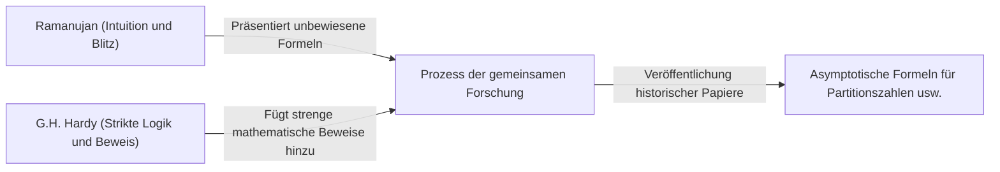

# Srinivasa Ramanujan: Der indische Magier, der Intuition und Unendlichkeit verwob

## 1. Einleitung: Eine "Singularität" in der Welt der Mathematik

Wenn man die Geschichte der Mathematik betrachtet, tauchten in jeder Epoche große Talente auf, die durch die Anhäufung von Logik neue Theorien aufbauten. In dieser langen Geschichte gibt es jedoch eine Person, die ohne an jeglichen gesunden Menschenverstand oder bestehende Rahmenbedingungen gebunden zu sein, Wahrheiten niederschrieb, als hätte sie direkte Inspiration von Gott erhalten. Dies war Srinivasa Ramanujan (1887-1920), der als "indischer Magier" bezeichnet wird.

Sein Leben war so dramatisch wie ein Film: Es begann in extremer Armut, er kam autodidaktisch mit den Tiefen der Mathematik in Berührung und reiste schließlich an die Universität Cambridge in England. Die Tausenden von Formeln und Theoremen, die er hinterließ, verblüfften nicht nur die Mathematiker seiner Zeit, sondern werden auch heute, über ein Jahrhundert später, in hochmodernen wissenschaftlichen Bereichen wie der Schwarze-Loch-Physik und der Stringtheorie weiterhin angewendet.

Dieser Artikel befasst sich eingehend mit dem Leben von Ramanujan, seiner historischen gemeinsamen Forschung mit G.H. Hardy und dem unermesslichen Erbe, das er der modernen Wissenschaft hinterlassen hat.

---

## 2. Herkunft und Kindheit: Erwachen zur Mathematik

Ramanujan wurde am 22. Dezember 1887 in Erode, Tamil Nadu in Südindien, in einer armen Brahmanenfamilie geboren. Von Kindheit an zeigte er ein außergewöhnliches Gedächtnis und mathematische Fähigkeiten und seine schulischen Leistungen waren hervorragend.

Das entscheidende Ereignis für sein Schicksal war die Entdeckung des Buches "Synopsis of Elementary Results in Pure and Applied Mathematics" von George Shoobridge Carr im Alter von 15 Jahren. Dieses Buch war lediglich eine Auflistung von Tausenden von mathematischen Theoremen und Formeln ohne Beweise, sozusagen eine Formelsammlung für Prüfungen. Für Ramanujan jedoch wurde dieses Buch zum besten Lehrbuch. Er versuchte autodidaktisch, diese Formeln zu beweisen, entdeckte nacheinander neue Theoreme und notierte sie in seinen Notizbüchern.

Seine ungewöhnliche Vertiefung in die Mathematik warf jedoch einen Schatten auf sein Leben. Obwohl er ein Universitätsstipendium erhielt, zeigte er absolut kein Interesse an anderen Fächern als Mathematik, fiel wiederholt durch und wurde schließlich von der Universität verwiesen. Danach wechselte er die Arbeitsplätze und verbrachte einsame Tage in extremer Armut, in denen er sich nur mit mathematischen Formeln beschäftigte.

---

## 3. Arbeit bei der Hafenbehörde und der schicksalhafte Brief

Um seinen Lebensunterhalt zu verdienen, begann Ramanujan als Büroangestellter bei der Hafenbehörde von Madras zu arbeiten. Sein Vorgesetzter, Narayana Iyer, war ebenfalls ein Mathematikliebhaber und erkannte Ramanujans außergewöhnliches Talent. Auf Anraten seines Umfelds begann Ramanujan, Briefe mit seinen Forschungsergebnissen an berühmte britische Mathematiker zu senden.

Damals wurden Briefe eines unbekannten indischen jungen Mannes von den meisten Mathematikern als "Geschwätz eines Verrückten" ignoriert. Nur ein genialer Mathematiker erkannte den wahren Wert der Briefe. Dies war Godfrey Harold Hardy (G.H. Hardy) von der Universität Cambridge.

1913 erhielt Hardy einen Brief, der dicht gedrängt mit über 100 komplexen mathematischen Formeln ohne jeglichen Beweis gefüllt war. Zunächst hielt Hardy es für einen Scherz, war aber verblüfft, als er die Formeln genauer untersuchte. Hardy sagte: "Diese könnten nur von Mathematikern höchsten Niveaus erdacht worden sein. Sie müssen wahr sein, denn wenn sie nicht wahr wären, hätte niemand die Vorstellungskraft, so etwas zu erfinden."

---

## 4. Tage in Cambridge: Die Verschmelzung von Intuition und Logik

Im Jahr 1914 reiste Ramanujan dank Hardys Bemühungen über das Meer und wurde an das Trinity College der Universität Cambridge eingeladen. Von hier an begann eine wundersame gemeinsame Forschung, die in die Geschichte der Mathematik einging.

Ramanujan und Hardy hatten völlig gegensätzliche Eigenschaften, wie Wasser und Öl.

Hardy war ein orthodoxer Mathematiker, der strenge Logik und Beweise schätzte. Ramanujan hingegen war ein Genie, das Ergebnisse allein durch Intuition und Geistesblitze ableitete. Laut Ramanujan wurden ihm die Formeln "im Traum von der Göttin Namagiri auf die Zunge geschrieben", und er selbst verstand das Konzept eines Beweises nicht vollständig.

Hardy verrichtete eine sehr heikle Arbeit: Er versuchte, Ramanujans Intuition nicht zu ersticken, während er ihm die strengen Beweismethoden der modernen Mathematik beibrachte. Ihre gemeinsame Forschung war sehr produktiv, und sie veröffentlichten nacheinander wichtige Arbeiten.

---

## 5. Hauptleistungen von Ramanujan

Ramanujans Errungenschaften sind vielfältig, aber besonders in den Bereichen der Zahlentheorie und der unendlichen Reihen bemerkenswert.

### 5.1 Asymptotische Formel für Partitionszahlen (Partitions)
Die Anzahl der Möglichkeiten, eine positive ganze Zahl als Summe positiver ganzer Zahlen darzustellen, wird "Partitionszahl" genannt. Zum Beispiel gibt es für die Zahl 4 fünf Partitionen: (4), (3+1), (2+2), (2+1+1), (1+1+1+1). Bei großen Zahlen steigt die Partitionszahl explosionsartig an, aber Ramanujan und Hardy entwickelten die "Kreismethode" (Circle Method), um die Partitionszahl $p(n)$ einer extrem großen Zahl $n$ mit sehr hoher Genauigkeit zu approximieren, und leiteten eine asymptotische Formel ab. Dies ist eine monumentale Leistung in der analytischen Zahlentheorie.

### 5.2 Unendliche Reihen für Pi
Ramanujan entdeckte viele unendliche Reihen zur Berechnung von Pi ($\pi$) mit einer wahnsinnigen Konvergenzgeschwindigkeit. Seine Formeln sind extrem komplex, werden aber noch heute als Grundlage für Pi-Berechnungsalgorithmen von Computern verwendet.

### 5.3 Ramanujans $\tau$-Funktion
In seinen Studien zu Modulformen definierte Ramanujan eine Funktion $\tau(n)$ und stellte mehrere Vermutungen auf. Diese Vermutungen (Ramanujan-Vermutung) wurden später von anderen Mathematikern bewiesen und hatten tiefgreifende Auswirkungen auf weite Bereiche der modernen Mathematik wie die algebraische Geometrie und die Darstellungstheorie.

---

## 6. Krankheit, früher Tod und das verlorene Notizbuch

Das Leben in England während des Ersten Weltkriegs war für Ramanujan, einen strengen Vegetarier, hart. Nahrungsmittelknappheit, das kalte Klima und Überarbeitung zehrten an seinem Körper, und er erkrankte an Tuberkulose (es wird auch von schwerem Vitaminmangel oder Amöbenruhr der Leber gesprochen).

Es gibt eine berühmte Anekdote mit Hardy, als er den kranken Ramanujan besuchte. Hardy beklagte sich: "Die Nummer meines Taxis war 1729, eine sehr langweilige Zahl." Ramanujan antwortete sofort: "Nein, das ist eine sehr interessante Zahl. Es ist die kleinste Zahl, die auf zwei verschiedene Arten als Summe von zwei Kubikzahlen ausgedrückt werden kann ($1^3 + 12^3 = 9^3 + 10^3$)." Wegen dieser Anekdote wird 1729 als "Taxicab number" bezeichnet.

Obwohl er 1919 nach Indien zurückkehrte, verstarb Ramanujan im folgenden Jahr 1920 im jungen Alter von 32 Jahren.

Bis kurz vor seinem Tod schrieb er in seinem Bett weiterhin mathematische Formeln auf. Das dort geschriebene Notizbuch (das verlorene Notizbuch) war nach seinem Tod jahrzehntelang verschollen, wurde aber 1976 von George Andrews in der Bibliothek der Universität von Pennsylvania entdeckt.

### Mock-Thetafunktionen (Mock Theta Functions)
Die Notizen, die er auf seinem Sterbebett schrieb, enthielten die Theorie einer völlig neuen Funktion, die als "Mock-Thetafunktion" bezeichnet wird. Damals verstand niemand deren Bedeutung, aber zu Beginn des 21. Jahrhunderts stellte sich heraus, dass sie direkt mit Stringtheorie-Modellen zur Berechnung der Entropie von Schwarzen Löchern zusammenhängt. Ramanujan hatte am Rande des Todes die Gleichungen der fortschrittlichsten Astrophysik vorweggenommen.

---

## 7. Fazit: Ein Geschenk Gottes namens Intuition

Die von Srinivasa Ramanujan hinterlassenen Notizbücher sind für Mathematiker bis heute eine unerschöpfliche Quelle von Ideen. Die meisten der von ihm entdeckten Formeln sind mittlerweile bewiesen und systematisiert worden, aber das größte Rätsel, "wie er auf diese Formeln gekommen ist", wird wohl ewig ungelöst bleiben.

Ramanujans Leben lehrt uns, dass "das menschliche Denken und die Intuition noch immer unermessliches Potenzial haben". Seine Leidenschaft und sein Erbe, rein nach der Wahrheit zu suchen, während er unter extremer Armut und Krankheit litt, werden weiterhin ein Licht sein, das die Grenzen der Wissenschaft erhellt.
