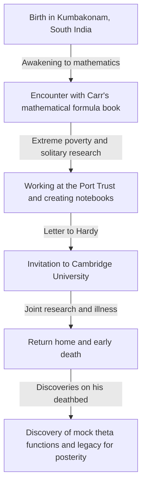
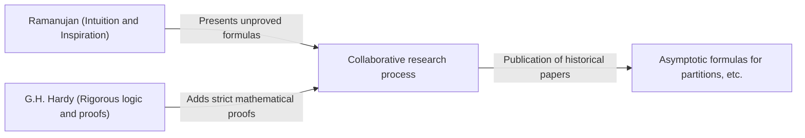

# Srinivasa Ramanujan: The Indian Magician Who Spun Intuition and Infinity

## 1. Introduction: A "Singularity" that Descended upon the Mathematical World

Looking back at the history of mathematics, great talents have emerged in every era, building new theories through the accumulation of logic. However, in that long history, there is one person who, unbound by any common sense or existing frameworks, wrote down truths as if directly inspired by God. That is Srinivasa Ramanujan (1887-1920), known as the "Indian Magician."

His life was as dramatic as a movie, starting from an environment of extreme poverty, touching the depths of mathematics through self-study, and crossing over to Cambridge University in England. The thousands of formulas and theorems he left behind not only astonished mathematicians of his time, but even now, over a century later, continue to be applied in cutting-edge scientific fields such as black hole physics and string theory.

In this article, we will delve deep into Ramanujan's life, his historic collaboration with G.H. Hardy, and the immeasurable legacy he left on modern science.

---

## 2. Early Life and Childhood: Awakening to Mathematics

Ramanujan was born on December 22, 1887, into a poor Brahmin family in Erode, Tamil Nadu, South India. From a young age, he showed extraordinary memory and calculation abilities, and his school grades were exceptionally excellent.

What decided his fate was his encounter at age 15 with George Shoobridge Carr's book "Synopsis of Elementary Results in Pure and Applied Mathematics." This book was essentially a collection of formulas for exam preparation, simply listing thousands of mathematical theorems and formulas without proofs. However, for Ramanujan, this book became the ultimate textbook. He attempted to prove these formulas on his own, and furthermore, began discovering new theorems one after another, writing them down in his notebook.

However, his extraordinary immersion in mathematics cast a shadow over his life. Although he obtained a university scholarship, he showed absolutely no interest in subjects other than mathematics, repeatedly failing, and eventually had to drop out of university. After that, he changed jobs frequently, continuing his solitary days of facing mathematical formulas in extreme poverty.

---

## 3. Working at the Port Trust and the Fateful Letter

To earn a living, Ramanujan began working as a clerk at the Madras Port Trust. His boss, Narayana Iyer, was also a mathematics enthusiast and noticed Ramanujan's extraordinary talent. Encouraged by those around him, Ramanujan began sending letters summarizing his research results to prominent British mathematicians.

At the time, letters from an unknown Indian youth were ignored by many mathematicians as the "ravings of a madman." However, only one genius mathematician saw the true value of the letter. That was Godfrey Harold Hardy of Cambridge University.

In 1913, the letter that arrived to Hardy contained over 100 complex mathematical formulas tightly written without any proofs. At first, Hardy thought it might be a hoax, but as he examined the formulas closely, he was astonished. Hardy stated, "They must be true because, if they were not true, no one would have had the imagination to invent them."

---

## 4. Days at Cambridge: The Fusion of Intuition and Logic

In 1914, through Hardy's efforts, Ramanujan crossed the sea and was invited to Trinity College, Cambridge University. From here, a miraculous collaborative research project that would remain in the history of mathematics began.

Ramanujan and Hardy had exact opposite characteristics, like oil and water.

Hardy was an orthodox mathematician who valued rigorous logic and proof. On the other hand, Ramanujan was a genius who derived only conclusions through intuition and inspiration. According to Ramanujan, formulas were "written on his tongue by the goddess Namagiri in his dreams," and he did not fully understand the concept of proof itself.

Hardy undertook the extremely delicate task of teaching Ramanujan the strict proof methods of modern mathematics without killing his intuition. Their collaboration was prolific, publishing important papers one after another.

---

## 5. Ramanujan's Major Achievements

Ramanujan's achievements span a wide range of fields, but they are particularly prominent in number theory and infinite series.

### 5.1 Asymptotic Formula for Partitions
The number of ways a positive integer can be expressed as a sum of positive integers is called the "partition number." For example, the partitions of 4 are (4), (3+1), (2+2), (2+1+1), (1+1+1+1), which is 5 ways. As the number increases, the partition number explodes, but Ramanujan and Hardy developed the "Circle Method" to approximate the partition number $p(n)$ of a huge number $n$ with extremely high precision, deriving an asymptotic formula. This is a monumental achievement in analytic number theory.

### 5.2 Infinite Series for Pi
Ramanujan discovered numerous infinite series for calculating pi $\pi$ that possess extraordinary convergence speeds. His formulas are complex and bizarre, but they are still used today as the basis for computer algorithms to calculate pi.

### 5.3 Ramanujan's $\tau$ Function
In the study of modular forms, Ramanujan defined a function called $\tau(n)$ and made several conjectures. These conjectures (Ramanujan conjectures) were proven by later mathematicians and have had a profound impact on a broad range of modern mathematical fields, such as algebraic geometry and representation theory.

---

## 6. Illness, Early Death, and the Lost Notebook

Life in Britain during World War I was harsh for Ramanujan, who was a strict vegetarian. Food shortages, cold weather, and overwork eroded his body, and he developed tuberculosis (or, as some suggest, severe vitamin deficiency or hepatic amebiasis).

There is a famous episode with Hardy when he visited Ramanujan after he fell ill. Hardy complained, "The taxi I rode in had the boring number 1729." Ramanujan instantly replied, "No, it is a very interesting number; it is the smallest number expressible as the sum of two cubes in two different ways ($1^3 + 12^3 = 9^3 + 10^3$)." From this episode, 1729 came to be known as the "Taxicab number."

Although he returned to India in 1919, Ramanujan passed away the following year, in 1920, at the young age of 32.

Until just before his death, he continued to write mathematical formulas in bed. The notebook he wrote there (the lost notebook) went missing for decades after it left his hands, but was discovered in 1976 by George Andrews in the library of Pennsylvania University.

### Mock Theta Functions
The notebook written on his deathbed contained a completely new mathematical theory called "mock theta functions." At the time, no one understood its meaning, but entering the 21st century, it was revealed that this directly relates to string theory models for calculating the entropy of black holes. Ramanujan, on the verge of death, had anticipated the equations of cutting-edge astrophysics.

---

## 7. Conclusion: A Gift from God Called Intuition

The notebooks left by Srinivasa Ramanujan are still an inexhaustible source of ideas for mathematicians today. Many of the mathematical formulas he discovered have now been proven and systematized, but the greatest mystery of "how he was inspired by those formulas" will never be solved.

Ramanujan's life teaches us that "there are still unfathomable possibilities in human thought and intuition." His passion and legacy of purely pursuing truth while suffering from extreme poverty and illness will continue to be a light illuminating the frontiers of science.
