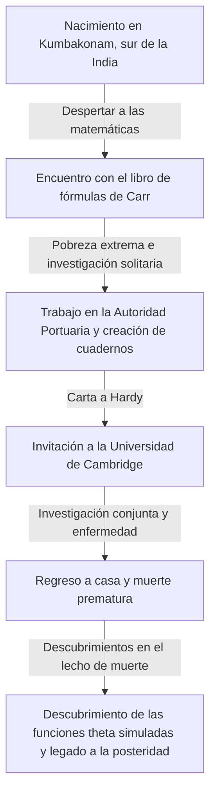
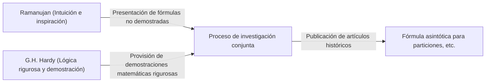

# Srinivasa Ramanujan: El mago indio que tejió la intuición y el infinito

## 1. Introducción: La "Singularidad" que descendió al mundo de las matemáticas

Al desentrañar la historia de las matemáticas, han aparecido grandes talentos en cada época, construyendo nuevas teorías a través de la acumulación de la lógica. Sin embargo, en esta larga historia, hay una persona que, sin estar atada al sentido común o a los marcos existentes, escribió verdades como si recibiera inspiración directa de Dios. Se trata de Srinivasa Ramanujan (1887-1920), conocido como el "Mago de la India".

Su vida fue tan dramática como una película: comenzó en un entorno de extrema pobreza, se adentró en el abismo de las matemáticas de forma autodidacta y viajó a la Universidad de Cambridge en Inglaterra. Las miles de fórmulas y teoremas que dejó no solo asombraron a los matemáticos de su tiempo, sino que más de un siglo después, siguen aplicándose en los campos científicos más avanzados, como la física de los agujeros negros y la teoría de cuerdas.

En este artículo profundizaremos en la vida de Ramanujan, su histórica investigación conjunta con G.H. Hardy y el incalculable legado que dejó a la ciencia moderna.

---

## 2. Origen e infancia: El despertar a las matemáticas

Ramanujan nació el 22 de diciembre de 1887 en Erode, estado de Tamil Nadu, en el sur de la India, en el seno de una familia brahmán pobre. Desde su infancia, mostró una memoria y habilidades de cálculo excepcionales, con excelentes calificaciones escolares.

Lo que determinó su destino fue el encuentro a los 15 años con el libro "Synopsis of Elementary Results in Pure and Applied Mathematics" de George Shoobridge Carr. Este libro era simplemente una recopilación de miles de teoremas y fórmulas matemáticas listados sin demostración, destinado para la preparación de exámenes. Sin embargo, para Ramanujan, este libro se convirtió en el mejor libro de texto. Intentó demostrar estas fórmulas de forma autodidacta y comenzó a descubrir por sí mismo nuevos teoremas uno tras otro, anotándolos en su cuaderno.

Sin embargo, su inmersión anormal en las matemáticas ensombreció su vida. Aunque obtuvo una beca universitaria, no mostró ningún interés en materias que no fueran matemáticas, reprobó repetidamente y finalmente fue expulsado de la universidad. Posteriormente, cambiando de un trabajo a otro, pasó días solitarios enfrentándose únicamente a fórmulas matemáticas en medio de una pobreza extrema.

---

## 3. Trabajo en la Autoridad Portuaria y la carta del destino

Para ganarse la vida, Ramanujan comenzó a trabajar como oficinista en la Autoridad Portuaria de Madrás. Su jefe, Narayana Iyer, también era un amante de las matemáticas y notó el talento extraordinario de Ramanujan. Animado por quienes lo rodeaban, Ramanujan comenzó a enviar cartas resumiendo los resultados de sus investigaciones a destacados matemáticos británicos.

En aquel entonces, las cartas de un joven indio desconocido fueron ignoradas por muchos matemáticos como "desvaríos de un loco". Sin embargo, un solo matemático genial reconoció el verdadero valor de esas cartas. Fue Godfrey Harold Hardy (G.H. Hardy) de la Universidad de Cambridge.

En 1913, la carta que recibió Hardy estaba repleta de más de 100 complejas fórmulas matemáticas, sin ninguna demostración. Al principio, Hardy pensó que era una broma, pero al examinar las fórmulas de cerca, quedó asombrado. Hardy dijo: "Estas deben ser verdad, porque si no lo fueran, nadie tendría la imaginación para inventarlas".

---

## 4. Días en Cambridge: Fusión de intuición y lógica

En 1914, gracias a los esfuerzos de Hardy, Ramanujan cruzó el océano y fue invitado al Trinity College de la Universidad de Cambridge. A partir de aquí, comienza una milagrosa investigación conjunta que quedaría en la historia de las matemáticas.

Ramanujan y Hardy tenían cualidades diametralmente opuestas, como el agua y el aceite.

Hardy era un matemático ortodoxo que valoraba la lógica rigurosa y la demostración. Por otro lado, Ramanujan era un genio que deducía conclusiones únicamente a través de la intuición y la inspiración. Según Ramanujan, las fórmulas eran "escritas en su lengua por la diosa Namagiri en sueños", y no comprendía del todo el concepto mismo de demostración.

Hardy realizó un trabajo muy delicado al enseñarle a Ramanujan los métodos de demostración rigurosa de las matemáticas modernas sin destruir su intuición. La investigación conjunta de los dos fue prolífica y publicaron importantes artículos uno tras otro.

---

## 5. Principales logros de Ramanujan

Los logros que dejó Ramanujan abarcan una amplia gama, pero son particularmente notables en los campos de la teoría de números y las series infinitas.

### 5.1 Fórmula asintótica de las particiones (Partitions)
El número de formas de expresar un entero positivo como suma de enteros positivos se llama "partición". Por ejemplo, las particiones de 4 son (4), (3+1), (2+2), (2+1+1) y (1+1+1+1), un total de 5 formas. A medida que el número crece, el número de particiones aumenta explosivamente, pero Ramanujan y Hardy desarrollaron el "Método del Círculo" para aproximar la partición $p(n)$ de un número enorme $n$ con una precisión extremadamente alta, y derivaron una fórmula asintótica. Este es un logro monumental en la teoría analítica de números.

### 5.2 Series infinitas de Pi
Ramanujan descubrió muchas series infinitas con una velocidad de convergencia inusual para calcular el valor de pi $\pi$. Sus fórmulas son complejas y extrañas, pero todavía se utilizan hoy en día como base para los algoritmos informáticos de cálculo de pi.

### 5.3 La función $\tau$ de Ramanujan
En el estudio de las formas modulares, Ramanujan definió una función llamada $\tau(n)$ y formuló varias conjeturas. Estas conjeturas (conjeturas de Ramanujan) fueron demostradas por matemáticos posteriores y tuvieron un profundo impacto en una amplia gama de campos de las matemáticas modernas, como la geometría algebraica y la teoría de representaciones.

---

## 6. Enfermedad, muerte prematura y los cuadernos perdidos

La vida en Inglaterra durante la Primera Guerra Mundial fue dura para Ramanujan, que era un vegetariano estricto. La escasez de alimentos, el clima frío y el exceso de trabajo mermaron su cuerpo y desarrolló tuberculosis (también se dice que fue una deficiencia grave de vitaminas o amebiasis hepática).

Hay una famosa anécdota con Hardy cuando visitó a un Ramanujan enfermo en la cama. Cuando Hardy se quejó de que "el número del taxi en el que vine era 1729, un número muy aburrido", Ramanujan respondió de inmediato: "No, es un número muy interesante. Es el número más pequeño expresable como la suma de dos cubos de dos maneras diferentes ($1^3 + 12^3 = 9^3 + 10^3$)". A partir de esta anécdota, al 1729 se le conoció como el "número de Hardy-Ramanujan" o "número de taxi" (Taxicab number).

Aunque regresó a la India en 1919, al año siguiente, 1920, Ramanujan falleció a la temprana edad de 32 años.

Hasta justo antes de su muerte, continuó escribiendo fórmulas matemáticas en su cama. El cuaderno escrito allí (el cuaderno perdido) estuvo desaparecido durante décadas después de salir de sus manos, pero fue descubierto en 1976 por George Andrews en la biblioteca de la Universidad de Pensilvania.

### Funciones Theta Simuladas (Mock Theta Functions)
El cuaderno escrito en este lecho de muerte contenía una teoría de funciones completamente nueva llamadas "funciones theta simuladas". En ese momento, nadie entendía su significado, pero en el siglo XXI se descubrió que estaban directamente relacionadas con el modelo de la teoría de cuerdas para calcular la entropía de los agujeros negros. Ramanujan, al borde de la muerte, se había anticipado a las ecuaciones de la astrofísica más avanzada.

---

## 7. Conclusión: Un regalo de los dioses llamado intuición

Los cuadernos dejados por Srinivasa Ramanujan siguen siendo una fuente inagotable de ideas para los matemáticos actuales. Muchas de las fórmulas que descubrió han sido demostradas y sistematizadas en la actualidad, pero el mayor misterio de "cómo se le ocurrieron esas fórmulas" nunca se resolverá.

La vida de Ramanujan nos enseña que "el pensamiento y la intuición humanos aún tienen un potencial insondable". Su pasión y legado de buscar puramente la verdad a pesar de sufrir una pobreza extrema y enfermedades continuarán iluminando las fronteras de la ciencia en el futuro.
