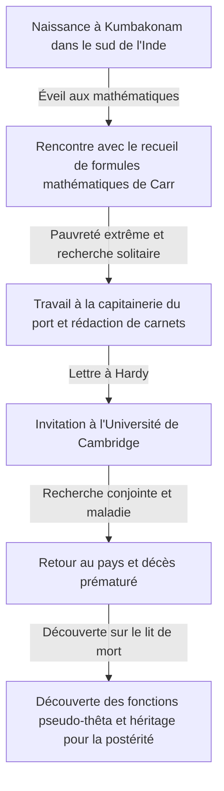
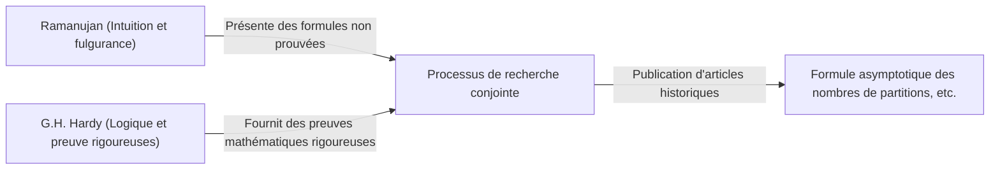

# Srinivasa Ramanujan : Le magicien indien qui a tissé l'intuition et l'infini

## 1. Introduction : Une "singularité" descendue dans le monde des mathématiques

Si l'on étudie l'histoire des mathématiques, on constate que de grands talents sont apparus à chaque époque, construisant de nouvelles théories par l'accumulation de la logique. Cependant, au cours de cette longue histoire, il y a une personne qui, sans se soucier du bon sens ou des cadres existants, a écrit la vérité comme si elle avait été directement inspirée par Dieu. Il s'agit de Srinivasa Ramanujan (1887-1920), surnommé "le magicien indien".

Sa vie, qui a commencé dans l'extrême pauvreté, a touché aux abysses des mathématiques en autodidacte, pour finalement traverser l'océan jusqu'à l'Université de Cambridge en Angleterre, est aussi dramatique qu'un film. Les milliers de formules et théorèmes qu'il a laissés n'ont pas seulement stupéfié les mathématiciens de son époque, mais continuent d'être appliqués, plus d'un siècle plus tard, dans les domaines scientifiques les plus pointus comme la physique des trous noirs et la théorie des cordes.

Dans cet article, nous explorerons en profondeur la vie de Ramanujan, ses recherches conjointes historiques avec G.H. Hardy, et l'héritage incommensurable qu'il a laissé à la science moderne.

---

## 2. Naissance et enfance : L'éveil aux mathématiques

Ramanujan est né le 22 décembre 1887 dans une famille brahmane pauvre d'Erode, dans l'État du Tamil Nadu, au sud de l'Inde. Dès son enfance, il a fait preuve d'une mémoire et de capacités de calcul exceptionnelles, avec d'excellents résultats scolaires.

Ce qui a scellé son destin, c'est sa rencontre à l'âge de 15 ans avec le livre de George Shoobridge Carr, "Synopsis of Elementary Results in Pure and Applied Mathematics". Ce livre était une collection de formules de préparation aux examens, listant des milliers de théorèmes et formules mathématiques sans démonstration. Cependant, pour Ramanujan, ce livre est devenu le meilleur des manuels. Il a essayé de prouver ces formules par lui-même en autodidacte, et a même commencé à découvrir de nouveaux théorèmes les uns après les autres, les consignant dans ses propres carnets.

Cependant, son immersion anormale dans les mathématiques a jeté une ombre sur sa vie. Bien qu'il ait obtenu une bourse universitaire, il n'a montré aucun intérêt pour les matières autres que les mathématiques, échouant à plusieurs reprises, jusqu'à ce qu'il soit finalement expulsé de l'université. Par la suite, il a enchaîné divers emplois, passant des journées solitaires, plongé dans des équations dans une pauvreté absolue.

---

## 3. Travail à la capitainerie du port et la lettre du destin

Pour gagner sa vie, Ramanujan a commencé à travailler comme commis au bureau de la capitainerie du port de Madras. Son supérieur, Narayana Iyer, était également un passionné de mathématiques et a remarqué le talent extraordinaire de Ramanujan. Poussé par son entourage, Ramanujan a commencé à envoyer des lettres résumant les résultats de ses recherches à des mathématiciens britanniques de renom.

À l'époque, les lettres d'un jeune Indien inconnu ont été ignorées par de nombreux mathématiciens comme étant les "divagations d'un fou". Cependant, un seul génie des mathématiques a vu la véritable valeur de ces lettres. C'était Godfrey Harold Hardy (G.H. Hardy) de l'Université de Cambridge.

En 1913, la lettre que Hardy a reçue était remplie de plus de 100 formules mathématiques complexes écrites sans aucune démonstration. Au début, Hardy a pensé à une blague, mais en examinant attentivement les équations, il a été stupéfait. Hardy a déclaré : "Celles-ci ne pourraient même pas être imaginées par un mathématicien qui n'est pas du plus haut niveau. Elles doivent être vraies, car si elles ne l'étaient pas, personne n'aurait l'imagination nécessaire pour les inventer."

---

## 4. Les jours à Cambridge : Fusion de l'intuition et de la logique

En 1914, grâce aux efforts de Hardy, Ramanujan a traversé la mer pour être invité au Trinity College de l'Université de Cambridge. C'est de là qu'a commencé une recherche conjointe miraculeuse dans l'histoire des mathématiques.

Ramanujan et Hardy avaient des personnalités diamétralement opposées, comme l'eau et l'huile.

Hardy était un mathématicien orthodoxe qui valorisait la logique rigoureuse et la démonstration. D'autre part, Ramanujan était un génie qui tirait des conclusions uniquement par l'intuition et l'inspiration. Selon Ramanujan, les formules étaient "écrites sur sa langue par la déesse Namagiri dans ses rêves", et il ne comprenait pas vraiment le concept de preuve lui-même.

Hardy a effectué un travail très délicat consistant à enseigner à Ramanujan les méthodes de preuve rigoureuses des mathématiques modernes, tout en veillant à ne pas étouffer son intuition. Les recherches conjointes des deux hommes ont été prolifiques, publiant d'importants articles l'un après l'autre.

---

## 5. Principales réalisations de Ramanujan

Les réalisations laissées par Ramanujan sont très variées, mais elles sont particulièrement remarquables dans les domaines de la théorie des nombres et des séries infinies.

### 5.1 Formule asymptotique des partitions
Le nombre de façons dont un entier positif peut être exprimé comme la somme d'entiers positifs est appelé "nombre de partitions". Par exemple, le nombre de partitions de 4 est 5 : (4), (3+1), (2+2), (2+1+1), (1+1+1+1). À mesure que les nombres s'agrandissent, le nombre de partitions augmente de manière explosive, mais Ramanujan et Hardy ont développé la "méthode du cercle", qui permet d'obtenir une approximation extrêmement précise du nombre de partitions $p(n)$ pour un grand nombre $n$, et en ont déduit une formule asymptotique. C'est une réalisation monumentale en théorie analytique des nombres.

### 5.2 Séries infinies de Pi
Ramanujan a découvert de nombreuses séries infinies pour calculer le nombre $\pi$, avec des vitesses de convergence incroyables. Ses formules sont extrêmement complexes, mais elles sont toujours utilisées aujourd'hui comme base des algorithmes informatiques de calcul de pi.

### 5.3 Fonction $\tau$ de Ramanujan
Dans l'étude des formes modulaires, Ramanujan a défini une fonction appelée $\tau(n)$ et a formulé plusieurs conjectures. Ces conjectures (conjectures de Ramanujan) ont été prouvées par des mathématiciens ultérieurs, et ont eu un impact profond sur de vastes domaines des mathématiques modernes, tels que la géométrie algébrique et la théorie des représentations.

---

## 6. Maladie, mort prématurée et carnets perdus

La vie en Angleterre pendant la Première Guerre mondiale a été dure pour Ramanujan, qui était un végétarien strict. Les pénuries alimentaires, le climat froid et le travail acharné ont ravagé son corps, et il a développé la tuberculose (ou, selon certains, une grave carence en vitamines ou une amibiase hépatique).

Il y a une célèbre anecdote avec Hardy lorsqu'il a rendu visite à Ramanujan alité. Lorsque Hardy s'est plaint : "Le numéro de mon taxi était 1729, un nombre très ennuyeux", Ramanujan a immédiatement répondu : "Non, c'est un nombre très intéressant. C'est le plus petit nombre qui peut être exprimé comme la somme de deux cubes de deux manières différentes ($1^3 + 12^3 = 9^3 + 10^3$)." Depuis cette anecdote, 1729 est appelé le "nombre de Hardy-Ramanujan" ou "nombre du taxi (Taxicab number)".

Bien qu'il soit retourné en Inde en 1919, l'année suivante, en 1920, Ramanujan a quitté ce monde au jeune âge de 32 ans.

Jusqu'à juste avant sa mort, il a continué à écrire des équations dans son lit. Les carnets qu'il a écrits là (les carnets perdus), après avoir quitté ses mains, ont disparu pendant des décennies, mais ont été découverts en 1976 par George Andrews dans la bibliothèque de l'Université de Pennsylvanie.

### Fonctions pseudo-thêta (Mock Theta Functions)
Ces notes, écrites sur son lit de mort, contenaient la théorie d'une toute nouvelle classe de fonctions appelées "fonctions pseudo-thêta". Personne ne comprenait leur signification à l'époque, mais au 21e siècle, on a découvert qu'elles étaient directement liées au modèle de la théorie des cordes permettant de calculer l'entropie d'un trou noir. Ramanujan, au bord de la mort, avait anticipé les équations de l'astrophysique la plus avancée.

---

## 7. Conclusion : Un cadeau de Dieu appelé intuition

Les carnets laissés par Srinivasa Ramanujan restent aujourd'hui encore une source inépuisable d'idées pour les mathématiciens. De nombreuses formules qu'il a découvertes ont été prouvées et systématisées aujourd'hui, mais le plus grand mystère de "comment il a eu l'intuition de ces formules" ne sera probablement jamais résolu.

La vie de Ramanujan nous enseigne que "la pensée humaine et l'intuition ont encore un potentiel insondable". Sa passion et son héritage de recherche de la vérité pure, tout en souffrant d'extrême pauvreté et de maladie, continueront d'être une lumière éclairant les frontières de la science.
