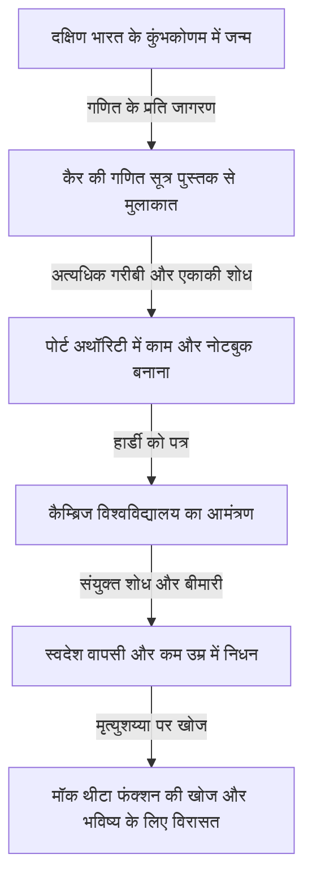
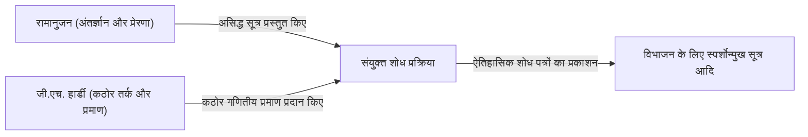

# श्रीनिवास रामानुजन: भारतीय जादूगर जिसने अंतर्ज्ञान और अनंत को पिरोया

## 1. परिचय: गणित की दुनिया में उतरी एक "विलक्षणता"

गणित के इतिहास को देखें, तो हर युग में महान प्रतिभाएँ सामने आई हैं, जिन्होंने तर्क के संचय के माध्यम से नए सिद्धांतों का निर्माण किया है। हालाँकि, इस लंबे इतिहास में एक ऐसा व्यक्ति है जिसने किसी भी सामान्य ज्ञान या मौजूदा ढांचे से बंधे बिना, सत्य को इस तरह लिखा मानो उसे सीधे ईश्वर से प्रेरणा मिली हो। वह व्यक्ति श्रीनिवास रामानुजन (1887-1920) हैं, जिन्हें "भारत का जादूगर" कहा जाता है।

उनका जीवन किसी फिल्म की तरह नाटकीय था: घोर गरीबी के माहौल में शुरुआत, स्व-अध्ययन के माध्यम से गणित की गहराइयों को छूना, और फिर इंग्लैंड में कैम्ब्रिज विश्वविद्यालय तक का सफर। उनके द्वारा छोड़े गए हजारों सूत्र और प्रमेय न केवल उस समय के गणितज्ञों को चकित कर गए, बल्कि एक सदी से अधिक समय बीत जाने के बाद भी, ब्लैक होल भौतिकी और स्ट्रिंग थ्योरी जैसे अत्याधुनिक वैज्ञानिक क्षेत्रों में लागू हो रहे हैं।

इस लेख में, हम रामानुजन के जीवन, जी.एच. हार्डी के साथ उनके ऐतिहासिक संयुक्त शोध, और आधुनिक विज्ञान पर उनके अमूल्य प्रभाव के बारे में गहराई से जानेंगे।

---

## 2. जन्म और बचपन: गणित के प्रति जागरण

रामानुजन का जन्म 22 दिसंबर, 1887 को दक्षिण भारत के तमिलनाडु राज्य के इरोड में एक गरीब ब्राह्मण परिवार में हुआ था। बचपन से ही उन्होंने असाधारण स्मृति और गणना क्षमता का प्रदर्शन किया, और स्कूल में उनके ग्रेड उत्कृष्ट थे।

उनके भाग्य का निर्धारण तब हुआ जब 15 वर्ष की आयु में उनकी मुलाकात जॉर्ज शूब्रिज कैर की पुस्तक "Synopsis of Elementary Results in Pure and Applied Mathematics" से हुई। यह पुस्तक केवल परीक्षा की तैयारी के लिए थी, जिसमें हजारों गणितीय प्रमेयों और सूत्रों को बिना किसी प्रमाण के सूचीबद्ध किया गया था। हालाँकि, रामानुजन के लिए, यह पुस्तक उनकी सबसे अच्छी पाठ्यपुस्तक बन गई। उन्होंने इन सूत्रों को स्वयं सिद्ध करने का प्रयास किया और अपने नोटबुक में एक के बाद एक नए प्रमेय खोजना और लिखना शुरू कर दिया।

हालाँकि, गणित में उनके इस असामान्य विसर्जन ने उनके जीवन पर बुरा असर डाला। विश्वविद्यालय से छात्रवृत्ति प्राप्त करने के बावजूद, उन्होंने गणित के अलावा किसी अन्य विषय में कोई रुचि नहीं दिखाई, बार-बार फेल हुए, और अंततः उन्हें विश्वविद्यालय से निकाल दिया गया। उसके बाद, एक काम से दूसरे काम में भटकते हुए, उन्होंने अत्यंत गरीबी में केवल गणितीय सूत्रों का सामना करते हुए अकेले दिन बिताए।

---

## 3. पोर्ट अथॉरिटी में काम और भाग्य का पत्र

अपनी आजीविका कमाने के लिए, रामानुजन ने मद्रास पोर्ट ट्रस्ट में एक क्लर्क के रूप में काम करना शुरू किया। उनके बॉस, नारायण अय्यर, भी गणित के प्रेमी थे और उन्होंने रामानुजन की असाधारण प्रतिभा को पहचाना। अपने आस-पास के लोगों के प्रोत्साहन से, रामानुजन ने अपने शोध परिणामों का सारांश देते हुए प्रमुख ब्रिटिश गणितज्ञों को पत्र भेजना शुरू किया।

उस समय, एक अज्ञात भारतीय युवक के पत्रों को कई गणितज्ञों ने "पागल की बकवास" मानकर अनदेखा कर दिया। हालाँकि, केवल एक प्रतिभाशाली गणितज्ञ ने उन पत्रों के असली मूल्य को पहचाना। वे कैम्ब्रिज विश्वविद्यालय के गॉडफ्रे हेरोल्ड हार्डी (G.H. Hardy) थे।

1913 में, हार्डी को जो पत्र मिला, उसमें 100 से अधिक जटिल गणितीय सूत्र बिना किसी प्रमाण के लिखे हुए थे। पहले तो हार्डी ने सोचा कि यह कोई मज़ाक है, लेकिन सूत्रों की करीब से जाँच करने पर वे चकित रह गए। हार्डी ने कहा, "ये सूत्र सत्य होने चाहिए, क्योंकि यदि वे सत्य नहीं होते, तो किसी में भी इनका आविष्कार करने की कल्पना नहीं होती।"

---

## 4. कैम्ब्रिज में दिन: अंतर्ज्ञान और तर्क का संगम

1914 में, हार्डी के प्रयासों के कारण, रामानुजन ने समुद्र पार किया और उन्हें कैम्ब्रिज विश्वविद्यालय के ट्रिनिटी कॉलेज में आमंत्रित किया गया। यहीं से गणित के इतिहास में एक चमत्कारी संयुक्त शोध शुरू हुआ।

रामानुजन और हार्डी में पानी और तेल की तरह बिल्कुल विपरीत गुण थे।

हार्डी एक रूढ़िवादी गणितज्ञ थे जो कठोर तर्क और प्रमाण को महत्व देते थे। दूसरी ओर, रामानुजन एक प्रतिभाशाली व्यक्ति थे जो केवल अंतर्ज्ञान और प्रेरणा के माध्यम से निष्कर्ष निकालते थे। रामानुजन के अनुसार, सूत्र "स्वप्न में देवी नामगिरी द्वारा उनकी जीभ पर लिखे जाते थे", और वे प्रमाण की अवधारणा को पूरी तरह से नहीं समझते थे।

हार्डी ने रामानुजन के अंतर्ज्ञान को नष्ट किए बिना उन्हें आधुनिक गणित के कठोर प्रमाणों के तरीके सिखाने का बहुत ही नाजुक काम किया। इन दोनों का संयुक्त शोध बहुत ही फलदायी रहा और उन्होंने एक के बाद एक महत्वपूर्ण शोध पत्र प्रकाशित किए।

---

## 5. रामानुजन की प्रमुख उपलब्धियां

रामानुजन की उपलब्धियां कई क्षेत्रों में फैली हुई हैं, लेकिन संख्या सिद्धांत और अनंत श्रृंखला के क्षेत्र में वे विशेष रूप से उल्लेखनीय हैं।

### 5.1 विभाजनों (Partitions) के लिए स्पर्शोन्मुख सूत्र
किसी धनात्मक पूर्णांक को धनात्मक पूर्णांकों के योग के रूप में व्यक्त करने के तरीकों की संख्या को "विभाजन" कहा जाता है। उदाहरण के लिए, 4 के विभाजन (4), (3+1), (2+2), (2+1+1), और (1+1+1+1) हैं, कुल 5 तरीके। जैसे-जैसे संख्या बढ़ती है, विभाजनों की संख्या विस्फोटक रूप से बढ़ती है, लेकिन रामानुजन और हार्डी ने एक विशाल संख्या $n$ के विभाजन $p(n)$ का अत्यंत उच्च सटीकता के साथ अनुमान लगाने के लिए "सर्कल मेथड" विकसित किया और एक स्पर्शोन्मुख सूत्र प्राप्त किया। विश्लेषणात्मक संख्या सिद्धांत में यह एक स्मारकीय उपलब्धि है।

### 5.2 पाई की अनंत श्रृंखला
रामानुजन ने पाई $\pi$ की गणना के लिए असामान्य अभिसरण गति वाली कई अनंत श्रृंखलाओं की खोज की। उनके सूत्र जटिल और विचित्र हैं, लेकिन आज भी वे कंप्यूटर द्वारा पाई की गणना के लिए एल्गोरिदम के आधार के रूप में उपयोग किए जाते हैं।

### 5.3 रामानुजन का $\tau$ फंक्शन
मॉड्यूलर रूपों के अध्ययन में, रामानुजन ने $\tau(n)$ नामक एक फलन को परिभाषित किया और कई अनुमान लगाए। ये अनुमान (रामानुजन के अनुमान) बाद के गणितज्ञों द्वारा सिद्ध किए गए और उन्होंने आधुनिक गणित के एक विस्तृत क्षेत्र, जैसे बीजीय ज्यामिति और प्रतिनिधित्व सिद्धांत, पर गहरा प्रभाव डाला।

---

## 6. बीमारी, कम उम्र में निधन, और खोई हुई नोटबुक

प्रथम विश्व युद्ध के दौरान इंग्लैंड में जीवन रामानुजन के लिए बहुत कठिन था, जो एक सख्त शाकाहारी थे। भोजन की कमी, ठंडी जलवायु, और अत्यधिक काम ने उनके शरीर को कमज़ोर कर दिया, और उन्हें तपेदिक (या संभवतः विटामिन की गंभीर कमी या यकृत अमीबायसिस) हो गया।

हार्डी से जुड़ी एक प्रसिद्ध कहानी है जब वे बीमार रामानुजन को देखने अस्पताल गए थे। जब हार्डी ने शिकायत की कि "जिस टैक्सी में मैं आया था उसका नंबर 1729 था, जो बहुत ही उबाऊ नंबर है," तो रामानुजन ने तुरंत जवाब दिया, "नहीं, यह बहुत ही दिलचस्प संख्या है। यह सबसे छोटी संख्या है जिसे दो अलग-अलग तरीकों से दो घनों के योग के रूप में व्यक्त किया जा सकता है ($1^3 + 12^3 = 9^3 + 10^3$)।" इस घटना से, 1729 को "टैक्सीकैब नंबर" के रूप में जाना जाने लगा।

यद्यपि वे 1919 में भारत लौट आए, लेकिन अगले वर्ष 1920 में, रामानुजन का मात्र 32 वर्ष की अल्पायु में निधन हो गया।

अपनी मृत्यु से ठीक पहले तक वे बिस्तर पर गणितीय सूत्र लिखते रहे। वहां लिखी गई नोटबुक (खोई हुई नोटबुक) उनके निधन के बाद दशकों तक गायब रही, लेकिन 1976 में जॉर्ज एंड्रयूज द्वारा पेंसिल्वेनिया विश्वविद्यालय के पुस्तकालय में खोजी गई।

### मॉक थीटा फंक्शन (Mock Theta Functions)
মৃত্যुशय्या पर लिखी गई इस नोटबुक में "मॉक थीटा फंक्शन" नामक एक पूरी तरह से नए फलन का सिद्धांत शामिल था। उस समय, कोई भी इसके अर्थ को नहीं समझ सका, लेकिन 21वीं सदी में यह पता चला कि वे सीधे ब्लैक होल की एन्ट्रापी की गणना करने वाले स्ट्रिंग थ्योरी के मॉडल से संबंधित हैं। अपनी मृत्यु के कगार पर, रामानुजन ने अत्याधुनिक खगोल भौतिकी के समीकरणों की भविष्यवाणी कर दी थी।

---

## 7. निष्कर्ष: ईश्वर का उपहार जिसे अंतर्ज्ञान कहा जाता है

श्रीनिवास रामानुजन द्वारा छोड़ी गई नोटबुक आज भी गणितज्ञों के लिए विचारों का एक अटूट स्रोत बनी हुई है। उनके द्वारा खोजे गए कई सूत्र अब सिद्ध और व्यवस्थित किए जा चुके हैं, लेकिन "उन्हें वे सूत्र कैसे सूझे" यह सबसे बड़ा रहस्य कभी नहीं सुलझ पाएगा।

रामानुजन का जीवन हमें सिखाता है कि "मानव विचार और अंतर्ज्ञान में अभी भी असीमित संभावनाएं हैं।" घोर गरीबी और बीमारी से पीड़ित होने के बावजूद शुद्ध रूप से सत्य की खोज करने का उनका जुनून और विरासत भविष्य में विज्ञान की सीमाओं को रोशन करती रहेगी।
