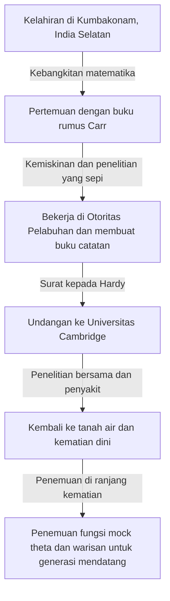

# Srinivasa Ramanujan: Penyihir India yang Merangkai Intuisi dan Ketidakterbatasan

## 1. Pendahuluan: "Singularitas" yang Turun di Dunia Matematika

Melihat kembali sejarah matematika, bakat-bakat hebat muncul di setiap era dan membangun teori-teori baru melalui akumulasi logika. Namun, dalam sejarah panjang tersebut, ada seseorang yang menuliskan kebenaran seolah-olah menerima inspirasi langsung dari Tuhan, tanpa terikat oleh akal sehat atau kerangka kerja yang ada. Ia adalah Srinivasa Ramanujan (1887-1920), yang dijuluki "Penyihir India".

Kehidupannya sangat dramatis bagaikan film, berawal dari lingkungan yang sangat miskin, menyentuh kedalaman matematika secara otodidak, hingga menyeberang ke Universitas Cambridge di Inggris. Ribuan rumus dan teorema yang ia tinggalkan tidak hanya mengejutkan para matematikawan pada masa itu, tetapi bahkan setelah lebih dari seabad, karya-karyanya terus diterapkan di bidang sains paling mutakhir, seperti fisika lubang hitam dan teori dawai.

Artikel ini akan membahas secara mendalam tentang kehidupan Ramanujan, penelitian bersamanya yang bersejarah dengan G.H. Hardy, dan warisan tak ternilai yang ia tinggalkan bagi sains modern.

---

## 2. Latar Belakang dan Masa Kecil: Kebangkitan Menuju Matematika

Ramanujan lahir pada 22 Desember 1887 di Erode, Tamil Nadu, India Selatan, di sebuah keluarga Brahmana yang miskin. Sejak kecil, ia menunjukkan daya ingat dan kemampuan berhitung yang luar biasa, dengan nilai sekolah yang sangat memuaskan.

Titik balik yang menentukan nasibnya adalah saat ia berusia 15 tahun, ketika ia menemukan buku karya George Shoobridge Carr berjudul "Synopsis of Elementary Results in Pure and Applied Mathematics". Buku ini hanyalah kumpulan ribuan teorema dan rumus matematika tanpa pembuktian, semacam buku rumus untuk ujian. Namun bagi Ramanujan, buku ini adalah buku teks terbaik. Ia mencoba membuktikan rumus-rumus ini secara otodidak, dan terus menemukan teorema baru yang ia catat di buku catatannya.

Namun, obsesinya yang tidak wajar terhadap matematika membawa bayang-bayang dalam hidupnya. Meskipun mendapatkan beasiswa universitas, ia sama sekali tidak peduli pada mata pelajaran selain matematika sehingga terus gagal dan akhirnya dikeluarkan dari universitas. Setelah itu, ia berpindah-pindah pekerjaan, menghabiskan hari-hari yang sepi dalam kemiskinan sambil terus berhadapan dengan rumus-rumus matematika.

---

## 3. Bekerja di Otoritas Pelabuhan dan Surat Takdir

Untuk memenuhi kebutuhan hidup, Ramanujan mulai bekerja sebagai juru tulis di Otoritas Pelabuhan Madras. Atasannya, Narayana Iyer, yang juga seorang pencinta matematika, menyadari bakat luar biasa Ramanujan. Atas dorongan orang-orang di sekitarnya, Ramanujan mulai mengirimkan surat berisi hasil penelitiannya kepada matematikawan terkemuka di Inggris.

Pada saat itu, surat dari seorang pemuda India tak dikenal diabaikan oleh banyak matematikawan karena dianggap sebagai "celotehan orang gila". Namun, hanya ada satu matematikawan jenius yang menyadari nilai sebenarnya dari surat tersebut. Ia adalah Godfrey Harold Hardy (G.H. Hardy) dari Universitas Cambridge.

Pada tahun 1913, surat yang diterima Hardy berisi lebih dari 100 rumus matematika yang rumit tanpa ada satupun pembuktian. Awalnya Hardy mengira itu hanyalah lelucon, tetapi ia terkejut ketika memeriksa rumus-rumus tersebut secara detail. Hardy berkata, "Semua ini tidak akan mungkin dibayangkan kecuali oleh matematikawan tingkat tertinggi. Ini pasti benar. Karena jika tidak benar, tidak akan ada orang yang memiliki imajinasi cukup untuk mengarang hal seperti ini."

---

## 4. Hari-hari di Cambridge: Perpaduan Intuisi dan Logika

Pada tahun 1914, berkat usaha Hardy, Ramanujan menyeberangi lautan dan diundang ke Trinity College, Universitas Cambridge. Dari sinilah penelitian bersama yang ajaib dalam sejarah matematika dimulai.

Ramanujan dan Hardy memiliki sifat yang sangat bertolak belakang ibarat air dan minyak.

Hardy adalah seorang matematikawan ortodoks yang mengutamakan logika ketat dan pembuktian. Di sisi lain, Ramanujan adalah seorang jenius yang hanya menghasilkan kesimpulan melalui intuisi dan kilat pikiran. Menurut Ramanujan, rumus-rumus tersebut "dituliskan oleh Dewi Namagiri di lidahnya dalam mimpi", dan ia sendiri tidak sepenuhnya memahami konsep pembuktian itu sendiri.

Hardy melakukan pekerjaan yang sangat halus, yaitu mengajarkan metode pembuktian matematika modern kepada Ramanujan tanpa membunuh intuisinya. Penelitian bersama mereka sangat produktif, menghasilkan banyak makalah penting satu demi satu.

---

## 5. Pencapaian Utama Ramanujan

Pencapaian yang ditinggalkan Ramanujan sangat beragam, terutama di bidang teori bilangan dan deret tak terhingga.

### 5.1 Rumus Asimtotik untuk Angka Partisi (Partitions)
Jumlah cara untuk menyatakan suatu bilangan bulat positif sebagai jumlah dari bilangan bulat positif disebut "angka partisi". Misalnya, angka partisi dari 4 adalah 5 cara: (4), (3+1), (2+2), (2+1+1), (1+1+1+1). Saat angkanya membesar, angka partisi meningkat secara eksplosif, tetapi Ramanujan dan Hardy mengembangkan "Metode Lingkaran" (Circle Method) yang mendekati angka partisi $p(n)$ dari sebuah angka besar $n$ dengan akurasi yang sangat tinggi, dan menghasilkan rumus asimtotik. Ini adalah pencapaian monumental dalam teori bilangan analitik.

### 5.2 Deret Tak Terhingga untuk Pi
Ramanujan menemukan banyak deret tak terhingga untuk menghitung Pi ($\pi$) dengan kecepatan konvergensi yang luar biasa. Rumusnya sangat rumit, tetapi hingga kini masih digunakan sebagai dasar algoritma perhitungan Pi oleh komputer.

### 5.3 Fungsi $\tau$ Ramanujan
Dalam penelitian bentuk modular, Ramanujan mendefinisikan fungsi $\tau(n)$ dan membuat beberapa dugaan. Dugaan ini (Dugaan Ramanujan) kemudian dibuktikan oleh matematikawan generasi berikutnya dan memberikan pengaruh mendalam pada berbagai bidang matematika modern seperti geometri aljabar dan teori representasi.

---

## 6. Penyakit, Kematian Dini, dan Buku Catatan yang Hilang

Kehidupan di Inggris selama Perang Dunia I sangat keras bagi Ramanujan yang merupakan seorang vegetarian ketat. Kekurangan makanan, iklim dingin, dan kerja keras menggerogoti tubuhnya, sehingga ia menderita tuberkulosis (atau ada juga yang mengatakan kekurangan vitamin yang parah atau amebiasis hati).

Ada sebuah kisah terkenal dengan Hardy saat menjenguk Ramanujan yang jatuh sakit. Hardy mengeluh, "Nomor taksi yang saya tumpangi adalah 1729, angka yang sangat membosankan," dan Ramanujan langsung menjawab, "Tidak, itu adalah angka yang sangat menarik. Itu adalah angka terkecil yang bisa diekspresikan sebagai jumlah dua bilangan kubik dalam dua cara yang berbeda ($1^3 + 12^3 = 9^3 + 10^3$)." Dari kisah ini, 1729 dikenal sebagai "Angka Taksi" (Taxicab number).

Meskipun ia kembali ke India pada tahun 1919, Ramanujan meninggal dunia pada tahun berikutnya, 1920, pada usia muda 32 tahun.

Hingga saat-saat terakhir menjelang kematiannya, ia terus menulis rumus matematika di tempat tidurnya. Buku catatan yang ditulis di sana (buku catatan yang hilang) sempat hilang selama beberapa dekade setelah kematiannya, tetapi pada tahun 1976 ditemukan oleh George Andrews di perpustakaan Universitas Pennsylvania.

### Fungsi Mock Theta (Mock Theta Functions)
Catatan yang ditulis di ranjang kematian ini berisi teori fungsi baru yang sama sekali berbeda, yang disebut "Fungsi Mock Theta". Pada saat itu, tidak ada yang memahami maknanya, tetapi memasuki abad ke-21, diketahui bahwa hal ini berhubungan langsung dengan model teori dawai untuk menghitung entropi lubang hitam. Ramanujan, di ambang kematiannya, telah mendahului persamaan astrofisika paling canggih.

---

## 7. Penutup: Hadiah dari Tuhan Bernama Intuisi

Buku catatan yang ditinggalkan Srinivasa Ramanujan hingga kini masih menjadi sumber ide yang tak ada habisnya bagi para matematikawan. Sebagian besar rumus yang ia temukan kini telah dibuktikan dan disistematisasikan, tetapi misteri terbesar tentang "bagaimana ia bisa membayangkan rumus-rumus tersebut" tidak akan pernah terpecahkan.

Kehidupan Ramanujan mengajarkan kita bahwa "pikiran dan intuisi manusia masih memiliki potensi yang tak terbatas". Dedikasi dan warisannya yang murni hanya mencari kebenaran, meski menderita kemiskinan dan penyakit, akan terus menjadi cahaya yang menerangi perbatasan sains.
