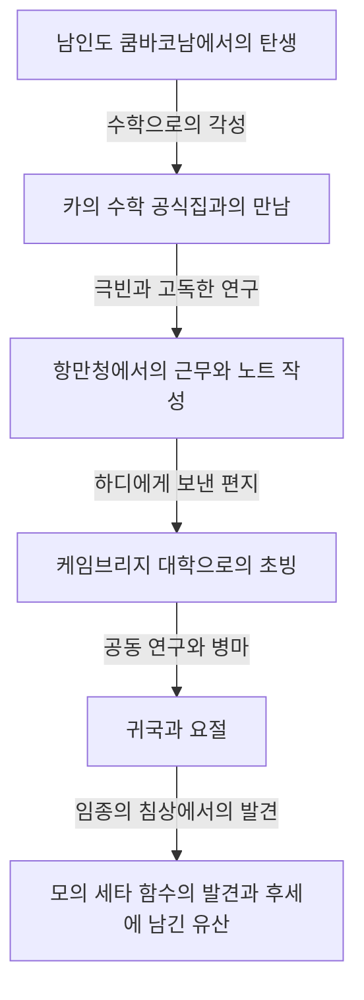

# 스리니바사 라마누잔: 직관과 무한을 엮은 인도의 마술사

## 1. 머리말: 수학계에 내려앉은 "특이점"

수학의 역사를 되짚어보면, 시대마다 위대한 재능이 나타나 논리의 축적을 통해 새로운 이론을 구축해 왔습니다. 그러나 그 유구한 역사 속에서 일체의 상식이나 기존의 틀에 얽매이지 않고, 마치 신으로부터 직접 영감을 받은 것처럼 진리를 써 내려간 인물이 있습니다. 그가 바로 "인도의 마술사"로 불리는 스리니바사 라마누잔(Srinivasa Ramanujan, 1887-1920)입니다.

그의 인생은 극빈의 환경에서 시작하여 독학으로 수학의 심연에 닿고, 영국의 케임브리지 대학으로 건너가는, 마치 영화와 같은 극적인 것이었습니다. 그가 남긴 수천 개에 달하는 공식과 정리는 당시의 수학자들을 경악시켰을 뿐만 아니라, 1세기가 지난 현재에도 블랙홀 물리학이나 끈 이론 등 최첨단 과학 분야에서 계속 응용되고 있습니다.

본 기사에서는 라마누잔의 생애, G.H. 하디와의 역사적인 공동 연구, 그리고 그가 현대 과학에 남긴 헤아릴 수 없는 유산에 대해 깊이 파고들어 봅니다.

---

## 2. 성장 배경과 유년기: 수학으로의 각성

라마누잔은 1887년 12월 22일, 남인도 타밀나두주 에로데의 가난한 브라만 가정에서 태어났습니다. 어릴 적부터 뛰어난 기억력과 계산 능력을 보였으며, 학교 성적은 매우 우수했습니다.

그의 운명을 결정지은 것은 15세 때 만난 조지 슌브리지 카의 저서 《순수 및 응용 수학 기본 결과 요람(Synopsis of Elementary Results in Pure and Applied Mathematics)》입니다. 이 책은 수천 개의 수학 정리와 공식이 증명 없이 나열되어 있는 것에 불과한, 말하자면 수험용 공식집이었습니다. 하지만 라마누잔에게 이 책은 최고의 교과서가 되었습니다. 그는 독학으로 이 공식들의 증명을 시도했고, 나아가 스스로 새로운 정리를 차례로 발견하여 자신의 노트에 적어 내려가기 시작했습니다.

그러나 수학에 대한 비정상적일 정도의 몰두는 그의 인생에 그림자를 드리웠습니다. 대학 장학금을 받았음에도 수학 외의 과목에는 전혀 관심을 보이지 않아 낙제를 거듭했고, 결국 대학을 퇴학당하게 됩니다. 그 후 직장을 전전하며 극빈 속에서 그저 묵묵히 수식과 마주하는 고독한 나날이 이어졌습니다.

---

## 3. 항만청에서의 근무와 운명의 편지

생계를 유지하기 위해 라마누잔은 마드라스 항만청의 서기로 일하기 시작합니다. 그의 상사였던 나라야나 아이야르 역시 수학을 사랑하는 인물이었으며, 라마누잔의 비범한 재능을 알아차렸습니다. 주위의 권유도 있어 라마누잔은 자신의 연구 성과를 정리한 편지를 영국의 저명한 수학자들에게 보내기 시작합니다.

당시 무명의 인도 청년이 보낸 편지는 많은 수학자들에 의해 "미치광이의 헛소리"로 무시당했습니다. 그러나 단 한 명의 천재 수학자만이 그 편지의 진가를 꿰뚫어 보았습니다. 그가 바로 케임브리지 대학의 고드프리 해럴드 하디(G.H. Hardy)입니다.

1913년, 하디에게 도착한 편지에는 100개가 넘는 복잡한 수식이 어떠한 증명도 없이 빼곡히 적혀 있었습니다. 처음에 하디도 장난일까 생각했지만, 식을 자세히 검토하면서 경악합니다. "이것들은 최고 수준의 수학자가 아니면 상상조차 할 수 없는 것들이다. 절대적으로 진실이다. 왜냐하면 만약 진실이 아니라면, 이런 것을 날조할 수 있을 만큼의 상상력을 가진 인간 따위는 존재하지 않기 때문이다"라고 하디는 말했습니다.

---

## 4. 케임브리지에서의 나날: 직관과 논리의 융합

1914년, 하디의 진력으로 라마누잔은 바다를 건너 케임브리지 대학 트리니티 칼리지로 초빙되었습니다. 여기서부터 수학사에 남을 기적의 공동 연구가 시작됩니다.

라마누잔과 하디는 그야말로 물과 기름처럼 정반대의 특성을 가지고 있었습니다.

하디는 엄밀한 논리와 증명을 중시하는 정통파 수학자였습니다. 반면 라마누잔은 직관과 번뜩임을 통해 결론만을 도출해내는 천재였습니다. 라마누잔에 따르면, 공식은 "꿈속에서 나마기리 여신이 혀에 적어주는" 것이었으며, 증명이라는 개념 자체를 충분히 이해하지 못했습니다.

하디는 라마누잔의 직관을 죽이지 않으면서 그에게 근대 수학의 엄밀한 증명 기법을 가르치는, 매우 섬세한 작업을 수행했습니다. 두 사람의 공동 연구는 다산이었으며, 차례차례 중요한 논문을 발표해 나갔습니다.

---

## 5. 라마누잔의 주요 업적

라마누잔이 남긴 업적은 다방면에 걸쳐 있지만, 특히 정수론과 무한급수 분야에서 두드러집니다.

### 5.1 분할수 (Partitions)의 점근 공식
어떤 양의 정수를 양의 정수들의 합으로 나타내는 방법의 수를 "분할수"라고 부릅니다. 예를 들어 4의 분할수는 (4), (3+1), (2+2), (2+1+1), (1+1+1+1)의 5가지입니다. 수가 커지면 분할수는 폭발적으로 증가하지만, 라마누잔과 하디는 거대한 수 $n$의 분할수 $p(n)$을 매우 높은 정밀도로 근사하는 "원 방법(Circle Method)"을 개발하여 점근 공식을 도출해 냈습니다. 이는 해석적 정수론에 있어서 기념비적인 업적입니다.

### 5.2 원주율의 무한급수
라마누잔은 원주율 $\pi$를 계산하기 위해 상식을 벗어난 수렴 속도를 가진 무한급수를 다수 발견했습니다. 그의 공식은 매우 기괴하고 복잡하지만, 현재에도 컴퓨터에 의한 원주율 계산 알고리즘의 기초로 사용되고 있습니다.

### 5.3 라마누잔의 $\tau$ 함수
모듈러 형식 연구에서 라마누잔은 $\tau(n)$이라는 함수를 정의하고 몇 가지 추측을 세웠습니다. 이러한 추측(라마누잔 추측)은 후대의 수학자들에 의해 증명되어, 대수 기하학이나 표현론과 같은 현대 수학의 광범위한 분야에 깊은 영향을 미쳤습니다.

---

## 6. 병마, 너무 이른 죽음, 그리고 잃어버린 노트

제1차 세계대전 하의 영국에서의 생활은 엄격한 채식주의자였던 라마누잔에게 가혹한 것이었습니다. 식량난과 한랭한 기후, 그리고 격무가 그의 육체를 갉아먹었고, 결핵(또는 중증의 비타민 결핍증이나 간 아메바증이었다고도 합니다)이 발병합니다.

병상에 누운 라마누잔을 문안했을 때 하디와의 유명한 일화가 있습니다. "타고 온 택시 번호가 1729라는 따분한 숫자였다"고 투덜거리는 하디에게 라마누잔은 즉석에서 "아닙니다, 그것은 매우 흥미로운 숫자입니다. 두 개의 세제곱수의 합으로 두 가지 방법으로 나타낼 수 있는 가장 작은 수($1^3 + 12^3 = 9^3 + 10^3$)이니까요"라고 대답했습니다. 이 일화에서 유래하여 1729는 "택시 수(Taxicab number)"라고 불리게 되었습니다.

1919년 인도로 귀국했으나, 이듬해인 1920년 라마누잔은 32세라는 젊은 나이에 세상을 떠났습니다.

임종 직전까지 그는 침대에서 수식을 계속 썼습니다. 거기서 쓰인 노트(잃어버린 노트)는 그의 손을 떠난 후 수십 년 동안 행방불명 상태였지만, 1976년 조지 앤드루스에 의해 펜실베이니아 대학 도서관에서 발견되었습니다.

### 모의 세타 함수 (Mock Theta Functions)
이 임종의 침상에서 쓰인 노트에는 "모의 세타 함수"라고 불리는 전혀 새로운 함수의 이론이 포함되어 있었습니다. 당시는 그 의미를 아무도 이해하지 못했지만, 21세기에 들어서 이것이 블랙홀의 엔트로피를 계산하는 끈 이론의 모델에 직접적으로 관계되어 있다는 것이 밝혀졌습니다. 라마누잔은 죽음의 문턱에서 최첨단 우주물리학의 방정식을 앞서 내다보았던 것입니다.

---

## 7. 맺음말: 직관이라는 이름의 신의 선물

스리니바사 라마누잔이 남긴 노트는 현재에도 수학자들에게 퍼내어도 마르지 않는 아이디어의 원천입니다. 그가 발견한 수식의 대부분은 현재 증명되고 체계화되었지만, "그가 어떻게 그 식들을 번뜩였는가"라는 최대의 수수께끼는 영원히 풀리지 않을 것입니다.

라마누잔의 인생은 우리에게 "인간의 사고와 직관에는 아직도 헤아릴 수 없는 가능성이 있다"는 것을 가르쳐 줍니다. 극빈과 병에 고통받으면서도 순수하게 진리만을 추구했던 그의 열정과 유산은 앞으로도 과학의 최전선을 비추는 빛으로 계속 남을 것입니다.
