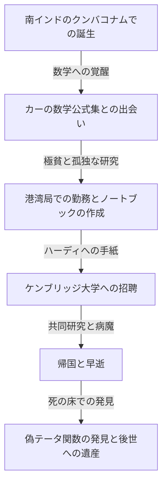
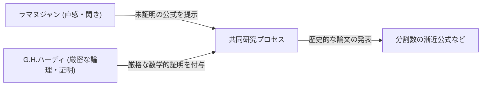

# シュリニヴァーサ・ラマヌジャン：直感と無限を紡いだインドの魔術師

## 1. はじめに：数学界に舞い降りた「特異点」

数学の歴史を紐解くと、時代ごとに偉大な才能が現れ、論理の積み重ねによって新たな理論を構築してきました。しかし、その悠久の歴史の中で、一切の常識や既存の枠組みに囚われず、まるで神から直接インスピレーションを与えられたかのように真理を書き出した人物がいます。それが「インドの魔術師」と称されるシュリニヴァーサ・ラマヌジャン（Srinivasa Ramanujan, 1887-1920）です。

彼の人生は、極貧の環境から始まり、独学で数学の深淵に触れ、イギリスのケンブリッジ大学へと渡るという、まるで映画のような劇的なものでした。彼が残した数千にも及ぶ公式や定理は、当時の数学者たちを驚愕させただけでなく、1世紀以上が経過した現在でも、ブラックホール物理学やひも理論など、最先端の科学分野で応用され続けています。

本記事では、ラマヌジャンの生涯、G.H.ハーディとの歴史的な共同研究、そして彼が現代科学に残した計り知れない遺産について、深く掘り下げていきます。

---

## 2. 生い立ちと幼少期：数学への覚醒

ラマヌジャンは1887年12月22日、南インドのタミル・ナードゥ州エロードで、貧しいバラモンの家庭に生まれました。幼少期から並外れた記憶力と計算能力を示し、学校の成績は非常に優秀でした。

彼の運命を決定づけたのは、15歳の時に出会ったジョージ・シェーンブリッジ・カーの著書『純粋・応用数学基本結果提要（Synopsis of Elementary Results in Pure and Applied Mathematics）』です。この本は、数千もの数学の定理や公式が証明抜きで羅列されているだけの、いわば受験用の公式集でした。しかし、ラマヌジャンにとってはこの本こそが最高の教科書となりました。彼は独学でこれらの公式の証明を試み、さらに自ら新たな定理を次々と発見しては、自身のノートブックに書き留めるようになりました。

しかし、数学への異常なまでの没頭は、彼の人生に影を落とします。大学の奨学金を得たものの、数学以外の科目に全く関心を示さず落第を繰り返し、ついに大学を退学することになります。その後は職を転々としながら、極貧の中でただひたすらに数式と向き合う孤独な日々が続きました。

---

## 3. 港湾局での勤務と運命の手紙

生活の糧を得るため、ラマヌジャンはマドラス港湾局の事務員として働き始めます。彼の上司であったナーラーヤナ・アイヤルもまた数学を愛好する人物であり、ラマヌジャンの尋常ならざる才能に気づきました。周囲の勧めもあり、ラマヌジャンは自らの研究成果をまとめた手紙を、イギリスの著名な数学者たちに送り始めます。

当時、無名のインド人青年からの手紙は、多くの数学者たちによって「狂人の戯言」として無視されました。しかし、一人の天才数学者だけが、その手紙の真価を見抜きました。それがケンブリッジ大学のゴッドフレイ・ハロルド・ハーディ（G.H. Hardy）です。

1913年、ハーディのもとに届いた手紙には、100を超える複雑な数式が、一切の証明なしにびっしりと書き連ねられていました。初めはハーディも悪戯かと思いましたが、式を詳しく検討するうちに驚愕します。「これらは、最高レベルの数学者でなければ想像すらできないものだ。絶対に真実である。なぜなら、もし真実でなければ、こんなものを捏造できるほどの想像力を持つ人間など存在しないからだ」とハーディは語っています。

---

## 4. ケンブリッジでの日々：直感と論理の融合

1914年、ハーディの尽力により、ラマヌジャンは海を渡りケンブリッジ大学トリニティ・カレッジに招聘されました。ここから、数学史に残る奇跡の共同研究が始まります。

ラマヌジャンとハーディは、まさに水と油のような正反対の特質を持っていました。

ハーディは厳密な論理と証明を重んじる正統派の数学者でした。一方のラマヌジャンは、直感と閃きによって結論だけを導き出す天才でした。ラマヌジャンによれば、公式は「夢の中でナマギリ女神が舌に書き残してくれる」ものであり、証明という概念自体を十分に理解していませんでした。

ハーディは、ラマヌジャンの直感を殺さないようにしつつ、彼に近代数学の厳密な証明の手法を教え込むという、非常に繊細な作業を行いました。二人の共同研究は多産で、次々と重要な論文を発表していきます。

---

## 5. ラマヌジャンの主要な業績

ラマヌジャンが遺した業績は多岐にわたりますが、特に数論や無限級数の分野で顕著です。

### 5.1 分割数 (Partitions) の漸近公式
ある正の整数を、正の整数の和として表す方法の数を「分割数」と呼びます。例えば4の分割数は、(4), (3+1), (2+2), (2+1+1), (1+1+1+1) の5通りです。数が大きくなると分割数は爆発的に増加しますが、ラマヌジャンとハーディは、巨大な数 $n$ の分割数 $p(n)$ を極めて高い精度で近似する「円周法（Circle Method）」を開発し、漸近公式を導き出しました。これは解析的整数論における記念碑的な業績です。

### 5.2 円周率の無限級数
ラマヌジャンは、円周率 $\pi$ を計算するための、常軌を逸した収束速度を持つ無限級数を多数発見しました。彼の公式は複雑怪奇ですが、現在でもコンピュータによる円周率の計算アルゴリズムの基礎として用いられています。

### 5.3 ラマヌジャンの $\tau$ 関数
モジュラー形式の研究において、ラマヌジャンは $\tau(n)$ という関数を定義し、いくつかの予想を立てました。これらの予想（ラマヌジャン予想）は、後の数学者たちによって証明され、代数幾何学や表現論といった現代数学の広範な分野に深い影響を与えました。

---

## 6. 病魔、早すぎる死、そして失われたノートブック

第一次世界大戦下のイギリスでの生活は、厳格な菜食主義者であったラマヌジャンにとって過酷なものでした。食糧難と寒冷な気候、そして激務が彼の肉体を蝕み、結核（あるいは重度のビタミン欠乏症や肝アメーバ症であったとも言われています）を発症します。

病に倒れたラマヌジャンを見舞った際のハーディとの有名なエピソードがあります。「乗ってきたタクシーのナンバーは1729という退屈な数字だった」とこぼすハーディに対し、ラマヌジャンは即座に「いいえ、それは非常に面白い数字です。2つの立方数の和として2通りに表せる最小の数（$1^3 + 12^3 = 9^3 + 10^3$）ですから」と返答しました。このエピソードから、1729は「タクシー数 (Taxicab number)」と呼ばれるようになりました。

1919年にインドへ帰国したものの、翌1920年、ラマヌジャンは32歳という若さでこの世を去りました。

死の直前まで彼はベッドで数式を書き続けていました。そこで書かれたノート（失われたノートブック）は、彼の手から離れた後、数十年の間行方不明になっていましたが、1976年にジョージ・アンドリュースによってペンシルベニア大学の図書館で発見されました。

### 偽テータ関数 (Mock Theta Functions)
この死の床で書かれたノートには、「偽テータ関数」と呼ばれる全く新しい関数の理論が含まれていました。当時はその意味が誰にも理解されませんでしたが、21世紀に入り、これがブラックホールのエントロピーを計算する弦理論のモデルに直接的に関係していることが判明しました。ラマヌジャンは、死の淵で、最先端の宇宙物理学の方程式を先取りしていたのです。

---

## 7. おわりに：直感という名の神からの贈り物

シュリニヴァーサ・ラマヌジャンの遺したノートブックは、現在でも数学者たちにとって汲めども尽きぬアイデアの源泉です。彼の発見した数式の多くは、現在では証明され体系化されていますが、「彼がどのようにしてそれらの式を閃いたのか」という最大の謎は、永遠に解き明かされることはありません。

ラマヌジャンの人生は、私たちに「人間の思考と直感には、まだまだ底知れぬ可能性がある」ことを教えてくれます。極貧と病に苦しみながらも、純粋に真理だけを追い求めた彼の情熱と遺産は、これからも科学のフロンティアを照らす光であり続けるでしょう。
